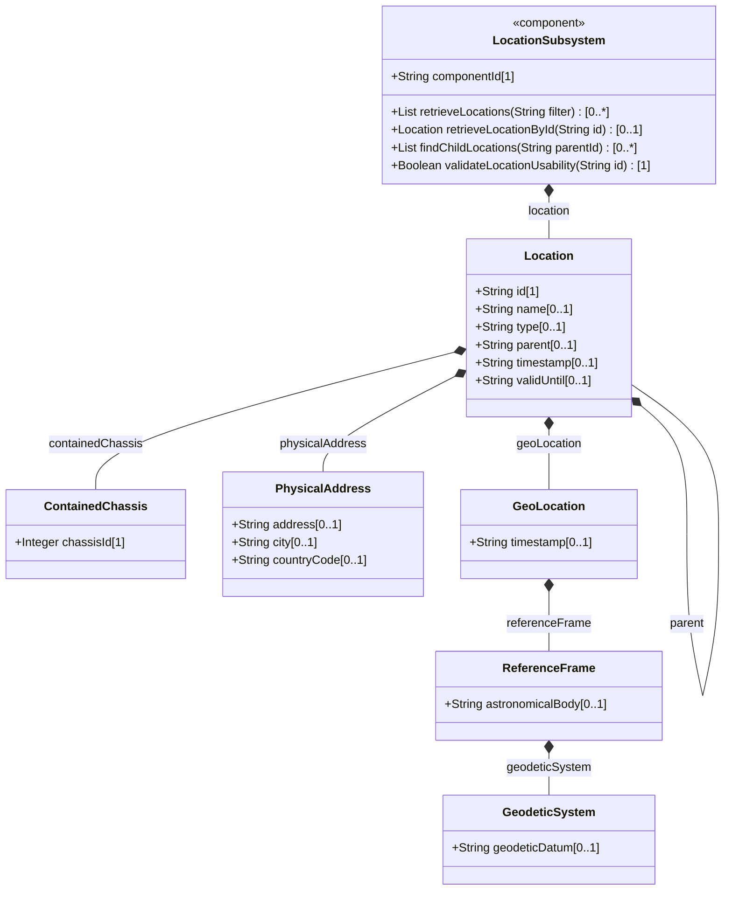
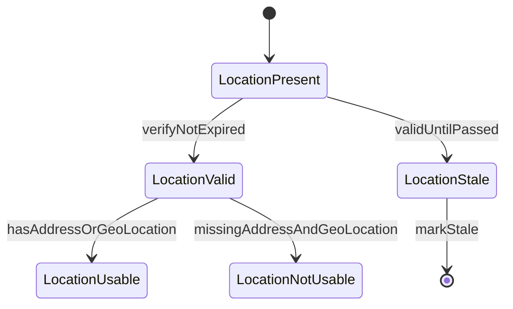

# Epic: Network Inventory Location

## 1. Context
This Epic covers the top-level network inventory location subsystem defined in the ietf-ni-location YANG module. It encompasses the hierarchical location list (sites, buildings, equipment rooms, floors, corridors, poles, roofs), associated physical address data, and geographic coordinate data (geo-location from RFC 9179). All data is read-only operational state (config false) serving as a complement to the base network inventory model. Locations can be nested via a self-referential parent leafref, forming a hierarchy. Each location may carry chassis references for equipment directly deployed without a rack, and must include either physical-address or geo-location data before being used for operational dispatch. The module augments /nwi:network-inventory with the locations container.

The bounded context for this Epic is the location subtree of the ietf-ni-location module, partitioned from the racks subtree due to structural depth exceeding 3 levels and leaf count exceeding 40 across the complete module.

## 2. Requirements & Checklist
- [ ] #1 - [Manage Hierarchical Location Inventory](https://github.com/gintatkinson/3dgs-030/blob/main/docs/features/feat-01-location-management.md) — Core location list with id, type, parent hierarchy, contained-chassis, temporal validity, and common entity attributes. Covers schema grouping locations, container locations, list location. Clause: Section 2, 4, 6.
- [ ] #2 - [Capture Physical Address Information](https://github.com/gintatkinson/3dgs-030/blob/main/docs/features/feat-02-physical-address.md) — Structured postal address with street, postal-code, state, city, and ISO ALPHA-2 country-code. Covers schema grouping physical-address, container physical-address. Clause: Section 4 tree diagram.
- [ ] #3 - [Capture Geographic Location Coordinates](https://github.com/gintatkinson/3dgs-030/blob/main/docs/features/feat-03-geographic-location.md) — RFC 9179 geo-location grouping with reference frame, geodetic system, choice between ellipsoid/cartesian coordinates, velocity vector, and feature-gated alternate-system. Clause: Section 2, RFC 9179.

### Associated Use Cases & User Stories

#### Associated Use Cases
(None yet — use cases to be generated downstream.)

#### Associated User Stories
(None yet — user stories to be generated downstream.)

## 3. Architecture

### Subsystem Component Definition
The Network Inventory Location subsystem provides read-only operational state for hierarchical physical location definitions. It exposes a location list interface with parent-child traversal, physical address retrieval, and geographic coordinate retrieval. Operations: retrieveLocations(String filter) returning Location list, retrieveLocationById(String id) returning Location, findChildLocations(String parentId) returning Location list, validateLocationUsability(String id) returning Boolean.

### System-Level UML Class Diagram

## State Machine Definitions

### System State Machine Diagram

## 4. Operational Considerations
- The controller maintains authoritative location data through automated tooling.
- Data sources include RFID tooling, geolocation services, and manual entry via controller interfaces.
- OSS systems consume location data as read-only operational state via NETCONF or RESTCONF.
- In large-scale inventories, pagination should be used for queries with large result sets.
- At least one of physical-address or geo-location must be present before using a location for operational dispatch.
- A parallel location-planning container (read-write) may be introduced in future revisions.

## 5. Security & Governance
- Access control via NACM (RFC 8341).
- Location data reveals physical deployment information, facility layouts, equipment density, geographic coordinates.
- Uncontrolled disclosure enables association of inventory identifiers with physical structures and coordinates.
- MUST use secure transport (SSH, TLS, QUIC) with mutual authentication for all YANG-based management protocols.

## Specification Context
From RFC XXXX, Section 2: The location list is generalized to support a variety of geographic location, such as sites, rooms, buildings. Locations can be nested to form a hierarchy. For example, buildings may be within a site, and a room may be within a building.

From RFC XXXX, Section 1: The Network Inventory location model is to record physical locations, such as sites, building, equipment rooms, racks, and so on. Additionally, it includes provisions for physical addresses or geo-location data (geographic coordinates).

## 6. Source References
Structural Schema: ietf-ni-location@2026-07-06.yang (Clause: grouping locations, container locations, list location, grouping physical-address, uses geo:geo-location)
Normative Specification: draft-ietf-ivy-network-inventory-location (Clause: Section 2, Section 4)
