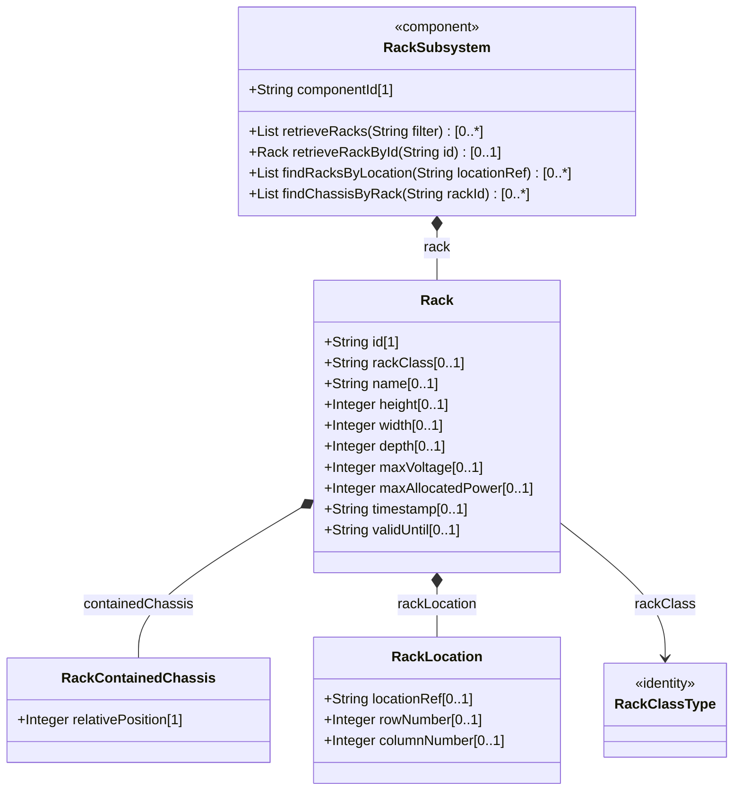
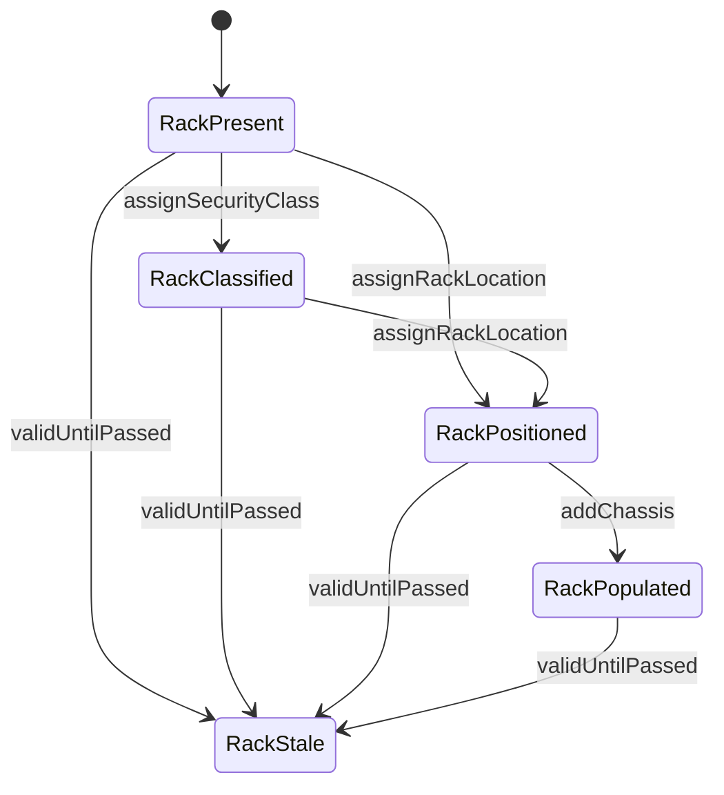

# Epic: Rack Inventory Management

## 1. Context
This Epic covers the rack inventory subsystem defined in the ietf-ni-location YANG module. It encompasses the read-only rack list with physical dimensions (height, width, depth in millimeters), electrical characteristics (max voltage in volts, max allocated power in watts), security classification via identity hierarchy (rack-class-type with derived identities rack-standard, rack-secure-baseline, rack-secure-medium, rack-secure-high), positional data within locations (rack-location with location-ref, row-number, column-number), contained chassis with U-slot positions, and temporal validity markers. All nodes are config false operational state.

The bounded context for this Epic is the racks subtree of the ietf-ni-location module, partitioned from the location subtree due to structural depth exceeding 3 levels across the complete module. Racks are a distinct functional entity representing physical equipment mounting infrastructure.

## 2. Requirements & Checklist
- [ ] #4 - [Manage Rack Inventory](https://github.com/gintatkinson/3dgs-030/blob/main/docs/features/feat-04-rack-management.md) — Rack list with physical dimensions, electrical characteristics, security classification identities, contained chassis with U-slot positions, and temporal validity. Covers schema grouping racks, container racks, list rack, identity hierarchy rack-class-type. Clause: Section 3, 4, Figure 3.
- [ ] #5 - [Map Rack Location Within Facility](https://github.com/gintatkinson/3dgs-030/blob/main/docs/features/feat-05-rack-location-details.md) — Rack positional data referencing parent location via ni-location-ref leafref, with row-number and column-number for grid positioning. Covers schema container rack-location, typedef ni-location-ref. Clause: Section 3, Figure 3.

### Associated Use Cases & User Stories

#### Associated Use Cases
(None yet — use cases to be generated downstream.)

#### Associated User Stories
(None yet — user stories to be generated downstream.)

## 3. Architecture

### Subsystem Component Definition
The Rack Inventory Management subsystem provides read-only operational state for physical equipment racks. It exposes a rack list interface with dimension queries, power capacity queries, security classification filtering, chassis-to-slot mapping, and positional data within parent locations. Operations: retrieveRacks(String filter) returning Rack list, retrieveRackById(String id) returning Rack, findRacksByLocation(String locationRef) returning Rack list, findChassisByRack(String rackId) returning RackContainedChassis list.

### System-Level UML Class Diagram

## State Machine Definitions

### System State Machine Diagram

## 4. Operational Considerations
- Racks are read-only operational state providing physical mounting context for NEs in a facility.
- The rack-class identityref enables filtering racks by physical security tier for security audit purposes.
- Rack dimensions (height, width, depth) are in millimeters; door facing user orientation.
- Power attributes (max-voltage, max-allocated-power) enable capacity planning for new equipment deployment.
- contained-chassis uses U-slot (relative-position) as key, enabling precise hardware location within a rack.
- A future revision may include a read-write racks-planning container for intent-based rack provisioning.

## 5. Security & Governance
- Access control via NACM (RFC 8341).
- Rack data reveals facility layouts, equipment density, and physical security characteristics.
- Rack security classifications expose physical protection levels.
- Chassis-to-rack mappings link inventory identifiers to precise physical locations.
- MUST use secure transport (SSH, TLS, QUIC) with mutual authentication.

## Specification Context
From RFC XXXX, Section 3: racks represent physical equipment racks in which NEs can be installed, which facilitate device maintenance. Through rack-location, each rack can be assigned to a site or a specific location within a site. Each rack is assigned a unique ID and a name in the context of a facility. The height, depth and width are described by Figure 2 (door facing the user).

From identity definitions: rack-class-type: Base identity for generic rack classification based on physical security characteristics. rack-standard: Standard general-purpose rack without physical locking mechanisms. rack-secure-baseline: Baseline secure lockable rack. rack-secure-medium: Medium security lockable rack. rack-secure-high: High security lockable rack.

## 6. Source References
Structural Schema: ietf-ni-location@2026-07-06.yang (Clause: grouping racks, container racks, list rack, container rack-location, typedef ni-location-ref, identities rack-class-type, rack-standard, rack-secure-baseline, rack-secure-medium, rack-secure-high)
Normative Specification: draft-ietf-ivy-network-inventory-location (Clause: Section 3, Section 4, Figure 2 rack dimensions, Figure 3 rack subtree)
