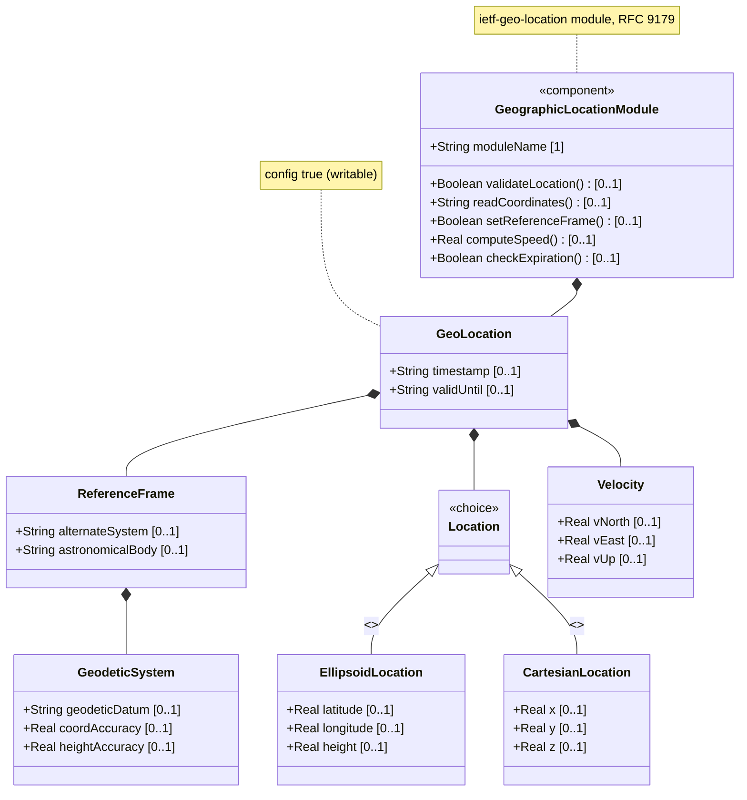
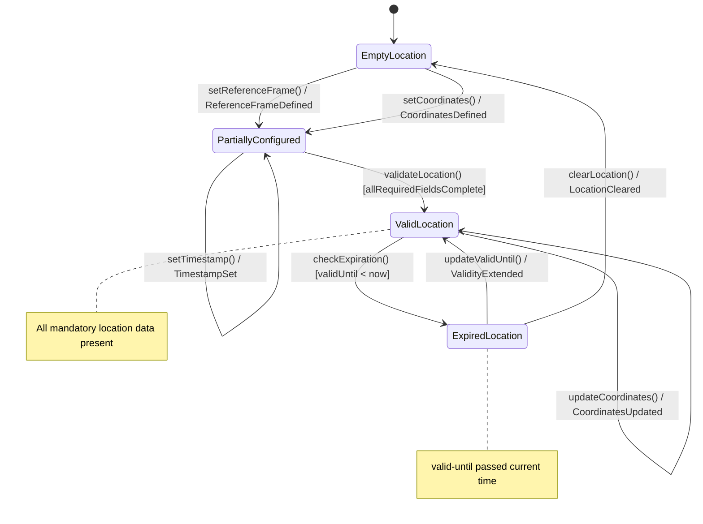

# Epic: Geographic Location Module

## 1. Context

This Epic governs the functional specification for the `ietf-geo-location` YANG module defined in RFC 9179. The module provides a reusable `geo-location` grouping for specifying a geographic location on or around any astronomical object (Earth, Moon, Mars, etc.), supporting both ellipsoidal (latitude/longitude/height) and Cartesian (x/y/z) coordinate systems. The specification captures the full structural decomposition of the module into five independently testable Features: the root geo-location container, reference frame, geodetic system, location coordinate choice, and velocity vector.

The module is classified as FUNCTIONAL (contains concrete data nodes with config true). Total leaf count: 16, depth: 3. Per schema-engineering heuristics (leaves <= 40, depth <= 3), this module maps to exactly 1 Epic.

## 2. Requirements & Checklist

- [ ] #21 - [Geo-Location Container](https://github.com/gintatkinson/3dgs-030/blob/main/docs/features/feat-06-geo-location-container.md) — Root container composing all sub-containers; hosts temporal attributes (timestamp, valid-until). Schema: container `geo-location`, RFC 9179 Sections 2, 2.4, 2.5.
- [ ] #22 - [Reference Frame](https://github.com/gintatkinson/3dgs-030/blob/main/docs/features/feat-07-reference-frame.md) — Frame of reference defining the astronomical body and optional alternate reference system. Includes <<feature_guard>> `alternate-systems`. Schema: container `reference-frame`, RFC 9179 Section 2.1.
- [ ] #23 - [Geodetic System](https://github.com/gintatkinson/3dgs-030/blob/main/docs/features/feat-08-geodetic-system.md) — Geodetic datum and coordinate/height accuracy overrides. References IANA Geodetic System Values registry. Schema: container `geodetic-system`, RFC 9179 Sections 2.1, 6.1.
- [ ] #24 - [Location Coordinates](https://github.com/gintatkinson/3dgs-030/blob/main/docs/features/feat-09-location-coordinates.md) — Choice between ellipsoidal (lat/lon/height) and Cartesian (x/y/z) coordinate systems. Schema: choice `location` with cases `ellipsoid` and `cartesian`, RFC 9179 Section 2.2.
- [ ] #25 - [Velocity Vector](https://github.com/gintatkinson/3dgs-030/blob/main/docs/features/feat-10-velocity-vector.md) — Three-dimensional motion vector (v-north, v-east, v-up) for objects in stable motion. Schema: container `velocity`, RFC 9179 Section 2.3.

### Associated Use Cases & User Stories

#### Associated Use Cases

- [ ] #19 - [Capture Geographic Location Coordinates](https://github.com/gintatkinson/3dgs-030/blob/main/docs/use-cases/uc-19-capture-geographic-location.md) — Primary use case for recording GPS-style coordinates in inventory management.
- [ ] #20 - [Map Rack Location Within Facility](https://github.com/gintatkinson/3dgs-030/blob/main/docs/use-cases/uc-20-map-rack-location.md) — Associates rack positions with geo-location data.

#### Associated User Stories

- [ ] #13 - [Verify Location Data Quality for Operational Dispatch](https://github.com/gintatkinson/3dgs-030/blob/main/docs/user-stories/us-13-verify-location-data-quality.md) — Validates that location data meets accuracy and freshness criteria.
- [ ] #14 - [Detect and Handle Expired Location and Rack Records](https://github.com/gintatkinson/3dgs-030/blob/main/docs/user-stories/us-14-detect-expired-location-records.md) — Uses `valid-until` to expire stale location records.
- [ ] #15 - [Transform Geographic Coordinates Between Reference Systems](https://github.com/gintatkinson/3dgs-030/blob/main/docs/user-stories/us-15-transform-coordinates.md) — Supports coordinate transformation between reference frames and geodetic datums.

## 3. Architecture

### System-Level UML Class Diagram



### State Machine Definitions

### System State Machine Diagram



## 4. Operational Considerations

- The `geo-location` grouping is designed as a reusable YANG grouping — consuming modules use it via `uses geo:geo-location` to embed location data within their own data models (e.g., rack inventory, network element positioning).
- When locations are nested (e.g., a building contains routers), the consuming module may indicate that `reference-frame` is inherited from the parent to avoid redundant configuration.
- The `alternate-systems` feature is conditionally compiled: devices that do not support alternate reference systems will not expose the `alternate-system` leaf.
- The module conforms to ISO 6709:2008 for standard representation of geographic point location by coordinates.
- Platform-independent serialization: All decimal64 values must preserve their specified fraction-digit precision during serialization (6 digits for Cartesian/height/accuracy, 12 for velocity, 16 for latitude/longitude).

## 5. Security & Governance

- All data nodes in this module are `config true` (writable/creatable/deletable) by default per YANG.
- Since the grouping identifies physical locations, consuming modules must consider privacy implications when location data is readable (e.g., customer device locations, data center coordinates).
- Access control must be enforced via NETCONF/RESTCONF access control models (RFC 8341) at the consuming module level.
- The IANA "Geodetic System Values" registry (established by RFC 9179 Section 6.1) governs the allowed values for `geodetic-datum` with First Come First Served allocation policy.

## Specification Context

From RFC 9179, Section 1:

> In many applications, we would like to specify the location of something geographically. Some examples of locations in networking might be the location of data centers, a rack in an Internet exchange point, a router, a firewall, a port on some device, or it could be the endpoints of a fiber, or perhaps the failure point along a fiber.

> Additionally, while this location is typically relative to Earth, it does not need to be. Indeed, it is easy to imagine a network or device located on the Moon, on Mars, on Enceladus (the moon of Saturn), or even on a comet (e.g., 67p/churyumov-gerasimenko).

> Finally, one can imagine defining locations using different frames of reference or even alternate systems (e.g., simulations or virtual realities). This document defines a 'geo-location' YANG grouping that allows for all the above data to be captured.

From RFC 9179, Section 2.6 (YANG Tree Diagram):

```
module: ietf-geo-location
  grouping geo-location:
    +-- geo-location
       +-- reference-frame
       |  +-- alternate-system?    string {alternate-systems}?
       |  +-- astronomical-body?   string
       |  +-- geodetic-system
       |     +-- geodetic-datum?    string
       |     +-- coord-accuracy?    decimal64
       |     +-- height-accuracy?   decimal64
       +-- (location)?
       |  +--:(ellipsoid)
       |  |  +-- latitude?    decimal64
       |  |  +-- longitude?   decimal64
       |  |  +-- height?      decimal64
       |  +--:(cartesian)
       |     +-- x?           decimal64
       |     +-- y?           decimal64
       |     +-- z?           decimal64
       +-- velocity
       |  +-- v-north?   decimal64
       |  +-- v-east?    decimal64
       |  +-- v-up?      decimal64
       +-- timestamp?         yang:date-and-time
       +-- valid-until?       yang:date-and-time
```

## 6. Source References

Structural Schema: [ietf-geo-location@2022-02-11.yang](https://github.com/YangModels/yang/blob/main/standard/ietf/RFC/ietf-geo-location%402022-02-11.yang) (Clause: entire module)
Normative Specification: [RFC 9179: A YANG Grouping for Geographic Locations](https://datatracker.ietf.org/doc/rfc9179/) (Clause: Sections 1-7)
