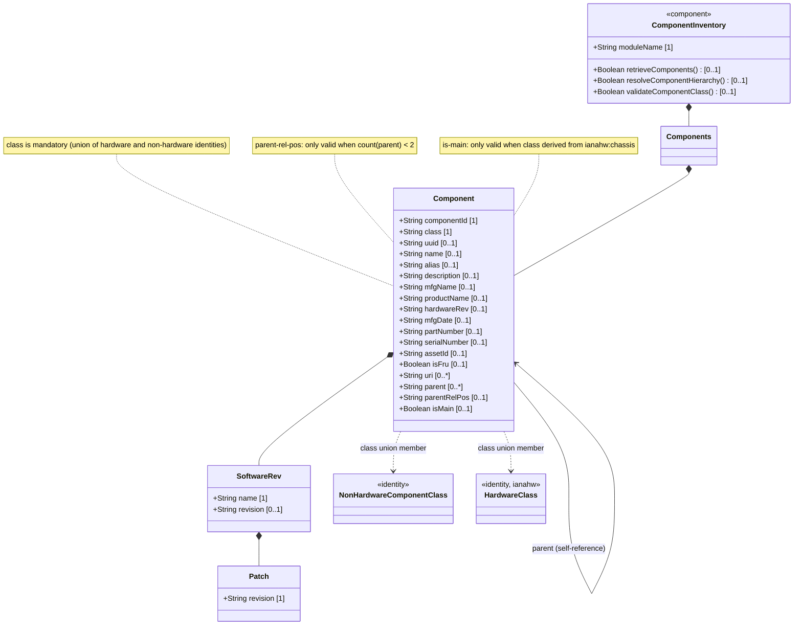
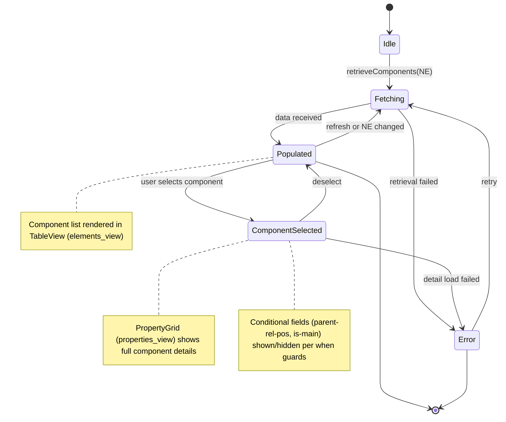

# Epic: Network Inventory: Component Inventory

## 1. Context

This Epic governs the functional specification for the `components` subtree of the `ietf-network-inventory` YANG module defined in draft-ietf-ivy-network-inventory-yang. Each network element contains a `components` container hosting a list of `component` entries keyed by `component-id`. Components represent the generalized inventory objects that can be managed like hardware components — including chassis, slots, boards, ports, CPUs, fans, power supplies, sensors, storage devices, and software components. The component model supports hierarchical containment (self-referencing parent references), class-based typing (union of IANA hardware classes and non-hardware identities), full manufacturing and asset tracking metadata, field-replaceable unit identification, and conditional attributes for topology position and multi-chassis designation.

The identity `non-hardware-component-class` and the grouping `component-attributes` (which composes and refines `ne-component-common-entity-attributes` with RFC 6933 references) are defined in this bounded context.

## 2. Requirements & Checklist

- [ ] #48 - [Component Inventory](https://github.com/gintatkinson/3dgs-030/blob/main/docs/features/feat-13-component-inventory.md) — Container `components` with list `component` keyed by `component-id`. Captures component identification, mandatory class typing (union of `ianahw:hardware-class` and `nwi:non-hardware-component-class`), manufacturing metadata (hardware-rev, mfg-date, part-number, serial-number), asset tracking (asset-id, is-fru, uri), hierarchical containment (parent leaf-list, parent-rel-pos with `when` guard), and multi-chassis designation (is-main with `when` guard). Schema: container `nwi:network-inventory/network-elements/network-element/components`, list `component`, identity `non-hardware-component-class`, grouping `component-attributes`. draft-ietf-ivy-network-inventory-yang Sections 3, 3.3, 3.3.1, 3.3.2, 3.4.

### Associated Use Cases & User Stories

#### Associated Use Cases

#### Associated User Stories

## 3. Architecture

### System-Level UML Class Diagram

### State Machine Definitions

### System State Machine Diagram

## 4. Operational Considerations

Component inventory data is discovered and reported by the network controller from each managed network element. The component `class` is the only mandatory field — all other attributes are optional and populated as available. The controller should prefer manufacturer-printed values for `mfg-name`, `hardware-rev`, and `serial-number` when available.

Component hierarchical containment is modeled via the `parent` leaf-list referencing sibling `component-id` values within the same NE. This enables representation of arbitrary nesting: chassis contains slots, slots contain boards, boards contain ports. A component may have multiple parents (multi-homing in the containment tree). The `parent-rel-pos` field is string-typed (not integer) to support non-integer position identifiers from devices, with a `when` guard limiting it to components with 0 or 1 parents.

Multi-chassis NEs are supported via the `is-main` boolean, which is only valid for components whose class derives from `ianahw:chassis`. This allows identifying the primary chassis in a multi-chassis network element deployment.

## 5. Security & Governance

Component inventory exposes detailed hardware and software information about deployed network infrastructure. Access to component data should be restricted to authorized operators and management systems. While read-only operational state prevents data modification attacks, the information itself reveals hardware models, firmware versions, serial numbers, and asset tracking data that could be exploited for targeted attacks or physical theft.

FRU (field-replaceable unit) identification and serial number tracking form part of the asset management lifecycle and should be governed by operational asset management policies.

## Specification Context

From draft-ietf-ivy-network-inventory-yang, Section 3.3:

> The YANG data model for network inventory mainly follows the same approach of RFC 8348 and reports the network hardware inventory as a list of components with different types (e.g., chassis, module, and port).

From draft-ietf-ivy-network-inventory-yang, Section 3.4.2:

> There are some use cases where the name of the components are assigned and changed by the operator. In these cases, the assigned names are also not guaranteed to be always unique. In order to support these use cases, this model is not aligned with RFC 8348 in defining the component name as the key for the component list. Instead, the name is defined as an optional attribute and the component-id is defined as the key for the component list (in alignment with the approach followed for the network-element list).

From draft-ietf-ivy-network-inventory-yang, Section 3.4.3:

> There are some use cases where the parent relative position is not reported as an integer but as a string. In order to support these use cases and allowing a straightforward match between the relative position definition in the device and in the network inventory, this model is defining the 'parent-rel-pos' data node as a string instead of as an integer.

From draft-ietf-ivy-network-inventory-yang, Section 3.3.1:

> The "iana-hardware" module defines YANG identities for the hardware component types in the IANA-maintained "IANA-ENTITY-MIB" registry. Some of the definitions taken from RFC 8348 are based on the ENTITY-MIB (RFC 6933). Additional attributes of specific hardware, such as CPU, storage, port, or power supply are defined in the hardware extension.

## 6. Source References

Structural Schema: [ietf-network-inventory@2026-05-27.yang](https://github.com/gintatkinson/3dgs-030/blob/main/schema/ietf-network-inventory%402026-05-27.yang) (Clause: container components, list component, identity non-hardware-component-class, grouping component-attributes)
Normative Specification: [draft-ietf-ivy-network-inventory-yang-18](https://datatracker.ietf.org/doc/html/draft-ietf-ivy-network-inventory-yang) (Clause: Sections 3, 3.3, 3.3.1, 3.3.2, 3.4)
