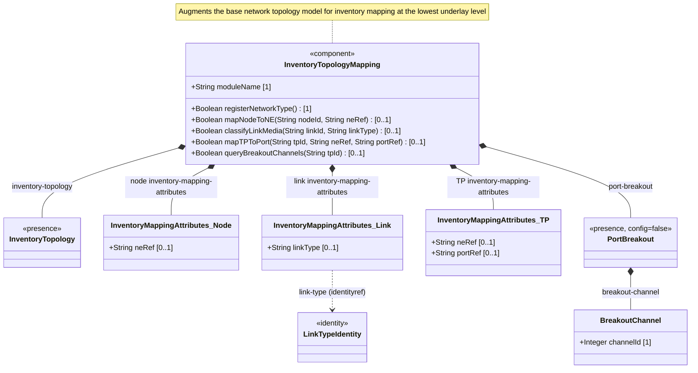
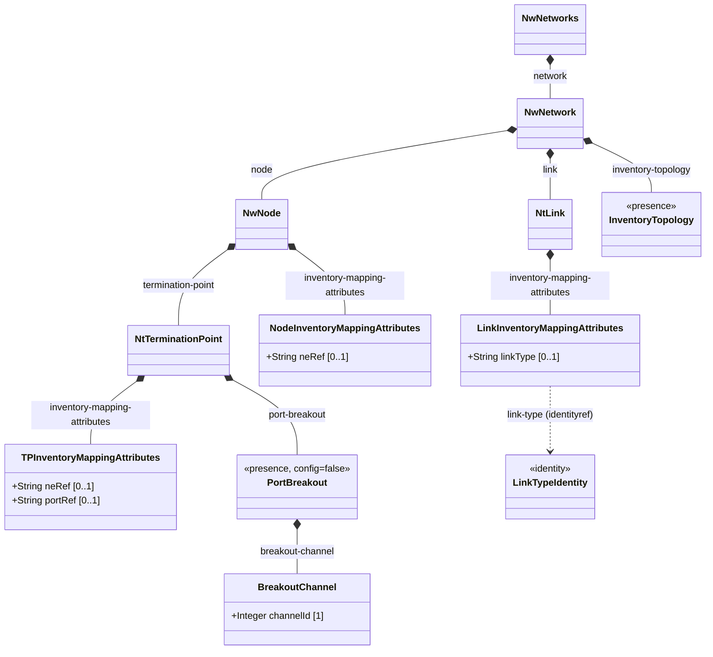
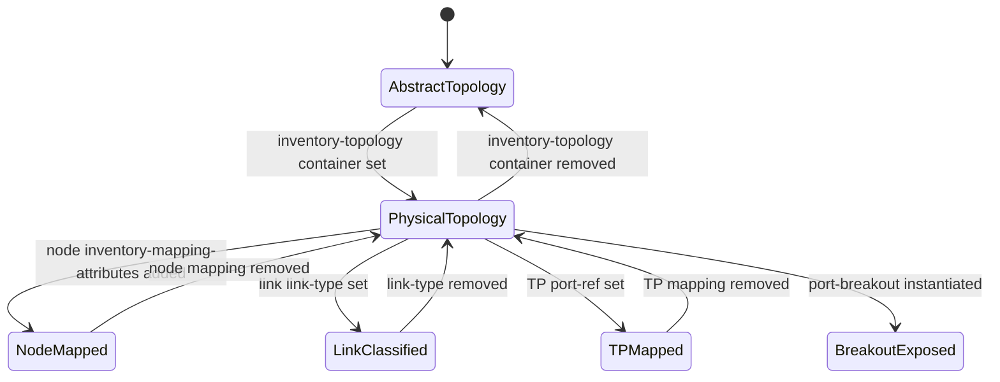

# Epic: Network Inventory: Inventory Topology Mapping

## 1. Context

This Epic governs the functional specification for the `ietf-network-inventory-topology` YANG module defined in draft-ietf-ivy-network-inventory-topology-08. The module augments the base network topology model to establish mappings between logical topology entities (nodes, links, termination points) and physical inventory components (network elements, ports). It introduces the `inventory-topology` network type as a presence container, lightweight link media type classification via an extensible identity hierarchy, 1:1 node-to-NE and TP-to-port mappings, and read-only port breakout capability reporting. The module is a functional augmentation with 5 containers, 8 identities, <40 leaves, and depth <= 3 — mapped to a single Epic.

The module imports `ietf-network`, `ietf-network-topology`, and `ietf-network-inventory` (draft-ietf-ivy-network-inventory-yang).

## 2. Requirements & Checklist

- [ ] #68 - [Inventory Topology Network Type](https://github.com/gintatkinson/3dgs-030/blob/main/docs/features/feat-14-inventory-topology-network-type.md) — Presence container `inventory-topology` under `/nw:networks/nw:network/nw:network-types` signalling physical-layer topology with inventory mapping, port breakout, and link media classification augmentations. Schema: container `nwit:inventory-topology`. draft-ietf-ivy-network-inventory-topology Sections 1, 4, 5.
- [ ] #69 - [Node-to-Network-Element Inventory Mapping](https://github.com/gintatkinson/3dgs-030/blob/main/docs/features/feat-15-node-to-ne-mapping.md) — Container `inventory-mapping-attributes` under `/nw:networks/nw:network/nw:node` with leaf `ne-ref` establishing 1:1 mapping between topology node and physical NE. Presence container distinguishes physical from abstract nodes. Schema: container `nwit:inventory-mapping-attributes`, leaf `ne-ref` (type `nwi:ne-ref`). draft-ietf-ivy-network-inventory-topology Sections 4, 5, 6.
- [ ] #70 - [Link Media Type Classification](https://github.com/gintatkinson/3dgs-030/blob/main/docs/features/feat-16-link-media-type-classification.md) — Container `inventory-mapping-attributes` under `/nw:networks/nw:network/nt:link` with leaf `link-type` (identityref to extensible `link-type` base identity). Captures all 8 identities: `link-type`, `copper`, `fiber`, `coax`, `microwave`, `wlan`, `unknown`, `leased-fiber`. Presence container signals physical link at lowest underlay level. Schema: container `nwit:inventory-mapping-attributes`, leaf `link-type`, identity hierarchy. draft-ietf-ivy-network-inventory-topology Sections 4.1, 5, Appendix A.
- [ ] #71 - [Termination-Point-to-Port Inventory Mapping](https://github.com/gintatkinson/3dgs-030/blob/main/docs/features/feat-17-tp-to-port-mapping.md) — Container `inventory-mapping-attributes` under `/nw:networks/nw:network/nw:node/nt:termination-point` using `nwi:port-ref` grouping (`ne-ref` + `port-ref` leafref). Establishes 1:1 mapping between logical TP and physical port component for SAP-to-physical-port correlation. Schema: container `nwit:inventory-mapping-attributes`, uses `nwi:port-ref`. draft-ietf-ivy-network-inventory-topology Sections 3.1, 4, 5, Appendix A.
- [ ] #72 - [Port Breakout Capability](https://github.com/gintatkinson/3dgs-030/blob/main/docs/features/feat-18-port-breakout-capability.md) — Read-only (`config false`) container `port-breakout` under `/nw:networks/nw:network/nw:node/nt:termination-point` with list `breakout-channel` keyed by `channel-id` (uint16). Exposes hardware-determined partitioning capability (e.g., 400G to 4x100G). Omitted for non-breakout ports. Schema: container `nwit:port-breakout`, list `breakout-channel`, leaf `channel-id`. draft-ietf-ivy-network-inventory-topology Sections 4.2, 5, 6, Appendix B.

### Associated Use Cases & User Stories

#### Associated Use Cases

#### Associated User Stories

## 3. Architecture

### Subsystem Component Definition

### System-Level UML Class Diagram

### State Machine Definitions

### System State Machine Diagram

## 4. Operational Considerations

The inventory topology mapping module bridges logical network topology and physical network inventory (draft-ietf-ivy-network-inventory-yang). It operates at the lowest underlay abstraction level. Mappings are primarily populated via automatic discovery but are defined as read-write (config true, except `port-breakout` which is `config false`) to support manual configuration for CPE outside management domain, leased lines, third-party transport, and planned/hypothetical resources. The `port-breakout` container reflects hardware-determined state and shall not be modifiable by operators.

The model enables service provisioning workflows (SAP-to-physical-port capacity verification), multi-layer network navigation (traversing from overlay to underlay to physical inventory), and "what-if" analysis (impact prediction of hardware changes, path re-optimization under resource constraints). Standard access control mechanisms apply to the writable mapping nodes (`ne-ref`, `port-ref`, `link-type`) as unauthorized modification could lead to incorrect resource allocation or service disruption.

## 5. Security & Governance

- The `ne-ref`, `port-ref`, and `link-type` data nodes are sensitive as they establish the mapping between logical topology and physical inventory. Write access must be restricted via standard access control mechanisms.
- The `port-breakout` node exposes hardware capabilities and should have read access controlled.
- All management protocols must use secure transport with mutual authentication.
- Sensitive readable nodes may reveal network infrastructure details and should be subject to access control policies.

## Specification Context

From draft-ietf-ivy-network-inventory-topology, Section 1:

> This document defines a YANG data model that extends the network topology data model to map network topologies with inventories. The data model introduces the "inventory-topology" network type and augmentations for physical entity mappings and capabilities, which may be used by any overlay network topology for service provisioning validation, network maintenance, and capacity planning.

> Therefore, this YANG data model can be used to represent a physical network instance at the lowest underlay abstraction level. Alternatively, it can be used in conjunction with existing network topology models when they contain nodes, links, or termination points belonging to the lowest underlay level.

From draft-ietf-ivy-network-inventory-topology, Section 3:

> Both architectures (NDT and SIMAP) require accurate mapping between logical network topology and physical inventory as a foundational data layer. This model provides the essential physical resource information to such systems, enabling them to perform accurate "what-if" analysis.

## 6. Source References

Structural Schema: [ietf-network-inventory-topology@2026-06-25.yang](https://github.com/gintatkinson/3dgs-030/blob/main/schema/ietf-network-inventory-topology%402026-06-25.yang) (Clause: module ietf-network-inventory-topology, all augmentations, identity hierarchy)
Normative Specification: [draft-ietf-ivy-network-inventory-topology-08](https://datatracker.ietf.org/doc/html/draft-ietf-ivy-network-inventory-topology) (Clause: Sections 1, 2, 3, 4, 4.1, 4.2, 5, 6, 7, 8, Appendix A, Appendix B)
