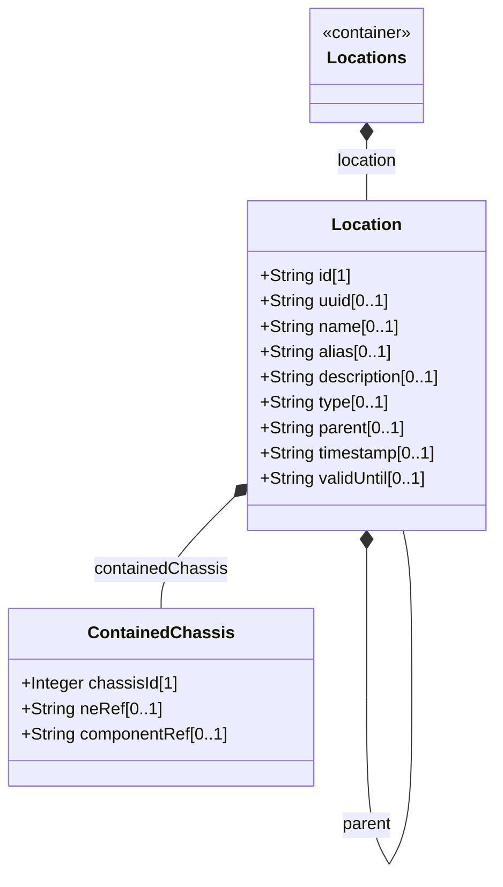

# Feature: Manage Hierarchical Location Inventory

## Parent Epic
- [ ] #6 - [Network Inventory Location](https://github.com/gintatkinson/3dgs-030/blob/main/docs/epics/epic-01-network-location-inventory.md)

## Description
Read-only access to hierarchical network inventory locations. Locations represent physical sites, buildings, equipment rooms, floors, corridors, poles, roofs, and other mount points. Each location has a unique identifier, optional type classification, optional parent reference enabling self-referential hierarchy traversal, temporal validity markers (timestamp, valid-until), and a list of directly contained chassis. Locations also carry common entity attributes (uuid, name, alias, description) inherited from the base network inventory model via nwi:basic-common-entity-attributes.

## UML Class Diagram


## Interface Requirements

### 1. Payload Schema
```json
{
  "ietf-ni-location:locations": {
    "location": [
      {
        "id": "Foo-Enterprise-Campus",
        "uuid": "550e8400-e29b-41d4-a716-446655440000",
        "name": "Foo Enterprise Campus",
        "alias": "MainSite",
        "description": "Primary enterprise campus",
        "type": "site",
        "parent": null,
        "timestamp": "2026-01-15T08:30:00Z",
        "valid-until": "2030-12-31T23:59:59Z",
        "physical-address": {},
        "geo-location": {},
        "contained-chassis": [
          {
            "chassis-id": 1,
            "ne-ref": "AP-Corridor-East-01",
            "component-ref": "chassis-1"
          }
        ]
      }
    ]
  }
}
```

### 2. Validation & Constraints
- `id` (String, mandatory): Unique identifier for the location, serves as list key.
- `uuid` (String, optional): Universally unique identifier per RFC 9562, inherited from nwi:basic-common-entity-attributes.
- `name` (String, optional): Human-readable name, inherited from nwi:basic-common-entity-attributes.
- `alias` (String, optional): Alternative label, inherited from nwi:basic-common-entity-attributes.
- `description` (String, optional): Free-text description, inherited from nwi:basic-common-entity-attributes.
- `type` (String, optional): Location type (e.g., equipment room, building, site, pole, roof, floor). Operators define custom types flexibly.
- `parent` (leafref to ../../location/id, optional): References the containing location's id. Enforces referential integrity within the same list.
- `timestamp` (yang:date-and-time, optional): When the location record was captured.
- `valid-until` (yang:date-and-time, optional): Expiration timestamp. If absent, location has no implicit expiration.
- `contained-chassis` (list, optional): Chassis directly deployed at this location without a rack.
  - `chassis-id` (uint32, mandatory key): Unique integer identifier for this chassis instance.
  - `ne-ref` (leafref to /nwi:network-inventory/nwi:network-elements/nwi:network-element/nwi:ne-id, optional).
  - `component-ref` (leafref to .../nwi:component/nwi:component-id, optional). Conditionally resolves relative to ne-ref.
- All nodes are config false (read-only operational state).

### 3. Logical Operations & Interface Messages
- Retrieve Locations: Standard YANG retrieval via NETCONF get or RESTCONF GET on /nwi:network-inventory/nil:locations.
- Filter by type: Server-side filtering on type leaf for queries scoped to specific location categories.
- Hierarchy traversal: Client navigates parent-child relationships using the parent leafref. Circular references must not exist.
- Chassis association: contained-chassis list exposes inventory components directly located. Multiple entries may reference the same ne-ref for distributed network elements.

### 4. Logical Exception States & Validation Failures
- Invalid parent reference: If parent value does not resolve to an existing location/id, the server returns an empty result per YANG leafref semantics.
- Stale location: If valid-until is present and represents a past timestamp, the location is stale and not used for operational dispatch.
- Chassis reference mismatch: If component-ref resolution fails, the server returns an empty result.
- Missing mandatory key (id): List entry without id is structurally invalid per YANG schema validation.

## Given-When-Then Acceptance Criteria

**Scenario: Retrieve all locations**
- Given the operational datastore contains multiple location entries
- When a client retrieves /nwi:network-inventory/nil:locations
- Then all location entries are returned with id, uuid, name, type, parent, timestamp, valid-until, physical-address, geo-location, and contained-chassis fields populated as available

**Scenario: Hierarchy traversal via parent reference**
- Given a location Room-101 with parent Building-A exists
- When a client retrieves the location with id Building-A
- Then the response includes the parent location details
- And a second query for parent=Building-A returns Room-101 among the results

**Scenario: Location type filtering**
- Given locations exist with types site, building, and room
- When a client retrieves locations filtered by type=site
- Then only location entries with type equal to site are returned

**Scenario: Stale location detection**
- Given a location entry has valid-until set to 2025-01-01T00:00:00Z
- When the current server time is after 2025-01-01T00:00:00Z
- Then the location entry is present in the datastore
- And any operational system checking validity marks it as expired

**Scenario: Distributed chassis in location**
- Given a network element NE-1 has two chassis components logically grouped
- When both chassis are recorded in the same location's contained-chassis list
- Then both entries reference the same ne-ref value NE-1
- And each entry has distinct chassis-id and component-ref values

**Scenario: Invalid parent reference resolution (negative)**
- Given a location has parent set to a non-existent location id
- When a client resolves the leafref
- Then the reference resolves to an empty instance

**Scenario: Date-time format validation (negative)**
- Given a server attempts to store a timestamp not conforming to yang:date-and-time format
- When the data is validated against the schema
- Then the validation fails with a type-mismatch error

## Specification Context (Verbatim)

From RFC XXXX, Section 2 (Hierarchical Locations of Network Inventory):

The location list is generalized to support a variety of geographic location, such as sites, rooms, buildings. A site represents a general geographic location to group a set of NEs and corresponding inventory components. NEs, racks, equipment rooms, and buildings can be grouped within a site. Locations can be nested to form a hierarchy.

From RFC XXXX, Section 6 (Operational Considerations):

This model serves as a complement to the base inventory, providing a read-only perspective of network inventory location information known to the controller. Before using a location for field dispatch or planning, verification is required to ensure at least one of physical-address or geo-location is present, and that the valid-until leaf is either not present or indicates a future time.

## Source References
Structural Schema: ietf-ni-location@2026-07-06.yang (Clause: grouping locations, container locations, list location, leaves id, type, parent, timestamp, valid-until, list contained-chassis)
Normative Specification: draft-ietf-ivy-network-inventory-location (Clause: Section 2, Section 4, Section 6)

## Logical UI & Layout Bindings
- Target LUI Component: TableView, PropertyGrid
- Target Layout Container ID: components_table, properties_view
- Data Source Bindings: /nwi:network-inventory/nil:locations/nil:location mapped to components_table with columns id, name, type, parent, timestamp; detail pane in properties_view for selected location properties
