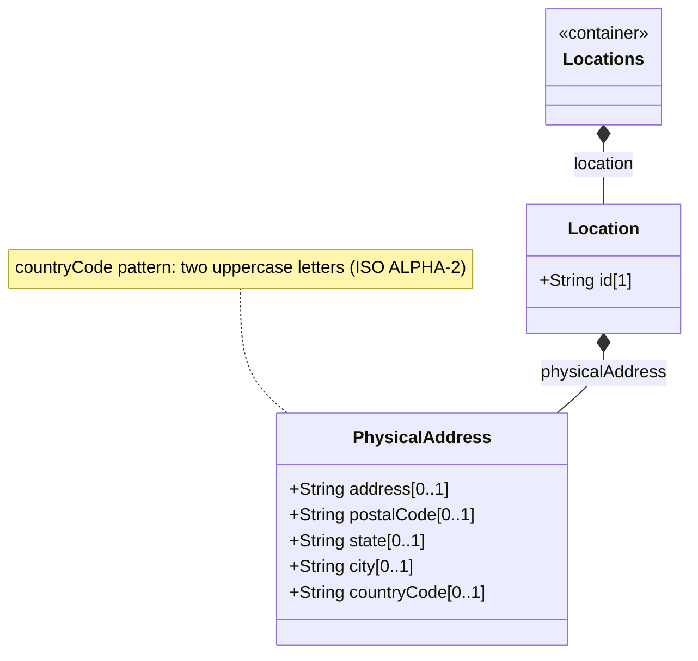

# Feature: Capture Physical Address Information

## Parent Epic
- [ ] #6 - [Network Inventory Location](https://github.com/gintatkinson/3dgs-030/blob/main/docs/epics/epic-01-network-location-inventory.md)

## Description
Read-only structured physical address data associated with each network inventory location. The physical address container holds five optional leaf nodes representing postal addressing components: street address, postal code, state or region, city, and country-code. The country-code enforces a strict two-letter uppercase ISO ALPHA-2 pattern. All fields are free-form strings allowing international address formats.

## UML Class Diagram


## Interface Requirements

### 1. Payload Schema
```json
{
  "physical-address": {
    "address": "123 Foo Street, Floor 2 East Corridor",
    "postal-code": "12345",
    "state": "Foo-State",
    "city": "Foo-City",
    "country-code": "ZZ"
  }
}
```

### 2. Validation & Constraints
- `address` (String, optional): Street address including number and street name.
- `postal-code` (String, optional): Postal or ZIP code. No pattern enforced for international formats.
- `state` (String, optional): State, province, or region. Can describe a region for countries without states.
- `city` (String, optional): City or locality name.
- `country-code` (String, optional): ISO ALPHA-2 code. Pattern enforced as two uppercase letters.
- All nodes are config false (read-only).
- At least one of physical-address or geo-location should be present before using a location for operational dispatch.

### 3. Logical Operations & Interface Messages
- Retrieve address: Embedded within parent location data tree at nil:locations/nil:location[nil:id=id]/nil:physical-address.
- Update: Operational state; not writable via standard YANG configuration operations. Populated by controller-side tooling.
- Partial address: Any subset of leaves may be present. No mandatory fields within the container.

### 4. Logical Exception States & Validation Failures
- Invalid country-code format: If value does not match two uppercase letters pattern, server rejects with schema validation error.
- Complete address absence: If all leaves are absent, the container exists as an empty node, which is structurally valid.

## Given-When-Then Acceptance Criteria

**Scenario: Retrieve complete physical address**
- Given a location Corridor-East has a populated physical-address
- When a client retrieves /nwi:network-inventory/nil:locations/nil:location[id=Corridor-East]/nil:physical-address
- Then all five leaves are returned with their stored values

**Scenario: Partial physical address**
- Given a location has only city and country-code populated
- When the address is retrieved
- Then only the city and country-code leaves are present

**Scenario: Country code pattern validation**
- Given a physical-address is populated
- When the country-code is set to ZZ (two uppercase letters)
- Then the value is accepted as valid

**Scenario: Invalid country code (negative)**
- Given a physical-address is populated
- When the country-code is set to zz or ZZZ
- Then schema validation fails with a pattern-mismatch error

**Scenario: State leaf used as region (negative)**
- Given a location is in a country without states
- When the state leaf stores a region name
- Then the value is stored and retrieved as a free-form string

**Scenario: Empty physical-address container (negative)**
- Given a location has never had physical-address data populated
- When a client retrieves the location
- Then the physical-address container may be absent or contain no leaf nodes

## Specification Context (Verbatim)

From RFC XXXX, Section 6 (Operational Considerations):

Before using a location for field dispatch or planning, verification is required to ensure at least one of physical-address or geo-location is present.

From the schema leaf descriptions:

Specifies an address (number and street). Specifies a postal code. Specifies a state. This leaf can also be used to describe a region for a country that does not have states. Specifies a city. Specifies a country. Expressed as ISO ALPHA-2 code.

## Source References
Structural Schema: ietf-ni-location@2026-07-06.yang (Clause: grouping physical-address, container physical-address, leaves address, postal-code, state, city, country-code)
Normative Specification: draft-ietf-ivy-network-inventory-location (Clause: Section 4, Figure 4 tree diagram)

## Logical UI & Layout Bindings
- Target LUI Component: PropertyGrid
- Target Layout Container ID: properties_view
- Data Source Bindings: /nwi:network-inventory/nil:locations/nil:location/nil:physical-address mapped to properties_view as grouped property sheet
