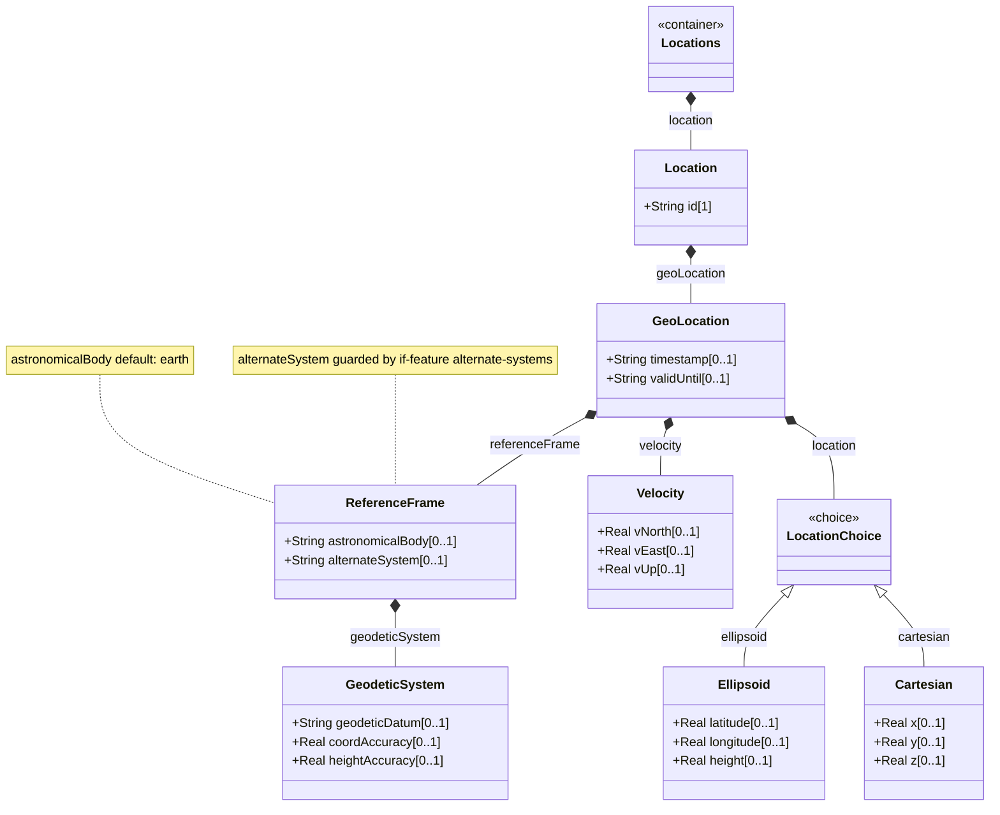

# Feature: Capture Geographic Location Coordinates

## Parent Epic
- [ ] #6 - [Network Inventory Location](https://github.com/gintatkinson/3dgs-030/blob/main/docs/epics/epic-01-network-location-inventory.md)

## Description
Read-only geographic location data using the ietf-geo-location grouping from RFC 9179. Each location may carry a reference frame defining the coordinate system (geodetic datum, astronomical body, coordinate and height accuracy), a choice between ellipsoidal coordinates (latitude, longitude, height) and Cartesian coordinates (x, y, z), an optional velocity vector (v-north, v-east, v-up), and temporal validity markers. The grouping also defines a feature-gated leaf alternate-system visible only when the alternate-systems feature is enabled.

## UML Class Diagram


## Interface Requirements

### 1. Payload Schema
```json
{
  "geo-location": {
    "reference-frame": {
      "alternate-system": null,
      "astronomical-body": "earth",
      "geodetic-system": {
        "geodetic-datum": "WGS-84",
        "coord-accuracy": 5.0,
        "height-accuracy": 10.0
      }
    },
    "ellipsoid": {
      "latitude": 40.7128,
      "longitude": -74.0060,
      "height": 15.0
    },
    "velocity": {
      "v-north": 0.0,
      "v-east": 0.0,
      "v-up": 0.0
    },
    "timestamp": "2026-01-15T08:30:00Z",
    "valid-until": "2030-12-31T23:59:59Z"
  }
}
```

### 2. Validation & Constraints

**Reference Frame**
- `alternate-system` (String, optional): Alternate reference system identifier. Guarded by if-feature alternate-systems.
- `astronomical-body` (String, optional): Celestial body (e.g., earth, moon). Default value: earth.

**Geodetic System**
- `geodetic-datum` (String, optional): Geodetic datum name (e.g., WGS-84, NAD83).
- `coord-accuracy` (decimal64, optional): Horizontal coordinate accuracy.
- `height-accuracy` (decimal64, optional): Vertical/height accuracy.

**Location Choice**
- Exactly one of ellipsoid or cartesian case may be present.

**Ellipsoid Case**
- `latitude` (decimal64, optional): Geodetic latitude.
- `longitude` (decimal64, optional): Geodetic longitude.
- `height` (decimal64, optional): Height above ellipsoid.

**Cartesian Case**
- `x` (decimal64, optional): X-coordinate in the selected reference frame.
- `y` (decimal64, optional): Y-coordinate.
- `z` (decimal64, optional): Z-coordinate.

**Velocity**
- `v-north` (decimal64, optional): Northward velocity.
- `v-east` (decimal64, optional): Eastward velocity.
- `v-up` (decimal64, optional): Upward velocity.

**Temporal Markers**
- `timestamp` (yang:date-and-time, optional): When geo-location was recorded.
- `valid-until` (yang:date-and-time, optional): Expiration timestamp.

### 3. Logical Operations & Interface Messages
- Retrieve geo-location: Embedded within location at nil:locations/nil:location[id=id]/nil:geo-location.
- Coordinate system selection: Server provides either ellipsoid or cartesian based on available data.
- Feature-dependent visibility: alternate-system leaf appears only when alternate-systems YANG feature is enabled.

### 4. Logical Exception States & Validation Failures
- Missing reference frame: If absent, no coordinate system is defined.
- Stale geo-location: If valid-until is past, the location is stale.
- decimal64 precision violation: Values exceeding fraction-digit precision are rejected.
- Coordinate ambiguity: If neither ellipsoid nor cartesian case is populated, the location lacks usable coordinate data.

## Given-When-Then Acceptance Criteria

**Scenario: Retrieve ellipsoidal coordinates with WGS-84 datum**
- Given a location has geo-location with geodetic-datum set to WGS-84 and coordinates in the ellipsoid case
- When a client retrieves the geo-location
- Then latitude, longitude, and height are returned
- And the cartesian case is absent

**Scenario: Retrieve Cartesian coordinates**
- Given a location has geo-location with coordinates in the cartesian case
- When retrieved
- Then x, y, z are returned with their decimal values

**Scenario: Default astronomical body**
- Given no astronomical-body is explicitly set
- When the geo-location is retrieved
- Then if the server applies the default, astronomical-body is reported as earth

**Scenario: Velocity tracking for mobile element**
- Given a location with a mobile network element and velocity data available
- When retrieved
- Then all three velocity components are returned

**Scenario: Stale geo-location data (negative)**
- Given a location's geo-location/valid-until is 2024-01-01T00:00:00Z
- When current server time is after that
- Then the geo-location data is marked as expired

**Scenario: Missing coordinate case (negative)**
- Given a location has reference-frame populated but no coordinate case
- When retrieved
- Then the location choice node is absent

**Scenario: Feature-gated alternate system (negative)**
- Given a server does not implement alternate-systems feature
- When a client retrieves the reference-frame
- Then the alternate-system leaf is absent

## Specification Context (Verbatim)

From RFC 9179 (Section 1, Introduction):

This document defines a YANG grouping for geographic locations. The grouping is designed to be used by other YANG modules that need to express the concept of a physical location.

From the geo-location grouping: alternate-system is guarded by the alternate-systems feature and is only present when the server implements that feature.

From RFC XXXX, Section 1: The Network Inventory location model includes provisions for geo-location data (geographic coordinates).

## Source References
Structural Schema: ietf-ni-location@2026-07-06.yang (Clause: uses geo:geo-location in list location)
External Schema: RFC 9179 - A YANG Grouping for Geographic Locations (grouping geo-location)
Normative Specification: draft-ietf-ivy-network-inventory-location (Clause: Section 2, Section 4 tree diagram)

## Logical UI & Layout Bindings
- Target LUI Component: PropertyGrid
- Target Layout Container ID: properties_view
- Data Source Bindings: /nwi:network-inventory/nil:locations/nil:location/nil:geo-location mapped to properties_view as a geodetic property sheet with coordinate fields and reference frame metadata
