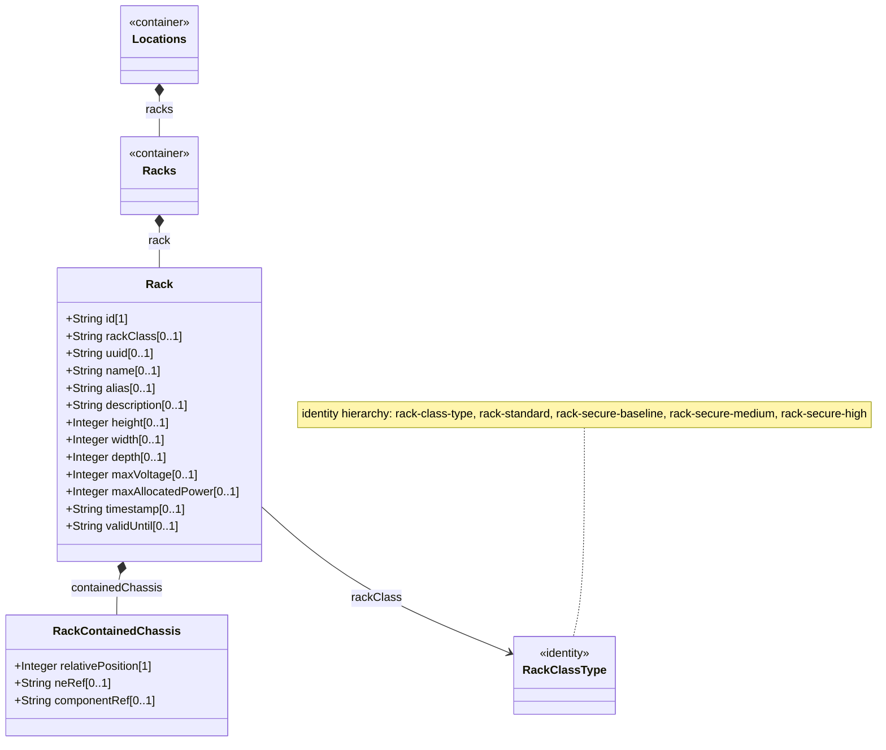

# Feature: Manage Rack Inventory

## Parent Epic
- [ ] #7 - [Rack Inventory Management](https://github.com/gintatkinson/3dgs-030/blob/main/docs/epics/epic-02-rack-inventory-management.md)

## Description
Read-only inventory of physical equipment racks within network locations. Each rack has a unique identifier, physical dimensions (height, width, depth in millimeters), electrical characteristics (max voltage in volts, max allocated power in watts), a security classification identity (rack-class), common entity attributes (uuid, name, alias, description), a rack-location sub-container for positional data, a list of contained chassis with relative positions (U-slot), and temporal validity markers. Rack classification identities define a hierarchy: rack-class-type (base) with derived identities rack-standard, rack-secure-baseline, rack-secure-medium, and rack-secure-high.

## UML Class Diagram


## Interface Requirements

### 1. Payload Schema
```json
{
  "ietf-ni-location:racks": {
    "rack": [
      {
        "id": "Rack-101-A",
        "rack-class": "rack-secure-baseline",
        "uuid": "660e8400-e29b-41d4-a716-446655440010",
        "name": "Rack A Room 101",
        "alias": "MainRack-101",
        "description": "Primary equipment rack",
        "rack-location": {
          "location-ref": "Room-101",
          "row-number": 1,
          "column-number": 1
        },
        "height": 2200,
        "width": 600,
        "depth": 1200,
        "max-voltage": 240,
        "max-allocated-power": 8000,
        "contained-chassis": [
          {
            "relative-position": 10,
            "ne-ref": "NE-1",
            "component-ref": "chassis-1"
          }
        ],
        "timestamp": "2026-01-15T10:00:00Z",
        "valid-until": "2028-01-15T10:00:00Z"
      }
    ]
  }
}
```

### 2. Validation & Constraints
- `id` (String, mandatory): Unique identifier, serves as list key.
- `rack-class` (identityref, optional): Classification from identity hierarchy rack-class-type. Valid values: rack-standard, rack-secure-baseline, rack-secure-medium, rack-secure-high, or vendor/region extensions.
- `uuid` (String, optional): Universally unique identifier, inherited from nwi:basic-common-entity-attributes.
- `name` (String, optional): Human-readable name, inherited from nwi:basic-common-entity-attributes.
- `alias` (String, optional): Alternative label, inherited from nwi:basic-common-entity-attributes.
- `description` (String, optional): Free-text description, inherited from nwi:basic-common-entity-attributes.
- `height` (uint16, optional): Rack height in millimeters.
- `width` (uint16, optional): Rack width in millimeters.
- `depth` (uint16, optional): Rack depth in millimeters.
- `max-voltage` (uint16, optional): Maximum voltage supported by the rack in volts.
- `max-allocated-power` (uint16, optional): Maximum allocated power in watts.
- `timestamp` (yang:date-and-time, optional): When the rack record was captured.
- `valid-until` (yang:date-and-time, optional): Expiration timestamp.
- `contained-chassis` (list, optional): Chassis within this rack.
  - `relative-position` (uint8, mandatory key): U-slot number.
  - `ne-ref` (leafref, optional): References the network element.
  - `component-ref` (leafref, optional): References the chassis component.
- All nodes are config false (read-only).

### 3. Logical Operations & Interface Messages
- Retrieve Racks: Standard YANG retrieval via NETCONF GET or RESTCONF GET on /nwi:network-inventory/nil:locations/nil:racks.
- Filter by rack-class: Server-side filtering on the rack-class identityref.
- Chassis positioning: Chassis entries identified by relative-position (U-slot). No duplicate positions within same rack.
- Power and dimension queries: Physical and electrical attributes enable capacity planning queries.

### 4. Logical Exception States & Validation Failures
- Invalid rack-class identity: Reference resolves to empty.
- Duplicate relative position: List key constraint violation.
- uint16 overflow for dimensions/power: Type validation failure.
- Stale rack record: valid-until past current time means rack is stale.

## Given-When-Then Acceptance Criteria

**Scenario: Retrieve all racks with physical dimensions**
- Given the operational datastore contains racks with populated physical attributes
- When a client retrieves /nwi:network-inventory/nil:locations/nil:racks
- Then each rack includes height, width, depth in millimeters

**Scenario: Rack security classification**
- Given a rack is classified as rack-secure-high
- When the rack is retrieved
- Then rack-class is reported as rack-secure-high

**Scenario: Retrieve chassis within a rack**
- Given a rack Rack-101-A contains three chassis at U-slots 10, 15, 20
- When a client retrieves the rack's contained-chassis list
- Then three entries are returned with distinct relative-position values

**Scenario: Rack power capacity**
- Given a rack has max-voltage 240 and max-allocated-power 8000
- When retrieved
- Then the rack's electrical capacity is in volts and watts respectively

**Scenario: Stale rack record (negative)**
- Given a rack has valid-until set to 2024-01-01T00:00:00Z
- When current server time is after that
- Then the rack record is treated as expired

**Scenario: Duplicate chassis position (negative)**
- Given a rack has chassis at U-slot 10
- When another chassis entry with relative-position 10 is added
- Then list key uniqueness constraint is violated

## Specification Context (Verbatim)

From RFC XXXX, Section 3 (Rack):

racks represent physical equipment racks in which NEs can be installed, which facilitate device maintenance. Through rack-location, each rack can be assigned to a site or a specific location within a site. Each rack is assigned a unique ID and a name in the context of a facility. A rack may have specific attributes such as appearance-related and electricity-related attributes. The height, depth and width are described by Figure 2 (door facing the user).

From identity definitions: rack-class-type: Base identity for generic rack classification based on physical security characteristics. rack-standard: Standard general-purpose rack without physical locking mechanisms. rack-secure-baseline: Baseline secure lockable rack. rack-secure-medium: Medium security lockable rack. rack-secure-high: High security lockable rack.

## Source References
Structural Schema: ietf-ni-location@2026-07-06.yang (Clause: grouping racks, container racks, list rack, identities rack-class-type, rack-standard, rack-secure-baseline, rack-secure-medium, rack-secure-high)
Normative Specification: draft-ietf-ivy-network-inventory-location (Clause: Section 3, Section 4, Figure 2 rack dimensions, Figure 3 rack subtree)

## Logical UI & Layout Bindings
- Target LUI Component: TableView, PropertyGrid
- Target Layout Container ID: components_table, properties_view
- Data Source Bindings: /nwi:network-inventory/nil:locations/nil:racks/nil:rack mapped to components_table; detail pane in properties_view for selected rack attributes
