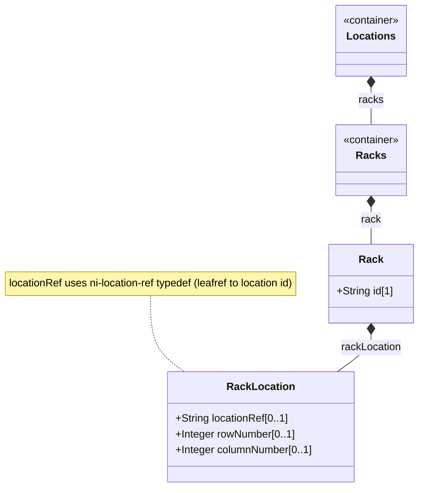

# Feature: Map Rack Location Within Facility

## Parent Epic
- [ ] #7 - [Rack Inventory Management](https://github.com/gintatkinson/3dgs-030/blob/main/docs/epics/epic-02-rack-inventory-management.md)

## Description
Read-only positional placement of each rack within an inventory location. The rack-location container holds three leaves: a reference to the parent location via the ni-location-ref typedef (a leafref pointing to the location list), a row number, and a column number identifying the rack's grid position within that location. This enables physical mapping and navigation of rack layout within a facility.

## UML Class Diagram


## Interface Requirements

### 1. Payload Schema
```json
{
  "rack-location": {
    "location-ref": "Room-101",
    "row-number": 1,
    "column-number": 1
  }
}
```

### 2. Validation & Constraints
- `location-ref` (ni-location-ref typedef, optional): Leafref resolving to /nwi:network-inventory/nil:locations/nil:location/nil:id. References the location where the rack is placed.
- `row-number` (uint32, optional): Row identifier within the referenced location.
- `column-number` (uint32, optional): Column identifier within the referenced location.
- The ni-location-ref typedef is defined as type leafref path to location/id.
- All nodes are config false (read-only).
- Row and column form a 2D grid coordinate for rack positioning.

### 3. Logical Operations & Interface Messages
- Retrieve rack location: Embedded within rack data at nil:locations/nil:racks/nil:rack[id=id]/nil:rack-location.
- Resolve location reference: The location-ref leafref resolves to the parent location's id. Unresolved references return empty.
- Grid positioning: Rack positions expressed as (row, column) pairs without spatial unit.

### 4. Logical Exception States & Validation Failures
- Unresolved location reference: If location-ref value does not match any existing location/id, leafref resolves to empty (silent non-match).
- Invalid row/column type: Values exceeding uint32 maximum rejected.
- Empty rack-location container: If all leaves are absent, container exists as structurally valid empty node.

## Given-When-Then Acceptance Criteria

**Scenario: Retrieve rack with complete location data**
- Given a rack Rack-101-A has rack-location with location-ref=Room-101, row-number=1, column-number=1
- When a client retrieves the rack
- Then all three leaves are returned

**Scenario: Rack grid positioning within a room**
- Given three racks in Room-201 with distinct (row, column) pairs
- When a client filters by location-ref=Room-201
- Then all three racks are returned with unique positions

**Scenario: Unresolved location reference (negative)**
- Given a rack has location-ref set to a non-existent location id
- When the leafref is resolved
- Then the reference resolves to empty

**Scenario: Missing rack-location (negative)**
- Given a rack has no rack-location container populated
- When the rack is retrieved
- Then the rack-location container is absent

**Scenario: row-number uint32 overflow (negative)**
- Given a rack's row-number would exceed 4294967295
- When data is validated against the schema
- Then uint32 type constraint is violated

## Specification Context (Verbatim)

From RFC XXXX, Section 3 (Rack):

Through rack-location, each rack can be assigned to a site or a specific location within a site, such as an equipment room.

From schema descriptions: The location information of the rack comprises the location reference, row number, and column number. This type is used by data models that need to reference network inventory location (ni-location-ref typedef).

## Source References
Structural Schema: ietf-ni-location@2026-07-06.yang (Clause: typedef ni-location-ref, container rack-location, leaves location-ref, row-number, column-number)
Normative Specification: draft-ietf-ivy-network-inventory-location (Clause: Section 3, Section 4 tree diagram, Figure 3 rack subtree)

## Logical UI & Layout Bindings
- Target LUI Component: PropertyGrid
- Target Layout Container ID: properties_view
- Data Source Bindings: /nwi:network-inventory/nil:locations/nil:racks/nil:rack/nil:rack-location mapped to properties_view as a grouped property sheet
