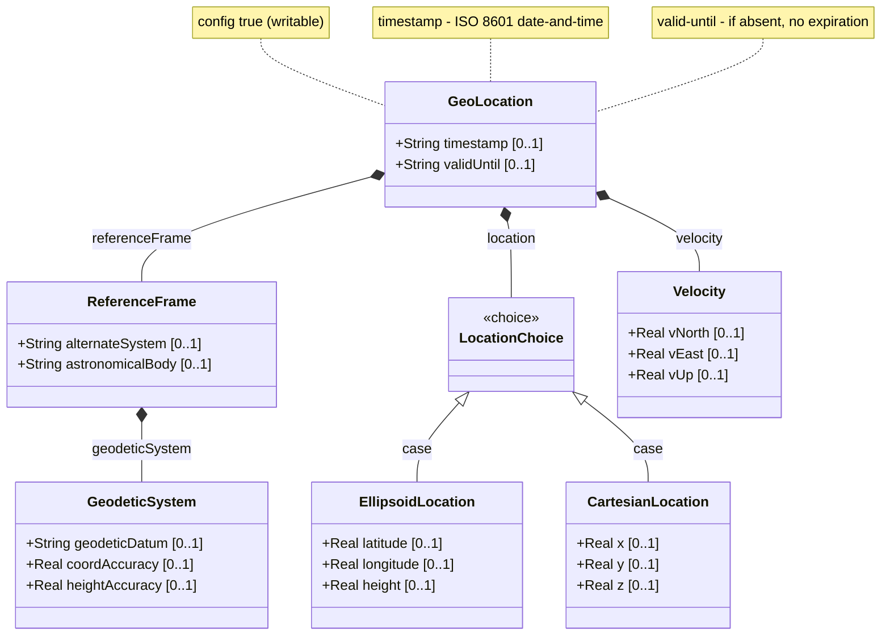

# Feature: Geo-Location Container

## Parent Epic
- [ ] #26 - Geographic Location Module (epic-03-geographic-location.md) — root container hosting all geolocation sub-containers and temporal attributes.

## Description

The `geo-location` container is the root data node that represents a location specification on or around an astronomical object (e.g., Earth). It composes a reference frame, a location choice (ellipsoidal or Cartesian), an optional velocity vector, and temporal attributes (`timestamp` and `valid-until`) that define when the location was recorded and how long it remains valid. All writable/creatable/deletable per YANG default (config true).

## UML Class Diagram



## Interface Requirements

### 1. Test Data Shape

```json
{
  "geoLocation": {
    "timestamp": "2026-07-30T14:30:00Z",
    "validUntil": "2026-07-31T14:30:00Z",
    "referenceFrame": {
      "astronomicalBody": "earth",
      "geodeticSystem": {
        "geodeticDatum": "wgs-84",
        "coordAccuracy": 0.000001,
        "heightAccuracy": 0.01
      }
    },
    "location": {
      "ellipsoid": {
        "latitude": 40.7329700000000000,
        "longitude": -74.0076960000000000,
        "height": 35.000000
      }
    },
    "velocity": {
      "vNorth": 0.000000000000,
      "vEast": 0.000000000000,
      "vUp": 0.000000000000
    }
  }
}
```

### 2. Validation & Constraints

- **timestamp**: Must be a valid ISO 8601 date-and-time string (YYYY-MM-DDTHH:mm:ss[.fraction][Z|+/-HH:MM]). Type: `yang:date-and-time` (RFC 6991). The `timestamp` field is optional.
- **valid-until**: Same type as `timestamp`. Optional. When absent, the geo-location has no specific expiration time. When present, represents when this location record ceases to be valid.
- All sub-containers and the location choice are optional: the system must accept a geo-location with only a timestamp and no location data.
- The container itself has no mandatory children; all leaves are optional.

### 3. Visual Layout & Arrangement

- The `GeoLocation` container shall be rendered as a form or property group within a `PropertyGrid` (container ID `properties_view`) or a row within a `TableView` (container ID `components_table`).
- The `timestamp` and `valid-until` fields shall appear in a "Temporal" section at the top of the property form.
- CSS resets (`box-sizing: border-box`) must apply to all layout containers. Scoped naming via CSS Modules or BEM conventions is mandatory.
- Layout containment must be restricted to outer layout splitters; scrollable child panels must not use CSS containment.

### 4. Interactive Flow & States

- **Read-only state**: When location data is displayed without edit permissions, all fields render as read-only text.
- **Edit state**: `timestamp` and `valid-until` fields become editable date-time picker controls. Timestamp field shows current UTC time as placeholder when empty.
- **Empty state**: When no geo-location data exists, the property grid shall display a placeholder message "No location data recorded."
- **Loading state**: A skeleton or spinner is shown while geo-location data is being fetched.
- **Error state**: Invalid date-time formats shall highlight the field border in the error color. Computed-style assertions must verify the error highlight color during testing.

## Given-When-Then Acceptance Criteria

**Scenario: Record geo-location with timestamp only**
- Given a user is editing a locatable entity
- When the user sets the `timestamp` to "2026-07-30T14:30:00Z" and commits without specifying a location choice
- Then the geo-location container is stored with the timestamp and all sub-containers absent
- And the `valid-until` field remains unset

**Scenario: Specify temporal validity window**
- Given a geo-location has a recorded `timestamp` of "2026-07-30T14:30:00Z"
- When the user sets `valid-until` to "2026-08-01T00:00:00Z"
- Then the location is considered valid only within the interval [2026-07-30T14:30:00Z, 2026-08-01T00:00:00Z]

**Scenario: Omit valid-until for indefinite validity**
- Given a geo-location has a recorded `timestamp`
- When `valid-until` is not specified
- Then the geo-location has no specific expiration time and is considered indefinitely valid

**Scenario: Invalid timestamp format**
- Given a user enters "2026/07/30" in the timestamp field
- When the form is submitted
- Then the system rejects the input
- And the timestamp field is highlighted with an error indicator

**Scenario: valid-until before timestamp**
- Given a timestamp of "2026-07-30T14:30:00Z"
- When the user sets valid-until to "2026-07-29T00:00:00Z"
- Then the system accepts the value (schema permits any valid date-and-time; business-layer validation may warn)
- And no schema-level constraint is violated (no cross-leaf validation defined in schema)

## Specification Context (Verbatim)

From RFC 9179, Section 2:

> This document defines a 'geo-location' YANG grouping that allows for all the above data to be captured.

From RFC 9179, Section 2.4:

> When locations are nested (e.g., a building may have a location that houses routers that also have locations), the module using this grouping is free to indicate in its definition that the 'reference-frame' is inherited from the containing object so that the 'reference-frame' need not be repeated in every instance of location data.

From RFC 9179, Section 2.5:

> During the development of this module, the question of whether it would support data such as orientation arose. These types of attributes are outside the scope of this grouping because they do not deal with a location but rather describe something more about the object that is at the location.

From RFC 9179, Section 7:

> All the data nodes defined in this YANG module are writable/creatable/deletable (i.e., "config true", which is the default). None of the writable/creatable/deletable data nodes in the YANG module defined in this document are by themselves considered more sensitive or vulnerable than standard configuration.

From the YANG module schema:
- `leaf timestamp`: type `yang:date-and-time`, description "Reference time when location was recorded."
- `leaf valid-until`: type `yang:date-and-time`, description "The timestamp for which this geo-location is valid until."

## Source References

Structural Schema: [ietf-geo-location@2022-02-11.yang](https://github.com/YangModels/yang/blob/main/standard/ietf/RFC/ietf-geo-location%402022-02-11.yang) (Clause: container geo-location)
Normative Specification: [RFC 9179: A YANG Grouping for Geographic Locations](https://datatracker.ietf.org/doc/rfc9179/) (Clause: Section 2)

## 5. Logical UI & Layout Bindings

- **Target LUI Component:** PropertyGrid
- **Target Layout Container ID:** properties_view
- **Data Source Bindings:** schema:generic-topology/topology/component[@id='active_focused_element']/child-components
