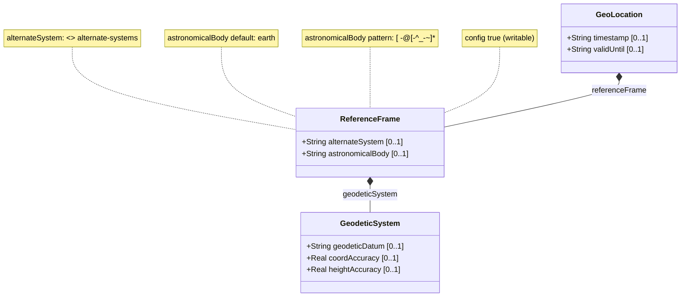

# Feature: Reference Frame

## Parent Epic
- [ ] #26 - Geographic Location Module (epic-03-geographic-location.md) — defines the frame of reference for location coordinate interpretation.

## Description

The `reference-frame` container defines the frame of reference in which all location coordinate values (latitude, longitude, height, or Cartesian x/y/z) are interpreted. It specifies the astronomical body (default "earth") on or near which the location exists, the geodetic system that defines coordinate meaning and accuracy, and optionally an alternate reference system via a feature-guarded leaf.

feature `alternate-systems`: This YANG feature is a conditional compilation guard applied via `if-feature`. When enabled on a device, the `alternate-system` leaf is available to override the default natural-universe reference system. When disabled, the leaf is not present and the reference frame always uses the natural universe. This guard is rendered as a `<<feature_guard>>` constraint note and is NOT a data leaf attribute.

## UML Class Diagram



## Interface Requirements

### 1. Test Data Shape

```json
{
  "referenceFrame": {
    "alternateSystem": null,
    "astronomicalBody": "earth",
    "geodeticSystem": {
      "geodeticDatum": "wgs-84",
      "coordAccuracy": 0.000001,
      "heightAccuracy": 0.01
    }
  }
}
```

Example with alternate system:
```json
{
  "referenceFrame": {
    "alternateSystem": "simulation-vr-001",
    "astronomicalBody": "mars",
    "geodeticSystem": {
      "geodeticDatum": "mars-2000",
      "coordAccuracy": 0.5,
      "heightAccuracy": 1.0
    }
  }
}
```

### 2. Validation & Constraints

- **alternateSystem** (type `string`): Available only when YANG feature `alternate-systems` is enabled (`<<feature_guard>>`). When absent, the system defaults to the natural universe. No pattern constraint.
- **astronomicalBody** (type `string`, default `"earth"`): Must match pattern `[ -@\[-\^_-~]*` (ASCII printable characters excluding control characters, values 32..64 and 91..126). The value SHOULD have uppercase converted to lowercase and not include leading "the". Examples: "earth", "moon", "mars", "enceladus", "ceres", "67p/churyumov-gerasimenko".
- The `astronomicalBody` leaf defaults to `"earth"` when not specified.
- When `alternateSystem` is absent, the astronomical body name is defined per the International Astronomical Union (IAU).

### 3. Visual Layout & Arrangement

- Render as a collapsible "Reference Frame" section within a `PropertyGrid` (container ID `properties_view`).
- `astronomicalBody` field shall be presented as a text input with a dropdown of known IAU body names, defaulting to "earth".
- `alternateSystem` field shall only be visible when the `alternate-systems` feature flag is enabled; otherwise hidden.
- CSS resets (`box-sizing: border-box`) mandatory. Scoped naming via CSS Modules/BEM required.
- Layout containment restricted to outer splitters only; no containment on scrollable child panels.

### 4. Interactive Flow & States

- **Read-only state**: All fields displayed as text. Default value "earth" shown even when astronomicalBody was unset.
- **Edit state**: `astronomicalBody` is a text input with IAU body name suggestions. `alternateSystem` appears only if the feature flag is active.
- **Empty state**: When editing a new location, `astronomicalBody` defaults to "earth" in the input field but the stored value is absent (using YANG default).
- **Feature toggle state**: Toggling `alternate-systems` on/off dynamically shows/hides the `alternateSystem` input field. Computed-style assertions must verify visibility changes.

## Given-When-Then Acceptance Criteria

**Scenario: Default reference frame for Earth**
- Given a user creates a new geo-location without specifying a reference frame
- When the geo-location is stored
- Then the `astronomical-body` defaults to "earth"
- And the reference frame uses the natural universe (no alternate system)

**Scenario: Specify a non-Earth astronomical body**
- Given a user is editing a geo-location for a Mars rover
- When the user sets `astronomical-body` to "mars" and `geodetic-datum` to "mars-2000"
- Then the reference frame stores "mars" as the astronomical body
- And coordinate interpretation uses the Mars-2000 geodetic system

**Scenario: Enable alternate reference system**
- Given the `alternate-systems` feature is enabled on the device
- When the user sets `alternate-system` to "virtual-reality-grid-7"
- Then the reference frame stores the alternate system identifier
- And all other reference frame values are interpreted relative to the named alternate system

**Scenario: Alternate system absent when feature disabled**
- Given the `alternate-systems` feature is not enabled
- When a reference frame is stored or retrieved
- Then the `alternate-system` leaf is not present in the data
- And the UI hides the alternate system input control

**Scenario: Invalid astronomical body pattern**
- Given a user enters a value with control characters (e.g., \x00 or \x1F)
- When the astronomical-body field is validated
- Then the system rejects the value as it fails the ASCII printable character pattern constraint

**Scenario: Uppercase auto-conversion**
- Given a user enters "Earth" or "EARTH" for astronomical-body
- When the value is processed
- Then the system SHOULD convert the value to lowercase "earth" (per RFC 9179 recommendation)

## Specification Context (Verbatim)

From RFC 9179, Section 2.1:

> The frame of reference ('reference-frame') defines what the location values refer to and their meaning. The referred-to object can be any astronomical body. It could be a planet such as Earth or Mars, a moon such as Enceladus, an asteroid such as Ceres, or even a comet such as 1P/Halley. This value is specified in 'astronomical-body' and is defined by the International Astronomical Union <http://www.iau.org>. The default 'astronomical-body' value is 'earth'.

> In addition to identifying the astronomical body, we also need to define the meaning of the coordinates (e.g., latitude and longitude) and the definition of 0-height. This is done with a 'geodetic-datum' value. The default value for 'geodetic-datum' is 'wgs-84' (i.e., the World Geodetic System [WGS84]), which is used by the Global Positioning System (GPS) among many others.

> Finally, we define an optional feature that allows for changing the system for which the above values are defined. This optional feature adds an 'alternate-system' value to the reference frame. This value is normally not present, which implies the natural universe is the system. The use of this value is intended to allow for creating virtual realities or perhaps alternate coordinate systems. The definition of alternate systems is outside the scope of this document.

From the YANG module:
- `feature alternate-systems`: "This feature means the device supports specifying locations using alternate systems for reference frames."
- `leaf alternate-system`: if-feature "alternate-systems", type string, "The system in which the astronomical body and geodetic-datum is defined."
- `leaf astronomical-body`: type string with pattern, default "earth", "An astronomical body as named by the IAU."

## Source References

Structural Schema: [ietf-geo-location@2022-02-11.yang](https://github.com/YangModels/yang/blob/main/standard/ietf/RFC/ietf-geo-location%402022-02-11.yang) (Clause: container reference-frame)
Normative Specification: [RFC 9179: A YANG Grouping for Geographic Locations](https://datatracker.ietf.org/doc/rfc9179/) (Clause: Section 2.1)

## 5. Logical UI & Layout Bindings

- **Target LUI Component:** PropertyGrid
- **Target Layout Container ID:** properties_view
- **Data Source Bindings:** schema:generic-topology/topology/component[@id='active_focused_element']/child-components
