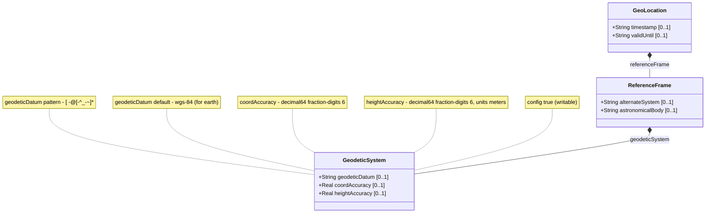

# Feature: Geodetic System

## Parent Epic
- [ ] #26 - Geographic Location Module (epic-03-geographic-location.md) — defines the geodetic datum and coordinate accuracy for the reference frame.

## Description

The `geodetic-system` container specifies the geodetic framework used to interpret latitude/longitude/height or Cartesian coordinates. It defines the geodetic datum (default "wgs-84" when the astronomical body is Earth), the horizontal coordinate accuracy (`coord-accuracy`), and the vertical/height accuracy (`height-accuracy`). The datum value is registered in the IANA "Geodetic System Values" registry. Accuracy values indicate measurement precision and override the defaults implied by the geodetic datum.

All leaves are optional. The `geodetic-datum`, when specified, must conform to the ASCII printable character pattern. The accuracy values are `decimal64` with 6 fraction digits, unitless for `coord-accuracy` and in meters for `height-accuracy`.

## UML Class Diagram



## Interface Requirements

### 1. Test Data Shape

```json
{
  "geodeticSystem": {
    "geodeticDatum": "wgs-84",
    "coordAccuracy": 0.000001,
    "heightAccuracy": 0.01
  }
}
```

Example with alternative datum:
```json
{
  "geodeticSystem": {
    "geodeticDatum": "me",
    "coordAccuracy": 1.5,
    "heightAccuracy": 3.0
  }
}
```

### 2. Validation & Constraints

- **geodeticDatum** (type `string`, pattern `[ -@\[-\^_-~]*`): ASCII printable characters only. Values SHOULD be converted to lowercase; spaces converted to dashes per IANA registry rules. Default is "wgs-84" when astronomical body is "earth". Examples: "wgs-84", "wgs-84-96", "wgs-84-08", "me" (Mean Earth/Polar Axis, Moon).
- **coordAccuracy** (type `decimal64`, fraction-digits 6): The accuracy of latitude/longitude for ellipsoidal coordinates, or X/Y/Z for Cartesian coordinates. Indicates measurement precision with respect to the defined geodetic datum. No unit (implicitly in the same unit as the coordinate system).
- **heightAccuracy** (type `decimal64`, fraction-digits 6, units meters): The accuracy of the height value for ellipsoidal coordinates. Not used with Cartesian coordinates. Indicates vertical measurement precision.
- All three leaves are optional. If `geodetic-datum` is absent, the datum defaults to "wgs-84" when astronomical body is "earth".
- Accuracy values, when present, override defaults implied by the geodetic datum.

### 3. Visual Layout & Arrangement

- Render as a sub-section "Geodetic System" within the Reference Frame section of a `PropertyGrid` (container ID `properties_view`).
- `geodeticDatum` shall be a text input with IANA registry value suggestions (wgs-84, wgs-84-96, me, etc.).
- `coordAccuracy` and `heightAccuracy` shall be numeric inputs with 6 decimal places displayed, with labels indicating meters for heightAccuracy.
- CSS resets mandatory. Scoped naming via CSS Modules/BEM required.
- Recursive lists must be nested inside parent list-items for valid DOM tree structure.

### 4. Interactive Flow & States

- **Read-only state**: Fields display as formatted text. `coordAccuracy` and `heightAccuracy` shown with 6 decimal places. "wgs-84" shown as default when absent.
- **Edit state**: `geodeticDatum` is a text input with datalist suggestions. Accuracy fields accept decimal numbers up to 6 fractional digits.
- **Empty state**: All fields blank; default "wgs-84" is inferred for Earth-based locations.
- **Error state**: Non-ASCII characters in `geodeticDatum` trigger pattern validation error. Excessive decimal places in accuracy fields trigger type validation error. Computed-style assertions must verify error highlighting during testing.
- **Interaction**: Changing `geodeticDatum` may update default accuracy values (informational hint).

## Given-When-Then Acceptance Criteria

**Scenario: Default WGS-84 for Earth locations**
- Given a geo-location has `astronomical-body` set to "earth"
- When no `geodetic-datum` is explicitly specified
- Then the geodetic system defaults to "wgs-84"
- And latitude/longitude values are interpreted per the WGS-84 ellipsoid

**Scenario: Specify a non-Earth geodetic datum**
- Given a geo-location on the Moon with `astronomical-body` "moon"
- When the user sets `geodetic-datum` to "me" (Mean Earth/Polar Axis)
- Then the geodetic system uses the Mean Earth datum for coordinate interpretation

**Scenario: Override coordinate accuracy**
- Given a geodetic datum "wgs-84" has an implicit accuracy
- When the user sets `coord-accuracy` to 0.5 meters
- Then the coordinate accuracy is 0.5 meters
- And this overrides the default accuracy implied by WGS-84

**Scenario: Override height accuracy**
- Given a geo-location using ellipsoidal coordinates
- When the user sets `height-accuracy` to 0.1 meters
- Then the height accuracy is 0.1 meters
- And this accuracy applies only to ellipsoidal height values (not Cartesian)

**Scenario: Invalid geodetic datum pattern**
- Given a user enters a geodetic datum containing a control character (e.g., "\x07bell")
- When the form is submitted
- Then the system rejects the value
- And an error message indicates the pattern constraint violation

**Scenario: Accuracy with full fractional precision**
- Given a user enters `coord-accuracy` of 0.123456
- When the value is stored
- Then all 6 fractional digits are preserved exactly
- And the decimal64 type with 6 fraction digits is honored

**Scenario: Height accuracy not applicable to Cartesian coordinates**
- Given the location uses Cartesian (x, y, z) coordinates
- When `height-accuracy` is specified
- Then per RFC 9179, the value is not used with Cartesian coordinates
- And the system notes this distinction in validation logic

## Specification Context (Verbatim)

From RFC 9179, Section 2.1:

> In addition to identifying the astronomical body, we also need to define the meaning of the coordinates (e.g., latitude and longitude) and the definition of 0-height. This is done with a 'geodetic-datum' value. The default value for 'geodetic-datum' is 'wgs-84' (i.e., the World Geodetic System [WGS84]), which is used by the Global Positioning System (GPS) among many others. We define an IANA registry for specifying standard values for the 'geodetic-datum'.

> In addition to the 'geodetic-datum' value, we allow overriding the coordinate and height accuracy using 'coord-accuracy' and 'height-accuracy', respectively. When specified, these values override the defaults implied by the 'geodetic-datum' value.

From RFC 9179, Section 6.1:

> IANA has created the "Geodetic System Values" registry under the "YANG Geographic Location Parameters" registry. This registry allocates names for standard geodetic systems. The values SHOULD use an acronym when available, they MUST be converted to lowercase, and spaces MUST be changed to dashes "-".

From the YANG module:
- `leaf coord-accuracy`: type `decimal64 { fraction-digits 6; }`, "The accuracy of the latitude/longitude pair for ellipsoidal coordinates, or the X, Y, and Z components for Cartesian coordinates."
- `leaf height-accuracy`: type `decimal64 { fraction-digits 6; }`, units "meters", "The accuracy of the height value for ellipsoidal coordinates; this value is not used with Cartesian coordinates."

## Source References

Structural Schema: [ietf-geo-location@2022-02-11.yang](https://github.com/YangModels/yang/blob/main/standard/ietf/RFC/ietf-geo-location%402022-02-11.yang) (Clause: container geodetic-system)
Normative Specification: [RFC 9179: A YANG Grouping for Geographic Locations](https://datatracker.ietf.org/doc/rfc9179/) (Clause: Section 2.1, Section 6.1)

## 5. Logical UI & Layout Bindings

- **Target LUI Component:** PropertyGrid
- **Target Layout Container ID:** properties_view
- **Data Source Bindings:** schema:generic-topology/topology/component[@id='active_focused_element']/child-components
