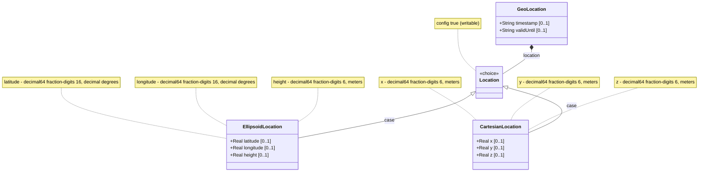

# Feature: Location Coordinates

## Parent Epic
- [ ] #26 - Geographic Location Module (epic-03-geographic-location.md) — captures the location coordinate data in either ellipsoidal (latitude/longitude/height) or Cartesian (x/y/z) form.

## Description

The `location` choice represents the position coordinate data on or relative to the astronomical object defined in the reference frame. Exactly one of two coordinate systems may be selected:

- **Ellipsoid** case: `latitude` (decimal64, fraction-digits 16, decimal degrees), `longitude` (decimal64, fraction-digits 16, decimal degrees), and optional `height` (decimal64, fraction-digits 6, meters).
- **Cartesian** case: `x`, `y`, `z` (decimal64, fraction-digits 6, meters each).

All leaves within both cases are optional. The choice itself is optional: a geo-location may have no location coordinate data specified.

## UML Class Diagram



## Interface Requirements

### 1. Test Data Shape

Ellipsoid location:
```json
{
  "location": {
    "ellipsoid": {
      "latitude": 40.7329700000000000,
      "longitude": -74.0076960000000000,
      "height": 35.000000
    }
  }
}
```

Cartesian location:
```json
{
  "location": {
    "cartesian": {
      "x": 1330680.593000,
      "y": -4652738.536000,
      "z": 4138531.132000
    }
  }
}
```

### 2. Validation & Constraints

**Ellipsoid case:**
- **latitude** (type `decimal64`, fraction-digits 16, units decimal degrees): Angular distance north or south of the equator. Valid range typically [-90.0, +90.0] decimal degrees (semantic constraint, not enforced by YANG schema). Precision: 16 fractional decimal digits.
- **longitude** (type `decimal64`, fraction-digits 16, units decimal degrees): Angular distance east or west of the prime meridian. Valid range typically [-180.0, +180.0] or [0.0, 360.0] decimal degrees (semantic, not schema-enforced). Precision: 16 fractional decimal digits.
- **height** (type `decimal64`, fraction-digits 6, units meters): Distance from a reference 0 value. The definition and precision of 0-height is defined by the reference frame's geodetic-datum. Precision: 6 fractional decimal digits.

**Cartesian case:**
- **x** (type `decimal64`, fraction-digits 6, units meters): X-axis coordinate as defined by the reference frame.
- **y** (type `decimal64`, fraction-digits 6, units meters): Y-axis coordinate as defined by the reference frame.
- **z** (type `decimal64`, fraction-digits 6, units meters): Z-axis coordinate as defined by the reference frame.

**General constraints:**
- All six leaves are optional within their respective cases.
- The choice itself is optional: a geo-location may be stored without any location coordinate data.
- Exactly one case (ellipsoid or cartesian) may be active; both cannot be present simultaneously.

### 3. Visual Layout & Arrangement

- Render within a `PropertyGrid` (container ID `properties_view`) as a "Location" section.
- Provide a toggle or tab control to select between "Ellipsoid" and "Cartesian" coordinate input modes.
- **Ellipsoid mode**: Three numeric inputs labeled "Latitude" (°), "Longitude" (°), and "Height" (m). Latitude/longitude inputs show 16 decimal places; height shows 6.
- **Cartesian mode**: Three numeric inputs labeled "X" (m), "Y" (m), "Z" (m), each showing 6 decimal places.
- CSS resets mandatory. Scoped naming via CSS Modules/BEM required. Layout containment restricted to outer splitters.

### 4. Interactive Flow & States

- **Read-only state**: Selected coordinate system values displayed as formatted text with full precision.
- **Edit state**: Toggle between ellipsoid and Cartesian modes. Switching clears the other case's values. Numeric inputs accept decimal values up to the schema-defined fraction digit limits.
- **Empty state**: When no location data exists, display "No coordinates specified" with the toggle controls available to begin input.
- **Loading state**: Skeleton inputs while fetching location data.
- **Error state**: Inputs exceeding the fraction-digit precision are rejected. Computed-style assertions must verify error highlight colors during testing.
- **Mode toggle interaction**: Switching from ellipsoid to Cartesian (or vice versa) replaces the input fields; previously entered values in the deselected case are not lost but become inactive in the data payload.

## Given-When-Then Acceptance Criteria

**Scenario: Record ellipsoidal coordinates at full precision**
- Given a user sets the coordinate mode to "Ellipsoid"
- When the user enters latitude 40.7329700000000000 and longitude -74.0076960000000000
- Then both values are stored with all 16 fractional decimal digits
- And the YANG decimal64 fraction-digits 16 constraint is satisfied

**Scenario: Record ellipsoidal coordinates with height**
- Given ellipsoid mode is selected
- When the user enters latitude 48.8583424, longitude 2.3375084, and height 35.000000
- Then all three values are stored
- And height is stored with 6 fractional decimal digits in meters

**Scenario: Record Cartesian coordinates**
- Given a user switches to "Cartesian" mode
- When the user enters x=1330680.593000, y=-4652738.536000, z=4138531.132000
- Then the Cartesian case values are stored
- And the ellipsoid case is not present in the data

**Scenario: Switch between coordinate systems**
- Given ellipsoid mode is active with latitude and longitude values entered
- When the user switches to Cartesian mode and enters x, y, z values
- Then the stored location contains only the Cartesian case
- And the ellipsoid values from the form are not included in the stored data

**Scenario: Omit location entirely**
- Given a geo-location is created without specifying any location coordinate data
- When the geo-location is stored
- Then the `location` choice is absent
- And no coordinate leaves are present

**Scenario: Location data with no height**
- Given ellipsoid mode and the user enters only latitude 51.5074 and longitude -0.1278
- When stored
- Then latitude and longitude are present
- And height is absent

**Scenario: Latitude/longitude semantic boundary validation**
- Given a user enters latitude 91.0
- When the form is validated at the application layer
- Then the system SHOULD warn that latitude exceeds the typical [-90, +90] range
- But the YANG schema itself has no range constraint on latitude

**Scenario: Cartesian single-axis specification**
- Given Cartesian mode with x=100.0, y unset, z unset
- When stored
- Then x is stored and y/z are absent
- And no mandatory-fields constraint is violated

## Specification Context (Verbatim)

From RFC 9179, Section 2.2:

> This is the location on, or relative to, the astronomical object. It is specified using two or three coordinate values. These values are given either as 'latitude', 'longitude', and an optional 'height', or as Cartesian coordinates of 'x', 'y', and 'z'. For the standard location choice, 'latitude' and 'longitude' are specified as decimal degrees, and the 'height' value is in fractions of meters. For the Cartesian choice, 'x', 'y', and 'z' are in fractions of meters. In both choices, the exact meanings of all the values are defined by the 'geodetic-datum' value in Section 2.1.

From the YANG module:
- `choice location`: "The location data either in latitude/longitude or Cartesian values"
- `case ellipsoid`: Contains latitude (decimal64 fr16, decimal degrees), longitude (decimal64 fr16, decimal degrees), height (decimal64 fr6, meters)
- `case cartesian`: Contains x, y, z (decimal64 fr6, meters each)

## Source References

Structural Schema: [ietf-geo-location@2022-02-11.yang](https://github.com/YangModels/yang/blob/main/standard/ietf/RFC/ietf-geo-location%402022-02-11.yang) (Clause: choice location, cases ellipsoid and cartesian)
Normative Specification: [RFC 9179: A YANG Grouping for Geographic Locations](https://datatracker.ietf.org/doc/rfc9179/) (Clause: Section 2.2)

## 5. Logical UI & Layout Bindings

- **Target LUI Component:** PropertyGrid
- **Target Layout Container ID:** properties_view
- **Data Source Bindings:** schema:generic-topology/topology/component[@id='active_focused_element']/child-components
