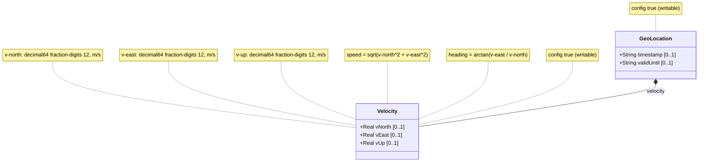

# Feature: Velocity Vector

## Parent Epic
- [ ] #26 - Geographic Location Module (epic-03-geographic-location.md) — describes the motion of the located object via a 3D velocity vector.

## Description

The `velocity` container captures the motion of a located object at the time given by the geo-location `timestamp`. It provides a three-dimensional velocity vector with components:

- **v-north** (decimal64, fraction-digits 12, meters per second): Rate of change towards true north as defined by the geodetic system.
- **v-east** (decimal64, fraction-digits 12, meters per second): Rate of change perpendicular to the right of true north.
- **v-up** (decimal64, fraction-digits 12, meters per second): Rate of change away from the center of mass (perpendicular to the v-north/v-east plane).

From these components, two-dimensional speed and heading can be derived:
- speed = sqrt(v_north^2 + v_east^2)
- heading = arctan(v_east / v_north)

All three leaves are optional. The velocity container is intended for objects in relatively stable motion and can track very slow movement such as continental drift when high accuracy is required.

## UML Class Diagram



## Interface Requirements

### 1. Test Data Shape

```json
{
  "velocity": {
    "vNorth": 1.500000000000,
    "vEast": 0.000000000000,
    "vUp": 0.050000000000
  }
}
```

Example for stationary object:
```json
{
  "velocity": {
    "vNorth": 0.000000000000,
    "vEast": 0.000000000000,
    "vUp": 0.000000000000
  }
}
```

### 2. Validation & Constraints

- **vNorth** (type `decimal64`, fraction-digits 12, units meters per second): Rate of change towards true north. Positive values are northward; negative values are southward. Precision: 12 fractional decimal digits.
- **vEast** (type `decimal64`, fraction-digits 12, units meters per second): Rate of change perpendicular to the right of true north. Positive values are eastward; negative values are westward. Precision: 12 fractional decimal digits.
- **vUp** (type `decimal64`, fraction-digits 12, units meters per second): Rate of change away from the center of mass. Positive values are upward (away from center of mass); negative values are downward. Precision: 12 fractional decimal digits.
- All three leaves are optional. If the velocity container is present, any subset of its components may be specified.
- The heading formula `arctan(v_east / v_north)` is undefined when v_north is zero. Implementations must handle this edge case (heading = 90° or 270° for due east/west).
- Derived speed is always non-negative (magnitude of the horizontal vector).

### 3. Visual Layout & Arrangement

- Render as a "Velocity" section within a `PropertyGrid` (container ID `properties_view`).
- Three numeric input fields labeled "v-North (m/s)", "v-East (m/s)", and "v-Up (m/s)", each showing 12 decimal places.
- Optionally display computed "Speed" and "Heading" values as read-only derived fields below the vector inputs.
- CSS resets mandatory. Scoped naming via CSS Modules/BEM required.
- Layout containment restricted to outer splitters.

### 4. Interactive Flow & States

- **Read-only state**: Velocity vector components displayed as text with 12 decimal places. Derived speed and heading shown if calculable.
- **Edit state**: Three numeric inputs accepting decimal values. Derived speed and heading update in real-time as the user types (read-only computed fields).
- **Empty state**: When no velocity data exists, display "No velocity recorded" with an "Add velocity" action button.
- **Error state**: Non-numeric or malformed decimal input triggers field-level validation error. Computed-style assertions must verify the error highlight color during testing.
- **Edge case (v-north = 0)**: When v-north is zero and v-east is non-zero, heading displays as 90° (east) or 270° (west). When both are zero, heading displays as "N/A".

## Given-When-Then Acceptance Criteria

**Scenario: Record stationary velocity**
- Given a geo-location represents a fixed asset
- When the user sets v-north=0.0, v-east=0.0, v-up=0.0
- Then the velocity vector is stored with all zeros
- And the derived speed is 0.0 m/s
- And the derived heading is "N/A"

**Scenario: Record northward velocity**
- Given a geo-location represents a vehicle moving north at 1.5 m/s
- When the user sets v-north=1.500000000000, v-east=0.000000000000, v-up=0.050000000000
- Then the velocity vector is stored with the precise values
- And the derived speed is 1.5 m/s
- And the derived heading is 0° (true north)

**Scenario: Record northeast velocity**
- Given an object moving northeast at 1 m/s north and 1 m/s east
- When v-north=1.000000000000 and v-east=1.000000000000
- Then the derived speed is approximately 1.414213562373 m/s
- And the derived heading is 45°

**Scenario: Record eastward velocity with no north component**
- Given an object moving due east at 2 m/s
- When v-north=0.0 and v-east=2.000000000000
- Then the derived heading is 90° (due east, atan2 handles v_north=0)
- And the derived speed is 2.0 m/s

**Scenario: Partial velocity components**
- Given an object whose east component is unknown
- When the user sets only v-north=0.500000000000
- Then the velocity container stores only the v-north component
- And v-east and v-up are absent
- And derived speed and heading are not calculable (shown as N/A)

**Scenario: No velocity specified**
- Given a geo-location is recorded without velocity data
- When the geo-location is stored
- Then the velocity container is absent from the data

**Scenario: Continental drift tracking**
- Given high-accuracy requirements for slow movement (e.g., continental drift ~0.000000030 m/s)
- When the user sets v-north=0.000000030000
- Then the value is stored with all 12 fractional digits
- And the decimal64 fraction-digits 12 constraint accommodates the precision

**Scenario: Excessive fractional precision rejected**
- Given a user attempts to enter 14 fractional digits for v-north
- When the input is validated against the decimal64 fraction-digits 12 constraint
- Then the system rejects the excess precision
- And an error message indicates the maximum of 12 fractional digits

## Specification Context (Verbatim)

From RFC 9179, Section 2.3:

> Support is added for objects in relatively stable motion. For objects in relatively stable motion, the grouping provides a three-dimensional vector value. The components of the vector are 'v-north', 'v-east', and 'v-up', which are all given in fractional meters per second. The values 'v-north' and 'v-east' are relative to true north as defined by the reference frame for the astronomical body; 'v-up' is perpendicular to the plane defined by 'v-north' and 'v-east', and is pointed away from the center of mass.

> To derive the two-dimensional heading and speed, one would use the following formulas: speed = sqrt(v_north^2 + v_east^2), heading = arctan(v_east / v_north).

> For some applications that demand high accuracy and where the data is infrequently updated, this velocity vector can track very slow movement such as continental drift.

> Tracking more complex forms of motion is outside the scope of this work. The intent of the grouping being defined here is to identify where something is located, and generally this is expected to be somewhere on, or relative to, Earth (or another astronomical body).

From the YANG module:
- `leaf v-north`: decimal64 fraction-digits 12, units "meters per second", "rate of change towards true north"
- `leaf v-east`: decimal64 fraction-digits 12, units "meters per second", "rate of change perpendicular to the right of true north"
- `leaf v-up`: decimal64 fraction-digits 12, units "meters per second", "rate of change away from the center of mass"

## Source References

Structural Schema: [ietf-geo-location@2022-02-11.yang](https://github.com/YangModels/yang/blob/main/standard/ietf/RFC/ietf-geo-location%402022-02-11.yang) (Clause: container velocity)
Normative Specification: [RFC 9179: A YANG Grouping for Geographic Locations](https://datatracker.ietf.org/doc/rfc9179/) (Clause: Section 2.3)

## 5. Logical UI & Layout Bindings

- **Target LUI Component:** PropertyGrid
- **Target Layout Container ID:** properties_view
- **Data Source Bindings:** schema:generic-topology/topology/component[@id='active_focused_element']/child-components
