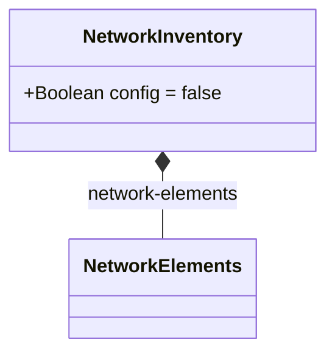

# Feature: Network Inventory Container

## Parent Epic
- [ ] #49 - [Network Inventory: Network Elements Management](https://github.com/gintatkinson/3dgs-030/blob/main/docs/epics/epic-04-network-elements-management.md) — Top-level container hosting all network inventory data; root entry point for inventory retrieval.

## Description

The `network-inventory` container is the root operational data node (`config false`) that provides a read-only snapshot of the network-wide inventory. It serves as the top-level entry point for all inventory retrieval, composing the `network-elements` subtree. Per the specification, additional inventory object types can be defined in companion augmentation data models and placed at this level, making the container a deliberate extension point.

## UML Class Diagram


## UML Class Diagram



## Interface Requirements

### 1. Test Data Shape

```json
{
  "networkInventory": {
    "networkElements": {
      "networkElement": []
    }
  }
}
```

### 2. Validation & Constraints

- **config false**: All data nodes under this container are read-only operational state. No write/create/delete operations are permitted at this level.
- The container itself has no leaf attributes; it is a structural grouping container only.
- The `network-elements` child container is present regardless of whether any network elements have been discovered (it may contain an empty list).
- No mandatory children exist at this container level.

### 3. Visual Layout & Arrangement

- The `NetworkInventory` container shall render as the root object in the resource hierarchy tree (`HierarchyTreeSelector`, container ID `resource_tree`), serving as the expandable root node under which all discovered network elements are enumerated.
- When no network elements are discovered, the tree node shall display with a "(0 elements)" suffix or an empty-state badge.
- CSS resets (`box-sizing: border-box`) must apply to all layout containers. Scoped naming via CSS Modules or BEM conventions is mandatory.
- Valid DOM nesting for tree structures: recursive lists must be nested inside parent list-items.

### 4. Interactive Flow & States

- **Loading state**: While inventory data is being fetched from the controller, a skeleton loader or spinner shall render at the root tree node position.
- **Empty state**: When inventory retrieval returns zero network elements, the tree shall display the root node with an empty indicator (e.g., "(0)").
- **Error state**: If inventory retrieval fails, the root node shall display an error icon with a tooltip containing the error message. Click/tap shall offer retry.
- **Read-only state**: The container and all descendants are read-only operational state — no inline editing controls shall appear.

## Given-When-Then Acceptance Criteria

**Scenario: Retrieve inventory with no network elements**
- Given a network controller has no discovered network elements
- When the system fetches the `network-inventory` operational state
- Then the `network-elements` container is present
- And the `network-element` list is empty

**Scenario: Inventory container exists as read-only operational state**
- Given the network inventory data model is loaded
- When a client attempts to write any data under `/network-inventory`
- Then the server rejects the write operation
- And returns an error indicating the datastore is operational (config false)

**Scenario: Extension point supports augmented inventory object types**
- Given a companion augmentation module defines a new container `other-inventory` at the `network-inventory` level
- When inventory data is retrieved
- Then the augmented container data appears alongside `network-elements` at the `network-inventory` level
- And no data is lost or corrupted

**Scenario: Root tree node selection populates workspace**
- Given network inventory data exists
- When a user selects the `NetworkInventory` root node in the resource tree (`resource_tree`)
- Then the workspace shall display a summary view showing total network element count
- And sub-nodes (individual network elements) become selectable in the tree

## Specification Context (Verbatim)

From draft-ietf-ivy-network-inventory-yang, Section 3:

> The base network inventory model, defined in this document, provides a list of network elements and of network element components. The network-inventory top level container has been defined to support reporting other types of network inventory objects, besides the network elements and network element components. These additional types of network inventory objects can be defined, together with the associated YANG data model and the rationale for managing them as part of the network inventory, in other documents providing application- and technology-specific companion augmentation data models.

From the YANG module schema:
- `container network-inventory`: config false, description "Top-level container for network inventory."

## Source References

Structural Schema: [ietf-network-inventory@2026-05-27.yang](https://github.com/gintatkinson/3dgs-030/blob/main/schema/ietf-network-inventory%402026-05-27.yang) (Clause: container network-inventory)
Normative Specification: [draft-ietf-ivy-network-inventory-yang-18](https://datatracker.ietf.org/doc/html/draft-ietf-ivy-network-inventory-yang) (Clause: Section 3)

## Logical UI & Layout Bindings

- **Target LUI Component:** HierarchyTreeSelector (root node), with PropertyGrid (summary details)
- **Target Layout Container ID:** resource_tree (root node), properties_view (summary)
- **Data Source Bindings:** schema:ietf-network-inventory/network-inventory
