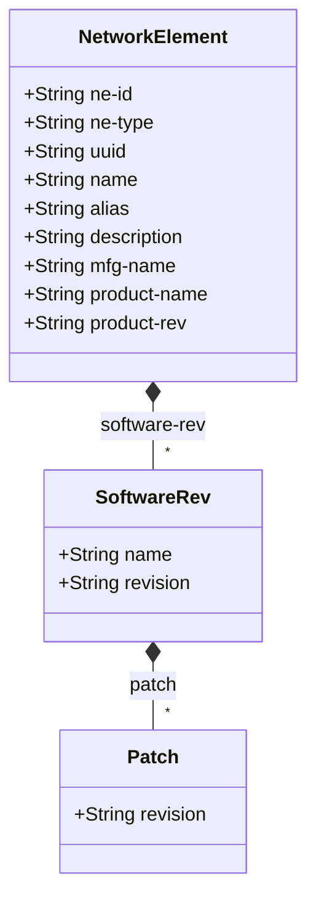

# Feature: Network Elements Management

## Parent Epic
- [ ] #49 - [Network Inventory: Network Elements Management](https://github.com/gintatkinson/3dgs-030/blob/main/docs/epics/epic-04-network-elements-management.md) — Container hosting the list of network elements with their identities, software revisions, and manufacturer attributes.

## Description

The `network-elements` container hosts the `network-element` list keyed by `ne-id`. Each network element (NE) represents a managed entity discovered by the controller — by default a physical network element (device, host, gateway, terminal server, etc.). The NE carries basic identification, manufacturer metadata, software revision tracking, and a product revision string. The `ne-type` identity system supports extensible type classification; this module defines only `ne-physical`.

The module also defines the `ne-ref` typedef (a leafref to `ne-id`) and three groupings (`component-ref`, `port-ref`, `basic-common-entity-attributes`, `ne-component-common-entity-attributes`) referenced by this feature's node tree. The identities `ne-type` and `ne-physical` are defined as part of this bounded context.

## UML Class Diagram


## UML Class Diagram



## Interface Requirements

### 1. Test Data Shape

```json
{
  "networkElements": {
    "networkElement": [
      {
        "neId": "ne-001",
        "neType": "nwi:ne-physical",
        "uuid": "550e8400-e29b-41d4-a716-446655440000",
        "name": "core-router-01",
        "alias": "CR01",
        "description": "Core router serving DC East",
        "softwareRev": [
          {
            "name": "OS",
            "revision": "22.3R1",
            "patch": [
              { "revision": "P1" },
              { "revision": "P2" }
            ]
          }
        ],
        "mfgName": "VendorCorp",
        "productName": "XR-9000",
        "productRev": "rev-B"
      }
    ]
  }
}
```

### 2. Validation & Constraints

- **ne-id** (String, key): Uniquely identifies the NE within the network, assigned by the server. The same NE must always receive the same identifier even after disconnection. Type: `string`.
- **ne-type** (String identityref, optional): Must be a valid identity derived from `nwi:ne-type`. Default: `nwi:ne-physical`. If no value is provided, the system defaults to physical NE.
- **uuid** (String, optional): Universally Unique Identifier in RFC 9562 format (e.g., `550e8400-e29b-41d4-a716-446655440000`). Type: `yang:uuid`.
- **name** (String, optional): Human-interpretable label. The server may auto-assign a locally unique value if none is discovered. Type: `string`.
- **alias** (String, optional): Operator-specified alternative label. Type: `string`.
- **description** (String, optional): Human-interpretable description for maintenance context. Type: `string`.
- **software-rev** (List, optional): Keyed by `name` (String). Each entry has `revision` (String, optional) and nested `patch` list keyed by `revision` (String).
- **mfg-name** (String, optional): Manufacturer name of the NE. Type: `string`.
- **product-name** (String, optional): Vendor-specific product type string. Expected unique per vendor scope. Type: `string`.
- **product-rev** (String, optional): Vendor-specific product revision string. Type: `string`.
- All leaves at the NE level are read-only (config false via parent container).
- The `ne-ref` typedef references `/nwi:network-inventory/nwi:network-elements/nwi:network-element/nwi:ne-id` with `require-instance false`.

### 3. Visual Layout & Arrangement

- The `network-element` list shall render as rows in a `TableView` (container ID `elements_view`). Each row displays columns for ne-id, name, ne-type, mfg-name, and product-name.
- Selecting a row populates a `PropertyGrid` (container ID `properties_view`) with the full NE attribute set, grouped into sections: "Identifier" (ne-id, uuid), "Labels" (name, alias, description), "Manufacturer" (mfg-name, product-name, product-rev), and "Software" (software-rev list with patches).
- The NE tree nodes shall appear as children of the root `NetworkInventory` node in the `resource_tree` (container ID `resource_tree`).
- CSS resets (`box-sizing: border-box`) must apply. Scoped naming via CSS Modules or BEM is mandatory.
- Layout containment restricted to outer layout splitters only.

### 4. Interactive Flow & States

- **Loading state**: TableView displays a skeleton or spinner while the NE list is being fetched.
- **Empty state**: When no network elements exist, the TableView displays "No network elements discovered." The NE list in the resource tree shows "(0)".
- **Read-only state**: All fields render as read-only text in the PropertyGrid. No inline editing.
- **Selection state**: Clicking/selecting a row in the TableView highlights the row and populates the PropertyGrid with that NE's data. The corresponding tree node in resource_tree is also selected.
- **Error state**: If NE data fails to load, an error banner appears above the TableView with retry action. Computed-style assertions must verify error highlight colors.

## Given-When-Then Acceptance Criteria

**Scenario: List all discovered network elements**
- Given a network controller has discovered multiple network elements
- When the system retrieves the `network-elements` operational state
- Then all discovered NEs are returned in the `network-element` list
- And each entry is uniquely identified by its `ne-id`

**Scenario: Network element has default physical type**
- Given a network element is discovered with no explicit `ne-type` specified
- When the NE data is retrieved
- Then the `ne-type` field defaults to `nwi:ne-physical`
- And the NE is classified as a physical network element

**Scenario: Track software revisions on a network element**
- Given a network element runs an OS image and two FPGA firmware modules
- When the inventory is retrieved
- Then the `software-rev` list contains one entry per software module
- And each entry contains the module `name` and optional `revision`
- And a module may have zero or more applied `patch` entries

**Scenario: NE identifier is stable across reconnections**
- Given a network element with ne-id "ne-001" is temporarily disconnected from the controller
- When the controller re-discovers the same network element
- Then the NE retains the identifier "ne-001"
- And no duplicate entry is created

**Scenario: Empty network element list**
- Given a controller has not discovered any network elements
- When inventory is retrieved
- Then the `network-element` list is present but contains zero entries

**Scenario: ne-ref typedef resolves to valid NE**
- Given a network element with ne-id "ne-001" exists in the inventory
- When a leafref of type `nwi:ne-ref` references "ne-001"
- Then the reference resolves correctly to the target network element
- And the target path is `/nwi:network-inventory/nwi:network-elements/nwi:network-element/nwi:ne-id`

**Scenario: ne-ref typedef allows references to non-existent NEs**
- Given no network element with ne-id "ne-999" exists
- When a leafref of type `nwi:ne-ref` references "ne-999"
- Then the reference is syntactically valid (require-instance is false)
- And the target NE may be instantiated later

**Scenario: Validate UUID format on network element**
- Given a network element's uuid field is populated
- When the uuid value is retrieved
- Then the value conforms to RFC 9562 UUID format (e.g., `550e8400-e29b-41d4-a716-446655440000`)
- And invalid UUID formats are not set by the server

## Specification Context (Verbatim)

From draft-ietf-ivy-network-inventory-yang, Section 3:

> The network element definition is generalized to support physical network elements and other types of components' groups that can be managed as physical network elements from an inventory perspective. Physical network elements are usually devices such as hosts, gateways, terminal servers, and the like, which have management agents responsible for performing the network management functions requested by the network management stations (RFC 1157).

From draft-ietf-ivy-network-inventory-yang, Section 3.2:

> ne-id: The identifier that uniquely identifies the network element (NE) within the network, assigned by the server since the network elements cannot guarantee that their local identifier is unique within the network. The ne-id should be assigned such that the same network element will always be identified through the same identifier, even if the network elements get disconnected from the network controller. Mechanisms to ensure this (e.g., checking the mfg-name, product-name, management IP address, physical location) are implementation specific and outside the scope of standardization.

> ne-type: The type of network element (e.g., physical network element).

> product-rev: A vendor-specific product revision string for the network-element.

From draft-ietf-ivy-network-inventory-yang, Section 3.1.1:

> mfg-name: The name of the manufacturer of the entity (component or network element).
> product-name: The vendor-specific and human-interpretable string describing the entity (component or network element) type. It is expected that vendors assign unique product names to different entities within the scope of the vendor.

From draft-ietf-ivy-network-inventory-yang, Section 3.3.2:

> Each instance of a network element or a component includes its own "software-rev" list which provides basic software attributes for each entity. The scope of the list is to provide information about the software images intended to be running within the related entity. The model supports scenarios where multiple software modules can be images intended to be running within the entity.

## Source References

Structural Schema: [ietf-network-inventory@2026-05-27.yang](https://github.com/gintatkinson/3dgs-030/blob/main/schema/ietf-network-inventory%402026-05-27.yang) (Clause: container network-elements, list network-element, identities ne-type/ne-physical, typedef ne-ref, groupings component-ref/port-ref/basic-common-entity-attributes/ne-component-common-entity-attributes)
Normative Specification: [draft-ietf-ivy-network-inventory-yang-18](https://datatracker.ietf.org/doc/html/draft-ietf-ivy-network-inventory-yang) (Clause: Sections 3, 3.1, 3.1.1, 3.2, 3.3.2)

## Logical UI & Layout Bindings

- **Target LUI Component:** TableView (list view), PropertyGrid (detail view)
- **Target Layout Container ID:** elements_view (list), properties_view (detail), resource_tree (tree node)
- **Data Source Bindings:** schema:ietf-network-inventory/network-inventory/network-elements/network-element[@ne-id='selected_element']
