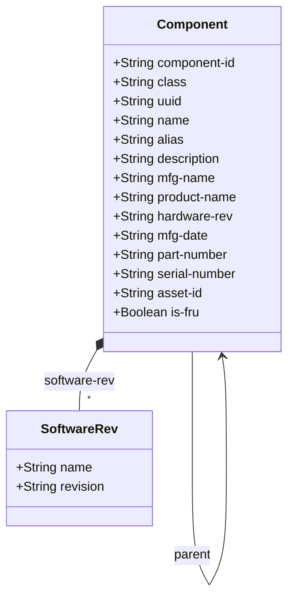

# Feature: Component Inventory

## Parent Epic
- [ ] #50 - [Network Inventory: Component Inventory](https://github.com/gintatkinson/3dgs-030/blob/main/docs/epics/epic-05-component-inventory.md) — Container hosting the list of components within each network element, including hardware and non-hardware component attributes.

## Description

The `components` container, nested under each `network-element`, hosts the `component` list keyed by `component-id`. A component is the generalisation of the hardware component definition to include any inventory object manageable like a hardware component (e.g., chassis, slot, board, port, CPU, fan, power supply, software components). Components are typed by their `class` — a union of IANA hardware class identities and the `non-hardware-component-class` identity. Components support hierarchical containment via the `parent` leaf-list (self-referencing sibling component-ids), relative positioning among siblings, and a chassis main-marker for multi-chassis NEs.

The identity `non-hardware-component-class` and the grouping `component-attributes` (which composes `ne-component-common-entity-attributes` refined with RFC 6933 references) are defined in this bounded context.

## UML Class Diagram


## UML Class Diagram



## Interface Requirements

### 1. Test Data Shape

```json
{
  "components": {
    "component": [
      {
        "componentId": "chassis-01",
        "class": "ianahw:chassis",
        "uuid": "660e8400-e29b-41d4-a716-446655440001",
        "name": "Main Chassis",
        "alias": "CH01",
        "description": "Primary chassis for ne-001",
        "softwareRev": [],
        "mfgName": "VendorCorp",
        "productName": "CH-3000",
        "hardwareRev": "rev-C",
        "mfgDate": "2025-03-15T08:00:00Z",
        "partNumber": "PN-CH3000-V2",
        "serialNumber": "SN-CH3000-00001",
        "assetId": "ASSET-1001",
        "isFru": false,
        "uri": ["https://inventory.example.com/components/chassis-01"],
        "parent": [],
        "isMain": true
      },
      {
        "componentId": "slot-01",
        "class": "ianahw:container",
        "parent": ["chassis-01"],
        "parentRelPos": "1-1",
        "mfgName": "VendorCorp",
        "productName": "SLOT-GEN2",
        "isFru": false
      }
    ]
  }
}
```

### 2. Validation & Constraints

- **component-id** (String, key): Uniquely identifies the component within its parent NE, assigned by the NE or the server. Type: `string`.
- **class** (Union, mandatory): Must be a valid identityref derived from either `ianahw:hardware-class` or `nwi:non-hardware-component-class`. This is the only mandatory leaf in the component. Type: `union { identityref { base ianahw:hardware-class; } identityref { base nwi:non-hardware-component-class; } }`.
- **uuid** (String, optional): UUID format (`yang:uuid`).
- **name** (String, optional): Human-interpretable label. The server may auto-assign if no value discovered.
- **alias** (String, optional): Operator-specified label.
- **description** (String, optional): Maintenance/context text.
- **software-rev** (List, optional): Keyed by `name` (String), with `revision` (String, optional) and nested `patch` list keyed by `revision` (String). Refined per RFC 6933 entPhysicalSoftwareRev.
- **mfg-name** (String, optional): Manufacturer name, preferred value printed on component itself. If unknown, not instantiated. Refined per RFC 6933 entPhysicalMfgName.
- **product-name** (String, optional): Vendor-specific product type string, expected unique per vendor scope.
- **hardware-rev** (String, optional): Hardware revision identifier, preferred value printed on component itself. Per RFC 6933 entPhysicalHardwareRev.
- **mfg-date** (String, optional): Manufacturing date as `yang:date-and-time` (ISO 8601). Per RFC 6933 entPhysicalMfgDate.
- **part-number** (String, optional): Vendor-specific part number of the component type. Expected unique within vendor scope. Replaces RFC 8348 "model-name".
- **serial-number** (String, optional): Vendor-specific serial number of the component instance. Expected unique within the scope of the part-number.
- **asset-id** (String, optional): Operator-specified asset tracking identifier. May map to entPhysicalAssetID (RFC 6933) with implementation-specific mapping for size/character differences.
- **is-fru** (Boolean, optional): Indicates whether the component is a field-replaceable unit per the vendor. Type: `boolean`.
- **uri** (Leaf-list of String, optional): Component identification URIs. Type: `inet:uri`.
- **parent** (Leaf-list of String, optional): References sibling component-ids within the same NE at path `../../component/component-id`. Represents parent components for containment hierarchy. `require-instance false`.
- **parent-rel-pos** (String, optional): Relative position among siblings sharing the same parent. **Condition**: Only valid when `count(../parent) < 2` (i.e., component has 0 or 1 parents). Type: `string` (not integer — supports non-integer position strings from devices). When absent with a single parent, no explicit position is asserted.
- **is-main** (Boolean, optional): Indicates the main chassis in a multi-chassis NE. **Condition**: Only valid when `derived-from-or-self(class, 'ianahw:chassis')`. Type: `boolean`.
- All leaves are read-only (config false via parent containers).

### 3. Visual Layout & Arrangement

- The `component` list shall render as rows in a `TableView` (container ID `elements_view`), displayed when a specific network element is selected. Columns: component-id, class, name, mfg-name, part-number, serial-number, is-fru.
- Selecting a row populates a `PropertyGrid` (container ID `properties_view`) with the full component attribute set, grouped into sections: "Identifier" (component-id, class), "Labels" (name, alias, description), "Manufacturer" (mfg-name, product-name, hardware-rev, mfg-date), "Tracking" (part-number, serial-number, asset-id), "Lifecycle" (is-fru, uris), "Topology" (parent references, parent-rel-pos, is-main), and "Software" (software-rev list with patches).
- Component tree nodes appear as children of their parent NE node in the `resource_tree` (container ID `resource_tree`), reflecting the hierarchical parent relationship.
- CSS resets (`box-sizing: border-box`) must apply. Scoped naming via CSS Modules or BEM is mandatory. Layout containment restricted to outer layout splitters.
- Valid DOM nesting for tree structures: recursive lists nested inside parent list-items for parent-child component hierarchies.

### 4. Interactive Flow & States

- **Loading state**: TableView displays skeleton/spinner while components load.
- **Empty state**: When a network element has no components, TableView displays "No components discovered for this network element."
- **Read-only state**: All fields render as read-only text. No inline editing.
- **Selection state**: Selecting a component row highlights the row, populates the PropertyGrid, and selects the corresponding node in the resource_tree.
- **Parent hierarchy rendering**: When a component has parent references, the resource_tree shall render it indented under its parent(s). If a component has multiple parents (leaf-list with >=2 entries), all parent relationships are reflected in the tree.
- **Conditional field visibility**: `parent-rel-pos` is only visible in the PropertyGrid when the component has 0 or exactly 1 parent. `is-main` is only visible when the component's class derives from `ianahw:chassis`.
- **Error state**: Failure to load components shows an error banner with retry action. Computed-style assertions must verify error highlight colors.

## Given-When-Then Acceptance Criteria

**Scenario: List all components within a network element**
- Given a network element "ne-001" exists with multiple components
- When the system retrieves the `components` container for "ne-001"
- Then all components belonging to that NE are returned in the `component` list
- And each entry is uniquely identified by its `component-id`

**Scenario: Component class is mandatory**
- Given a component entry is being created by the server
- When the server instantiates a component without a `class` value
- Then the component is invalid per schema
- And the class field MUST be populated with a valid identityref

**Scenario: Class accepts hardware and non-hardware identities**
- Given a component is a physical chassis
- When the `class` is set to `ianahw:chassis` (derived from `ianahw:hardware-class`)
- Then the component is valid
- Given a component is a software license
- When the `class` is set to an identity derived from `nwi:non-hardware-component-class`
- Then the component is valid

**Scenario: Component parent references sibling components**
- Given component "chassis-01" and component "slot-01" exist in the same NE
- When "slot-01" has `parent` set to ["chassis-01"]
- Then the reference resolves within the same NE's component list
- And "slot-01" is displayed as a child of "chassis-01" in the hierarchy

**Scenario: Parent relative position with single parent**
- Given a component "slot-01" has exactly one parent "chassis-01"
- When `parent-rel-pos` is set to "1-1"
- Then the field is valid and indicates slot-01 occupies position "1-1" within chassis-01

**Scenario: Parent relative position forbidden with multiple parents**
- Given a component has `parent` set to ["chassis-01", "chassis-02"] (count >= 2)
- When the XPath `when` condition `count(../parent) < 2` evaluates
- Then `parent-rel-pos` is not instantiated
- And the PropertyGrid hides the parent-rel-pos field

**Scenario: is-main flag only valid for chassis components**
- Given a component has class derived from `ianahw:chassis`
- When `is-main` is set to `true`
- Then the field is valid
- Given a component has class `ianahw:port`
- When the XPath `when` condition `derived-from-or-self(class, 'ianahw:chassis')` evaluates to false
- Then `is-main` is not instantiated
- And the PropertyGrid hides the is-main field

**Scenario: FRU indicator identifies replaceable components**
- Given a component is a field-replaceable unit per vendor specification
- When `is-fru` is set to `true`
- Then the component is marked as FRU in the inventory
- And a visual indicator distinguishes FRU components in the TableView

**Scenario: Serial number uniqueness within part-number scope**
- Given two components share the same `part-number` "PN-X100"
- When both have `serial-number` "SN-00001"
- Then the inventory can distinguish them via the composite (part-number, serial-number) pair
- And comparisons between components with different `mfg-name` values are not meaningful

**Scenario: Track manufacturing date as ISO 8601 date-and-time**
- Given a component was manufactured on March 15, 2025
- When `mfg-date` is set to "2025-03-15T08:00:00Z"
- Then the value is valid `yang:date-and-time`
- And any non-ISO 8601 format is rejected by the schema

**Scenario: URI leaf-list stores multiple identification links**
- Given a component has both a web inventory page and a QR code resolution URL
- When the `uri` leaf-list contains ["https://inv.example.com/c/001", "https://qr.example.com/c/001"]
- Then both URIs are stored and retrievable
- And each must be a valid `inet:uri`

**Scenario: Empty component list**
- Given a network element has no reported components
- When inventory is retrieved for that NE
- Then the `components` container and `component` list are present
- And the `component` list contains zero entries

**Scenario: Asset tracking identifier supports operator-specified IDs**
- Given a network operator assigns asset id "ASSET-5001" to a component
- When `asset-id` is populated by the server
- Then the asset-id is retrievable
- And may differ in size/character set from RFC 6933 entPhysicalAssetID per implementation-specific mapping

## Specification Context (Verbatim)

From draft-ietf-ivy-network-inventory-yang, Section 3.3:

> The YANG data model for network inventory mainly follows the same approach of RFC 8348 and reports the network hardware inventory as a list of components with different types (e.g., chassis, module, and port). In addition to the common attributes defined for network elements and components in Section 3.1, the following attributes are defined for the components: component-id, class, hardware-rev, mfg-date, part-number, serial-number, asset-id, is-fru.

> component-id: The identifier that uniquely identifies the component within the NE. It can be assigned by the NE or by the server. class: The type of component (e.g., chassis, module, port).

From draft-ietf-ivy-network-inventory-yang, Section 3.4:

> This document re-defines some attributes listed in RFC 8348. According to the description in RFC 8348, the attribute named "model-name" under the component, is preferred to have a customer-visible part number value. "Model-name" is not straightforward to understand, and therefore, in this model the attribute is called "part-number". There are some use cases where the name of the components are assigned and changed by the operator. In these cases, the assigned names are also not guaranteed to be always unique. In order to support these use cases, this model is not aligned with RFC 8348 in defining the component name as the key for the component list. Instead, the name is defined as an optional attribute and the component-id is defined as the key. There are some use cases where the parent relative position is not reported as an integer but as a string. In order to support these use cases, this model is defining the 'parent-rel-pos' data node as a string instead of as an integer.

From draft-ietf-ivy-network-inventory-yang, Section 3:

> The component definition is also generalized to support any types of component inventory objects that can be managed as hardware components from an inventory perspective. Different types of components can be distinguished by the class of component. The component "class" is defined as a union between the hardware class identity, defined in "iana-hardware", and the "non-hardware" identity, defined in this document. The identity definition of additional types of "ne-type" and "non-hardware" identity of component are outside the scope of this document and could be defined in application- and technology-specific companion augmentation data models.

From the YANG module schema:
- `leaf parent-rel-pos`: when `count(../parent) < 2`; type `string`; description "Relative position among siblings."
- `leaf is-main`: when `derived-from-or-self(../nwi:class, 'ianahw:chassis')`; type `boolean`; description "Main chassis indicator for multi-chassis NEs."
- `leaf parent`: type `leafref { path "../../component/component-id"; require-instance false; }`; description "Parent component identifiers."

## Source References

Structural Schema: [ietf-network-inventory@2026-05-27.yang](https://github.com/gintatkinson/3dgs-030/blob/main/schema/ietf-network-inventory%402026-05-27.yang) (Clause: container components, list component, identity non-hardware-component-class, grouping component-attributes)
Normative Specification: [draft-ietf-ivy-network-inventory-yang-18](https://datatracker.ietf.org/doc/html/draft-ietf-ivy-network-inventory-yang) (Clause: Sections 3, 3.3, 3.3.1, 3.3.2, 3.4)

## Logical UI & Layout Bindings

- **Target LUI Component:** TableView (list view), PropertyGrid (detail view)
- **Target Layout Container ID:** elements_view (list), properties_view (detail), resource_tree (tree node)
- **Data Source Bindings:** schema:ietf-network-inventory/network-inventory/network-elements/network-element[@ne-id='selected_ne']/components/component[@component-id='selected_component']
