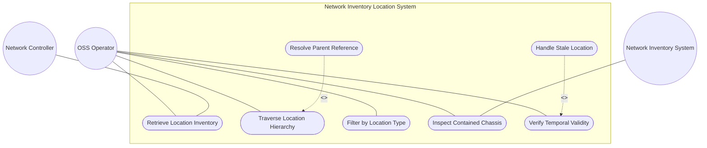
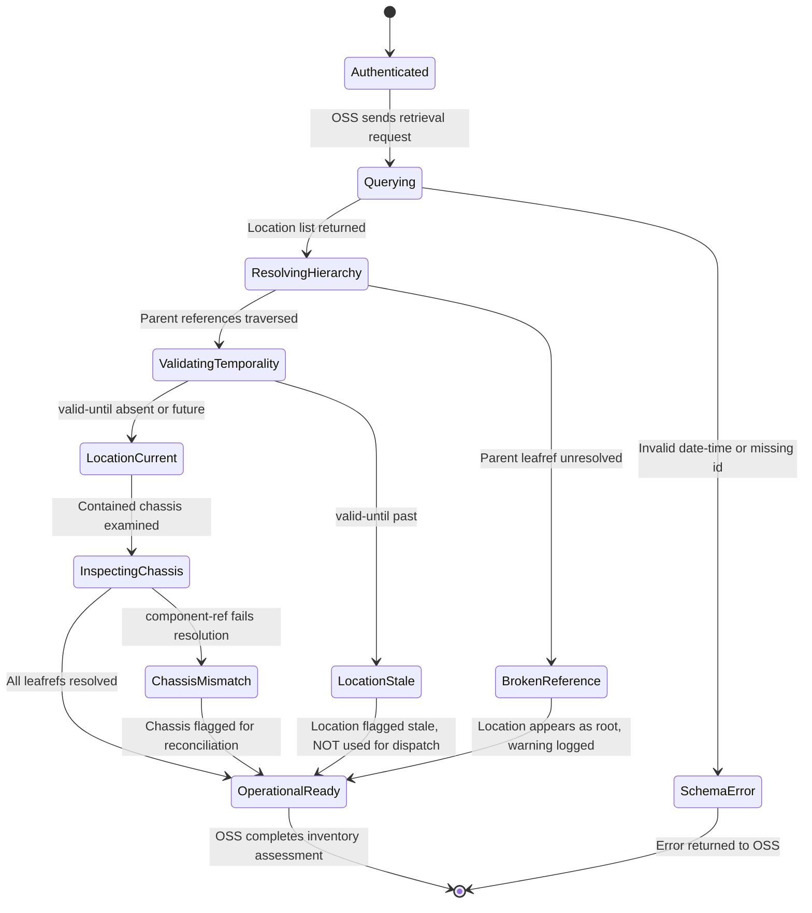

# Use Case: Manage Hierarchical Location Inventory

## Parent Epic
- [ ] #6 - [Network Inventory Location](https://github.com/gintatkinson/3dgs-030/blob/main/docs/epics/epic-01-network-location-inventory.md) (the locations container is the root operational data structure for the entire location inventory subsystem)

## Compliance Table

| Requirement | Status | Evidence |
|---|---|---|
| System boundary subgraph | PASS | Use Case Diagram groups all use case nodes inside `Network Inventory Location System` boundary |
| External actors identified | PASS | Primary: OSS Operator, Secondary: Network Controller, Network Inventory System |
| Complete realization matrix | PASS | Links to Feature #1 and User Stories #8, #10, #11, #12, #13, #14 |
| Constraint-to-flow parity | PASS | 14 Alternate/Exception flows covering all 14 validation constraints from Feature #1 |
| Minimum 2 alternate flows | PASS | 14 > 2 flows present |
| Schema container declared | PASS | `nil:locations` container with `node_type: container` |
| Single container mandate | PASS | Exactly 1 schema container entry |

## 1. Actors
- **Primary Actor:** OSS Operator (Operations Support System personnel or automated OSS application)
- **Secondary Actors:** Network Controller (authoritative source of location data, populated via RFID, geolocation services, manual entry), Network Inventory System (base inventory with network elements and components for leafref resolution)

## 2. Preconditions
- The Network Controller maintains authoritative, read-only location records sourced from RFID tooling, geolocation services, or manual entry.
- At least one location entry exists in the operational datastore under `/nwi:network-inventory/nil:locations`.
- The base Network Inventory model is populated with network elements and components for leafref resolution.
- The OSS client has authenticated access via NETCONF or RESTCONF with appropriate NACM read permissions.

## 3. Trigger
An OSS Operator or automated OSS application initiates a query to retrieve, traverse, or inspect hierarchical location inventory data to support network planning, deployment, maintenance, or troubleshooting activities.

## 4. Main Success Scenario (Basic Flow)
1. The OSS Operator sends a YANG retrieval request (NETCONF `<get>` or RESTCONF `GET`) on the locations subtree `/nwi:network-inventory/nil:locations`.
2. The Network Controller returns the list of location entries with their identifiers (`id`), common entity attributes (`uuid`, `name`, `alias`, `description`), type classification, parent references, temporal markers (`timestamp`, `valid-until`), embedded physical-address and geo-location containers, and contained-chassis entries.
3. The OSS Operator inspects the location hierarchy by resolving `parent` leafref values to traverse from child locations upward to their containing sites or buildings.
4. The OSS Operator filters locations by `type` (e.g., `site`, `building`, `room`) to scope the query to specific location categories.
5. For a location of interest, the OSS Operator examines the `contained-chassis` list to identify chassis directly deployed at that location without a rack, noting `chassis-id`, `ne-ref`, and `component-ref` references.
6. The OSS Operator verifies that the location's `valid-until` is either absent or set to a future timestamp, confirming the location is current for operational use.
7. The OSS Operator uses the resolved location data for network planning, field dispatch, or inventory reconciliation.

## 5. Alternate and Exception Flows

- **5a. Mandatory ID Constraint Violation (Branches from Basic Flow step 1):**
  1. A location list entry is encountered without a valid `id` key, which is mandatory as the list key.
  2. Per YANG schema validation, the list entry is structurally invalid and excluded from the operational datastore.

- **5b. UUID Format Violation (Branches from Basic Flow step 2):**
  1. A location's `uuid` value does not conform to the RFC 9562 universally unique identifier format, inherited from nwi:basic-common-entity-attributes.
  2. The uuid leaf is optional; if an invalid uuid is provided during population, the server rejects the malformed data at ingestion.

- **5c. Empty Name Field (Branches from Basic Flow step 2):**
  1. The `name` leaf is absent for a location entry, though it is optional and inherited from nwi:basic-common-entity-attributes.
  2. The OSS Operator relies on the `id` value or other attributes to identify the location in the absence of a human-readable name.

- **5d. Missing Alias Identifier (Branches from Basic Flow step 2):**
  1. The `alias` leaf is absent, which is permitted as it is optional and inherited from nwi:basic-common-entity-attributes.
  2. The OSS Operator proceeds without an alternative label, using the primary `name` or `id` for identification.

- **5e. Empty Description Field (Branches from Basic Flow step 2):**
  1. The `description` leaf is absent, which is permitted as free-text is optional per nwi:basic-common-entity-attributes.
  2. The OSS Operator interprets the location without supplementary descriptive context.

- **5f. Undefined Type Classification (Branches from Basic Flow step 4):**
  1. The `type` leaf is absent or contains a value not recognized by the OSS Operator's operational taxonomy, though operators may define custom types such as pole, roof, or floor.
  2. The OSS Operator treats the location as having an unclassified type and may not filter it effectively during scoped queries.

- **5g. Invalid Parent Reference (Branches from Basic Flow step 3):**
  1. The `parent` leafref points to a non-existent `location/id` value, violating referential integrity within the same list.
  2. The leafref resolves to an empty instance per YANG semantics; no parent location entity is returned, and the location appears as a root node.

- **5h. Timestamp Format Violation (Branches from Basic Flow step 6):**
  1. The `timestamp` value does not conform to the `yang:date-and-time` format.
  2. Server-side schema validation rejects the malformed data at ingestion, and the timestamp is absent from the server response.

- **5i. Valid-Until Expiration (Branches from Basic Flow step 6):**
  1. The location's `valid-until` timestamp is present and represents a date-time earlier than the current server time.
  2. Per Section 6 operational considerations, the location is stale and the OSS Operator MUST NOT use it for operational dispatch or planning.

- **5j. Contained-Chassis List Empty (Branches from Basic Flow step 5):**
  1. The `contained-chassis` list is optionally absent, meaning no chassis are directly deployed at this location without a rack.
  2. The OSS Operator concludes that all equipment at this location is either rack-mounted or not yet inventoried.

- **5k. Chassis-ID Key Uniqueness Violation (Branches from Basic Flow step 5):**
  1. Two chassis entries in the `contained-chassis` list share the same `chassis-id` value, violating the mandatory uint32 key uniqueness constraint.
  2. The duplicate entry is structurally invalid per YANG list key semantics, and the server excludes one of the conflicting entries.

- **5l. NE-Ref Leafref Resolution Failure (Branches from Basic Flow step 5):**
  1. The `ne-ref` leafref value does not resolve to an existing `ne-id` in `/nwi:network-inventory/nwi:network-elements/nwi:network-element`.
  2. The reference resolves to empty; the chassis entry is present but its network element association is broken.

- **5m. Component-Ref Leafref Resolution Failure (Branches from Basic Flow step 5):**
  1. The `component-ref` leafref value does not resolve to a component within the network element identified by the corresponding `ne-ref`.
  2. The conditional resolution fails and returns an empty result; the OSS Operator flags the chassis-to-component association for inventory reconciliation.

- **5n. Write Attempt on Read-Only Data (Branches from Basic Flow step 1):**
  1. The OSS Operator attempts to modify location data via NETCONF `<edit-config>` or RESTCONF `PUT/PATCH`.
  2. Since all nodes are `config false` (read-only operational state), the server rejects the write operation with an access-denied error.

## 6. Postconditions (Guarantees)
- **Success Guarantee:** The OSS Operator has successfully retrieved, traversed, and validated the hierarchical location inventory. All leafrefs within valid scope resolve correctly. Temporal validity state is assessed for each location. The operator possesses a complete and verified view of the location inventory suitable for subsequent operational activities.
- **Failure Guarantee:** If retrieval fails (e.g., authentication error, transport failure) or leafref resolution is broken (invalid parent, mismatched chassis references), the OSS Operator is notified of the specific failure. No partial modifications occur because the data is read-only operational state. The OSS Operator retains any previously cached data and can retry the query.

## UML Diagrams

### Use Case Diagram

### State Machine Diagram

## 7. Operational Context

From draft-ietf-ivy-network-inventory-location, Section 2 (Hierarchical Locations of Network Inventory):

> The "location" list is generalized to support a variety of geographic location, such as sites, rooms, buildings. A site represents a general geographic location to group a set of NEs and corresponding inventory components. Locations can be nested to form a hierarchy.

From Section 4 (Network Inventory Location Tree), the `contained-chassis` list:

> Chassis directly deployed at this location without rack. Also used for distributed chassis components that are logically part of a network element but physically located.

From Section 6 (Operational Considerations):

> Sources of controller location data may include RFID tooling, geolocation services, as well as manual entry via controller interfaces. As this data is read-only, the controller does not support OSS modification of controller location records.

## 8. Realization Matrix

### Required User Stories
- [ ] #8 - [Navigate Hierarchical Location Tree](https://github.com/gintatkinson/3dgs-030/blob/main/docs/user-stories/us-01-navigate-location-hierarchy.md) (hierarchical traversal of parent leafref links within the locations container)
- [ ] #10 - [Deploy Chassis Directly at a Location Without Rack](https://github.com/gintatkinson/3dgs-030/blob/main/docs/user-stories/us-03-deploy-chassis-without-rack.md) (contained-chassis list at location level for non-rack deployments per Appendix A.1)
- [ ] #11 - [Map Distributed Network Element Across Multiple Locations](https://github.com/gintatkinson/3dgs-030/blob/main/docs/user-stories/us-04-map-distributed-network-element.md) (multi-chassis distributed NE with common ne-ref across location contained-chassis lists per Appendix A.2)
- [ ] #12 - [Query Location Inventory with Pagination](https://github.com/gintatkinson/3dgs-030/blob/main/docs/user-stories/us-05-query-locations-with-pagination.md) (large-scale location list retrieval with NETCONF/RESTCONF pagination)
- [ ] #13 - [Verify Location Data Quality for Operational Dispatch](https://github.com/gintatkinson/3dgs-030/blob/main/docs/user-stories/us-06-verify-location-data-quality.md) (valid-until temporal validity check before operational use)
- [ ] #14 - [Detect and Handle Expired Location and Rack Records](https://github.com/gintatkinson/3dgs-030/blob/main/docs/user-stories/us-07-detect-expired-records.md) (location valid-until expiration detection and stale record handling)

### Required Features
- [ ] #1 - [Manage Hierarchical Location Inventory](https://github.com/gintatkinson/3dgs-030/blob/main/docs/features/feat-01-location-management.md) (the locations container schema with id, parent leafref, type, contained-chassis, and temporal markers)

## Source References
Structural Schema: [ietf-ni-location@2026-07-06.yang](https://github.com/ietf-ivy-wg/network-inventory-location/blob/main/ietf-ni-location.yang) (Clause: grouping locations, container locations, list location)
Normative Specification: [draft-ietf-ivy-network-inventory-location](https://datatracker.ietf.org/doc/html/draft-ietf-ivy-network-inventory-location) (Clause: Section 2, Section 4, Section 6)
