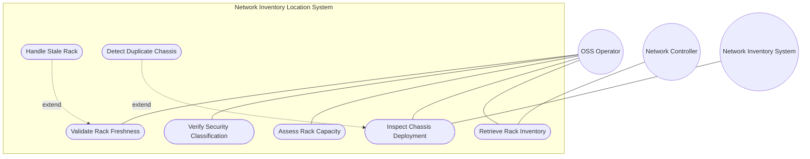
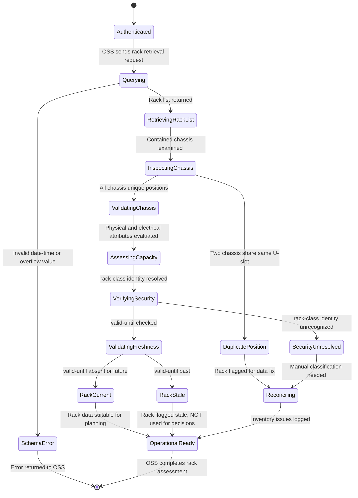

# Use Case: Manage Rack Inventory

## Parent Epic
- [ ] #7 - [Rack Inventory Management](https://github.com/gintatkinson/3dgs-030/blob/main/docs/epics/epic-02-rack-inventory-management.md) (the racks container is the root operational data structure for all rack inventory entries)

## Compliance Table

| Requirement | Status | Evidence |
|---|---|---|
| System boundary subgraph | PASS | Use Case Diagram groups all use case nodes inside `Network Inventory Location System` boundary |
| External actors identified | PASS | Primary: OSS Operator; Secondary: Network Controller, Network Inventory System |
| Complete realization matrix | PASS | Links to Feature #4 and User Stories #9, #12, #14 |
| Constraint-to-flow parity | PASS | 18 Alternate/Exception flows covering all 18 validation constraints from Feature #4 |
| Minimum 2 alternate flows | PASS | 18 > 2 flows present |
| Schema container declared | PASS | `nil:locations/racks` container with `node_type: container` |
| Single container mandate | PASS | Exactly 1 schema container entry |

## 1. Actors
- **Primary Actor:** OSS Operator (Operations Support System personnel or automated OSS application performing equipment deployment planning)
- **Secondary Actors:** Network Controller (authoritative source of rack data maintained via RFID tooling, geolocation services, or manual entry), Network Inventory System (base inventory providing network element and component identifiers for leafref resolution)

## 2. Preconditions
- The Network Controller maintains authoritative, read-only rack data including physical dimensions, electrical capacity, security classification, rack-location placement, contained chassis, and temporal validity markers.
- At least one rack entry exists in the operational datastore under `/nwi:network-inventory/nil:locations/nil:racks`.
- The base Network Inventory model contains network elements and components for `ne-ref` and `component-ref` leafref resolution.
- The locations list contains entries for `location-ref` resolution via the `ni-location-ref` typedef.
- The OSS client has authenticated access via NETCONF or RESTCONF with appropriate NACM read permissions.

## 3. Trigger
An OSS Operator initiates a query on the racks subtree to retrieve rack physical attributes, inspect chassis deployment within racks, assess power capacity, or verify security classification for equipment installation planning.

## 4. Main Success Scenario (Basic Flow)
1. The OSS Operator sends a YANG retrieval request (NETCONF `<get>` or RESTCONF `GET`) on the racks subtree `/nwi:network-inventory/nil:locations/nil:racks`.
2. The Network Controller returns the list of rack entries, each containing the mandatory `id`, common entity attributes, security classification (`rack-class`), a `rack-location` sub-container with facility placement data, physical dimensions (`height`, `width`, `depth` in millimeters), electrical characteristics (`max-voltage` in volts, `max-allocated-power` in watts), a `contained-chassis` list keyed by `relative-position` (U-slot), and temporal markers (`timestamp`, `valid-until`).
3. The OSS Operator inspects the `contained-chassis` list within a rack to identify deployed equipment at each U-slot position, noting `ne-ref` and `component-ref` references to the network inventory.
4. The OSS Operator evaluates the rack's physical dimensions and electrical capacity against the requirements of equipment planned for deployment.
5. The OSS Operator confirms the rack's security classification (`rack-class`) matches the physical protection needs of the planned equipment.
6. The OSS Operator verifies that the rack's `valid-until` is either absent or set to a future timestamp, confirming the rack record is current for operational use.
7. The OSS Operator uses the resolved rack data for equipment installation planning and capacity management.

## 5. Alternate and Exception Flows

- **5a. Mandatory Rack ID Constraint Violation (Branches from Basic Flow step 1):**
  1. A rack list entry is encountered without a valid `id` key, which is mandatory as the list key.
  2. Per YANG schema validation, the list entry is structurally invalid and excluded from the operational datastore.

- **5b. Invalid Rack-Class Identity Reference (Branches from Basic Flow step 5):**
  1. The `rack-class` identityref references an identity that is not recognized by the server's identity hierarchy (e.g., a vendor-specific extension not in the rack-class-type hierarchy).
  2. The identityref resolution returns empty; no security classification is reported, and the OSS Operator escalates for manual classification.

- **5c. UUID Format Violation (Branches from Basic Flow step 2):**
  1. A rack's `uuid` value does not conform to the RFC 9562 universally unique identifier format, inherited from nwi:basic-common-entity-attributes.
  2. The uuid leaf is optional; if an invalid uuid is provided during population, the server rejects the malformed data at ingestion.

- **5d. Empty Rack Name Field (Branches from Basic Flow step 2):**
  1. The `name` leaf is absent for a rack entry, though it is optional and inherited from nwi:basic-common-entity-attributes.
  2. The OSS Operator relies on the `id` value or other attributes to identify the rack in the absence of a human-readable name.

- **5e. Missing Rack Alias (Branches from Basic Flow step 2):**
  1. The `alias` leaf is absent, which is permitted as it is optional and inherited from nwi:basic-common-entity-attributes.
  2. The OSS Operator proceeds without an alternative label for the rack.

- **5f. Empty Rack Description (Branches from Basic Flow step 2):**
  1. The `description` leaf is absent, which is permitted as free-text is optional per nwi:basic-common-entity-attributes.
  2. The OSS Operator interprets the rack without supplementary descriptive context.

- **5g. Height Value Absent or Zero (Branches from Basic Flow step 4):**
  1. The `height` leaf is absent or set to zero, though it is an optional uint16 in millimeters.
  2. The OSS Operator cannot verify adequate physical clearance for planned equipment; physical inspection may be required.

- **5h. Width Value Absent or Zero (Branches from Basic Flow step 4):**
  1. The `width` leaf is absent or set to zero, though it is an optional uint16 in millimeters.
  2. The OSS Operator cannot verify the rack's horizontal equipment compatibility; physical inspection may be required.

- **5i. Depth Value Absent or Zero (Branches from Basic Flow step 4):**
  1. The `depth` leaf is absent or set to zero, though it is an optional uint16 in millimeters.
  2. The OSS Operator cannot verify the rack's depth clearance for planned equipment; physical inspection may be required.

- **5j. Max-Voltage Absent or Undefined (Branches from Basic Flow step 4):**
  1. The `max-voltage` leaf is absent, though it is an optional uint16 in volts.
  2. The OSS Operator cannot verify the rack's voltage compliance with equipment requirements; electrical capacity is unknown.

- **5k. Max-Allocated-Power Absent or Undefined (Branches from Basic Flow step 4):**
  1. The `max-allocated-power` leaf is absent, though it is an optional uint16 in watts.
  2. The OSS Operator cannot perform power budget calculations to determine if additional equipment can be deployed; capacity planning is blocked.

- **5l. Timestamp Format Violation (Branches from Basic Flow step 6):**
  1. The `timestamp` value does not conform to the `yang:date-and-time` format.
  2. Server-side schema validation rejects the malformed data at ingestion, and the timestamp is absent from the server response.

- **5m. Valid-Until Expiration (Branches from Basic Flow step 6):**
  1. The rack's `valid-until` timestamp is present and represents a date-time earlier than the current server time.
  2. Per Section 6 operational considerations, the rack record is stale and the OSS Operator MUST NOT base equipment deployment decisions on it.

- **5n. Contained-Chassis List Empty (Branches from Basic Flow step 3):**
  1. The `contained-chassis` list is optionally absent, meaning no chassis are deployed in this rack.
  2. The OSS Operator identifies the rack as having available U-slots for new equipment deployment.

- **5o. Duplicate Relative-Position Key Conflict (Branches from Basic Flow step 3):**
  1. Two chassis entries in the `contained-chassis` list share the same `relative-position` (U-slot) value, violating the mandatory uint8 key uniqueness constraint.
  2. The duplicate entry is structurally invalid per YANG list key semantics, and the server excludes one of the conflicting entries.

- **5p. NE-Ref Leafref Resolution Failure (Branches from Basic Flow step 3):**
  1. The `ne-ref` leafref value in a rack's contained-chassis entry does not resolve to an existing `ne-id`.
  2. The reference resolves to empty; the chassis entry is present but its network element association is broken.

- **5q. Component-Ref Leafref Resolution Failure (Branches from Basic Flow step 3):**
  1. The `component-ref` leafref value does not resolve to a component within the network element identified by the corresponding `ne-ref`.
  2. The conditional resolution fails and returns an empty result; the OSS Operator flags the chassis-to-component association for inventory reconciliation.

- **5r. Write Attempt on Read-Only Rack Data (Branches from Basic Flow step 1):**
  1. The OSS Operator attempts to modify rack data via NETCONF `<edit-config>` or RESTCONF `PUT/PATCH`.
  2. Since all nodes are `config false` (read-only operational state), the server rejects the write operation with an access-denied error.

## 6. Postconditions (Guarantees)
- **Success Guarantee:** The OSS Operator has retrieved a complete and validated view of all rack inventory entries, including physical dimensions, electrical capacity, security classification, positioned chassis, and temporal validity state. Capacity and compatibility assessments for equipment deployment are supported by accurate rack data.
- **Failure Guarantee:** If retrieval fails (e.g., authentication error, transport failure) or data integrity issues are detected (duplicate chassis positions, invalid rack-class, overflow values), the OSS Operator is notified of the specific failure. No partial modifications occur because the data is read-only operational state.

## UML Diagrams

### Use Case Diagram

### State Machine Diagram

## 7. Operational Context

From draft-ietf-ivy-network-inventory-location, Section 3 (Rack):

> racks represent physical equipment racks in which NEs can be installed, which facilitate device maintenance. Through rack-location, each rack can be assigned to a site or a specific location within a site. Each rack is assigned a unique ID and a name in the context of a facility. A rack may have some specific attributes, such as appearance-related attributes and electricity-related attributes.

From the identity definitions: rack-class-type is the base identity for rack classification based on physical security characteristics, with derived identities rack-standard, rack-secure-baseline, rack-secure-medium, and rack-secure-high.

## 8. Realization Matrix

### Required User Stories
- [ ] #9 - [Deploy Equipment in a Rack](https://github.com/gintatkinson/3dgs-030/blob/main/docs/user-stories/us-02-deploy-equipment-in-rack.md) (rack-based chassis deployment with relative-position U-slot assignment and capacity assessment)
- [ ] #12 - [Query Location Inventory with Pagination](https://github.com/gintatkinson/3dgs-030/blob/main/docs/user-stories/us-05-query-locations-with-pagination.md) (paginated rack list retrieval for large-scale rack inventories)
- [ ] #14 - [Detect and Handle Expired Location and Rack Records](https://github.com/gintatkinson/3dgs-030/blob/main/docs/user-stories/us-07-detect-expired-records.md) (rack valid-until expiration detection mirroring location temporal lifecycle)

### Required Features
- [ ] #4 - [Manage Rack Inventory](https://github.com/gintatkinson/3dgs-030/blob/main/docs/features/feat-04-rack-management.md) (the racks container schema with rack identity, dimensions, electrical attributes, security classification, contained-chassis, and temporal markers)

## Source References
Structural Schema: [ietf-ni-location@2026-07-06.yang](https://github.com/ietf-ivy-wg/network-inventory-location/blob/main/ietf-ni-location.yang) (Clause: grouping racks, container racks, list rack, identities)
Normative Specification: [draft-ietf-ivy-network-inventory-location](https://datatracker.ietf.org/doc/html/draft-ietf-ivy-network-inventory-location) (Clause: Section 3, Section 4, Figure 2 rack dimensions, Figure 3 rack subtree)
