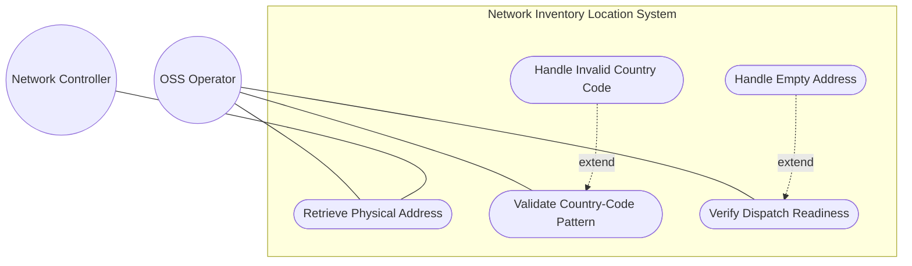
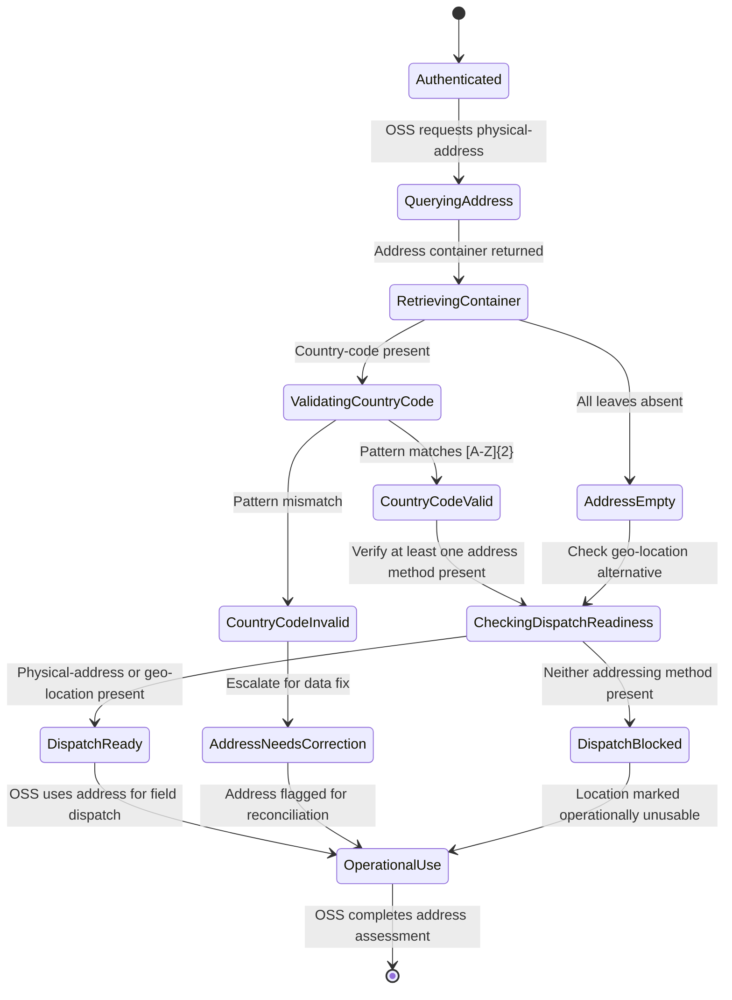

# Use Case: Capture Physical Address Information

## Parent Epic
- [ ] #6 - [Network Inventory Location](https://github.com/gintatkinson/3dgs-030/blob/main/docs/epics/epic-01-network-location-inventory.md) (physical address is a sub-container of each location entry, providing postal addressing for operational dispatch)

## Compliance Table

| Requirement | Status | Evidence |
|---|---|---|
| System boundary subgraph | PASS | Use Case Diagram groups all use case nodes inside `Network Inventory Location System` boundary |
| External actors identified | PASS | Primary: OSS Operator; Secondary: Network Controller |
| Complete realization matrix | PASS | Links to Feature #2 and User Story #13 |
| Constraint-to-flow parity | PASS | 7 Alternate/Exception flows covering all 7 validation constraints from Feature #2 |
| Minimum 2 alternate flows | PASS | 7 > 2 flows present |
| Schema container declared | PASS | `nil:locations/location/physical-address` container with `node_type: container` |
| Single container mandate | PASS | Exactly 1 schema container entry |

## 1. Actors
- **Primary Actor:** OSS Operator (field dispatch personnel or automated OSS application requiring physical address for on-site operations)
- **Secondary Actors:** Network Controller (authoritative source of physical address data populated via RFID tooling, geolocation services, or manual entry)

## 2. Preconditions
- A location entry exists in the operational datastore under `/nwi:network-inventory/nil:locations/nil:location`.
- The Network Controller has populated at least a subset of the physical address leaves for that location.
- The OSS client has authenticated access via NETCONF or RESTCONF with appropriate NACM read permissions.

## 3. Trigger
An OSS Operator or automated OSS application retrieves the physical address of a location to support field dispatch, on-site equipment installation, maintenance crew navigation, or location verification before operational use.

## 4. Main Success Scenario (Basic Flow)
1. The OSS Operator sends a YANG retrieval request (NETCONF `<get>` or RESTCONF `GET`) targeting a specific location's physical-address subtree: `/nwi:network-inventory/nil:locations/nil:location[id=<id>]/nil:physical-address`.
2. The Network Controller returns the `physical-address` container with its populated leaf nodes: `address` (street number and name), `postal-code`, `state` or region, `city`, and `country-code` in ISO ALPHA-2 format.
3. The OSS Operator verifies that the `country-code` conforms to the two-uppercase-letter ISO ALPHA-2 pattern, confirming data quality.
4. The OSS Operator validates that at least one of `physical-address` or `geo-location` is present for the location, meeting the operational dispatch readiness requirement.
5. The OSS Operator uses the resolved physical address for field dispatch routing, crew navigation, or inventory documentation.

## 5. Alternate and Exception Flows

- **5a. Street Address Absent (Branches from Basic Flow step 2):**
  1. The `address` leaf (street number and name) is absent from the physical-address container, though it is an optional string.
  2. The OSS Operator proceeds without street-level detail, relying on other fields such as city and postal-code for approximate location identification.

- **5b. Postal-Code Absent (Branches from Basic Flow step 2):**
  1. The `postal-code` leaf is absent, though it is an optional string with no enforced pattern for international formats.
  2. The OSS Operator proceeds without postal zone information; dispatch routing may be less precise for this location.

- **5c. State or Region Absent (Branches from Basic Flow step 2):**
  1. The `state` leaf is absent, though it is an optional string usable as a state, province, or region descriptor for countries without formal state divisions.
  2. The OSS Operator identifies the administrative division through other contextual information such as city or postal-code.

- **5d. City Name Absent (Branches from Basic Flow step 2):**
  1. The `city` leaf is absent from the physical-address container, though it is an optional string.
  2. The OSS Operator may not be able to resolve the locality for dispatch routing and requests city population from inventory administrators.

- **5e. Country-Code Pattern Violation (Branches from Basic Flow step 3):**
  1. The `country-code` leaf contains a value that does not match the required pattern of exactly two uppercase letters expressed as ISO ALPHA-2 code.
  2. Schema validation rejects the non-conforming value with a pattern-mismatch error; the country-code is either absent or represented by an invalid placeholder.

- **5f. Write Attempt on Read-Only Address Data (Branches from Basic Flow step 1):**
  1. The OSS Operator attempts to modify physical-address data via NETCONF `<edit-config>` or RESTCONF `PUT/PATCH`.
  2. Since all nodes are `config false` (read-only), the server rejects the write operation with an access-denied error.

- **5g. Both Address Methods Absent for Dispatch (Branches from Basic Flow step 4):**
  1. The OSS Operator verifies location dispatch readiness and discovers that neither `physical-address` nor `geo-location` contains any data.
  2. Per Section 6 operational considerations, at least one of physical-address or geo-location should be present before using a location for field dispatch; the OSS Operator marks the location as not operationally ready.

## 6. Postconditions (Guarantees)
- **Success Guarantee:** The OSS Operator has retrieved a valid, ISO ALPHA-2 conformant physical address for the target location. The address is sufficiently complete for field dispatch navigation. At least one of physical-address or geo-location is verified present.
- **Failure Guarantee:** If the country-code format is invalid, the address is completely empty, or both addressing methods are absent, the OSS Operator is notified of the data quality deficiency. The location remains in the datastore but is marked as not operationally ready for dispatch.

## UML Diagrams

### Use Case Diagram

### State Machine Diagram

## 7. Operational Context

From draft-ietf-ivy-network-inventory-location, Section 6 (Operational Considerations):

> Before using a location for field dispatch or planning, verification is required to ensure at least one of physical-address or geo-location is present, and that the valid-until leaf is either not present or indicates a future time.

From the schema leaf descriptions: address specifies an address (number and street), postal-code specifies a postal code, state specifies a state or region for countries without states, city specifies a city, and country-code is expressed as ISO ALPHA-2 code.

## 8. Realization Matrix

### Required User Stories
- [ ] #13 - [Verify Location Data Quality for Operational Dispatch](https://github.com/gintatkinson/3dgs-030/blob/main/docs/user-stories/us-06-verify-location-data-quality.md) (physical-address presence is one of the two gating conditions for operational dispatch readiness)

### Required Features
- [ ] #2 - [Capture Physical Address Information](https://github.com/gintatkinson/3dgs-030/blob/main/docs/features/feat-02-physical-address.md) (the physical-address container schema with address, postal-code, state, city, and country-code leaves including ISO ALPHA-2 pattern constraint)

## Source References
Structural Schema: [ietf-ni-location@2026-07-06.yang](https://github.com/ietf-ivy-wg/network-inventory-location/blob/main/ietf-ni-location.yang) (Clause: grouping physical-address, container physical-address)
Normative Specification: [draft-ietf-ivy-network-inventory-location](https://datatracker.ietf.org/doc/html/draft-ietf-ivy-network-inventory-location) (Clause: Section 4, Figure 4 tree diagram, Section 6)
