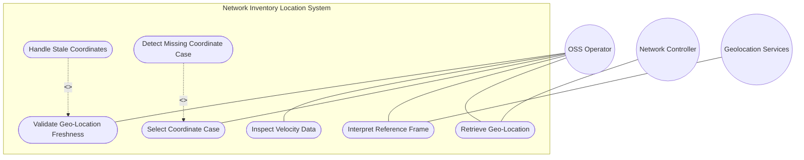
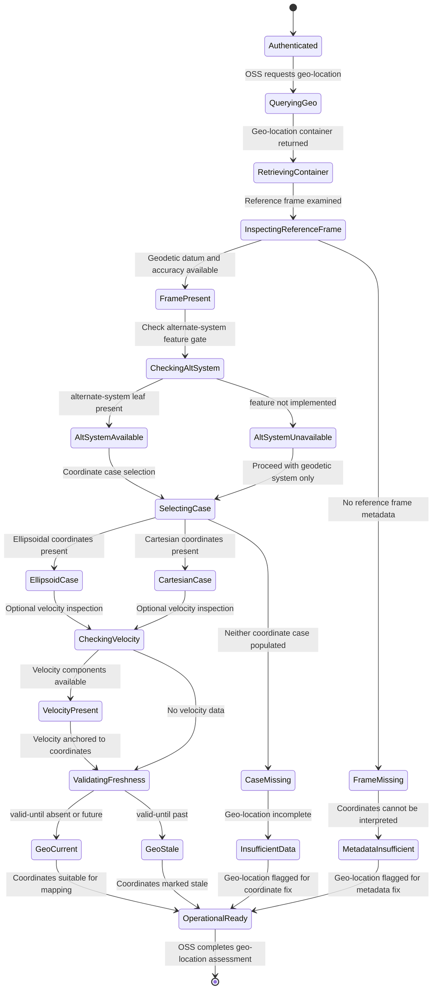

# Use Case: Capture Geographic Location Coordinates

## Parent Epic
- [ ] #6 - [Network Inventory Location](https://github.com/gintatkinson/3dgs-030/blob/main/docs/epics/epic-01-network-location-inventory.md) (geo-location is a sub-container of each location entry, providing geographic coordinate data per RFC 9179)

## Compliance Table

| Requirement | Status | Evidence |
|---|---|---|
| System boundary subgraph | PASS | Use Case Diagram groups all use case nodes inside `Network Inventory Location System` boundary |
| External actors identified | PASS | Primary: OSS Operator; Secondary: Network Controller, Geolocation Services |
| Complete realization matrix | PASS | Links to Feature #3 and User Stories #13, #15 |
| Constraint-to-flow parity | PASS | 17 Alternate/Exception flows covering all 17 validation constraints from Feature #3 |
| Minimum 2 alternate flows | PASS | 17 > 2 flows present |
| Schema container declared | PASS | `nil:locations/location/geo-location` container with `node_type: container` |
| Single container mandate | PASS | Exactly 1 schema container entry |

## 1. Actors
- **Primary Actor:** OSS Operator (network planning personnel or automated OSS application requiring geographic coordinates for mapping, coverage optimization, or field dispatch)
- **Secondary Actors:** Network Controller (authoritative source of geo-location data populated via geolocation services, RFID tooling, or manual entry), Geolocation Services (external coordinate providers with reference frame metadata and coordinate accuracy)

## 2. Preconditions
- A location entry exists in the operational datastore under `/nwi:network-inventory/nil:locations/nil:location`.
- The Network Controller has populated the `geo-location` container with a reference frame (geodetic system including datum and accuracy), and at least one coordinate case (ellipsoid or cartesian).
- The server's YANG feature flags are configured (e.g., `alternate-systems` feature toggle).
- The OSS client has authenticated access via NETCONF or RESTCONF with appropriate NACM read permissions.

## 3. Trigger
An OSS Operator sends a retrieval request for geographic coordinate data of a specific location to support network planning, coverage mapping, field dispatch, or coordinate transformation into other reference systems.

## 4. Main Success Scenario (Basic Flow)
1. The OSS Operator sends a YANG retrieval request (NETCONF `<get>` or RESTCONF `GET`) targeting a specific location's geo-location subtree: `/nwi:network-inventory/nil:locations/nil:location[id=<id>]/nil:geo-location`.
2. The Network Controller returns the `geo-location` container with its `reference-frame` sub-container specifying the astronomical body and the `geodetic-system` with `geodetic-datum`, `coord-accuracy`, and `height-accuracy`.
3. The response includes exactly one coordinate case: either the `ellipsoid` case with `latitude`, `longitude`, `height` or the `cartesian` case with `x`, `y`, `z` coordinates.
4. The OSS Operator inspects the reference frame metadata to identify the coordinate system and geodetic datum in use, enabling correct interpretation of the numeric coordinates.
5. If the location represents a mobile network element, the OSS Operator also inspects the `velocity` sub-container (`v-north`, `v-east`, `v-up`) for directional movement data.
6. The OSS Operator verifies that the geo-location's `valid-until` is either absent or set to a future timestamp, confirming coordinate currency.
7. The OSS Operator uses the resolved geographic coordinates for network planning, coverage mapping, or transformation into other coordinate reference systems.

## 5. Alternate and Exception Flows

- **5a. Alternate-System Leaf Unavailable (Branches from Basic Flow step 2):**
  1. The `alternate-system` leaf is guarded by the `if-feature alternate-systems` YANG feature flag, which is optional and may not be implemented by the server.
  2. If the server does not implement this feature, the alternate-system leaf is absent; the OSS Operator relies on the geodetic system for coordinate system identification.

- **5b. Astronomical-Body Default or Absent (Branches from Basic Flow step 2):**
  1. The `astronomical-body` leaf is absent, though it has a default value of `earth` per the schema definition.
  2. The OSS Operator assumes the coordinates are relative to Earth unless the server reports a different celestial body in the response.

- **5c. Geodetic-Datum Absent (Branches from Basic Flow step 4):**
  1. The `geodetic-datum` leaf (e.g., WGS-84, NAD83) is absent from the reference-frame's geodetic-system, though it is an optional string.
  2. The OSS Operator cannot determine the geodetic reference system for the coordinates and escalates for metadata population.

- **5d. Coord-Accuracy Absent or Zero (Branches from Basic Flow step 4):**
  1. The `coord-accuracy` decimal64 value is absent or set to zero, indicating unknown horizontal coordinate accuracy.
  2. The OSS Operator treats the coordinates as potentially imprecise and flags the location for accuracy verification before dispatch.

- **5e. Height-Accuracy Absent or Zero (Branches from Basic Flow step 4):**
  1. The `height-accuracy` decimal64 value is absent or set to zero, indicating unknown vertical/height accuracy.
  2. The OSS Operator cannot determine the vertical precision of the reported coordinates and may need altimeter or survey data for elevation-critical operations.

- **5f. Choice Case Constraint Violation (Branches from Basic Flow step 3):**
  1. The schema defines a choice between ellipsoid and cartesian cases; exactly one of the two may be present.
  2. If both cases or neither case is populated, the `(location)` choice node is structurally invalid and the coordinate data is unreliable.

- **5g. Latitude Absent in Ellipsoid Case (Branches from Basic Flow step 3):**
  1. The `latitude` decimal64 leaf is absent when the ellipsoid case is selected, though it is optional within the case.
  2. The OSS Operator cannot determine the geodetic latitude and may only have longitude and height data, which is insufficient for full positioning.

- **5h. Longitude Absent in Ellipsoid Case (Branches from Basic Flow step 3):**
  1. The `longitude` decimal64 leaf is absent when the ellipsoid case is selected, though it is optional within the case.
  2. The OSS Operator cannot determine the geodetic longitude and may only have latitude and height data, which is insufficient for full positioning.

- **5i. Height Absent in Ellipsoid Case (Branches from Basic Flow step 3):**
  1. The `height` decimal64 leaf is absent when the ellipsoid case is selected, though it is optional within the case.
  2. The OSS Operator treats the location as having zero height above the ellipsoid, which may be inaccurate for elevated or subterranean locations.

- **5j. X Coordinate Absent in Cartesian Case (Branches from Basic Flow step 3):**
  1. The `x` decimal64 leaf is absent when the cartesian case is selected, though it is optional within the case.
  2. The OSS Operator cannot determine the X-axis coordinate position and the cartesian location fix is incomplete.

- **5k. Y Coordinate Absent in Cartesian Case (Branches from Basic Flow step 3):**
  1. The `y` decimal64 leaf is absent when the cartesian case is selected, though it is optional within the case.
  2. The OSS Operator cannot determine the Y-axis coordinate position and the cartesian location fix is incomplete.

- **5l. Z Coordinate Absent in Cartesian Case (Branches from Basic Flow step 3):**
  1. The `z` decimal64 leaf is absent when the cartesian case is selected, though it is optional within the case.
  2. The OSS Operator cannot determine the Z-axis coordinate position and the cartesian location fix is incomplete.

- **5m. V-North Velocity Absent (Branches from Basic Flow step 5):**
  1. The `v-north` decimal64 leaf is absent from the velocity sub-container, though it is optional.
  2. If velocity tracking is relevant for a mobile element, the OSS Operator has incomplete velocity data and cannot determine northward movement.

- **5n. V-East Velocity Absent (Branches from Basic Flow step 5):**
  1. The `v-east` decimal64 leaf is absent from the velocity sub-container, though it is optional.
  2. If velocity tracking is relevant, the OSS Operator cannot determine eastward movement of the mobile element.

- **5o. V-Up Velocity Absent (Branches from Basic Flow step 5):**
  1. The `v-up` decimal64 leaf is absent from the velocity sub-container, though it is optional.
  2. If velocity tracking is relevant, the OSS Operator cannot determine upward movement of the mobile element.

- **5p. Geo-Location Timestamp Format Violation (Branches from Basic Flow step 2):**
  1. The `timestamp` value does not conform to the `yang:date-and-time` format.
  2. Server-side schema validation rejects the malformed data at ingestion, and the timestamp is absent from the server response.

- **5q. Geo-Location Valid-Until Expiration (Branches from Basic Flow step 6):**
  1. The geo-location's `valid-until` timestamp is present and represents a date-time earlier than the current server time.
  2. Per Section 6 operational considerations, the geo-location data is stale and the OSS Operator MUST NOT rely on the coordinates for operational navigation or planning.

## 6. Postconditions (Guarantees)
- **Success Guarantee:** The OSS Operator has retrieved valid geographic coordinates with complete reference frame metadata (geodetic datum, astronomical body, accuracy). The coordinate case is populated and conforms to the server's supported reference system(s). Temporal validity confirms currency.
- **Failure Guarantee:** If the coordinate case is missing, the reference frame is absent, precision constraints are violated, or the data is stale, the OSS Operator is notified of the specific data quality deficiency. The geo-location remains in the datastore but is marked as unreliable for operational use.

## UML Diagrams

### Use Case Diagram

### State Machine Diagram

## 7. Operational Context

From draft-ietf-ivy-network-inventory-location, Section 1 (Introduction):

> The Network Inventory location model includes provisions for geo-location data (geographic coordinates).

From RFC 9179: the geo-location grouping defines a reference frame (geodetic datum, astronomical body, coordinate accuracy, height accuracy), a choice between ellipsoid and Cartesian coordinates, and an optional velocity vector. The alternate-system leaf is guarded by the alternate-systems feature.

From Section 6 (Operational Considerations):

> Before using a location for field dispatch or planning, verification is required to ensure at least one of physical-address or geo-location is present.

## 8. Realization Matrix

### Required User Stories
- [ ] #13 - [Verify Location Data Quality for Operational Dispatch](https://github.com/gintatkinson/3dgs-030/blob/main/docs/user-stories/us-06-verify-location-data-quality.md) (geo-location presence is one of the two gating conditions for operational dispatch readiness)
- [ ] #15 - [Transform Geographic Coordinates Between Reference Systems](https://github.com/gintatkinson/3dgs-030/blob/main/docs/user-stories/us-08-transform-coordinate-systems.md) (coordinate transformation between ellipsoid and cartesian systems per RFC 9179)

### Required Features
- [ ] #3 - [Capture Geographic Location Coordinates](https://github.com/gintatkinson/3dgs-030/blob/main/docs/features/feat-03-geographic-location.md) (the geo-location container schema with reference-frame, geodetic-system, ellipsoid/cartesian choice, velocity, and temporal markers per RFC 9179)

## Source References
Structural Schema: [ietf-ni-location@2026-07-06.yang](https://github.com/ietf-ivy-wg/network-inventory-location/blob/main/ietf-ni-location.yang) (Clause: uses geo:geo-location in list location)
External Schema: [RFC 9179 - A YANG Grouping for Geographic Locations](https://www.rfc-editor.org/rfc/rfc9179) (grouping geo-location)
Normative Specification: [draft-ietf-ivy-network-inventory-location](https://datatracker.ietf.org/doc/html/draft-ietf-ivy-network-inventory-location) (Clause: Section 1, Section 2, Section 4 tree diagram, Section 6)
