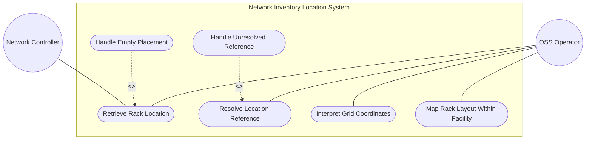
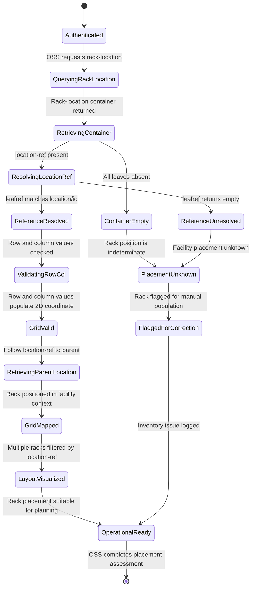

# Use Case: Map Rack Location Within Facility

## Parent Epic
- [ ] #7 - [Rack Inventory Management](https://github.com/gintatkinson/3dgs-030/blob/main/docs/epics/epic-02-rack-inventory-management.md) (rack-location is a sub-container of each rack entry, providing positional placement data within facility locations)

## Compliance Table

| Requirement | Status | Evidence |
|---|---|---|
| System boundary subgraph | PASS | Use Case Diagram groups all use case nodes inside `Network Inventory Location System` boundary |
| External actors identified | PASS | Primary: OSS Operator; Secondary: Network Controller |
| Complete realization matrix | PASS | Links to Feature #5 and User Story #9 |
| Constraint-to-flow parity | PASS | 6 Alternate/Exception flows covering all 6 validation constraints from Feature #5 |
| Minimum 2 alternate flows | PASS | 6 > 2 flows present |
| Schema container declared | PASS | `nil:locations/racks/rack/rack-location` container with `node_type: container` |
| Single container mandate | PASS | Exactly 1 schema container entry |

## 1. Actors
- **Primary Actor:** OSS Operator (facility planner or field technician performing rack installation, maintenance, or equipment deployment planning)
- **Secondary Actors:** Network Controller (authoritative source of rack-location placement data maintained via RFID tooling, geolocation services, or manual entry)

## 2. Preconditions
- A rack entry exists in the operational datastore under `/nwi:network-inventory/nil:locations/nil:racks/nil:rack`.
- The `rack-location` container is populated with at least a `location-ref` leafref pointing to an existing location `id`.
- The target location referenced by `location-ref` exists in the locations list for leafref resolution.
- The OSS client has authenticated access via NETCONF or RESTCONF with appropriate NACM read permissions.

## 3. Trigger
An OSS Operator retrieves rack-location data to determine the physical placement of a rack within a facility, including the parent location reference, row number, and column number, for equipment installation planning or facility layout mapping.

## 4. Main Success Scenario (Basic Flow)
1. The OSS Operator sends a YANG retrieval request (NETCONF `<get>` or RESTCONF `GET`) targeting a specific rack's rack-location subtree: `/nwi:network-inventory/nil:locations/nil:racks/nil:rack[id=<id>]/nil:rack-location`.
2. The Network Controller returns the `rack-location` container with the `location-ref` leafref resolved to the parent location's `id`, the `row-number`, and the `column-number`.
3. The OSS Operator follows the `location-ref` to retrieve the parent location's details (name, type, physical address, geo-location) to understand the facility context.
4. The OSS Operator interprets the `(row-number, column-number)` pair as a 2D grid coordinate for the rack's position within the location.
5. The OSS Operator maps multiple racks within the same location by filtering on `location-ref`, visualizing the grid layout for capacity planning and equipment placement.

## 5. Alternate and Exception Flows

- **5a. Location-Ref Leafref Unresolved (Branches from Basic Flow step 2):**
  1. The `location-ref` leafref value (using the ni-location-ref typedef which references location/id) does not match any existing location `id`.
  2. Per YANG leafref semantics, the reference resolves to an empty instance; the rack's facility placement is unknown and the OSS Operator flags it for manual location assignment.

- **5b. Row-Number Absent or Zero (Branches from Basic Flow step 4):**
  1. The `row-number` leaf is absent or set to zero, though it is an optional uint32 identifying the row within the referenced location.
  2. The OSS Operator cannot determine the rack's row position within the facility and may only use the column-number or location-ref for approximate placement.

- **5c. Column-Number Absent or Zero (Branches from Basic Flow step 4):**
  1. The `column-number` leaf is absent or set to zero, though it is an optional uint32 identifying the column within the referenced location.
  2. The OSS Operator cannot determine the rack's column position within the facility and may only use the row-number or location-ref for approximate placement.

- **5d. Ni-Location-Ref Typedef Leafref Path Constraint (Branches from Basic Flow step 2):**
  1. The ni-location-ref typedef is defined as type leafref with a path to `/nwi:network-inventory/nil:locations/nil:location/nil:id`.
  2. If the target location entry is removed from the locations list after the rack-location was populated, the leafref resolution breaks silently without automatic cleanup.

- **5e. Write Attempt on Read-Only Rack-Location Data (Branches from Basic Flow step 1):**
  1. The OSS Operator attempts to modify rack-location data via NETCONF `<edit-config>` or RESTCONF `PUT/PATCH`.
  2. Since all nodes are `config false` (read-only), the server rejects the write operation with an access-denied error.

- **5f. Row and Column Form Invalid 2D Grid (Branches from Basic Flow step 4):**
  1. The `row-number` and `column-number` form a 2D grid coordinate for rack positioning without a spatial unit.
  2. If the row and column values place the rack in an improbable position (e.g., row 999999, column 1), the OSS Operator flags the grid coordinate for physical verification.

## 6. Postconditions (Guarantees)
- **Success Guarantee:** The OSS Operator has retrieved a fully resolved rack-location mapping. The `location-ref` resolves to a valid parent location with known facility context. The `(row-number, column-number)` grid coordinates uniquely position the rack within the facility.
- **Failure Guarantee:** If `location-ref` is unresolved or the row/column grid coordinates are absent or implausible, the OSS Operator is notified of the placement data deficiency. The rack remains in the datastore but its physical position is unknown or unreliable for field operations.

## UML Diagrams

### Use Case Diagram

### State Machine Diagram

## 7. Operational Context

From draft-ietf-ivy-network-inventory-location, Section 3 (Rack):

> Through rack-location, each rack can be assigned to a site or a specific location within a site, such as an equipment room.

From the schema descriptions: the location information of the rack comprises the location reference, row number, and column number. The ni-location-ref typedef is used by data models that need to reference network inventory location.

## 8. Realization Matrix

### Required User Stories
- [ ] #9 - [Deploy Equipment in a Rack](https://github.com/gintatkinson/3dgs-030/blob/main/docs/user-stories/us-02-deploy-equipment-in-rack.md) (rack placement within a facility via rack-location is a prerequisite for equipment deployment planning)

### Required Features
- [ ] #5 - [Map Rack Location Within Facility](https://github.com/gintatkinson/3dgs-030/blob/main/docs/features/feat-05-rack-location-details.md) (the rack-location container schema with ni-location-ref typedef, location-ref, row-number, and column-number)

## Source References
Structural Schema: [ietf-ni-location@2026-07-06.yang](https://github.com/ietf-ivy-wg/network-inventory-location/blob/main/ietf-ni-location.yang) (Clause: typedef ni-location-ref, container rack-location)
Normative Specification: [draft-ietf-ivy-network-inventory-location](https://datatracker.ietf.org/doc/html/draft-ietf-ivy-network-inventory-location) (Clause: Section 3, Section 4 tree diagram, Figure 3 rack subtree)
