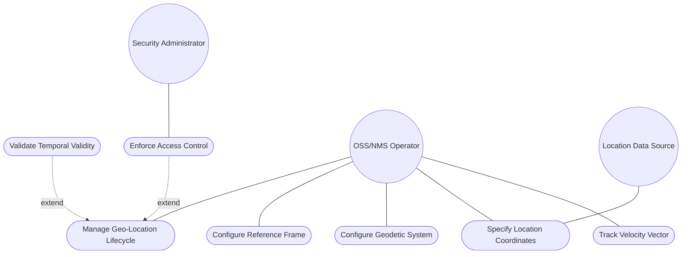
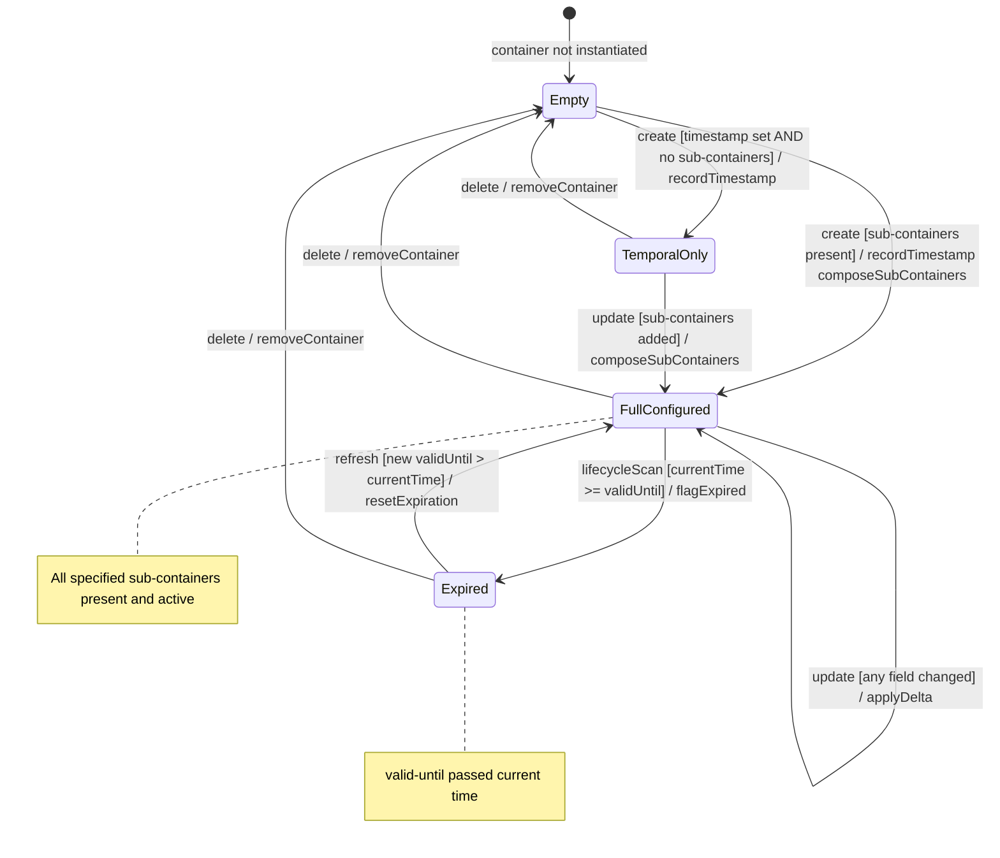

# Use Case: Manage Geo-Location Lifecycle

## Parent Epic
- [ ] #26 - [Geographic Location Module](https://github.com/gintatkinson/3dgs-030/blob/main/docs/epics/epic-03-geographic-location.md) (root container composing all geolocation sub-containers, temporal attributes, and security governance)

## Compliance Table

| Requirement | Status | Evidence |
|---|---|---|
| System boundary subgraph | PASS | Use Case Diagram groups all use case nodes inside `Geo-Location Management System` boundary |
| External actors identified | PASS | Primary: OSS/Network Management System; Secondary: Security Administrator, Location Data Source |
| Complete realization matrix | PASS | Links to Feature #21 and User Stories #27-#40 |
| Constraint-to-flow parity | PASS | 4 Alternate/Exception flows covering all 4 validation constraints from Feature #21 |
| Minimum 2 alternate flows | PASS | 4 > 2 flows present |
| Schema container declared | PASS | `ietf-geo-location:geo-location` container with `node_type: container` |
| Single container mandate | PASS | Exactly 1 schema container entry |

## 1. Actors
- **Primary Actor:** OSS/Network Management System (operator or automated system managing geographic location data for network elements, data centers, equipment racks)
- **Secondary Actors:**
  - Security Administrator (enforces access control and privacy policies for sensitive location data)
  - Location Data Source (external system providing coordinate data, e.g., GPS receiver, manual survey)

## 2. Preconditions
- The `ietf-geo-location` YANG module is loaded and the `geo-location` grouping is available for use by a consuming module.
- The consuming data model has included the grouping via `uses geo:geo-location`.
- The management transport layer (NETCONF/RESTCONF) is operational with secure transport (SSH/TLS).

## 3. Trigger
An OSS/Network Management System initiates a request to create, read, update, or delete a geo-location record for a locatable entity, or a periodic lifecycle scan detects location records approaching or past their `valid-until` timestamp.

## 4. Main Success Scenario (Basic Flow)
1. The OSS/Network Management System requests creation of a geo-location for a target locatable entity.
2. The Geo-Location Management System allocates a `geo-location` container instance within the consuming module's data tree.
3. The system optionally records a `timestamp` (ISO 8601 `yang:date-and-time`) indicating when the location was captured.
4. The system optionally sets a `valid-until` timestamp defining the location record's expiration boundary.
5. The system optionally composes sub-containers: `reference-frame`, `location` (choice), and `velocity` — each configured through their respective specialized Use Cases.
6. The system persists the geo-location data in the configuration datastore with all sub-containers present or absent as specified.
7. On query, the system returns the complete geo-location record including timestamp, valid-until, and all present sub-containers.
8. Periodic lifecycle monitoring evaluates `valid-until` against current time; records past expiration are flagged for the consuming application.

## 5. Alternate and Exception Flows

- **5a. Invalid Timestamp Format (Branches from Basic Flow step 3):**
  1. The system validates the `timestamp` value against the `yang:date-and-time` type (ISO 8601 format YYYY-MM-DDTHH:mm:ss[.fraction][Z|+/-HH:MM]).
  2. On pattern mismatch, the system rejects the input, rolls back the pending geo-location creation, and returns a type-validation error to the OSS/Network Management System.

- **5b. Valid-Until Precedes Timestamp (Branches from Basic Flow step 4):**
  1. The system performs a semantic cross-leaf check: if `valid-until` is chronologically before `timestamp`, the configuration is accepted at the schema level (no YANG cross-leaf constraint exists).
  2. The system emits an advisory warning to the OSS/Network Management System indicating the validity window has already closed; downstream consuming applications may treat the record as immediately expired.

- **5c. Missing All Sub-Containers with Timestamp Only (Branches from Basic Flow step 5):**
  1. The system accepts a geo-location with only `timestamp` and/or `valid-until` set — all sub-containers (reference-frame, location, velocity) are optional per schema.
  2. The system stores the minimal geo-location record; no coordinate data is associated. The record serves as a temporal placeholder until coordinates are populated in a subsequent update.

- **5d. Non-Mandatory Children Deleted by External Write (Branches from Basic Flow step 6):**
  1. An external NETCONF/RESTCONF operation replaces the geo-location container payload, omitting all sub-containers (reference-frame, location, velocity) while retaining only timestamp.
  2. The system accepts the write — all sub-containers are optional per the YANG schema definition and have no `mandatory true` flag. The geo-location transitions to a temporal-only state with no coordinate data.

## 6. Postconditions (Guarantees)
- **Success Guarantee:** A `geo-location` container instance exists in the configuration datastore with the specified temporal attributes and any present sub-containers. The record is writable, readable, and deletable (config true). Timestamp values conform to ISO 8601.
- **Failure Guarantee:** If validation fails at any step, no partial geo-location container is persisted. The configuration datastore state remains unchanged (rollback). The OSS/Network Management System receives a typed validation error message.

## UML Diagrams
### Use Case Diagram


### State Machine Diagram


## 7. Operational Context

From RFC 9179, Section 2:

> This document defines a 'geo-location' YANG grouping that allows for all the above data to be captured.

From RFC 9179, Section 2.4 (Nested Locations):

> When locations are nested (e.g., a building may have a location that houses routers that also have locations), the module using this grouping is free to indicate in its definition that the 'reference-frame' is inherited from the containing object so that the 'reference-frame' need not be repeated in every instance of location data.

From RFC 9179, Section 2.5 (Non-location Attributes):

> During the development of this module, the question of whether it would support data such as orientation arose. These types of attributes are outside the scope of this grouping because they do not deal with a location but rather describe something more about the object that is at the location.

From RFC 9179, Section 7 (Security Considerations):

> All the data nodes defined in this YANG module are writable/creatable/deletable (i.e., "config true", which is the default). None of the writable/creatable/deletable data nodes in the YANG module defined in this document are by themselves considered more sensitive or vulnerable than standard configuration. Some of the readable data nodes in this YANG module may be considered sensitive or vulnerable in some network environments. It is thus important to control read access (e.g., via get, get-config, or notification) to these data nodes. Since the grouping defined in this module identifies locations, authors using this grouping SHOULD consider any privacy issues that may arise when the data is readable (e.g., customer device locations, etc).

From RFC 9179, Section 1 (Introduction):

> In many applications, we would like to specify the location of something geographically. Some examples of locations in networking might be the location of data centers, a rack in an Internet exchange point, a router, a firewall, a port on some device, or it could be the endpoints of a fiber, or perhaps the failure point along a fiber. Additionally, while this location is typically relative to Earth, it does not need to be. Indeed, it is easy to imagine a network or device located on the Moon, on Mars, on Enceladus (the moon of Saturn), or even on a comet (e.g., 67p/churyumov-gerasimenko).

## 8. Realization Matrix
### Required Features
- [ ] #21 - [Geo-Location Container](https://github.com/gintatkinson/3dgs-030/blob/main/docs/features/feat-06-geo-location-container.md) (root container hosting timestamp, valid-until, and all sub-containers; defines temporal attribute lifecycle and config-true writability)

### Required User Stories
- [ ] #27 - [Specify Ellipsoidal Coordinates](https://github.com/gintatkinson/3dgs-030/blob/main/docs/user-stories/us-09-specify-ellipsoidal-coordinates.md) (ellipsoidal case within the location choice hosted by the root geo-location container)
- [ ] #28 - [Specify Cartesian Coordinates](https://github.com/gintatkinson/3dgs-030/blob/main/docs/user-stories/us-10-specify-cartesian-coordinates.md) (Cartesian case within the location choice hosted by the root geo-location container)
- [ ] #29 - [Define Reference Frame](https://github.com/gintatkinson/3dgs-030/blob/main/docs/user-stories/us-11-define-reference-frame.md) (reference-frame sub-container within the root geo-location container)
- [ ] #30 - [Track Velocity Vector](https://github.com/gintatkinson/3dgs-030/blob/main/docs/user-stories/us-12-track-velocity-vector.md) (velocity sub-container within the root geo-location container)
- [ ] #31 - [Use Alternate Reference Systems](https://github.com/gintatkinson/3dgs-030/blob/main/docs/user-stories/us-13-use-alternate-reference-systems.md) (alternate-system leaf in reference-frame hosted by root container)
- [ ] #37 - [Inherit Reference Frame in Nested Hierarchies](https://github.com/gintatkinson/3dgs-030/blob/main/docs/user-stories/us-19-inherit-reference-frame.md) (inheritance pattern for nested geo-location containers as defined by RFC 9179 Section 2.4)
- [ ] #38 - [Manage Temporal Validity and Expiration](https://github.com/gintatkinson/3dgs-030/blob/main/docs/user-stories/us-20-manage-temporal-validity.md) (timestamp and valid-until lifecycle management on the root geo-location container)
- [ ] #39 - [Derive Speed and Heading from Velocity](https://github.com/gintatkinson/3dgs-030/blob/main/docs/user-stories/us-21-derive-speed-heading.md) (derived values computed from velocity container within the root geo-location)
- [ ] #40 - [Enforce Coordinate Precision Constraints](https://github.com/gintatkinson/3dgs-030/blob/main/docs/user-stories/us-22-enforce-coordinate-precision.md) (precision enforcement across all numeric leaves within the geo-location container)

## Source References
Structural Schema: [ietf-geo-location@2022-02-11.yang](https://github.com/YangModels/yang/blob/main/standard/ietf/RFC/ietf-geo-location%402022-02-11.yang) (Clause: container geo-location)
Normative Specification: [RFC 9179: A YANG Grouping for Geographic Locations](https://datatracker.ietf.org/doc/rfc9179/) (Clause: Sections 1, 2, 2.4, 2.5, 7)

> [!WARNING]
> **Mermaid Block Closing Constraints & Code Fence Integrity:**
> - Every Mermaid diagram MUST be strictly closed with ``` on a new line. Leaking Mermaid blocks or stray/unclosed code fences will fail downstream validation checks.
> - **Semicolon Restriction**: Do NOT use semicolons (`;`) in sequence diagram `Note` statements or message text statements. Semicolons are not allowed.

> **Container Traceability:** This Use Case declares exactly one schema container `ietf-geo-location:geo-location` with `node_type: container`. Multi-container Use Cases are forbidden.
