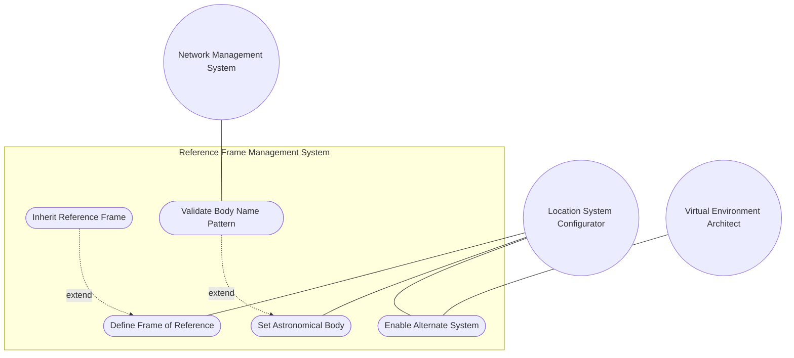
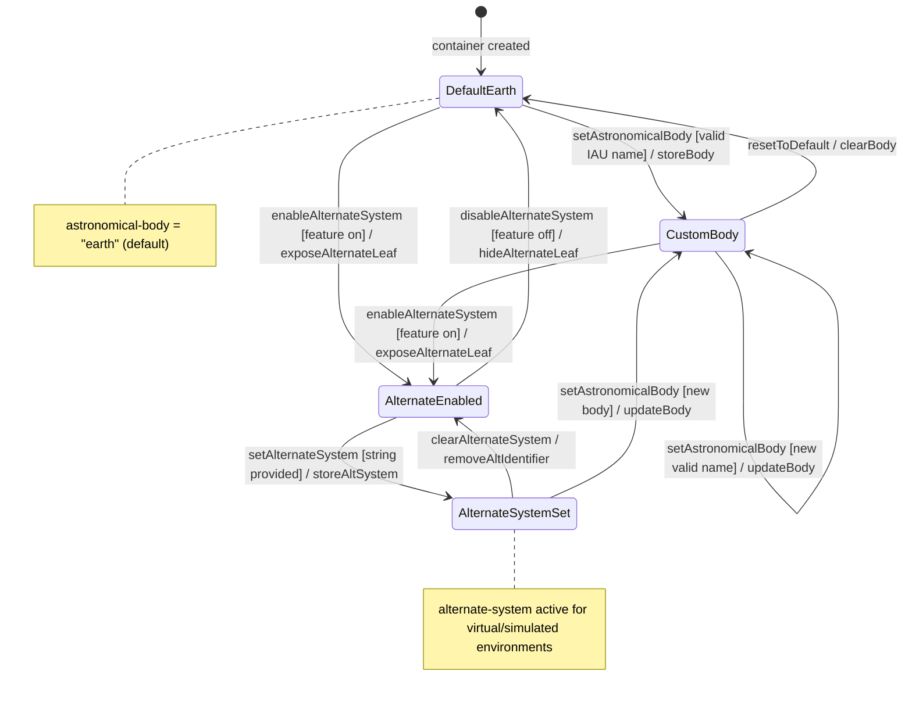

# Use Case: Define Frame of Reference for Geographic Location Interpretation

## Parent Epic
- [ ] #26 - [Geographic Location Module](https://github.com/gintatkinson/3dgs-030/blob/main/docs/epics/epic-03-geographic-location.md) (reference-frame container defining the astronomical body and optional alternate system for coordinate interpretation)

## Compliance Table

| Requirement | Status | Evidence |
|---|---|---|
| System boundary subgraph | PASS | Use Case Diagram groups all use case nodes inside `Reference Frame Management System` boundary |
| External actors identified | PASS | Primary: Location System Configurator; Secondary: Virtual Environment Architect, Network Management System |
| Complete realization matrix | PASS | Links to Features #22, #23 and User Stories #29, #31, #37 |
| Constraint-to-flow parity | PASS | 9 Alternate/Exception flows covering all 9 validation constraints from Features #22 and #23 |
| Minimum 2 alternate flows | PASS | 9 > 2 flows present |
| Schema container declared | PASS | `ietf-geo-location:geo-location/reference-frame` container with `node_type: container` |
| Single container mandate | PASS | Exactly 1 schema container entry |

## 1. Actors
- **Primary Actor:** Location System Configurator (network engineer or automated provisioning system defining the frame of reference for all location coordinates within a geo-location instance)
- **Secondary Actors:**
  - Virtual Environment Architect (specifies alternate reference systems for simulated or virtual reality environments when the `alternate-systems` feature is enabled)
  - Network Management System (receives validation errors and notification of reference frame configuration changes)

## 2. Preconditions
- The parent `geo-location` container is instantiated in the consuming module's data tree.
- The `reference-frame` sub-container is accessible as a child of `geo-location`.
- The YANG module `ietf-geo-location` is loaded with its `feature alternate-systems` state known to the device.

## 3. Trigger
A Location System Configurator initiates configuration of the astronomical body and/or alternate reference system for a geo-location, or a nested location requires resolution of an inherited reference frame from its parent container.

## 4. Main Success Scenario (Basic Flow)
1. The Location System Configurator opens the `reference-frame` container for a target geo-location.
2. The system presents the `astronomical-body` field with the default value "earth" pre-populated.
3. The configurator optionally overrides `astronomical-body` with any valid IAU-named astronomical body (e.g., "mars", "moon", "enceladus", "ceres").
4. The system validates the `astronomical-body` value against the ASCII printable character pattern `[ -@\[-\^_-~]*` and converts uppercase to lowercase per RFC 9179 recommendation.
5. If the `alternate-systems` feature is enabled on the device, the system exposes the `alternate-system` leaf; the configurator optionally sets it to a system identifier string.
6. The system stores the reference frame definition. The `geodetic-system` sub-container (addressed in UC-08) provides the datum and accuracy for this frame.
7. When this geo-location serves as a parent for nested locations, the consuming module may inherit this reference frame into child locations to avoid redundant configuration.

## 5. Alternate and Exception Flows

- **5a. Invalid Astronomical Body Pattern (Branches from Basic Flow step 4):**
  1. The system detects that the `astronomical-body` value contains control characters or non-ASCII characters outside the pattern `[ -@\[-\^_-~]*`.
  2. The system rejects the value, restores the previous valid astronomical-body value (or default "earth"), and returns a pattern-constraint violation error with the allowed character range to the configurator.

- **5b. Alternate System Requested When Feature Disabled (Branches from Basic Flow step 5):**
  1. The system evaluates the `alternate-systems` YANG feature guard on the device; the feature is found disabled.
  2. The system suppresses the `alternate-system` leaf entirely — it is not present in the schema tree. Any attempt to write to this leaf path is rejected with a schema-mount violation. The configurator is notified that the `alternate-systems` feature must be enabled to use this capability.

- **5c. Uppercase Astronomical Body Normalization (Branches from Basic Flow step 4):**
  1. The system receives an `astronomical-body` value containing uppercase characters (e.g., "Earth", "MARS", "Enceladus").
  2. Per RFC 9179 recommendation, the system SHOULD convert the value to lowercase before storing. The configurator is notified of the normalization if the stored value differs from the input. The normalized value (e.g., "earth", "mars", "enceladus") is persisted.

- **5d. Leading "the" in Astronomical Body Name (Branches from Basic Flow step 3):**
  1. The configurator enters an `astronomical-body` value with a leading "the" prefix (e.g., "the moon", "the earth").
  2. Per RFC 9179 YANG module description, any preceding "the" in the name SHOULD NOT be included. The system strips the leading "the " prefix and stores the reduced form (e.g., "moon", "earth"). The configurator is notified of the normalization.

- **5e. Astronomical Body Not an IAU-Recognized Name (Branches from Basic Flow step 3):**
  1. The configurator enters a custom astronomical body name that is not recognized by the International Astronomical Union (e.g., "planet-x", "custom-world").
  2. The system accepts the value — the pattern constraint only enforces ASCII printable characters, not IAU membership. The system stores the value with an advisory note that the body name is not in the IAU registry and coordinate interpretation may require custom geodetic system calibration.

- **5f. Alternate System Specified Without Astronomical Body (Branches from Basic Flow step 5):**
  1. The configurator sets `alternate-system` to a virtual reality identifier but leaves `astronomical-body` at its default "earth".
  2. The system stores both values as-is — there is no schema-level cross-leaf constraint coupling these fields. The system issues an advisory warning that the astronomical body name "earth" may be semantically inconsistent with a non-natural alternate system. The configurator should review whether a custom body name is more appropriate.

- **5g. Reference Frame Inherited from Parent with Override (Branches from Basic Flow step 7):**
  1. A nested geo-location inherits the reference-frame from its parent container but the configurator explicitly sets a different `astronomical-body` value on the child.
  2. The system resolves the inheritance: the child's explicitly specified value overrides the inherited parent value for that leaf. Other inherited leaves (alternate-system, geodetic-datum) remain inherited unless also overridden. The resolved reference frame is stored with the child geo-location.

- **5h. Geodetic Datum Default Resolution for Non-Earth Body (Branches from Basic Flow step 2):**
  1. The configurator sets `astronomical-body` to "mars" but does not specify a `geodetic-datum` in the geodetic-system sub-container.
  2. The system cannot resolve the default "wgs-84" — this default is defined for Earth only. The geodetic-datum remains absent from the stored data. The system issues an advisory warning that no geodetic datum is configured for the non-Earth body and coordinate interpretation is undefined until a datum is explicitly specified.

- **5i. Accuracy Override Rejected Due to Invalid Geodetic Datum Context (Branches from Basic Flow step 5):**
  1. The configurator specifies `coord-accuracy` in the geodetic-system sub-container without having configured a valid `geodetic-datum` first.
  2. Per RFC 9179 Section 2.1, accuracy overrides augment the default precision implied by the geodetic datum. Without an explicit or default datum, the accuracy override lacks a reference baseline. The system stores the coord-accuracy value (no cross-leaf constraint in schema) but flags this as a diagnostic warning: the accuracy override may be interpreted inconsistently until a geodetic-datum is established for the reference frame.

## 6. Postconditions (Guarantees)
- **Success Guarantee:** The `reference-frame` container stores a valid `astronomical-body` value (default "earth" if not specified) and optionally an `alternate-system` identifier when the feature is enabled. The reference frame defines the coordinate interpretation context for all location data within this geo-location.
- **Failure Guarantee:** If validation fails (invalid pattern, unauthorized alternate system), the reference-frame container retains its previous state (or default values). No partial or invalid configuration is persisted. The configurator receives a typed error message.

## UML Diagrams
### Use Case Diagram


### State Machine Diagram


## 7. Operational Context

From RFC 9179, Section 2.1 (Frame of Reference):

> The frame of reference ('reference-frame') defines what the location values refer to and their meaning. The referred-to object can be any astronomical body. It could be a planet such as Earth or Mars, a moon such as Enceladus, an asteroid such as Ceres, or even a comet such as 1P/Halley. This value is specified in 'astronomical-body' and is defined by the International Astronomical Union <http://www.iau.org>. The default 'astronomical-body' value is 'earth'.

> Finally, we define an optional feature that allows for changing the system for which the above values are defined. This optional feature adds an 'alternate-system' value to the reference frame. This value is normally not present, which implies the natural universe is the system. The use of this value is intended to allow for creating virtual realities or perhaps alternate coordinate systems. The definition of alternate systems is outside the scope of this document.

From RFC 9179, Section 2.4 (Nested Locations):

> When locations are nested (e.g., a building may have a location that houses routers that also have locations), the module using this grouping is free to indicate in its definition that the 'reference-frame' is inherited from the containing object so that the 'reference-frame' need not be repeated in every instance of location data.

## 8. Realization Matrix
### Required Features
- [ ] #22 - [Reference Frame](https://github.com/gintatkinson/3dgs-030/blob/main/docs/features/feat-07-reference-frame.md) (defines astronomical-body leaf with default "earth", pattern constraint, and alternate-system leaf with YANG feature guard `alternate-systems`)
- [ ] #23 - [Geodetic System](https://github.com/gintatkinson/3dgs-030/blob/main/docs/features/feat-08-geodetic-system.md) (geodetic-system sub-container within reference-frame; datum and accuracy values are interpreted in context of the reference frame's astronomical body)

### Required User Stories
- [ ] #29 - [Define Frame of Reference for Geographic Location Interpretation](https://github.com/gintatkinson/3dgs-030/blob/main/docs/user-stories/us-11-define-reference-frame.md) (primary user story: selecting astronomical body and geodetic datum for coordinate interpretation within reference-frame)
- [ ] #31 - [Use Alternate Reference Systems for Virtual or Non-Natural Environments](https://github.com/gintatkinson/3dgs-030/blob/main/docs/user-stories/us-13-use-alternate-reference-systems.md) (enabling alternate-system leaf when the feature guard is active for virtual realities and simulations)
- [ ] #37 - [Inherit Reference Frame in Nested Location Hierarchies](https://github.com/gintatkinson/3dgs-030/blob/main/docs/user-stories/us-19-inherit-reference-frame.md) (reference-frame inheritance pattern for nested geo-location containers as defined by RFC 9179 Section 2.4)

## Source References
Structural Schema: [ietf-geo-location@2022-02-11.yang](https://github.com/YangModels/yang/blob/main/standard/ietf/RFC/ietf-geo-location%402022-02-11.yang) (Clause: container reference-frame, leaf astronomical-body, leaf alternate-system, feature alternate-systems)
Normative Specification: [RFC 9179: A YANG Grouping for Geographic Locations](https://datatracker.ietf.org/doc/rfc9179/) (Clause: Sections 2.1, 2.4)

> [!WARNING]
> **Mermaid Block Closing Constraints & Code Fence Integrity:**
> - Every Mermaid diagram MUST be strictly closed with ``` on a new line. Leaking Mermaid blocks or stray/unclosed code fences will fail downstream validation checks.
> - **Semicolon Restriction**: Do NOT use semicolons (`;`) in sequence diagram `Note` statements or message text statements. Semicolons are not allowed.

> **Container Traceability:** This Use Case declares exactly one schema container `ietf-geo-location:geo-location/reference-frame` with `node_type: container`. Multi-container Use Cases are forbidden.
