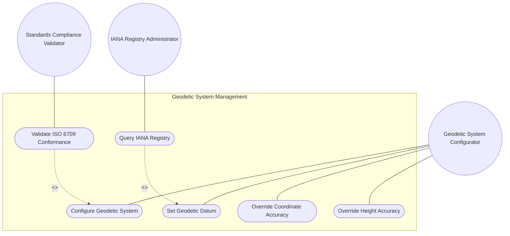
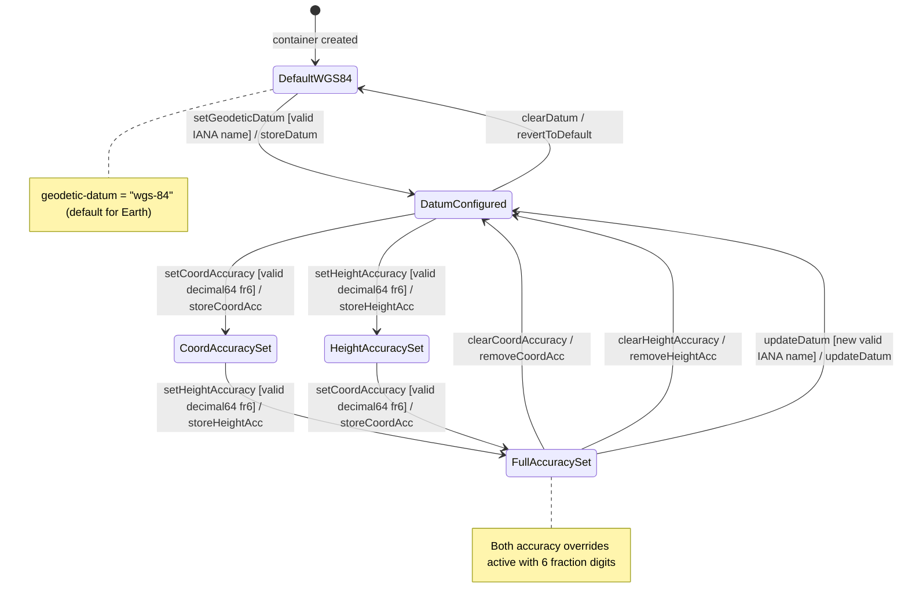

# Use Case: Configure Geodetic System Datum and Coordinate Accuracy

## Parent Epic
- [ ] #26 - [Geographic Location Module](https://github.com/gintatkinson/3dgs-030/blob/main/docs/epics/epic-03-geographic-location.md) (geodetic-system container defining datum and accuracy overrides within the reference frame)

## Compliance Table

| Requirement | Status | Evidence |
|---|---|---|
| System boundary subgraph | PASS | Use Case Diagram groups all use case nodes inside `Geodetic System Management` boundary |
| External actors identified | PASS | Primary: Geodetic System Configurator; Secondary: IANA Registry Administrator, Standards Compliance Validator |
| Complete realization matrix | PASS | Links to Features #23, #22 and User Stories #29, #36, #40 |
| Constraint-to-flow parity | PASS | 9 Alternate/Exception flows covering all 9 validation constraints from Features #23 and #22 |
| Minimum 2 alternate flows | PASS | 9 > 2 flows present |
| Schema container declared | PASS | `ietf-geo-location:geo-location/reference-frame/geodetic-system` container with `node_type: container` |
| Single container mandate | PASS | Exactly 1 schema container entry |

## 1. Actors
- **Primary Actor:** Geodetic System Configurator (survey engineer or automated system defining the geodetic datum, coordinate accuracy, and height accuracy for location interpretation)
- **Secondary Actors:**
  - IANA Registry Administrator (maintains the "Geodetic System Values" registry under the "YANG Geographic Location Parameters" registry per RFC 9179 Section 6.1)
  - Standards Compliance Validator (verifies ISO 6709:2008 conformance including CRS indication and coordinate representation)

## 2. Preconditions
- The parent `reference-frame` container exists within a `geo-location` instance.
- The `geodetic-system` sub-container is accessible as a child of `reference-frame`.
- The IANA "Geodetic System Values" registry is established and populated with standard geodetic system names (wgs-84, wgs-84-96, wgs-84-08, me, etc.).

## 3. Trigger
A Geodetic System Configurator specifies or overrides the geodetic datum, coordinate accuracy, or height accuracy for a geo-location, or an ISO 6709:2008 conformance validation test suite is executed against the geo-location data.

## 4. Main Success Scenario (Basic Flow)
1. The Geodetic System Configurator opens the `geodetic-system` sub-container for a target `reference-frame`.
2. The configurator specifies a `geodetic-datum` value (e.g., "wgs-84", "wgs-84-96", "me") from the IANA "Geodetic System Values" registry. The default is "wgs-84" when the astronomical body is Earth.
3. The system validates the `geodetic-datum` against the ASCII printable character pattern `[ -@\[-\^_-~]*` and normalizes to lowercase with spaces converted to dashes per IANA registry rules.
4. The configurator optionally sets `coord-accuracy` (decimal64, fraction-digits 6, unitless) to override the default accuracy of latitude/longitude or Cartesian X/Y/Z relative to the geodetic datum.
5. The configurator optionally sets `height-accuracy` (decimal64, fraction-digits 6, units meters) to override the default height accuracy — applicable only to ellipsoidal coordinates.
6. The system stores the geodetic system configuration. All accuracy overrides take effect immediately for this geo-location instance.
7. The Standards Compliance Validator executes ISO 6709:2008 Annex A tests: A.1.2.1 (CRS always indicated via reference-frame or WGS-84 default), A.1.2.2 (CRS register is the IANA registry), A.1.2.4 (horizontal position conforms), A.1.2.5 (vertical position conforms). Tests A.1.2.3 and A.1.2.6 are N/A.

## 5. Alternate and Exception Flows

- **5a. Invalid Geodetic Datum Pattern (Branches from Basic Flow step 3):**
  1. The system detects non-ASCII or control characters in the `geodetic-datum` value that violate the pattern `[ -@\[-\^_-~]*`.
  2. The system rejects the value, restores the previous valid datum (or defaults to "wgs-84" for Earth), and returns a pattern-constraint violation error specifying the allowed ASCII character range.

- **5b. Coord-Accuracy Precision Exceeded (Branches from Basic Flow step 4):**
  1. The system validates the `coord-accuracy` value against the `decimal64 { fraction-digits 6 }` type constraint.
  2. If the value has more than 6 fractional decimal digits, the system rejects the input and returns a type-violation error indicating the maximum allowed fraction digits (6). The configurator must truncate or round to 6 fractional digits.

- **5c. Height-Accuracy Applied to Cartesian Coordinates (Branches from Basic Flow step 5):**
  1. The system detects that the location choice is set to Cartesian (x/y/z) coordinates but `height-accuracy` has been specified.
  2. Per RFC 9179, `height-accuracy` is not used with Cartesian coordinates. The system stores the value (the schema has no cross-leaf constraint) but advises the configurator that the height-accuracy override will have no effect on Cartesian coordinate interpretation. The configurator may choose to remove it.

- **5d. Coord-Accuracy Applied to Cartesian Coordinates (Branches from Basic Flow step 4):**
  1. The system validates `coord-accuracy` against the decimal64 fraction-digits 6 type constraint when the location choice uses Cartesian coordinates.
  2. Per RFC 9179, `coord-accuracy` applies to Cartesian X/Y/Z components. The system stores the value and applies it to the Cartesian coordinate uncertainty. No warning is needed — this is a valid usage path distinct from the ellipsoidal case.

- **5e. Geodetic Datum Value Not Registered in IANA Registry (Branches from Basic Flow step 2):**
  1. The configurator enters a `geodetic-datum` string that matches the ASCII pattern but is not listed in the IANA "Geodetic System Values" registry.
  2. The system accepts the value — the IANA registry is First Come First Served and does not enforce a closed enumeration. The system issues an advisory that the datum is not in the standard registry. The configurator should consider registering the new datum with IANA.

- **5f. Geodetic Datum With Spaces Not Normalized to Dashes (Branches from Basic Flow step 3):**
  1. The configurator enters a `geodetic-datum` value containing spaces (e.g., "World Geodetic System 1984").
  2. Per IANA registry rules (RFC 9179 Section 6.1), spaces MUST be converted to dashes. The system normalizes "World Geodetic System 1984" to "world-geodetic-system-1984" and stores the dashed form. The configurator is notified of the normalization.

- **5g. Accuracy Override Exceeds Datum Default Precision (Branches from Basic Flow step 4):**
  1. The configurator sets `coord-accuracy` to 0.5 meters when the geodetic datum "wgs-84" implies a higher default precision (e.g., sub-centimeter).
  2. The system stores the value as specified — accuracy overrides the default implied by the datum regardless of direction (more or less precise). No schema constraint limits the accuracy magnitude. The system records the explicit override.

- **5h. Coord-Accuracy Set Without Geodetic Datum (Branches from Basic Flow step 4):**
  1. The configurator specifies `coord-accuracy` but leaves `geodetic-datum` unset.
  2. The system stores both values as-is — the geodetic-datum defaults to "wgs-84" for Earth-based locations. The coord-accuracy overrides the default accuracy implied by WGS-84. If the astronomical body is not Earth, an advisory warns that the datum default may be invalid.

- **5i. Negative Accuracy Value Supplied (Branches from Basic Flow step 4):**
  1. The configurator attempts to set `coord-accuracy` to a negative decimal64 value (e.g., -0.5).
  2. The system checks the YANG `decimal64` type definition: decimal64 is a signed type that permits negative values. The system stores the negative value as-is — no non-negative constraint is defined in the schema. The system issues a semantic advisory that negative accuracy values are physically meaningless and the configurator should verify the input.

## 6. Postconditions (Guarantees)
- **Success Guarantee:** The `geodetic-system` container stores a valid `geodetic-datum` (default "wgs-84" for Earth), and optionally `coord-accuracy` and `height-accuracy` with 6 fractional digits precision. The geodetic framework defines the meaning and precision of all coordinates in this geo-location. ISO 6709:2008 conformance tests pass.
- **Failure Guarantee:** If any validation constraint fails, no partial geodetic-system configuration is persisted. The previous state (or default datum "wgs-84") is retained. A typed error is returned to the configurator.

## UML Diagrams
### Use Case Diagram


### State Machine Diagram


## 7. Operational Context

From RFC 9179, Section 2.1 (Geodetic System):

> In addition to identifying the astronomical body, we also need to define the meaning of the coordinates (e.g., latitude and longitude) and the definition of 0-height. This is done with a 'geodetic-datum' value. The default value for 'geodetic-datum' is 'wgs-84' (i.e., the World Geodetic System [WGS84]), which is used by the Global Positioning System (GPS) among many others. We define an IANA registry for specifying standard values for the 'geodetic-datum'.

> In addition to the 'geodetic-datum' value, we allow overriding the coordinate and height accuracy using 'coord-accuracy' and 'height-accuracy', respectively. When specified, these values override the defaults implied by the 'geodetic-datum' value.

From RFC 9179, Section 6.1 (IANA Geodetic System Values Registry):

> IANA has created the "Geodetic System Values" registry under the "YANG Geographic Location Parameters" registry. This registry allocates names for standard geodetic systems. The values SHOULD use an acronym when available, they MUST be converted to lowercase, and spaces MUST be changed to dashes "-". The allocation policy for this registry is First Come First Served. The initial values include: me (Mean Earth/Polar Axis - Moon), wgs-84-96, wgs-84-08, wgs-84.

From RFC 9179, Section 4 (ISO 6709:2008 Conformance):

> For test 'A.1.2.1', the YANG geo-location object either includes a Coordinate Reference System (CRS) ('reference-frame') or has a default defined WGS84. For 'A.1.2.3', we do not define our own CRS, and doing so is not required for conformance. For 'A.1.2.6', we do not define a text string representation, which is also not required for conformance.

## 8. Realization Matrix
### Required Features
- [ ] #23 - [Geodetic System](https://github.com/gintatkinson/3dgs-030/blob/main/docs/features/feat-08-geodetic-system.md) (defines geodetic-datum with pattern constraint, coord-accuracy decimal64 fr6, and height-accuracy decimal64 fr6 units meters)
- [ ] #22 - [Reference Frame](https://github.com/gintatkinson/3dgs-030/blob/main/docs/features/feat-07-reference-frame.md) (parent container providing astronomical-body context; geodetic-datum default depends on the astronomical body)

### Required User Stories
- [ ] #29 - [Define Frame of Reference for Geographic Location Interpretation](https://github.com/gintatkinson/3dgs-030/blob/main/docs/user-stories/us-11-define-reference-frame.md) (selecting geodetic-datum and configuring accuracy overrides is part of the reference frame definition workflow)
- [ ] #36 - [Validate ISO 6709:2008 Conformance for Geographic Point Location](https://github.com/gintatkinson/3dgs-030/blob/main/docs/user-stories/us-18-validate-iso-6709-conformance.md) (geodetic-system provides the CRS indication and IANA registry reference required for ISO 6709 conformance tests A.1.2.1 and A.1.2.2)
- [ ] #40 - [Enforce Coordinate Precision Constraints per Schema Type Definitions](https://github.com/gintatkinson/3dgs-030/blob/main/docs/user-stories/us-22-enforce-coordinate-precision.md) (coord-accuracy and height-accuracy participate in the precision enforcement matrix with decimal64 fraction-digits 6)

## Source References
Structural Schema: [ietf-geo-location@2022-02-11.yang](https://github.com/YangModels/yang/blob/main/standard/ietf/RFC/ietf-geo-location%402022-02-11.yang) (Clause: container geodetic-system, leaf geodetic-datum, leaf coord-accuracy, leaf height-accuracy)
Normative Specification: [RFC 9179: A YANG Grouping for Geographic Locations](https://datatracker.ietf.org/doc/rfc9179/) (Clause: Sections 2.1, 4, 6.1)

> [!WARNING]
> **Mermaid Block Closing Constraints & Code Fence Integrity:**
> - Every Mermaid diagram MUST be strictly closed with ``` on a new line. Leaking Mermaid blocks or stray/unclosed code fences will fail downstream validation checks.
> - **Semicolon Restriction**: Do NOT use semicolons (`;`) in sequence diagram `Note` statements or message text statements. Semicolons are not allowed.

> **Container Traceability:** This Use Case declares exactly one schema container `ietf-geo-location:geo-location/reference-frame/geodetic-system` with `node_type: container`. Multi-container Use Cases are forbidden.
