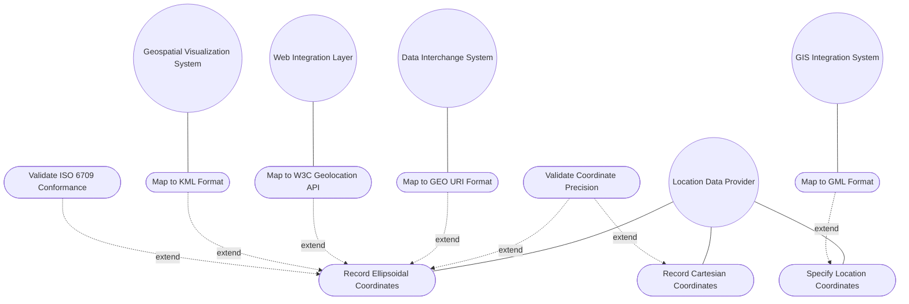

# Use Case: Specify Geographic Location Coordinates in Ellipsoidal or Cartesian Form

## Parent Epic
- [ ] #26 - [Geographic Location Module](https://github.com/gintatkinson/3dgs-030/blob/main/docs/epics/epic-03-geographic-location.md) (location choice with ellipsoid and Cartesian cases, cross-mapped to GEO URI, W3C, GML, and KML portability formats)

## Compliance Table

| Requirement | Status | Evidence |
|---|---|---|
| System boundary subgraph | PASS | Use Case Diagram groups all use case nodes inside `Location Coordinate Management System` boundary |
| External actors identified | PASS | Primary: Location Data Provider; Secondary: Data Interchange System, GIS Integration System, Geospatial Visualization System |
| Complete realization matrix | PASS | Links to Features #24, #21 and User Stories #27, #28, #32-#36, #40 |
| Constraint-to-flow parity | PASS | 13 Alternate/Exception flows covering all 13 validation constraints from Features #24 and #21 |
| Minimum 2 alternate flows | PASS | 13 > 2 flows present |
| Schema container declared | PASS | `ietf-geo-location:geo-location/location` choice with `node_type: choice` |
| Single container mandate | PASS | Exactly 1 schema container entry |

## 1. Actors
- **Primary Actor:** Location Data Provider (field engineer, GPS receiver, or automated survey system recording a geographic position using ellipsoidal latitude/longitude/height or Cartesian x/y/z coordinates)
- **Secondary Actors:**
  - Data Interchange System (converts location data to/from RFC 5870 geo: URI format)
  - Web Integration Layer (maps location data to/from W3C Geolocation API interfaces)
  - GIS Integration System (maps location data to/from GML `gml:pos` and `gml:Observation` elements)
  - Geospatial Visualization System (maps location data to/from KML `kml:Point` or `kml:Camera` elements for Google Earth and similar platforms)
  - Precision Enforcement Engine (validates decimal64 fraction-digit compliance across all coordinate leaves)

## 2. Preconditions
- The parent `geo-location` container is instantiated with a valid `reference-frame` defining the astronomical body and geodetic system.
- The `location` choice is accessible as a child of `geo-location`.
- The geodetic-datum in the reference frame defines the coordinate system semantics (WGS-84 for Earth, Mean Earth for Moon, etc.).

## 3. Trigger
A Location Data Provider selects a coordinate representation mode (ellipsoidal or Cartesian) and enters position coordinate values, or an external system requests bidirectional mapping between YANG location data and a portable format (geo: URI, W3C, GML, KML).

## 4. Main Success Scenario (Basic Flow)
1. The Location Data Provider opens the `location` choice for a target geo-location.
2. The provider selects the **ellipsoidal** case and enters `latitude` (decimal degrees, decimal64 fraction-digits 16) and `longitude` (decimal degrees, decimal64 fraction-digits 16), and optionally `height` (meters, decimal64 fraction-digits 6).
3. Alternatively, the provider selects the **Cartesian** case and enters `x`, `y`, and `z` values (meters each, decimal64 fraction-digits 6).
4. The system validates all numeric values against their schema-defined decimal64 fraction-digit limits: 16 for lat/lon, 6 for height and Cartesian components.
5. The system enforces mutual exclusivity: exactly one case (ellipsoid or Cartesian) is active; the other is absent.
6. The system stores the active coordinate case in the configuration datastore. The choice may be entirely absent if no coordinate data is provided.
7. On export, the Data Interchange System maps ellipsoidal coordinates plus geodetic-datum to RFC 5870 `geo:` URI format with CRS and uncertainty parameters.
8. On export to W3C, the Web Integration Layer maps ellipsoidal coordinates, accuracy, and velocity-derived heading/speed — valid only for Earth-based WGS-84 locations.
9. On export to GML, the GIS Integration System maps coordinates to `gml:pos` with `srsName` from the geodetic-datum, and timestamp/valid-until to `gml:validTime`.
10. On export to KML, the Geospatial Visualization System maps ellipsoidal coordinates to KML coordinate strings with `altitudeMode` handling (absolute, relativeToGround, clampToGround).

## 5. Alternate and Exception Flows

- **5a. Latitude Fraction-Digit Precision Exceeded (Branches from Basic Flow step 4):**
  1. The system detects that `latitude` has more than 16 fractional decimal digits.
  2. The system rejects the latitude value and returns a `decimal64 fraction-digits 16` type-violation error. The provider must truncate or round to 16 fractional digits. No partial coordinate data is stored.

- **5b. Cartesian Fraction-Digit Precision Exceeded (Branches from Basic Flow step 4):**
  1. The system detects that any of `x`, `y`, or `z` has more than 6 fractional decimal digits.
  2. The system rejects the violating coordinate(s) and returns a `decimal64 fraction-digits 6` type-violation error. The provider must truncate or round the affected components. No partial Cartesian data is stored.

- **5c. Both Ellipsoid and Cartesian Cases Active (Branches from Basic Flow step 5):**
  1. The system detects an attempt to store both ellipsoid and Cartesian case data simultaneously (e.g., via a merge or replace operation that sets nodes in both cases).
  2. The system enforces the YANG `choice` semantics: only one case may be present. The write operation is rejected with a schema constraint violation. The provider must select exactly one coordinate system.

- **5d. Non-Earth Location Mapped to W3C Format (Branches from Basic Flow step 8):**
  1. The Web Integration Layer detects that `astronomical-body` is not "earth" or `geodetic-datum` is not "wgs-84".
  2. The system rejects the W3C mapping request with an incompatibility notification: the W3C Geolocation API only supports Earth-based WGS-84 coordinates. The provider must use a different export format (GML or KML) for non-Earth or non-WGS-84 locations.

- **5e. KML Relative-to-Ground Height Mapping (Branches from Basic Flow step 10):**
  1. The Geospatial Visualization System encounters `altitudeMode` "relativeToGround" in a KML import — the height value is relative to ground level, not absolute within the geodetic datum.
  2. Per RFC 9179 Section 5.1.4, the YANG grouping cannot directly map relative-to-ground heights. The system requires external ground elevation data to compute the absolute height before storing in the ellipsoid case. If elevation data is unavailable, the mapping fails with an "unable to resolve relative height" error.

- **5f. Longitude Fraction-Digit Precision Exceeded (Branches from Basic Flow step 4):**
  1. The system detects that `longitude` has more than 16 fractional decimal digits.
  2. The system rejects the longitude value and returns a `decimal64 fraction-digits 16` type-violation error. The provider must truncate or round to 16 fractional digits before retry.

- **5g. Height Fraction-Digit Precision Exceeded (Branches from Basic Flow step 4):**
  1. The system detects that `height` (ellipsoid case) has more than 6 fractional decimal digits.
  2. The system rejects the height value and returns a `decimal64 fraction-digits 6` type-violation error. Unlike latitude/longitude (16 digits), height is constrained to 6 fractional digits in meters per the YANG schema.

- **5h. Location Choice Entirely Absent (Branches from Basic Flow step 6):**
  1. The provider commits a geo-location without selecting either the ellipsoid or Cartesian case — the `location` choice node is absent.
  2. The system stores the geo-location with no coordinate data. Per schema, the choice itself is optional. The geo-location container exists as a temporal-only or velocity-only record. No error is raised.

- **5i. Ellipsoid Height Specified Without Latitude or Longitude (Branches from Basic Flow step 2):**
  1. The provider sets only the `height` leaf in the ellipsoid case without specifying `latitude` or `longitude`.
  2. The system accepts the partial data — all leaves within the ellipsoid case are optional. The stored geo-location has a height value but no horizontal position. The system issues an advisory that a height value without horizontal coordinates provides incomplete geolocation information.

- **5j. Cartesian Single-Axis Specification (Branches from Basic Flow step 3):**
  1. The provider sets only the `x` coordinate in the Cartesian case, leaving `y` and `z` unset.
  2. The system stores only the x component — all three leaves within the Cartesian case are optional per schema. The system accepts this partial vector as valid, noting that a single-axis Cartesian coordinate defines position on one axis only.

- **5k. Latitude Semantic Boundary Exceeded (Branches from Basic Flow step 4):**
  1. The provider enters latitude = 95.0 decimal degrees, which exceeds the typical [-90, +90] range.
  2. The system stores the value — the YANG schema has no `range` constraint on latitude. The system issues a semantic warning that the latitude value exceeds the conventional geographic range and may produce unexpected coordinate interpretations when consumed by mapping applications.

- **5l. GML Import with Unsupported CRS Type (Branches from Basic Flow step 9):**
  1. The GIS Integration System receives a `gml:pos` element with `srsName` referencing a non-geodetic CRS (e.g., a projected or engineering CRS).
  2. The system cannot directly map the CRS to an `ietf-geo-location` geodetic-datum. The import is rejected with a "CRS type not supported" error. The geodetic CRS type with ellipsoidal or Cartesian coordinates is required for mapping.

- **5m. KML ClampToGround Import with Height Suppression (Branches from Basic Flow step 10):**
  1. The Geospatial Visualization System imports a KML element with `altitudeMode` "clampToGround" containing coordinate values that include a height component.
  2. Per RFC 9179 Section 5.1.4, when `altitudeMode` is "clampToGround", the height value is ignored. The system discards the height component and stores only latitude and longitude in the ellipsoid case. The provider is notified that the height was suppressed during import.

## 6. Postconditions (Guarantees)
- **Success Guarantee:** The `location` choice stores exactly one active case (ellipsoid or Cartesian) with all coordinate values conforming to their schema-defined decimal64 precision constraints. The choice is compatible with bidirectional mapping to GEO URI (RFC 5870), W3C (Earth-WGS84 only), GML (any CRS), and KML (absolute and clampToGround altitude modes).
- **Failure Guarantee:** If any precision constraint is violated or mutual exclusivity is breached, no coordinate data is persisted. The location choice retains its previous state (or remains absent). The provider receives a typed validation error. For format mapping failures (non-Earth W3C, relative KML height), the export/import operation is aborted with an incompatibility notification.

## UML Diagrams
### Use Case Diagram


### State Machine Diagram
```mermaid
stateDiagram-v2
    [*] --> NoCoordinates: location choice absent
    NoCoordinates --> EllipsoidActive: selectEllipsoid [lat AND lon valid fr16] / storeEllipsoid
    NoCoordinates --> CartesianActive: selectCartesian [x OR y OR z valid fr6] / storeCartesian
    EllipsoidActive --> EllipsoidWithHeight: setHeight [valid fr6] / storeHeight
    EllipsoidWithHeight --> EllipsoidActive: clearHeight / removeHeight
    EllipsoidActive --> NoCoordinates: clearLocation / removeChoice
    EllipsoidWithHeight --> NoCoordinates: clearLocation / removeChoice
    CartesianActive --> NoCoordinates: clearLocation / removeChoice
    EllipsoidActive --> CartesianActive: switchToCartesian / replaceWithCartesian
    CartesianActive --> EllipsoidActive: switchToEllipsoid / replaceWithEllipsoid
    EllipsoidActive --> EllipsoidActive: updateCoordinates [valid fr16] / updateLatLon
    CartesianActive --> CartesianActive: updateCoordinates [valid fr6] / updateXYZ
    note right of EllipsoidActive: lat/lon: fr16, decimal degrees
    note right of CartesianActive: x/y/z: fr6, meters
    note right of NoCoordinates: No coordinate data recorded
```

## 7. Operational Context

From RFC 9179, Section 2.2 (Location):

> This is the location on, or relative to, the astronomical object. It is specified using two or three coordinate values. These values are given either as 'latitude', 'longitude', and an optional 'height', or as Cartesian coordinates of 'x', 'y', and 'z'. For the standard location choice, 'latitude' and 'longitude' are specified as decimal degrees, and the 'height' value is in fractions of meters. For the Cartesian choice, 'x', 'y', and 'z' are in fractions of meters. In both choices, the exact meanings of all the values are defined by the 'geodetic-datum' value in Section 2.1.

From RFC 9179, Section 5.1.1 (GEO URI):

> RFC 5870 defines a standard URI value for geographic location data. It includes the ability to specify the 'geodetic-value' (it calls this 'crs') with the default being 'wgs-84'. For accuracy, it has a single 'u' parameter for specifying uncertainty. URI values can be mapped to and from the YANG grouping with the caveat that some loss of precision (in the extremes) may occur due to the YANG grouping using decimal64 values rather than strings.

From RFC 9179, Section 5.1.2 (W3C):

> W3C API values can be mapped to the YANG grouping with the caveat that some loss of precision (in the extremes) may occur due to the YANG grouping using decimal64 values rather than doubles. Conversely, only YANG values for Earth using the default 'wgs-84' as the 'geodetic-datum' can be directly mapped to the W3C values.

From RFC 9179, Section 5.1.3 (GML):

> GML 'gml:pos' values can be mapped directly to the YANG grouping with the caveat that some loss of precision (in the extremes) may occur due to the YANG grouping using decimal64 values rather than doubles. The instantaneous 'gml:TimeInstant' is mappable to and from the YANG grouping 'timestamp' value, and values down to the resolution of seconds for 'gml:TimePeriod' can be mapped using the 'valid-until' node.

From RFC 9179, Section 5.1.4 (KML):

> The YANG grouping can directly map the ignored and absolute cases but not the relative-to-ground case. For the relative height cases, the application doing the transformation is expected to have the data available to transform the relative height into an absolute height, which can then be expressed using the YANG grouping.

## 8. Realization Matrix
### Required Features
- [ ] #24 - [Location Coordinates](https://github.com/gintatkinson/3dgs-030/blob/main/docs/features/feat-09-location-coordinates.md) (defines the location choice with ellipsoid case: latitude fr16, longitude fr16, height fr6; and cartesian case: x fr6, y fr6, z fr6)
- [ ] #21 - [Geo-Location Container](https://github.com/gintatkinson/3dgs-030/blob/main/docs/features/feat-06-geo-location-container.md) (root container hosting the location choice; provides timestamp for GML validTime and KML timestamp mappings)

### Required User Stories
- [ ] #27 - [Specify Ellipsoidal Coordinates](https://github.com/gintatkinson/3dgs-030/blob/main/docs/user-stories/us-09-specify-ellipsoidal-coordinates.md) (primary user story for recording latitude/longitude/height with decimal64 fraction-digits 16 lat/lon, 6 height)
- [ ] #28 - [Specify Cartesian Coordinates](https://github.com/gintatkinson/3dgs-030/blob/main/docs/user-stories/us-10-specify-cartesian-coordinates.md) (primary user story for recording x/y/z coordinates with decimal64 fraction-digits 6)
- [ ] #32 - [Map GEO URI Format](https://github.com/gintatkinson/3dgs-030/blob/main/docs/user-stories/us-14-map-geo-uri-format.md) (bidirectional mapping between YANG ellipsoidal location data and RFC 5870 geo: URI strings with CRS and uncertainty)
- [ ] #33 - [Map W3C Geolocation API](https://github.com/gintatkinson/3dgs-030/blob/main/docs/user-stories/us-15-map-w3c-geolocation-api.md) (bidirectional mapping between YANG data and W3C GeolocationPosition/GeolocationCoordinates interfaces, Earth-WGS84 only)
- [ ] #34 - [Map GML Format](https://github.com/gintatkinson/3dgs-030/blob/main/docs/user-stories/us-16-map-gml-format.md) (bidirectional mapping to GML gml:pos with srsName and gml:validTime with TimeInstant/TimePeriod)
- [ ] #35 - [Map KML Format](https://github.com/gintatkinson/3dgs-030/blob/main/docs/user-stories/us-17-map-kml-format.md) (bidirectional mapping to KML coordinate strings with altitudeMode handling for absolute, clampToGround, and relativeToGround)
- [ ] #36 - [Validate ISO 6709:2008 Conformance](https://github.com/gintatkinson/3dgs-030/blob/main/docs/user-stories/us-18-validate-iso-6709-conformance.md) (ISO 6709 tests A.1.2.4 horizontal position and A.1.2.5 vertical position representation require ellipsoidal coordinates)
- [ ] #40 - [Enforce Coordinate Precision Constraints](https://github.com/gintatkinson/3dgs-030/blob/main/docs/user-stories/us-22-enforce-coordinate-precision.md) (latitude fr16, longitude fr16, height fr6, Cartesian x/y/z fr6 precision enforcement)

## Source References
Structural Schema: [ietf-geo-location@2022-02-11.yang](https://github.com/YangModels/yang/blob/main/standard/ietf/RFC/ietf-geo-location%402022-02-11.yang) (Clause: choice location, case ellipsoid, case cartesian)
Normative Specification: [RFC 9179: A YANG Grouping for Geographic Locations](https://datatracker.ietf.org/doc/rfc9179/) (Clause: Sections 2.2, 4, 5.1.1-5.1.4)
Cross-Reference: [RFC 5870: geo URI Scheme](https://datatracker.ietf.org/doc/rfc5870/)

> [!WARNING]
> **Mermaid Block Closing Constraints & Code Fence Integrity:**
> - Every Mermaid diagram MUST be strictly closed with ``` on a new line. Leaking Mermaid blocks or stray/unclosed code fences will fail downstream validation checks.
> - **Semicolon Restriction**: Do NOT use semicolons (`;`) in sequence diagram `Note` statements or message text statements. Semicolons are not allowed.

> **Container Traceability:** This Use Case declares exactly one schema container `ietf-geo-location:geo-location/location` with `node_type: choice`. Multi-container Use Cases are forbidden.
