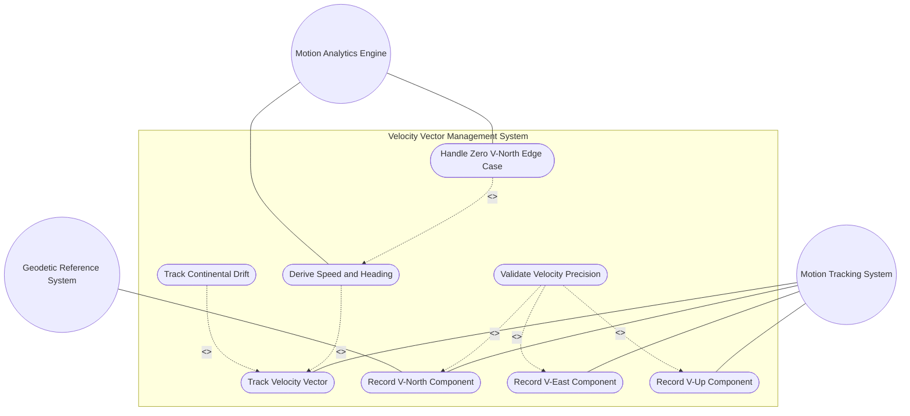
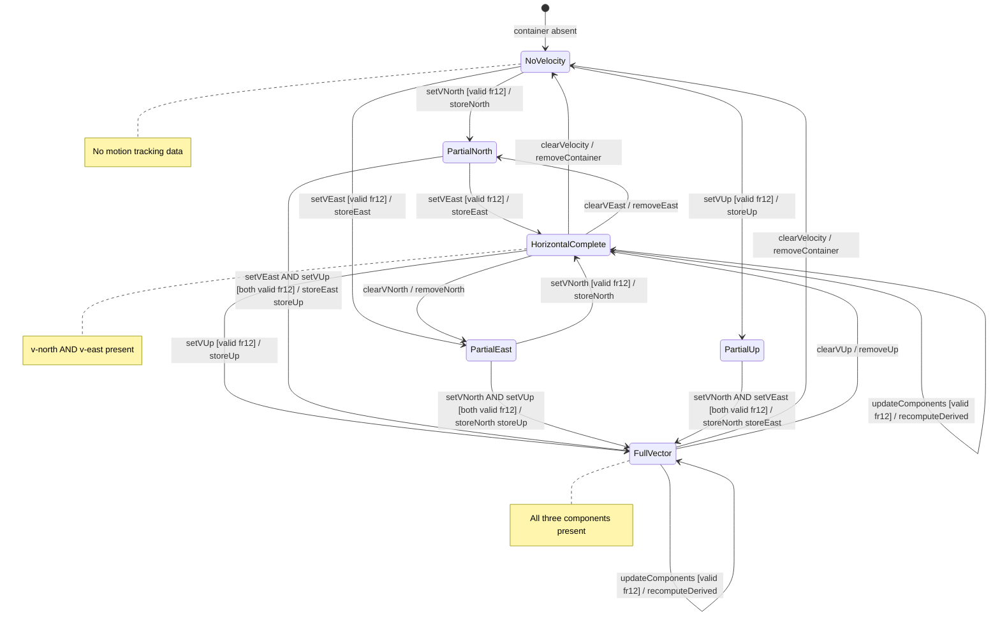

# Use Case: Track Object Motion Using a Three-Dimensional Velocity Vector

## Parent Epic
- [ ] #26 - [Geographic Location Module](https://github.com/gintatkinson/3dgs-030/blob/main/docs/epics/epic-03-geographic-location.md) (velocity container capturing object motion with v-north, v-east, v-up components at the geo-location timestamp)

## Compliance Table

| Requirement | Status | Evidence |
|---|---|---|
| System boundary subgraph | PASS | Use Case Diagram groups all use case nodes inside `Velocity Vector Management System` boundary |
| External actors identified | PASS | Primary: Motion Tracking System; Secondary: Motion Analytics Engine, Geodetic Reference System |
| Complete realization matrix | PASS | Links to Features #25, #21 and User Stories #30, #39, #40 |
| Constraint-to-flow parity | PASS | 10 Alternate/Exception flows covering all 10 validation constraints from Features #25 and #21 |
| Minimum 2 alternate flows | PASS | 10 > 2 flows present |
| Schema container declared | PASS | `ietf-geo-location:geo-location/velocity` container with `node_type: container` |
| Single container mandate | PASS | Exactly 1 schema container entry |

## 1. Actors
- **Primary Actor:** Motion Tracking System (GPS tracking device, telemetry receiver, or network element monitoring the movement of a locatable object at the time given by the geo-location timestamp)
- **Secondary Actors:**
  - Motion Analytics Engine (computes derived two-dimensional speed and heading from the velocity vector components using the RFC 9179 algorithmic formulas)
  - Geodetic Reference System (provides the true north reference and center-of-mass direction from the reference-frame/geodetic-system configuration)

## 2. Preconditions
- The parent `geo-location` container is instantiated with a valid `reference-frame` defining the geodetic system (true north reference, center of mass direction).
- The `velocity` sub-container is accessible as a child of `geo-location`.
- The `timestamp` leaf in the parent `geo-location` should be set to indicate when the velocity measurement was taken.

## 3. Trigger
A Motion Tracking System records the three-dimensional velocity of a locatable object (moving equipment, vehicle, satellite, or tracking continental drift), or a Motion Analytics Engine requests derivation of scalar speed and directional heading from stored velocity components.

## 4. Main Success Scenario (Basic Flow)
1. The Motion Tracking System opens the `velocity` container for a target geo-location that has a valid `timestamp`.
2. The tracking system sets `v-north` (decimal64, fraction-digits 12, meters per second) — the rate of change towards true north as defined by the geodetic system.
3. The tracking system sets `v-east` (decimal64, fraction-digits 12, meters per second) — the rate of change perpendicular to the right of true north.
4. The tracking system optionally sets `v-up` (decimal64, fraction-digits 12, meters per second) — the rate of change away from the center of mass.
5. The system validates all velocity components against their schema-defined decimal64 fraction-digits 12 precision limits.
6. The system stores the velocity vector. Any subset of the three components may be present; all are optional.
7. The Motion Analytics Engine computes derived values: two-dimensional speed = sqrt(v_north^2 + v_east^2), heading = arctan(v_east / v_north) in decimal degrees clockwise from true north.
8. For high-accuracy applications (e.g., continental drift at ~0.000000030 m/s), the decimal64 fraction-digits 12 precision accommodates the slow-movement tracking at the specified timestamp.

## 5. Alternate and Exception Flows

- **5a. V-North Precision Exceeded (Branches from Basic Flow step 5):**
  1. The system detects that `v-north` has more than 12 fractional decimal digits.
  2. The system rejects the value and returns a `decimal64 fraction-digits 12` type-violation error. The tracking system must truncate or round to 12 fractional digits. No partial velocity data is stored.

- **5b. V-East Precision Exceeded (Branches from Basic Flow step 5):**
  1. The system detects that `v-east` has more than 12 fractional decimal digits.
  2. The system rejects the value and returns a `decimal64 fraction-digits 12` type-violation error. The tracking system must truncate or round to 12 fractional digits.

- **5c. Heading Calculation with Zero V-North (Branches from Basic Flow step 7):**
  1. The Motion Analytics Engine executes the heading formula `arctan(v_east / v_north)` but detects that `v-north` equals zero.
  2. The system handles the division-by-zero edge case: if `v-east > 0` the heading is 90 degrees (due east); if `v-east < 0` the heading is 270 degrees (due west); if `v-east == 0` the heading is undefined and speed is zero. The tracking system is notified of the special-case heading resolution.

- **5d. Speed and Heading Requested with Partial Components (Branches from Basic Flow step 7):**
  1. The Motion Analytics Engine receives a request for derived speed and heading but finds that `v-north` or `v-east` (or both) is absent from the velocity container.
  2. The system returns not-applicable indicators for both derived values. The requestor is notified that complete horizontal velocity data (both v-north and v-east) is required for speed and heading derivation.

- **5e. Velocity Recorded with No Timestamp (Branches from Basic Flow step 1):**
  1. The system detects that the parent `geo-location` container has no `timestamp` set but velocity data is being written.
  2. Per RFC 9179, velocity data is meaningful only at the time given by the timestamp. The system accepts the velocity values (no cross-leaf schema constraint exists) but emits an advisory warning that velocity data lacks a temporal reference. The tracking system should set the timestamp to contextualize the velocity measurement.

- **5f. V-Up Precision Exceeded (Branches from Basic Flow step 5):**
  1. The system detects that `v-up` has more than 12 fractional decimal digits.
  2. The system rejects the value and returns a `decimal64 fraction-digits 12` type-violation error. The tracking system must truncate or round to 12 fractional digits. Previously validated v-north and v-east values are rolled back.

- **5g. Heading Calculation with Both Components Zero (Branches from Basic Flow step 7):**
  1. The Motion Analytics Engine detects that both `v-north` and `v-east` equal zero.
  2. The system computes speed = 0.0 m/s and marks heading as undefined (N/A). Unlike the zero-v-north-only case which has defined heading (90 or 270 degrees), the zero-zero case represents a stationary object with no meaningful direction. The analytics engine returns speed=0 and heading=N/A to the requestor.

- **5h. Continental Drift Precision Underflow (Branches from Basic Flow step 8):**
  1. A continental drift tracking application records v-north = 0.000000000030 m/s (3e-11), which requires at least 11 fractional digits for representation.
  2. The system stores the value — the decimal64 fraction-digits 12 type can accommodate 3e-11 m/s (approximately 1 cm/yr which is 0.000000000317 m/s). If an even slower rate exceeds the 12-digit precision floor, the system stores the value truncated to 12 fractional digits and notifies the tracker that sub-picometer/second precision cannot be represented.

- **5i. Timestamp Format Invalid During Velocity Write (Branches from Basic Flow step 1):**
  1. The tracking system attempts to record velocity data while the parent `geo-location` has a `timestamp` with an invalid ISO 8601 format (from a prior corrupted write or merge).
  2. The system validates the timestamp leaf independently — if the format is invalid, the timestamp is in error state. The velocity write is accepted (velocity leaves are independent of timestamp validity at the schema level) but the system flags both the timestamp error and the uncorrelated velocity data for operator attention.

- **5j. Speed and Heading Derived Without Geodetic System (Branches from Basic Flow step 7):**
  1. The Motion Analytics Engine computes speed and heading but the parent `reference-frame/geodetic-system` container has no `geodetic-datum` configured (absent, not defaulted — e.g., for a non-Earth body without explicit datum).
  2. The system computes the scalar speed value using the RFC 9179 formula regardless — the magnitude sqrt(v_north^2 + v_east^2) is mathematically independent of the geodetic system. However, heading in decimal degrees is valid only relative to a defined true-north reference. The system returns speed with the computed heading qualified as "relative to undefined true north" and advises the configurator to set a geodetic-datum.

## 6. Postconditions (Guarantees)
- **Success Guarantee:** The `velocity` container stores the specified subset of v-north, v-east, and v-up components with decimal64 fraction-digits 12 precision. When both horizontal components are present, the derived speed and heading are computable using RFC 9179 formulas with atan2 quadrant resolution. The velocity vector is associated with the geo-location timestamp for temporal correlation.
- **Failure Guarantee:** If any precision constraint is violated, no velocity data is persisted. The velocity container retains its previous state (or remains absent). The tracking system receives a typed validation error. For derivation failures (missing components, undefined heading), not-applicable indicators are returned without modifying stored data.

## UML Diagrams
### Use Case Diagram


### State Machine Diagram


## 7. Operational Context

From RFC 9179, Section 2.3 (Motion):

> Support is added for objects in relatively stable motion. For objects in relatively stable motion, the grouping provides a three-dimensional vector value. The components of the vector are 'v-north', 'v-east', and 'v-up', which are all given in fractional meters per second. The values 'v-north' and 'v-east' are relative to true north as defined by the reference frame for the astronomical body; 'v-up' is perpendicular to the plane defined by 'v-north' and 'v-east', and is pointed away from the center of mass.

> To derive the two-dimensional heading and speed, one would use the following formulas: speed = sqrt(v_north^2 + v_east^2), heading = arctan(v_east / v_north).

> For some applications that demand high accuracy and where the data is infrequently updated, this velocity vector can track very slow movement such as continental drift.

> Tracking more complex forms of motion is outside the scope of this work. The intent of the grouping being defined here is to identify where something is located, and generally this is expected to be somewhere on, or relative to, Earth (or another astronomical body). At least two options are available to YANG data models that wish to use this grouping with objects that are changing location frequently in non-simple ways. A data model can either add additional motion data to its model directly, or if the application allows, it can require more frequent queries to keep the location data current.

## 8. Realization Matrix
### Required Features
- [ ] #25 - [Velocity Vector](https://github.com/gintatkinson/3dgs-030/blob/main/docs/features/feat-10-velocity-vector.md) (defines v-north fr12 m/s, v-east fr12 m/s, v-up fr12 m/s, and the algorithmic speed/heading derivation formulas per RFC 9179 Section 2.3)
- [ ] #21 - [Geo-Location Container](https://github.com/gintatkinson/3dgs-030/blob/main/docs/features/feat-06-geo-location-container.md) (root container hosting the velocity sub-container; timestamp provides temporal reference for the velocity measurement)

### Required User Stories
- [ ] #30 - [Track Objects in Motion Using a Three-Dimensional Velocity Vector](https://github.com/gintatkinson/3dgs-030/blob/main/docs/user-stories/us-12-track-velocity-vector.md) (primary user story for recording v-north, v-east, v-up with decimal64 fraction-digits 12 and computing derived speed/heading)
- [ ] #39 - [Derive Speed and Heading from Velocity Vector Components](https://github.com/gintatkinson/3dgs-030/blob/main/docs/user-stories/us-21-derive-speed-heading.md) (algorithmic extraction of scalar speed and directional heading from v-north and v-east; atan2 quadrant resolution; zero-v-north edge case handling)
- [ ] #40 - [Enforce Coordinate Precision Constraints per Schema Type Definitions](https://github.com/gintatkinson/3dgs-030/blob/main/docs/user-stories/us-22-enforce-coordinate-precision.md) (v-north fr12, v-east fr12, v-up fr12 precision enforcement; continental drift precision requirements at ~0.000000030 m/s)

## Source References
Structural Schema: [ietf-geo-location@2022-02-11.yang](https://github.com/YangModels/yang/blob/main/standard/ietf/RFC/ietf-geo-location%402022-02-11.yang) (Clause: container velocity, leaf v-north, leaf v-east, leaf v-up)
Normative Specification: [RFC 9179: A YANG Grouping for Geographic Locations](https://datatracker.ietf.org/doc/rfc9179/) (Clause: Section 2.3)

> [!WARNING]
> **Mermaid Block Closing Constraints & Code Fence Integrity:**
> - Every Mermaid diagram MUST be strictly closed with ``` on a new line. Leaking Mermaid blocks or stray/unclosed code fences will fail downstream validation checks.
> - **Semicolon Restriction**: Do NOT use semicolons (`;`) in sequence diagram `Note` statements or message text statements. Semicolons are not allowed.

> **Container Traceability:** This Use Case declares exactly one schema container `ietf-geo-location:geo-location/velocity` with `node_type: container`. Multi-container Use Cases are forbidden.
