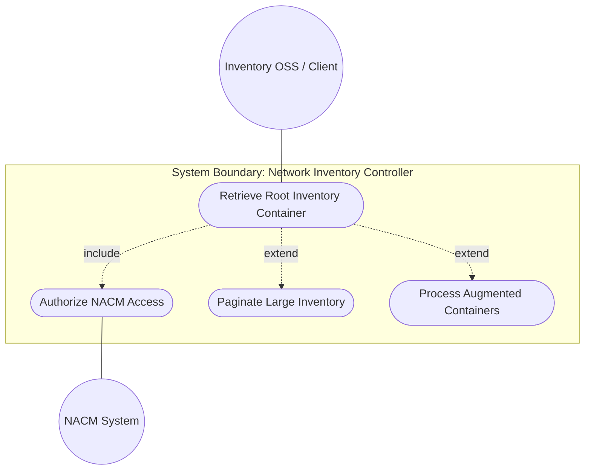
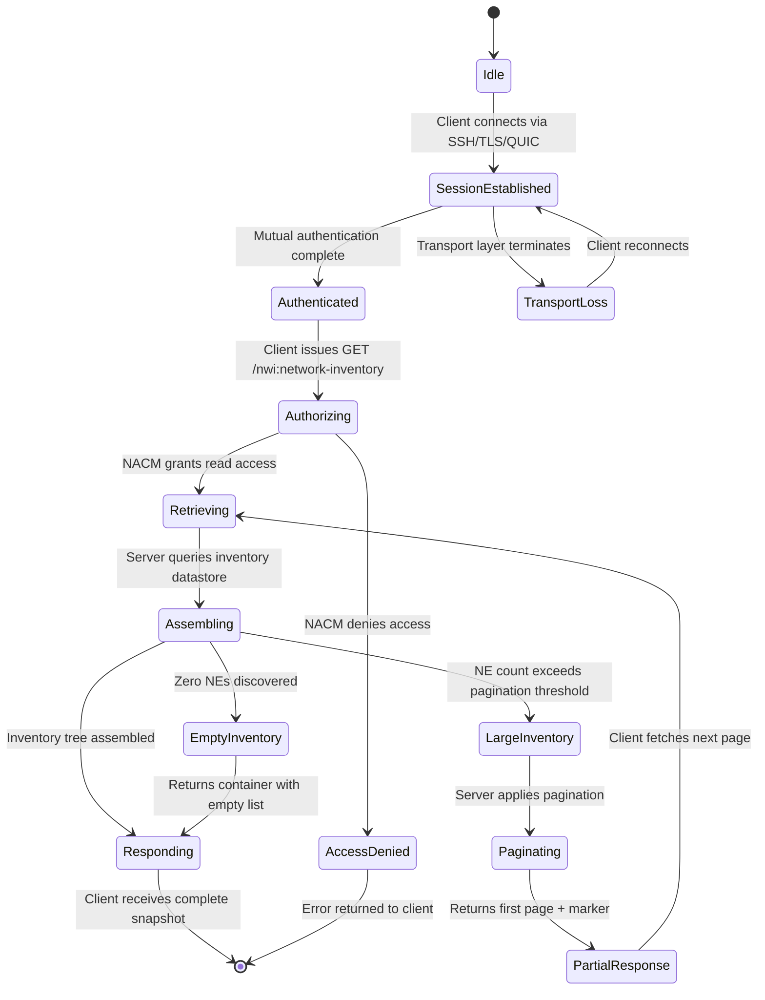

# Use Case: Retrieve Network Inventory Root Container

## Parent Epic
- [ ] #49 - [Network Inventory: Network Elements Management](https://github.com/gintatkinson/3dgs-030/blob/main/docs/epics/epic-04-network-elements-management.md) — The top-level `network-inventory` container is the root node of the NE Management bounded context, serving as entry point for all inventory data retrieval.

## 1. Actors
- **Primary Actor:** Inventory Operations Support System (OSS) / Network Controller Client — a northbound application or hierarchical controller that needs to discover network-wide inventory data.
- **Secondary Actors:** Domain Controller (provides raw inventory data via device models), NACM Access Control System (authorizes read access), NETCONF/RESTCONF Transport Layer (secure channel).

## 2. Preconditions
- The network controller has been bootstrapped and has discovered at least the list of network elements under its domain (or confirmed zero elements).
- The `ietf-network-inventory` YANG module is loaded and operational on the server.
- The client has established a secure transport session (SSH/TLS/QUIC) with mutual authentication.
- The client's NACM rules grant read access to the `/nwi:network-inventory` subtree.

## 3. Trigger
A northbound application, hierarchical controller, or Inventory OSS issues a `<get>` or `<get-data>` NETCONF/RESTCONF request targeting the `/nwi:network-inventory` operational datastore.

## 4. Main Success Scenario (Basic Flow)
1. The Client sends a read request (e.g., NETCONF `<get>`, RESTCONF `GET`) targeting `/nwi:network-inventory`.
2. The Server validates the client's NACM authorization for the `network-inventory` subtree.
3. The Server assembles the operational state from the controller's inventory datastore, including the child `network-elements` container.
4. The Server returns the `network-inventory` container with its `network-elements` child (which may contain zero or more `network-element` entries).
5. The Client receives and parses the inventory tree, rendering it in its UI or forwarding it to downstream systems.
6. The Client confirms successful retrieval; the session remains open for subsequent queries.

## 5. Alternate and Exception Flows
- **5a. Write attempt on read-only operational state (Branches from Basic Flow step 1):**
  1. The Client sends a write operation (e.g., `<edit-config>`, `PUT`, `POST`) targeting any path under `/nwi:network-inventory`.
  2. The Server rejects the operation with an `access-denied` or `operation-not-supported` error because the container is `config false`.
  3. The Server responds with an RFC 8040 / RFC 6241 error message indicating the datastore is operational and does not support writes.
  4. The Client's state remains unchanged; no data is mutated.

- **5b. Root container access denied by NACM (Branches from Basic Flow step 2):**
  1. The Server evaluates NACM rules and determines the client's user/group lacks read permission for `/nwi:network-inventory`.
  2. The Server returns an `access-denied` error.
  3. The Client does not receive any inventory data.
  4. The Client may retry with different credentials or escalate to an administrator for NACM rule adjustment.

- **5c. Empty inventory with no discovered network elements (Branches from Basic Flow step 4):**
  1. The Server's inventory datastore contains no network elements (controller has not discovered any).
  2. The Server still returns the `network-inventory` container with an empty `network-elements`/`network-element` list.
  3. The Client receives a structurally complete but empty inventory tree.
  4. The Client renders an empty-state indicator (e.g., "No network elements discovered").

- **5d. Large-scale inventory retrieval triggers resource exhaustion (Branches from Basic Flow step 3):**
  1. During assembly of the operational state, the Server detects that the volume of network elements exceeds pagination thresholds.
  2. The Server applies pagination (if supported by the transport protocol) or returns partial results with a continuation marker.
  3. The Server includes a `Warning` header (RESTCONF) or an `rpc-error` (NETCONF) indicating partial results.
  4. The Client issues subsequent paginated requests to retrieve remaining inventory pages.

- **5e. Transport layer disruption during retrieval (Branches from Basic Flow step 4):**
  1. During transmission of the large inventory response, the secure transport session (SSH/TLS/QUIC) is terminated.
  2. The Client detects the connection loss and aborts the in-progress retrieval.
  3. The Client re-establishes a new authenticated session.
  4. The Client reissues the read request from step 1; the Server returns a fresh snapshot.

- **5f. Schema augmentation extension point integrity (Branches from Basic Flow step 4):**
  1. During assembly, the Server detects that a companion augmentation module has defined additional containers at the `network-inventory` level (e.g., `nwi-location:locations`).
  2. The Server includes augmented data alongside `network-elements` in the response.
  3. A Client that only understands the base module must gracefully ignore unknown augmented nodes.
  4. If the augmentation module is not loaded on the Server, only base inventory data is returned.

## 6. Postconditions (Guarantees)
- **Success Guarantee:** The Client possesses a complete, read-only snapshot of the top-level inventory container with the `network-elements` child container. The response structure conforms to the `ietf-network-inventory` YANG schema. No inventory data was mutated by the retrieval operation.
- **Failure Guarantee:** If any step fails (authorization, transport, timeout, write attempt), no inventory data is returned to the Client. The Server's inventory datastore remains in its original state. The Client receives a protocol-specific error message and may retry after resolving the failure condition.

## UML Diagrams

### Use Case Diagram

### State Machine Diagram

## 7. Operational Context
From draft-ietf-ivy-network-inventory-yang, Section 3:

> The base network inventory model, defined in this document, provides a list of network elements and of network element components. The network-inventory top level container has been defined to support reporting other types of network inventory objects, besides the network elements and network element components. These additional types of network inventory objects can be defined, together with the associated YANG data model and the rationale for managing them as part of the network inventory, in other documents providing application- and technology-specific companion augmentation data models.

From Section 6:

> The network inventory YANG data model defined in the document is intended to report the actual inventory data that a network controller knows of the network elements and components actually installed within the network. Therefore, this data model provides a read-only perspective of the network inventory information. This information can be provided by a network controller to a higher level hierarchical network controller, to an Inventory OSS or to any other type of application which needs to discover the network inventory information.

From Section 7:

> The "ietf-network-inventory" YANG module defines a data model that is designed to be accessed via YANG-based management protocols, such as NETCONF and RESTCONF. These YANG-based management protocols have to use a secure transport layer and have to use mutual authentication. The Network Configuration Access Control Model (NACM) provides the means to restrict access for particular NETCONF or RESTCONF users to a preconfigured subset of all available NETCONF or RESTCONF protocol operations and content.

## 8. Realization Matrix
### Required User Stories
- [ ] #51 - [Retrieve Network Element List from Inventory Controller](https://github.com/gintatkinson/3dgs-030/blob/main/docs/user-stories/us-23-retrieve-network-element-list.md) (root `network-inventory` container is the entry point through which the NE list is accessed; every NE retrieval begins at this container level)
- [ ] #60 - [Access Read-Only Operational Inventory with Pagination Support](https://github.com/gintatkinson/3dgs-030/blob/main/docs/user-stories/us-32-read-only-paginated-inventory.md) (root container enforces `config false` read-only access and triggers pagination for large-scale queries at the top level)
- [ ] #63 - [Compute Inventory Summaries and Entity Counts Across the Network](https://github.com/gintatkinson/3dgs-030/blob/main/docs/user-stories/us-35-compute-inventory-summaries.md) (network-wide summary computation aggregates data from the root container, making it the logical starting point for cross-inventory statistics)

### Required Features
- [ ] #46 - [Network Inventory Container](https://github.com/gintatkinson/3dgs-030/blob/main/docs/features/feat-11-network-inventory-container.md) (directly realizes the `network-inventory` container feature: read-only enforcement, empty-state behavior, and extension-point semantics)

## Source References
Structural Schema: [ietf-network-inventory@2026-05-27.yang](https://github.com/gintatkinson/3dgs-030/blob/main/schema/ietf-network-inventory%402026-05-27.yang) (Clause: container network-inventory, config false)
Normative Specification: [draft-ietf-ivy-network-inventory-yang-18](https://datatracker.ietf.org/doc/html/draft-ietf-ivy-network-inventory-yang) (Clause: Sections 3, 6, 7)
