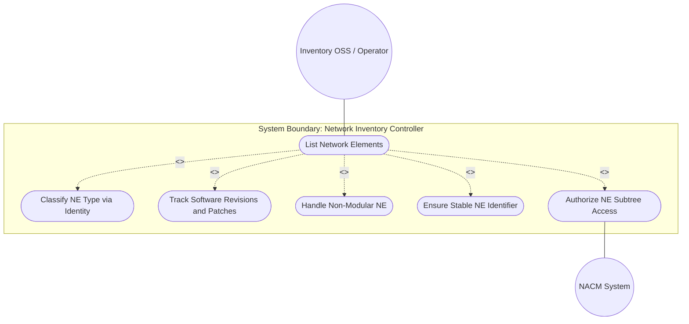
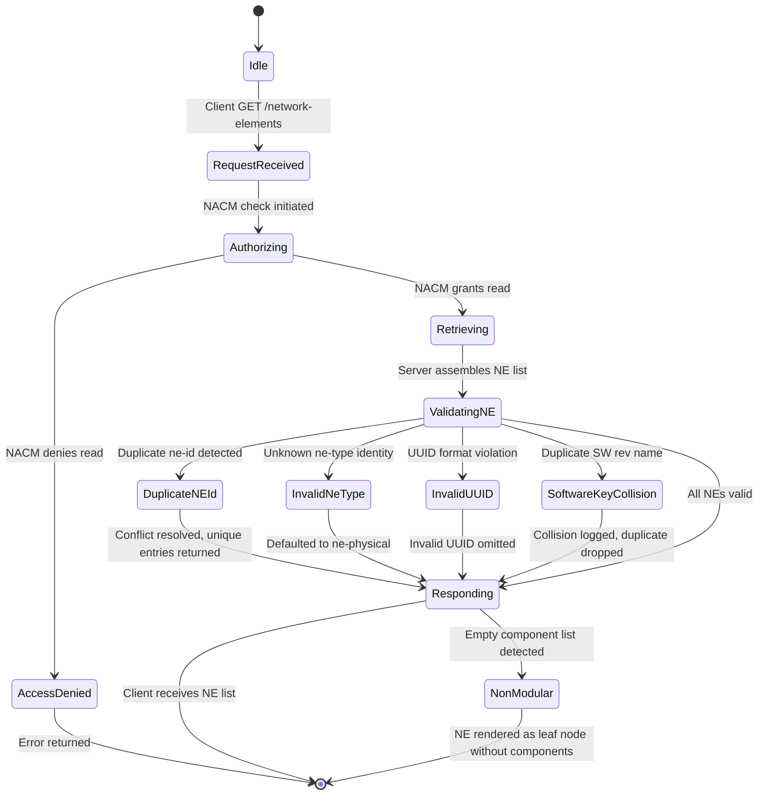

# Use Case: Manage Network Elements List

## Parent Epic
- [ ] #49 - [Network Inventory: Network Elements Management](https://github.com/gintatkinson/3dgs-030/blob/main/docs/epics/epic-04-network-elements-management.md) — The `network-elements` container and its `network-element` list form the core of the NE Management bounded context, providing NE discovery, identification, type classification, software revision tracking, and manufacturer metadata.

## 1. Actors
- **Primary Actor:** Inventory OSS / Network Operations Center Operator — needs to discover, list, and inspect network elements under controller management.
- **Secondary Actors:** Domain Controller (performs NE discovery and assigns persistent ne-id), Software Image Repository (provides software module name/revision data), NACM Access Control System (authorizes read access), NETCONF/RESTCONF Transport Layer.

## 2. Preconditions
- The `network-inventory` root container is operational (`config false`) and loaded.
- The domain controller has completed a discovery cycle and assigned a persistent `ne-id` to each discovered network element.
- Each NE's manufacturer metadata (`mfg-name`, `product-name`) has been collected during discovery and is available in the controller's inventory datastore.
- For NEs with software module data, the `software-rev` list has been populated from the device or configuration source.
- The client has a secure, mutually authenticated transport session with valid NACM read authorization for `/nwi:network-inventory/network-elements`.

## 3. Trigger
A northbound client (OSS, hierarchical controller) sends a read request (NETCONF `<get>`, RESTCONF `GET`) targeting subtree `/nwi:network-inventory/network-elements` to retrieve the list of managed network elements, their identities, types, software revisions, and manufacturer attributes.

## 4. Main Success Scenario (Basic Flow)
1. The Client issues a read request targeting `/nwi:network-inventory/network-elements`.
2. The Server verifies NACM read authorization for the `network-elements` subtree.
3. The Server retrieves the `network-element` list from its inventory datastore, including for each NE: `ne-id` (key), `ne-type` (defaulting to `nwi:ne-physical` if unset), `uuid`, `name`, `alias`, `description`, `software-rev` list with patches, `mfg-name`, `product-name`, and `product-rev`.
4. The Server returns the complete `network-elements` container with all matching `network-element` entries.
5. The Client parses the list, renders NE rows in a table view and detail panes, and allows operator drill-down into individual NE components.
6. The Client acknowledges successful retrieval.

## 5. Alternate and Exception Flows
- **5a. Network element identified by duplicate ne-id (Branches from Basic Flow step 3):**
  1. During inventory assembly, the Server detects two NEs with the same `ne-id` value (violation of key uniqueness constraint).
  2. The Server applies implementation-specific conflict resolution: retain the first discovered entry and log a warning, or mark the duplicate for operator review.
  3. The Server returns the inventory list with only unique `ne-id` entries; a warning is included in the response or server log.
  4. The operator is notified to investigate and manually reassign one NE's identifier.

- **5b. Invalid or unrecognized ne-type identity (Branches from Basic Flow step 4):**
  1. An NE reports an `ne-type` value that does not derive from the `nwi:ne-type` identity base.
  2. The Server validates the type against the identityref constraint and rejects or flags the invalid type.
  3. The Server falls back to the default `nwi:ne-physical` for that NE.
  4. The response includes a validation warning; the operator may investigate the source of the unknown identity.

- **5c. UUID field does not conform to RFC 9562 format (Branches from Basic Flow step 3):**
  1. During retrieval, the Server encounters an NE whose `uuid` field is populated but does not match the `yang:uuid` pattern.
  2. The Server omits the invalid `uuid` from the response (or substitutes a server-assigned valid UUID).
  3. An informational annotation is attached indicating the field was suppressed due to format violation.
  4. The operator may trigger re-collection of UUID data from the device.

- **5d. Write attempt on read-only network-elements subtree (Branches from Basic Flow step 1):**
  1. The Client sends a write operation (e.g., `<edit-config>`, `PUT`) targeting a path under `network-elements`.
  2. The Server rejects the operation with `operation-not-supported` or `access-denied` because the parent container is `config false`.
  3. The Server returns an error response; no NE data is created, modified, or deleted.
  4. The Client transitions to an error state and notifies the user that inventory is read-only.

- **5e. NE reconnection triggers identifier stability verification (Branches from Basic Flow step 3):**
  1. A previously disconnected NE reconnects to the controller. The controller's discovery mechanism uses implementation-specific heuristics (mfg-name, product-name, management IP, physical location) to re-identify the NE.
  2. The Server verifies that the NE should retain its original `ne-id` rather than being assigned a new identifier.
  3. If the heuristics match, the NE's existing entry is updated with latest operational data rather than creating a duplicate.
  4. If heuristics are ambiguous, the NE may be registered as new pending operator confirmation; a notification is generated.

- **5f. Software revision list key collision (Branches from Basic Flow step 3):**
  1. Two software modules on the same NE report the same `software-rev/name` (the key leaf).
  2. The Server detects the duplicate key and retains only one instance per key.
  3. An informational log entry records the collision; the redundant entry is dropped.
  4. The response contains one `software-rev` entry per unique name.

- **5g. NE reference (ne-ref typedef) resolves to non-existent NE (Branches from Basic Flow step 4):**
  1. A lower-level model uses the `nwi:ne-ref` typedef to reference an `ne-id` that does not currently exist in the inventory.
  2. Because `require-instance false`, the leafref is syntactically valid; no structural error is raised.
  3. The reference is retained as a dangling pointer that may resolve when the target NE is discovered later.
  4. The client application should handle dangling references gracefully (e.g., with a placeholder indicator).

- **5h. Non-modular NE with no component breakdown (Branches from Basic Flow step 5):**
  1. The Client retrieves a network element that has an empty `components/component` list (non-modular NE, per Appendix F).
  2. The Server returns the NE with its identification and software-rev data intact but no component children.
  3. The Client must render the NE as a leaf node in the resource tree, displaying "(0 components)" or an empty-state placeholder.
  4. The operator may still inspect NE-level attributes without requiring component decomposition.

- **5i. NE access denied by NACM at network-elements subtree (Branches from Basic Flow step 2):**
  1. The Server evaluates NACM rules and determines the client lacks read permission for the `network-elements` subtree.
  2. The Server returns an `access-denied` error.
  3. The Client receives no NE data.
  4. The operator escalates to the security administrator for NACM rule review.

- **5j. Large NE list triggers pagination with continuation markers (Branches from Basic Flow step 4):**
  1. During response assembly, the Server detects that the number of network elements exceeds the configured page size limit.
  2. The Server returns a partial `network-element` list with a continuation marker or RFC 8040 `Content-Range` header.
  3. The Client renders the first page and provides pagination navigation controls.
  4. The Client issues subsequent paginated requests using the continuation marker to retrieve remaining pages.

- **5k. Transport layer disruption during NE list retrieval (Branches from Basic Flow step 4):**
  1. During transmission of the NE list response, the secure transport session (SSH/TLS/QUIC) is terminated.
  2. The Client detects the connection loss and discards any partially received NE data.
  3. The Client re-establishes a new authenticated session.
  4. The Client reissues the read request from step 1; the Server returns the current inventory snapshot.

- **5l. NE discovery incomplete with partial manufacturer metadata (Branches from Basic Flow step 3):**
  1. The Server retrieves an NE from its inventory datastore whose discovery process could not collect complete manufacturer metadata (e.g., missing `mfg-name` or `product-name`).
  2. The Server omits the unavailable optional fields per schema rules; no default or placeholder values are substituted.
  3. The NE is returned with `ne-id` and any successfully collected attributes; missing fields are simply absent from the response.
  4. The Client renders the partially populated NE with visual indicators for missing fields; the operator may trigger re-discovery.

## 6. Postconditions (Guarantees)
- **Success Guarantee:** The Client receives a complete, read-only list of all discovered network elements, each with a unique and stable `ne-id`, a valid `ne-type` identity (defaulting to `nwi:ne-physical`), correct manufacturer metadata, and all applicable software revision entries with patches. The response conforms to the `ietf-network-inventory` schema.
- **Failure Guarantee:** If authorization, transport, or identity validation fails, no partial list is returned. The Server's inventory datastore remains unmodified. The Client receives an appropriate protocol error and may not proceed until the failure condition is resolved.

## UML Diagrams

### Use Case Diagram

### State Machine Diagram

## 7. Operational Context
From draft-ietf-ivy-network-inventory-yang, Section 3.2:

> In addition to the common attributes defined for network elements and components in Section 3.1, the following attributes are defined for the network elements: ne-id — the identifier that uniquely identifies the network element (NE) within the network, assigned by the server since the network elements cannot guarantee that their local identifier is unique within the network. The ne-id should be assigned such that the same network element will always be identified through the same identifier, even if the network elements get disconnected from the network controller. Mechanisms to ensure this (e.g., checking the mfg-name, product-name, management IP address, physical location) are implementation specific and outside the scope of standardization.

From Section 3.1.1:

> mfg-name: The name of the manufacturer of the entity (component or network element). product-name: The vendor-specific and human-interpretable string describing the entity (component or network element) type. It is expected that vendors assign unique product names to different entities within the scope of the vendor.

From Section 3.3.2:

> Each instance of a network element or a component includes its own "software-rev" list which provides basic software attributes for each entity. The scope of the list is to provide information about the software images intended to be running within the related entity. The model supports scenarios where multiple software modules can be images intended to be running within the entity.

From Appendix F (Non-Modular NEs):

> The example demonstrates a network element without explicit component breakdown, where the NE itself carries identification, software revision, and manufacturer attributes without nested component entries.

## 8. Realization Matrix
### Required User Stories
- [ ] #51 - [Retrieve Network Element List from Inventory Controller](https://github.com/gintatkinson/3dgs-030/blob/main/docs/user-stories/us-23-retrieve-network-element-list.md) (primary user story for listing and accessing all discovered network elements; the `network-elements` container is the direct realization target)
- [ ] #53 - [Report Software Component Revisions and Patches for Inventory Entities](https://github.com/gintatkinson/3dgs-030/blob/main/docs/user-stories/us-25-report-software-revisions-patches.md) (each NE carries a `software-rev` list; the `ne-component-common-entity-attributes` grouping provides this structure at the NE level)
- [ ] #55 - [Inventory Non-Modular Network Elements Without Component Breakdown](https://github.com/gintatkinson/3dgs-030/blob/main/docs/user-stories/us-27-inventory-non-modular-nes.md) (non-modular NEs appear in the NE list with empty `components`; the NE list must handle this case gracefully)
- [ ] #58 - [Classify Network Element Types via Extensible Identity System](https://github.com/gintatkinson/3dgs-030/blob/main/docs/user-stories/us-30-classify-ne-types-identity.md) (the `ne-type` identityref leaf with base `nwi:ne-type` and derived `ne-physical` is directly mapped to NE list entries)
- [ ] #62 - [Record Manufacturing and Revision Data for Inventory Entities](https://github.com/gintatkinson/3dgs-030/blob/main/docs/user-stories/us-34-record-manufacturing-revision-data.md) (NE-level manufacturer fields `mfg-name`, `product-name`, `product-rev` are part of the `ne-component-common-entity-attributes` grouping used by each NE entry)

### Required Features
- [ ] #47 - [Network Elements Management](https://github.com/gintatkinson/3dgs-030/blob/main/docs/features/feat-12-network-elements-management.md) (directly realizes the `network-elements` container feature: NE list structure, identity system, software revision tracking, reference infrastructure, and manufacturer attributes)

## Source References
Structural Schema: [ietf-network-inventory@2026-05-27.yang](https://github.com/gintatkinson/3dgs-030/blob/main/schema/ietf-network-inventory%402026-05-27.yang) (Clause: container network-elements, list network-element, identities ne-type/ne-physical, typedef ne-ref, groupings component-ref/port-ref/basic-common-entity-attributes/ne-component-common-entity-attributes)
Normative Specification: [draft-ietf-ivy-network-inventory-yang-18](https://datatracker.ietf.org/doc/html/draft-ietf-ivy-network-inventory-yang) (Clause: Sections 3, 3.1, 3.1.1, 3.2, 3.3.2, Appendix F)
