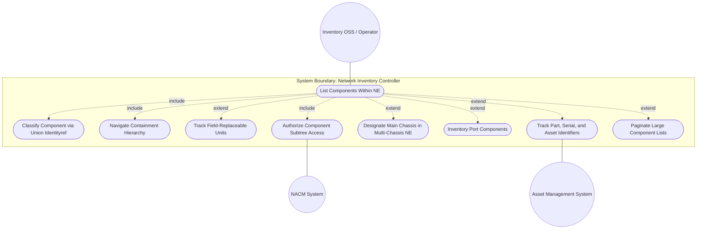
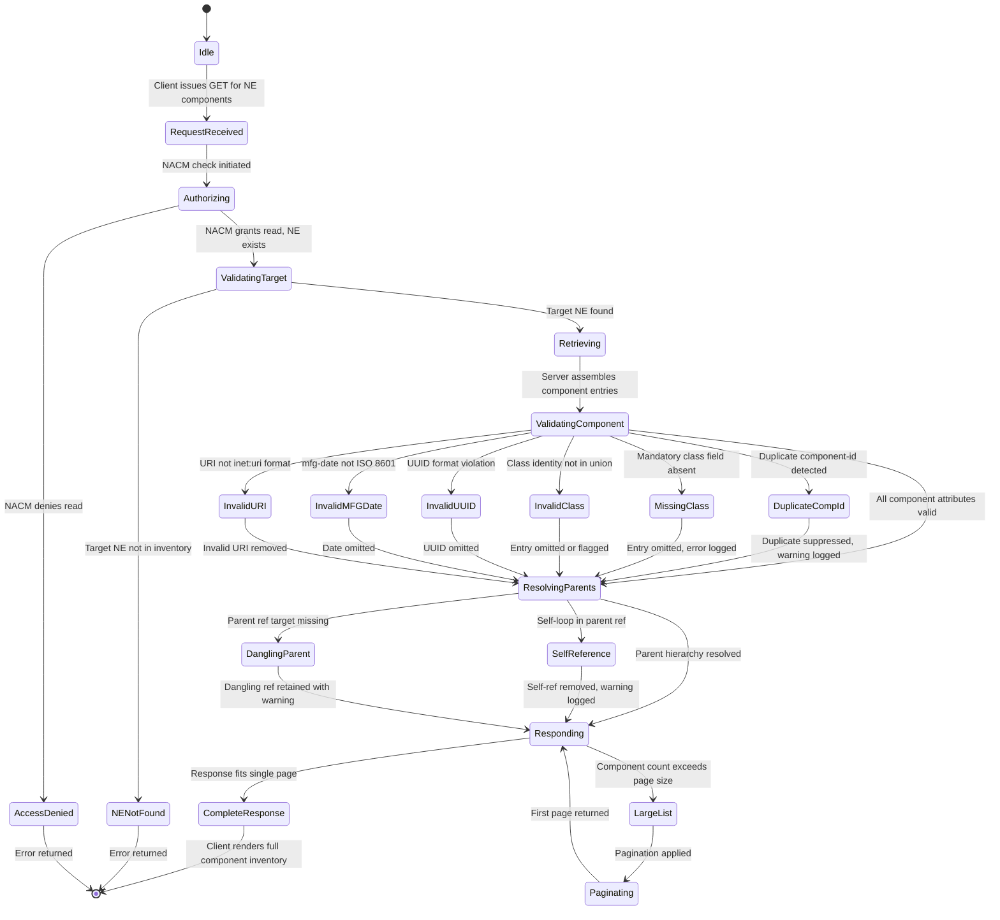

# Use Case: Manage Component Inventory Within Network Elements

## Parent Epic
- [ ] #50 - [Network Inventory: Component Inventory](https://github.com/gintatkinson/3dgs-030/blob/main/docs/epics/epic-05-component-inventory.md) — The `components` container within each `network-element` hosts the `component` list keyed by `component-id`. Components represent generalized inventory objects — chassis, slots, boards, ports, CPUs, fans, power supplies, sensors, storage devices, and non-hardware software components — with hierarchical containment, class-based typing, manufacturing metadata, FRU tracking, and conditional topology attributes.

## 1. Actors
- **Primary Actor:** Inventory OSS / Network Operations Engineer — needs to inspect, navigate, and track hardware and non-hardware components across the network element fleet.
- **Secondary Actors:** Domain Controller (discovers component data from devices via device models), IANA Hardware Registry (provides `ianahw:hardware-class` identities), Asset Management System (consumes part-number, serial-number, asset-id), Field Maintenance Crew (uses FRU indicators for replacement planning), NACM Access Control System, NETCONF/RESTCONF Transport Layer.

## 2. Preconditions
- A target `network-element` exists in the controller's inventory with its `ne-id` assigned and stable.
- The `components` container is instantiated under that NE (present even if the component list is empty).
- The domain controller has performed hardware/software discovery for the target NE and populated component data including `component-id`, `class`, and any available optional attributes (`parent`, `mfg-name`, `part-number`, `serial-number`, `mfg-date`, `is-fru`, etc.).
- The `iana-hardware` YANG module is loaded providing the `ianahw:hardware-class` identity definitions for chassis, port, container, CPU, fan, power-supply, sensor, module, storage-device, backplane, battery, and stack.
- The client has secure, mutually authenticated transport with NACM read authorization for the target component subtree.

## 3. Trigger
An Inventory OSS or operator selects a specific network element and issues a read request (NETCONF `<get>`, RESTCONF `GET`) targeting subtree `/nwi:network-inventory/network-elements/network-element[ne-id='<id>']/components` to retrieve all components within that NE, their attributes, containment hierarchy, and lifecycle metadata.

## 4. Main Success Scenario (Basic Flow)
1. The Client selects a target NE by `ne-id` and sends a read request for its `components` container.
2. The Server verifies NACM read authorization for the components subtree.
3. The Server retrieves the `component` list for that NE from its inventory datastore.
4. For each component, the Server assembles: `component-id` (key), `class` (mandatory union identityref), and all available optional attributes — `uuid`, `name`, `alias`, `description`, `software-rev` with patches, manufacturer metadata (`mfg-name`, `product-name`, `hardware-rev`, `mfg-date`), tracking fields (`part-number`, `serial-number`, `asset-id`), lifecycle indicators (`is-fru`, `uri`), and topology fields (`parent` references, `parent-rel-pos`, `is-main`).
5. The Server resolves component parent references within the same NE, establishing a containment hierarchy.
6. The Server returns the complete `components` container with all component entries and their inter-relationships.
7. The Client renders the component list in a table view, displays full details in a property grid, and renders the containment tree in a resource hierarchy, respecting conditional field visibility (`parent-rel-pos` when 0 or 1 parent, `is-main` when class derives from chassis).
8. The operator may select individual components to inspect attribute details, track FRU status, verify asset/serial tracking, or review software revisions.

## 5. Alternate and Exception Flows
- **5a. Duplicate component-id within the same NE (Branches from Basic Flow step 4):**
  1. The Server detects two components within the same NE sharing the same `component-id` (key uniqueness violation).
  2. The Server retains the first discovered entry and logs a warning for the duplicate.
  3. An informational annotation is included in the response indicating the duplicate was suppressed.
  4. The operator is notified to investigate and assign a unique `component-id` to one of the conflicting components.

- **5b. Component missing mandatory class field (Branches from Basic Flow step 4):**
  1. A component entry is encountered without a `class` value — the only mandatory leaf in the component schema.
  2. The Server cannot instantiate a valid component entry; the entry is omitted from the response.
  3. An error or warning is logged indicating the component was suppressed due to missing mandatory class.
  4. The operator is notified that discovery data is incomplete and must trigger re-collection from the device.

- **5c. Invalid component class identity (Branches from Basic Flow step 4):**
  1. A component reports a `class` value that does not derive from either `ianahw:hardware-class` or `nwi:non-hardware-component-class`.
  2. The Server validates the union identityref constraint and rejects the unknown class.
  3. The component entry is either omitted or flagged with a validation error in the response.
  4. The operator must verify the device's reported component class against the IANA hardware registry and extension modules.

- **5d. UUID field format violation on component (Branches from Basic Flow step 4):**
  1. A component's `uuid` field is populated but does not conform to the `yang:uuid` pattern (RFC 9562).
  2. The Server omits the invalid `uuid` from the component's response data.
  3. An informational annotation marks the field as suppressed due to format violation.
  4. The operator may trigger re-collection of UUID data from the device firmware.

- **5e. Self-referencing parent creates cycle in containment hierarchy (Branches from Basic Flow step 5):**
  1. During parent resolution, the Server detects a component whose `parent` leaf-list references its own `component-id`, creating a self-loop.
  2. The Server rejects the self-reference, removing the offending parent entry from the component's parent list.
  3. A cycle-detection warning is logged; the invalid parent reference is dropped.
  4. The component is rendered without the circular parent reference; the operator is notified.

- **5f. Dangling parent reference to non-existent sibling component (Branches from Basic Flow step 5):**
  1. A component's `parent` leaf-list references a `component-id` that does not exist in the same NE's component list.
  2. Because `require-instance false` on the `parent` leafref, the reference is syntactically valid as a dangling pointer.
  3. The reference is retained in the data; the client renders the parent link with a warning indicator.
  4. The operator may investigate whether the referenced component was removed or not yet discovered.

- **5g. Parent relative position set when component has multiple parents (Branches from Basic Flow step 7):**
  1. The Client attempts to display `parent-rel-pos` for a component whose `parent` leaf-list contains 2 or more entries.
  2. The XPath `when` condition `count(../parent) < 2` evaluates to false.
  3. The `parent-rel-pos` field is not instantiated in the data and the PropertyGrid hides the field.
  4. No error is raised; the field simply does not appear for this component.

- **5h. is-main flag set on non-chassis component class (Branches from Basic Flow step 7):**
  1. The Client attempts to display `is-main` for a component whose `class` does not derive from `ianahw:chassis` (e.g., a port or CPU).
  2. The XPath `when` condition `derived-from-or-self(class, 'ianahw:chassis')` evaluates to false.
  3. The `is-main` field is not instantiated and the PropertyGrid hides the field.
  4. No error is raised; the conditional constraint is silently enforced by the server.

- **5i. Manufacturing date does not conform to ISO 8601 / yang:date-and-time (Branches from Basic Flow step 4):**
  1. A component's `mfg-date` value is not a valid `yang:date-and-time` string (e.g., missing timezone, wrong format).
  2. The Server validates the type constraint and omits or rejects the invalid `mfg-date`.
  3. The field is either excluded from the response or returned with a validation flag.
  4. The operator notes the missing manufacturing date and may source it from alternate asset records.

- **5j. Component URI fails inet:uri format validation (Branches from Basic Flow step 4):**
  1. An entry in a component's `uri` leaf-list does not conform to the `inet:uri` format (RFC 3986 URI syntax).
  2. The Server removes the invalid URI entry from the leaf-list.
  3. Only valid URIs are returned; a log entry records the suppression.
  4. The operator may correct the URI in the source system and trigger re-collection.

- **5k. Duplicate (part-number, serial-number) pair within same manufacturer scope (Branches from Basic Flow step 7):**
  1. Two components from the same `mfg-name` share identical `part-number` and `serial-number` values.
  2. The Server detects the duplication, which violates the expected uniqueness constraint within part-number scope.
  3. Both entries are returned but flagged with a data-quality warning.
  4. The operator is notified to verify serial number data for potential device misconfiguration or cloning.

- **5l. Write attempt on read-only components subtree (Branches from Basic Flow step 1):**
  1. The Client sends a write operation (e.g., `<edit-config>`, `PUT`, `POST`) targeting a path under the `components` container.
  2. The Server rejects the operation with `operation-not-supported` or `access-denied` because all ancestor containers are `config false`.
  3. An error response is returned; no component data is created, modified, or deleted.
  4. The Client's UI transitions to an error notification state.

- **5m. Component access denied by NACM at components subtree (Branches from Basic Flow step 2):**
  1. The Server evaluates NACM rules and determines the client lacks read permission for the target components subtree.
  2. The Server returns an `access-denied` error.
  3. The Client receives no component data.
  4. The operator escalates to the security administrator for NACM rule adjustment.

- **5n. FRU indicator inconsistency with device-reported replaceability (Branches from Basic Flow step 7):**
  1. A component is marked `is-fru: true` by the vendor but the controller's discovery data indicates the component is soldered or non-removable.
  2. The Server returns the `is-fru` value as reported by the vendor device model.
  3. An informational entry describes the inconsistency for operator review.
  4. The operator may override the FRU marking in a local asset tracking overlay (outside scope of this base model).

- **5o. Asset identifier exceeds implementation-specific size constraints (Branches from Basic Flow step 4):**
  1. A component's `asset-id` string exceeds the size limit used by the backend inventory datastore or differs in character set from RFC 6933's `entPhysicalAssetID`.
  2. The Server applies implementation-specific truncation or encoding, mapping the value per the specification's allowance for size/character differences.
  3. The possibly truncated `asset-id` is returned with an annotation about the mapping.
  4. The operator may adjust the asset ID format in the source system to align with inventory constraints.

- **5p. Hardware revision mismatch between printed label and reported value (Branches from Basic Flow step 7):**
  1. The `hardware-rev` value reported by the device does not match the revision printed on the physical component (the preferred source per the spec).
  2. The Server returns the device-reported value; the operator field-verifies the actual printed revision.
  3. A data-quality discrepancy note is generated.
  4. The operator triggers re-collection or manually corrects the revision in upstream device configuration.

- **5q. Software revision key collision within a component (Branches from Basic Flow step 4):**
  1. Two software module entries for the same component share the same `software-rev/name` (key collision).
  2. The Server retains only one entry per unique `name`; the duplicate is dropped.
  3. A log entry records the collision.
  4. The client displays one software module entry per name.

- **5r. Component containment hierarchy exceeds depth limit (Branches from Basic Flow step 7):**
  1. During tree rendering, the Client detects a component containment chain (e.g., chassis -> slot -> sub-slot -> board -> sub-board -> port) exceeding the UI's maximum tree depth or causing circular parent resolution.
  2. The Client truncates rendering at the configured maximum depth, displaying a "(+ more)" expander node.
  3. The fully qualified containment path is still accessible via the PropertyGrid's parent references.
  4. The operator may adjust the tree view depth configuration to accommodate deeper hierarchies.

- **5s. Port component with no parent reference (Branches from Basic Flow step 7):**
  1. A component classified as `ianahw:port` has an empty `parent` leaf-list, making it impossible to determine which board or chassis the port belongs to.
  2. The Server returns the port component without parent references.
  3. The Client renders the port as a top-level component under the NE in the resource tree.
  4. The operator recognizes the missing containment relationship and triggers re-discovery.

- **5t. Multi-chassis NE with ambiguous main chassis designation (Branches from Basic Flow step 7):**
  1. A multi-chassis NE contains multiple components with class deriving from `ianahw:chassis`, but none has `is-main: true` set.
  2. The Server returns all chassis components without a designated main chassis.
  3. The Client renders all chassis as peer-level components; no visual distinction is applied.
  4. The operator is notified that the multi-chassis topology is incomplete and may need manual designation.

- **5u. Large component list triggers pagination (Branches from Basic Flow step 6):**
  1. The target NE contains hundreds of components (e.g., high-density chassis with many ports), exceeding page size limits.
  2. The Server returns a partial component list with a pagination marker.
  3. The Client displays the first page and provides navigation controls for subsequent pages.
  4. The operator retrieves remaining pages iteratively.

## 6. Postconditions (Guarantees)
- **Success Guarantee:** The Client receives a complete, read-only list of all components belonging to the target NE, each with a unique `component-id`, a valid mandatory `class`, correct hierarchical containment via parent references, valid conditional attribute presence per schema `when` constraints, and all available tracking/lifecycle metadata. The response conforms to the `ietf-network-inventory` schema.
- **Failure Guarantee:** If authorization fails, transport is lost, the target NE does not exist, or mandatory constraint validation fails at the server level, no partial component data is returned. The Server's inventory datastore remains unmodified. The Client receives a protocol error and may retry after corrective action.

## UML Diagrams

### Use Case Diagram

### State Machine Diagram

## 7. Operational Context
From draft-ietf-ivy-network-inventory-yang, Section 3.3:

> The YANG data model for network inventory mainly follows the same approach of RFC 8348 and reports the network hardware inventory as a list of components with different types (e.g., chassis, module, and port). In addition to the common attributes defined for network elements and components in Section 3.1, the following attributes are defined for the components: component-id, class, hardware-rev, mfg-date, part-number, serial-number, asset-id, is-fru.

From Section 3.3.1 (Hardware Components):

> Other models classify the hardware components into two groups: holder group and equipment group. The holder group contains rack, chassis, slot, sub-slot while the equipment group contains network-element, board and port. This model, likewise RFC 8348, does not follow this classification and manage all the hardware components without distinguishing between holder and equipment groups. See Appendix D, Appendix E, and Appendix F for concrete hardware component examples. Figure 1 describes the relationship between typical inventory objects in a physical network element: network element -> chassis -> (slot | board/sub-slot) -> port.

From Section 3.4 (Changes Since RFC 8348):

> This document re-defines some attributes listed in RFC 8348. According to the description in RFC 8348, the attribute named "model-name" under the component, is preferred to have a customer-visible part number value. "Model-name" is not straightforward to understand, and therefore, in this model the attribute is called "part-number". There are some use cases where the name of the components are assigned and changed by the operator. In these cases, the assigned names are also not guaranteed to be always unique. In order to support these use cases, this model is not aligned with RFC 8348 in defining the component name as the key for the component list. Instead, the name is defined as an optional attribute and the component-id is defined as the key. There are some use cases where the parent relative position is not reported as an integer but as a string. In order to support these use cases, this model is defining the 'parent-rel-pos' data node as a string instead of as an integer.

From Appendix D (Port Component Examples):

> The appendix provides JSON examples of port components, demonstrating port inventory entries with their parent references to enclosing boards or chassis, class identity set to `ianahw:port`, and relative positioning within the parent component.

From Appendix E (Multi-Chassis NE Examples):

> The appendix provides JSON examples of multi-chassis network elements, demonstrating the `is-main` boolean flag used to designate the primary chassis among multiple chassis components within the same NE.

From Section 7 (Security Considerations):

> The subtree "/nwi:network-elements" reports the inventory information for all the network elements and their hardware components deployed within the network as well as of the software modules being active on these network elements and components. Unauthorized access to this subtree can disclose this information. A malicious attacker can use this information to perform targeted attacks to network elements, hardware components or software modules with known vulnerabilities. In large networks, the massive volume of reported data can cause scalability issues.

## 8. Realization Matrix
### Required User Stories
- [ ] #52 - [Retrieve Hardware Component Inventory for a Network Element](https://github.com/gintatkinson/3dgs-030/blob/main/docs/user-stories/us-24-retrieve-hardware-component-inventory.md) (primary user story for retrieving the component list within an NE; the `components/component` list is the direct realization target)
- [ ] #53 - [Report Software Component Revisions and Patches for Inventory Entities](https://github.com/gintatkinson/3dgs-030/blob/main/docs/user-stories/us-25-report-software-revisions-patches.md) (components carry their own `software-rev` list via `ne-component-common-entity-attributes` grouping; firmware, boot-loader, and FPGA software modules are tracked per component)
- [ ] #54 - [Manage Multi-Chassis Network Elements with is-main Role Designation](https://github.com/gintatkinson/3dgs-030/blob/main/docs/user-stories/us-26-manage-multi-chassis-ne-is-main.md) (the `is-main` boolean on chassis-class components designates the primary chassis in a multi-chassis NE, validated by the `when` guard)
- [ ] #56 - [Navigate Component Containment Hierarchy via Parent References and Relative Position](https://github.com/gintatkinson/3dgs-030/blob/main/docs/user-stories/us-28-navigate-component-containment-hierarchy.md) (the `parent` self-referencing leaf-list and `parent-rel-pos` string leaf establish and navigate the chassis-to-slot-to-board-to-port containment hierarchy)
- [ ] #57 - [Inventory Port Components as Transceiver and Connector Endpoints](https://github.com/gintatkinson/3dgs-030/blob/main/docs/user-stories/us-29-inventory-port-components.md) (port components with class `ianahw:port` are catalogued with parent references to enclosing boards/chassis and relative positioning; port-ref grouping provides cross-referencing)
- [ ] #59 - [Classify Hardware and Non-Hardware Component Types via Union Identityref](https://github.com/gintatkinson/3dgs-030/blob/main/docs/user-stories/us-31-classify-component-types-union.md) (the mandatory `class` union leaf distinguishes hardware types such as chassis, port, CPU, fan, PSU from non-hardware types such as software licenses and firmware modules)
- [ ] #61 - [Track Part and Serial Numbers for Asset Management](https://github.com/gintatkinson/3dgs-030/blob/main/docs/user-stories/us-33-track-part-serial-numbers.md) (component tracking fields `part-number`, `serial-number`, `asset-id` provide vendor and operator asset tracing with uniqueness expectations within defined scopes)
- [ ] #62 - [Record Manufacturing and Revision Data for Inventory Entities](https://github.com/gintatkinson/3dgs-030/blob/main/docs/user-stories/us-34-record-manufacturing-revision-data.md) (component-level manufacturing fields `mfg-name`, `product-name`, `hardware-rev`, `mfg-date` extend the NE-level attribute set with component-specific hardware revision and fabrication date)
- [ ] #64 - [Track Component Age from Manufacturing Date for Lifecycle Management](https://github.com/gintatkinson/3dgs-030/blob/main/docs/user-stories/us-36-track-component-age-mfg-date.md) (the `mfg-date` field enables lifecycle calculations including component age, end-of-life scheduling, and warranty tracking derived from the ISO 8601 manufacturing date)

### Required Features
- [ ] #48 - [Component Inventory](https://github.com/gintatkinson/3dgs-030/blob/main/docs/features/feat-13-component-inventory.md) (directly realizes the `components` container feature: component list structure, class typing, containment hierarchy, manufacturing/tracking metadata, FRU identification, conditional topology attributes, and software revision tracking within components)

## Source References
Structural Schema: [ietf-network-inventory@2026-05-27.yang](https://github.com/gintatkinson/3dgs-030/blob/main/schema/ietf-network-inventory%402026-05-27.yang) (Clause: container components, list component, identity non-hardware-component-class, grouping component-attributes)
Normative Specification: [draft-ietf-ivy-network-inventory-yang-18](https://datatracker.ietf.org/doc/html/draft-ietf-ivy-network-inventory-yang) (Clause: Sections 3, 3.3, 3.3.1, 3.3.2, 3.4, 6, 7, Appendix D, Appendix E, Appendix F)
