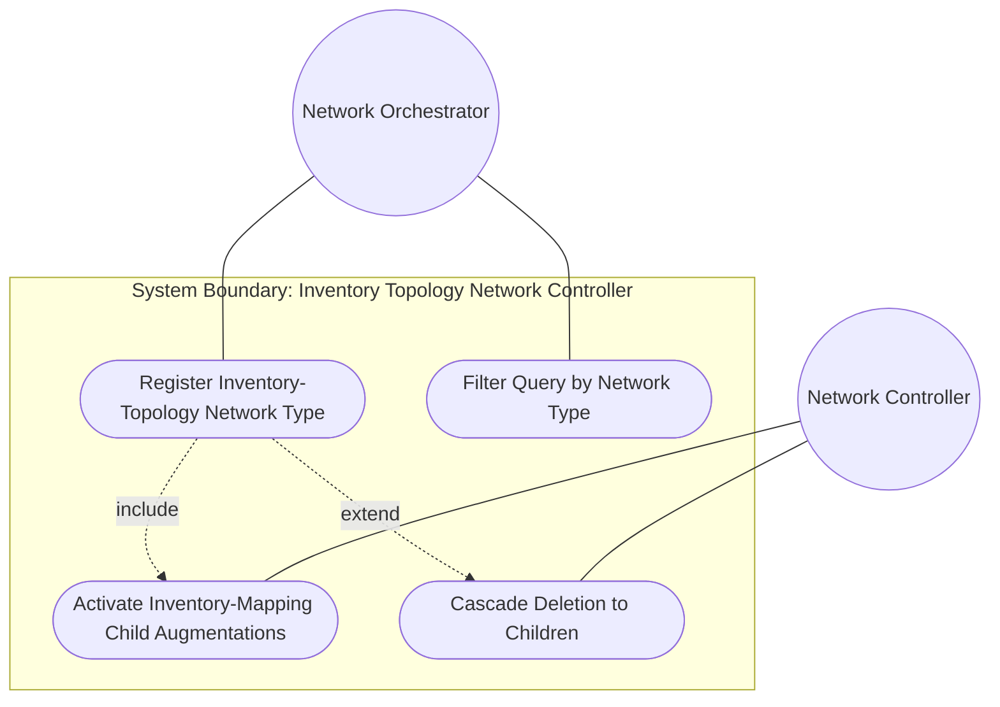
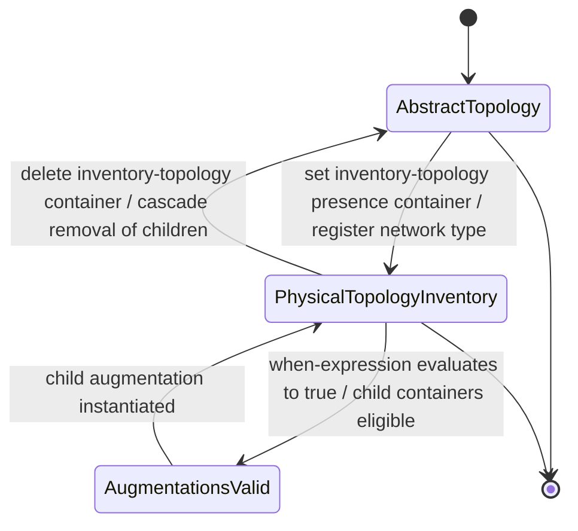

# Use Case: Register Inventory Topology Network Type

## Parent Epic
- [ ] #73 - [Network Inventory: Inventory Topology Mapping](https://github.com/gintatkinson/3dgs-030/blob/main/docs/epics/epic-06-inventory-topology-mapping.md) (the inventory-topology presence container is the gating condition enabling all physical-layer augmentations in this module)

## 1. Actors
- **Primary Actor:** Network Orchestrator (system or operator designating a network instance as a physical underlay topology with inventory mapping, port breakout, and link media classification capabilities)
- **Secondary Actors:** Network Controller (enforces when-expression gating on child augmentations); Inventory Database (source of network-element and component references to be mapped later)

## 2. Preconditions
- A network instance exists or is being provisioned at `/nw:networks/nw:network`.
- The `ietf-network-inventory-topology` YANG module is loaded and available for augmentation.
- The network candidate configuration or running datastore is writable for the requesting actor.

## 3. Trigger
The Network Orchestrator creates a network instance (via NETCONF edit-config or RESTCONF POST/PUT) and includes the `inventory-topology` presence container under `network-types`, signalling that this network will serve as the physical underlay topology for inventory-mapped nodes, links, and termination points.

## 4. Main Success Scenario (Basic Flow)
1. The Network Orchestrator initiates creation of a network instance with a unique `network-id` (e.g., "physical-underlay").
2. The Network Orchestrator includes the `inventory-topology` presence container under the `network-types` node.
3. The Network Controller validates that the `inventory-topology` container carries no child data leaves (it is a presence-only container).
4. The Network Controller accepts the configuration and stores the network instance with `inventory-topology` set in its `network-types`.
5. The Network Controller evaluates the `when` expressions on all child augmentations (`inventory-mapping-attributes` under node, link, and TP; `port-breakout` under TP) and determines they now evaluate to `true`.
6. The child augmentation containers become eligible for instantiation — they are conditionally valid.
7. The network instance is now classified as an inventory-topology network and is available to serve as the lowest underlay abstraction level for logical overlay topologies.

## 5. Alternate and Exception Flows
- **5a. Child data leaves within presence container (Branches from Basic Flow step 3):**
  1. The Network Controller detects that the client attempted to set child data leaves within the `inventory-topology` container.
  2. The Network Controller rejects the operation with an `invalid-value` error per standard management protocol semantics (RFC 8040 / RFC 6241).
  3. The network instance creation is rolled back; no inventory-topology network is created.

- **5b. Child augmentation instantiated without inventory-topology parent (Branches from Basic Flow step 5):**
  1. A child augmentation container (e.g., `inventory-mapping-attributes` under a node) is present in instance data but the parent network's `network-types` does not include `inventory-topology`.
  2. The Network Controller evaluates the `when` expression `'../nw:network-types/nwit:inventory-topology'` and finds it evaluates to `false`.
  3. The augmented container is treated as invalid; the operation is rejected per the `when` constraint.
  4. The augmented data is not stored; the node/link/TP remains without inventory mapping.

- **5c. Deletion of inventory-topology cascades to augmented children (Branches from Basic Flow step 7):**
  1. After successful registration, the Network Orchestrator deletes the `inventory-topology` container from an existing network.
  2. The Network Controller evaluates all child augmentations gated by the `when` expression and finds they now evaluate to `false`.
  3. The Network Controller removes or invalidates all child `inventory-mapping-attributes` and `port-breakout` containers that were gated by the now-absent network type.
  4. Subsequent reads of the network data return no inventory-mapping augmented data.

- **5d. Presence semantics violated via container absence in read-back (Branches from Basic Flow step 7):**
  1. A network instance was created without including `inventory-topology` in its `network-types`.
  2. When the Network Orchestrator queries the network, the `inventory-topology` container is absent from `network-types`.
  3. The network is identified as a logical/abstract topology — no inventory-mapping augmentations are instantiated.
  4. The Orchestrator determines that physical-layer operations (SAP-to-port correlation, multi-layer navigation to physical layer) are not available for this network.

- **5e. Network type filter query returns only inventory-topology networks (Branches from Basic Flow step 7):**
  1. Multiple networks exist in the datastore, some with `inventory-topology` and some without.
  2. The Network Orchestrator issues a filtered query using an XPath or subtree filter targeting `network[network-types/inventory-topology]`.
  3. The Network Controller returns only those networks whose `network-types` node contains the `inventory-topology` presence container.
  4. Networks without the container are excluded from the result set.

## 6. Postconditions (Guarantees)
- **Success Guarantee:** The network instance is stored with the `inventory-topology` presence container set. All child augmentations (`inventory-mapping-attributes` on node, link, and TP; `port-breakout` on TP) are conditionally valid and eligible for instantiation. The network can serve as the physical underlay for logical overlay topologies.
- **Failure Guarantee:** If any validation constraint fails (invalid child data, type mismatch on augmented children), the network instance creation is rolled back entirely. No partial inventory-topology network exists. The network remains in its previous valid state or is not created.

## UML Diagrams
### Use Case Diagram


### State Machine Diagram


## 7. Operational Context
From draft-ietf-ivy-network-inventory-topology, Section 1:
> This document defines a YANG data model that extends the network topology data model to map network topologies with inventories. The data model introduces the "inventory-topology" network type and augmentations for physical entity mappings and capabilities, which may be used by any overlay network topology for service provisioning validation, network maintenance, and capacity planning.
>
> Therefore, this YANG data model can be used to represent a physical network instance at the lowest underlay abstraction level. Alternatively, it can be used in conjunction with existing network topology models when they contain nodes, links, or termination points belonging to the lowest underlay level.

From draft-ietf-ivy-network-inventory-topology, Section 4 (Module Tree):
> The module augments the "ietf-network-topology" module as follows: Inventory mapping attributes for nodes, and termination points: The corresponding containers augments the topology module with the references to the base network inventory.

From draft-ietf-ivy-network-inventory-topology, Section 3.2:
> The topology models support navigation across the different layers, down to the physical layer, as defined in Section 4.4.9 of the base network topology data model. The navigation between the physical layer and the network inventory is outside the scope of the topology models and is addressed in this document.

From draft-ietf-ivy-network-inventory-topology, Section 3.3:
> Both architectures (NDT and SIMAP) require accurate mapping between logical network topology and physical inventory as a foundational data layer. This model provides the essential physical resource information to such systems, enabling them to perform accurate "what-if" analysis.

## 8. Realization Matrix
### Required User Stories
- [ ] #74 - [Register Inventory Topology Network Type](https://github.com/gintatkinson/3dgs-030/blob/main/docs/user-stories/us-37-register-inventory-topology-network-type.md) (directly realizes the inventory-topology presence container registration and when-expression gating for child augmentations)
- [ ] #80 - [Navigate Multi-Layer Network Topology Down to Physical Inventory Layer](https://github.com/gintatkinson/3dgs-030/blob/main/docs/user-stories/us-43-navigate-multi-layer-network.md) (the inventory-topology network type signals that a network serves as the physical underlay target for multi-layer navigation from logical layers downward)
- [ ] #81 - [Evaluate What-If Network Digital Twin Scenarios Using Inventory Topology](https://github.com/gintatkinson/3dgs-030/blob/main/docs/user-stories/us-44-evaluate-what-if-digital-twin.md) (the physical underlay designation provides the foundational topology for NDT and SIMAP what-if analysis)
- [ ] #83 - [Enforce Access Control on Topology-Inventory Mapping Nodes](https://github.com/gintatkinson/3dgs-030/blob/main/docs/user-stories/us-46-enforce-access-control-topology-inventory.md) (the inventory-topology network type gates the scope of protected write operations for ne-ref, port-ref, and link-type)

### Required Features
- [ ] #68 - [Inventory Topology Network Type](https://github.com/gintatkinson/3dgs-030/blob/main/docs/features/feat-14-inventory-topology-network-type.md) (the `inventory-topology` presence container is the primary schema construct enabling all downstream physical-layer augmentations)

## Source References
Structural Schema: [ietf-network-inventory-topology@2026-06-25.yang](https://github.com/gintatkinson/3dgs-030/blob/main/schema/ietf-network-inventory-topology%402026-06-25.yang) (Clause: augment /nw:networks/nw:network/nw:network-types, container inventory-topology with presence)
Normative Specification: [draft-ietf-ivy-network-inventory-topology-08](https://datatracker.ietf.org/doc/html/draft-ietf-ivy-network-inventory-topology) (Clause: Sections 1, 3.2, 3.3, 4, 5)

> [!WARNING]
> **Mermaid Block Closing Constraints & Code Fence Integrity:**
> - Every Mermaid diagram MUST be strictly closed with ``` on a new line. Leaking Mermaid blocks or stray/unclosed code fences will fail downstream validation checks.
> - **Semicolon Restriction**: Do NOT use semicolons (`;`) in sequence diagram `Note` statements or message text statements. Semicolons are not allowed. Replace any semicolons with commas, dashes, or spaces.
