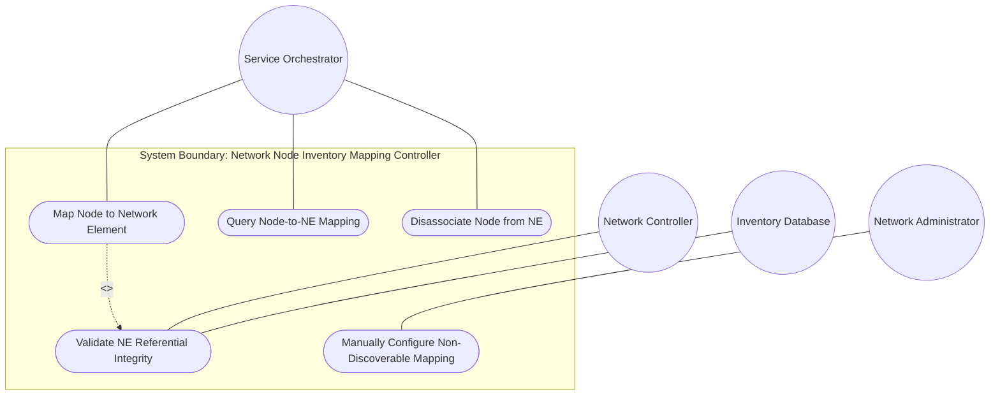
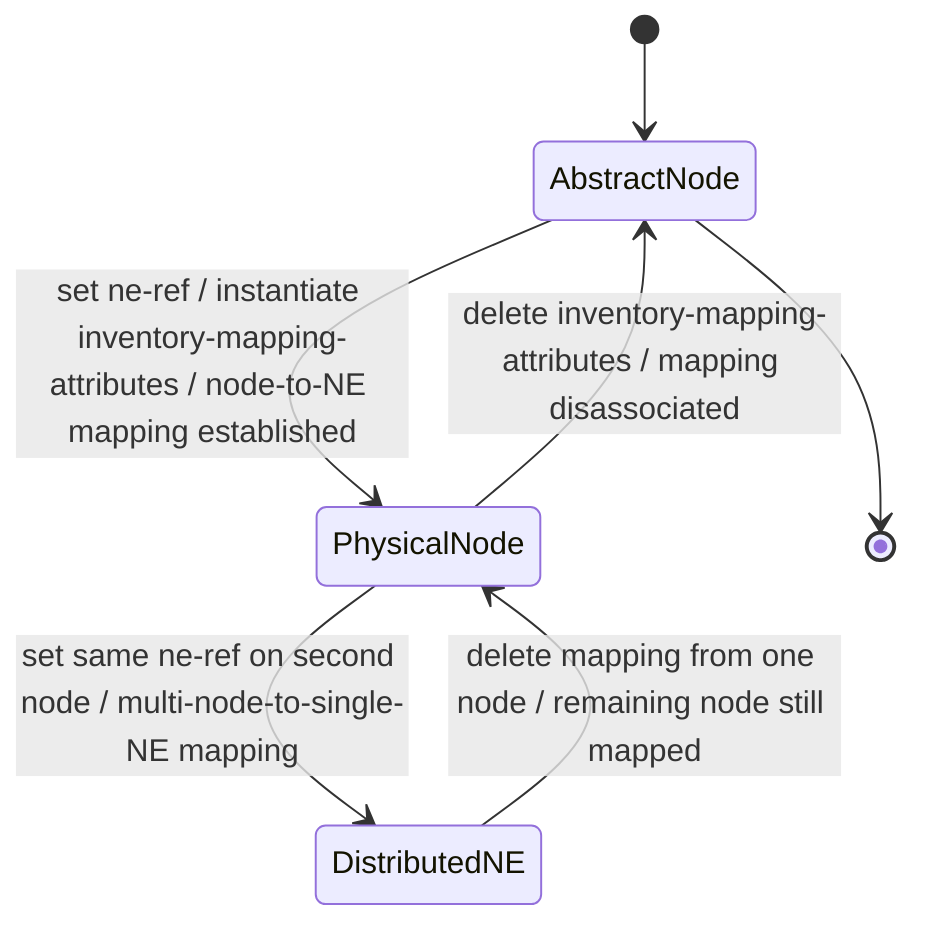

# Use Case: Map Topology Node to Network Element for Physical Inventory Correlation

## Parent Epic
- [ ] #73 - [Network Inventory: Inventory Topology Mapping](https://github.com/gintatkinson/3dgs-030/blob/main/docs/epics/epic-06-inventory-topology-mapping.md) (the node-to-NE mapping under inventory-mapping-attributes is a core augmentation establishing physical-to-logical correlation)

## 1. Actors
- **Primary Actor:** Service Orchestrator (system performing service provisioning that requires locating the physical NE underlying a logical topology node to verify resource availability)
- **Secondary Actors:** Network Controller (enforces leafref referential integrity and when-expression validation); Inventory Database (source of valid network-element identifiers and component data)

## 2. Preconditions
- The parent network has `inventory-topology` present in its `network-types` (the `when` expression `'../nw:network-types/nwit:inventory-topology'` evaluates to `true`).
- The target Network Element (NE) exists in the base inventory at `/nwi:network-inventory/nwi:network-elements/nwi:network-element` with a valid `ne-id`.
- The topology node exists at `/nw:networks/nw:network/nw:node`.

## 3. Trigger
The Service Orchestrator sets the `ne-ref` leaf within the `inventory-mapping-attributes` container on a topology node (via NETCONF edit-config or RESTCONF PUT/PATCH), establishing a 1:1 mapping between the logical node and its physical NE.

## 4. Main Success Scenario (Basic Flow)
1. The Service Orchestrator identifies a topology node requiring physical inventory correlation (e.g., "SW-1" in network "physical-underlay").
2. The Service Orchestrator queries the base inventory to confirm that the target NE (e.g., "NE-SW1") exists with a valid `ne-id`.
3. The Service Orchestrator creates or modifies the `inventory-mapping-attributes` container on the node, setting `ne-ref` to the target NE identifier.
4. The Network Controller validates that the `when` expression on the node augmentation evaluates to `true` (parent network is of `inventory-topology` type).
5. The Network Controller validates that the `ne-ref` leafref resolves to a valid `ne-id` in the inventory — referential integrity is satisfied.
6. The Network Controller stores the mapping: the `inventory-mapping-attributes` presence container signals the node is a physical node, and `ne-ref` establishes the 1:1 correlation.
7. The mapping is available for downstream consumers: multi-layer navigation resolves the physical NE; SAP resource determination traces to the NE; what-if analysis identifies dependent resources.
8. Subsequent GET/GET-CONFIG requests return the `inventory-mapping-attributes` container with the resolved `ne-ref` value.

## 5. Alternate and Exception Flows
- **5a. Node is abstract — inventory mapping absent (Branches from Basic Flow step 7):**
  1. The Service Orchestrator queries a topology node that has no `inventory-mapping-attributes` container instantiated.
  2. The Network Controller returns the node data without the `inventory-mapping-attributes` container.
  3. The Service Orchestrator interprets the node as an abstract/logical node — no physical NE correlation is available for resource verification or capacity planning.

- **5b. Dangling ne-ref to nonexistent NE (Branches from Basic Flow step 5):**
  1. The Service Orchestrator sets `ne-ref` to a value (e.g., "NE-FAKE") that does not match any `ne-id` in the base inventory.
  2. The Network Controller evaluates the leafref `require-instance` constraint (default `true`).
  3. The Network Controller detects a referential integrity violation — the referenced NE instance does not exist.
  4. The operation is rejected with an `invalid-value` error; the `ne-ref` is not stored; the node remains unmapped.

- **5c. When constraint violation — network not inventory-topology (Branches from Basic Flow step 4):**
  1. The Service Orchestrator attempts to set `inventory-mapping-attributes` on a node belonging to a network whose `network-types` does not include `inventory-topology`.
  2. The Network Controller evaluates the `when` expression `'../nw:network-types/nwit:inventory-topology'` and finds it evaluates to `false`.
  3. The augmentation is invalid for this network type; the operation is rejected.
  4. The node remains abstract — no inventory mapping is stored.

- **5d. Distributed NE across multiple topology nodes (Branches from Basic Flow step 6):**
  1. The Service Orchestrator sets `ne-ref` on two different topology nodes (e.g., "node-A" and "node-B") to the same NE identifier (e.g., "NE-dual").
  2. The Network Controller performs no uniqueness check (the schema defines no `unique` constraint on `ne-ref` across nodes).
  3. Both mappings are accepted — two topology nodes reference the same physical NE.
  4. This represents a distributed NE scenario and is semantically valid per the specification.

- **5e. Removal of inventory mapping deletes physical node association (Branches from Basic Flow step 7):**
  1. After successful mapping, the Service Orchestrator deletes the `inventory-mapping-attributes` container (or its `ne-ref` leaf) from an existing node.
  2. The Network Controller removes the mapping data.
  3. The node reverts to an abstract/logical node — no physical NE correlation remains.
  4. Subsequent GET requests omit the `inventory-mapping-attributes` container.

- **5f. Manual configuration for non-discoverable CPE or planned resource (Branches from Basic Flow step 3):**
  1. Automatic discovery cannot reach a CPE device, leased line endpoint, or planned future resource.
  2. The Service Orchestrator (or Network Administrator) manually creates the `inventory-mapping-attributes` container and sets `ne-ref` to a pre-registered NE.
  3. The Network Controller validates the referential integrity as in step 5 of the basic flow.
  4. The manual mapping is stored (config true), maintaining topology-to-inventory correlation even without auto-discovery.

- **5g. Unauthorized write operation denied by NACM (Branches from Basic Flow step 3):**
  1. A user without NACM write permission attempts to modify `ne-ref`.
  2. The Network Controller evaluates the NACM rule and denies the write operation.
  3. An `access-denied` error is returned.
  4. The existing mapping (if any) is preserved unchanged — no corruption of logical-to-physical topology mappings occurs.

## 6. Postconditions (Guarantees)
- **Success Guarantee:** The topology node is associated 1:1 with a physical NE. The `inventory-mapping-attributes` presence container signals the node is a physical node. The `ne-ref` leafref resolves to a valid `ne-id` in the base inventory. The mapping is retrievable via GET/GET-CONFIG and is available to downstream consumers (multi-layer navigation, SAP resource determination, what-if analysis, digital twin construction).
- **Failure Guarantee:** If validation fails (dangling reference, when-expression violation, or NACM denial), the node remains in its prior state — either abstract (no mapping) or with the pre-existing mapping intact. No corrupt partial mapping is stored.

## UML Diagrams
### Use Case Diagram


### State Machine Diagram


## 7. Operational Context
From draft-ietf-ivy-network-inventory-topology, Section 5 (YANG module):
> `augment "/nw:networks/nw:network/nw:node"` with `when '../nw:network-types/nwit:inventory-topology'` — container `inventory-mapping-attributes` with presence "If present, it indicates this is a physical node, which maps to a network element. If not present, it indicates it is an abstract node." Leaf `ne-ref` type `nwi:ne-ref` — "Reference to the NE in the inventory that corresponds to this topology node. This reference establishes a 1:1 mapping between the logical node and its physical NE."

From draft-ietf-ivy-network-inventory-topology, Section 6:
> The inventory-mapping-attributes containers are defined as read-write (config true) to accommodate cases where automatic discovery is not possible, including: Customer-premises equipment (CPE) outside the operator's management domain, Leased lines and third-party transport resources, Planned or hypothetical resources for future deployment.

From draft-ietf-ivy-network-inventory-topology, Section 7:
> 'ne-ref' is a sensitive writable node. Unauthorized modification could lead to incorrect resource allocation or service disruption.

From draft-ietf-ivy-network-inventory-topology, Section 3.1 (SAP resource determination):
> The orchestrator uses the inventory topology data model to identify the physical port underlying each candidate SAP. The parent-termination-point of a SAP is mapped to the corresponding port-ref. The NE context for that port comes from the node's ne-ref mapping.

## 8. Realization Matrix
### Required User Stories
- [ ] #75 - [Map Topology Node to Network Element for Inventory Correlation](https://github.com/gintatkinson/3dgs-030/blob/main/docs/user-stories/us-38-map-topology-node-to-network-element.md) (directly realizes the ne-ref mapping establishment and abstract-node vs. physical-node discrimination)
- [ ] #79 - [Determine Service Attachment Point Physical Resources for Capacity Verification](https://github.com/gintatkinson/3dgs-030/blob/main/docs/user-stories/us-42-determine-sap-physical-resources.md) (the ne-ref mapping provides the NE context for locating the physical port component underlying each SAP)
- [ ] #80 - [Navigate Multi-Layer Network Topology Down to Physical Inventory Layer](https://github.com/gintatkinson/3dgs-030/blob/main/docs/user-stories/us-43-navigate-multi-layer-network.md) (the ne-ref mapping resolves physical nodes to NEs during downward navigation from logical layers)
- [ ] #81 - [Evaluate What-If Network Digital Twin Scenarios Using Inventory Topology](https://github.com/gintatkinson/3dgs-030/blob/main/docs/user-stories/us-44-evaluate-what-if-digital-twin.md) (ne-ref enables dependency analysis, End-of-Life impact computation, and affected service identification in digital twin scenarios)
- [ ] #82 - [Manually Configure NE and Port Mappings for Non-Discoverable Resources](https://github.com/gintatkinson/3dgs-030/blob/main/docs/user-stories/us-45-manually-configure-non-discoverable-mappings.md) (the ne-ref leaf is config-writable, enabling manual CPE and planned resource mapping when auto-discovery is unavailable)
- [ ] #83 - [Enforce Access Control on Topology-Inventory Mapping Nodes](https://github.com/gintatkinson/3dgs-030/blob/main/docs/user-stories/us-46-enforce-access-control-topology-inventory.md) (ne-ref is a sensitive writable node requiring NACM access control per Section 7)

### Required Features
- [ ] #69 - [Node-to-Network-Element Inventory Mapping](https://github.com/gintatkinson/3dgs-030/blob/main/docs/features/feat-15-node-to-ne-mapping.md) (the `inventory-mapping-attributes` container with `ne-ref` leaf is the primary schema construct for node-to-NE 1:1 mapping)

## Source References
Structural Schema: [ietf-network-inventory-topology@2026-06-25.yang](https://github.com/gintatkinson/3dgs-030/blob/main/schema/ietf-network-inventory-topology%402026-06-25.yang) (Clause: augment /nw:networks/nw:network/nw:node, container inventory-mapping-attributes, leaf ne-ref)
Normative Specification: [draft-ietf-ivy-network-inventory-topology-08](https://datatracker.ietf.org/doc/html/draft-ietf-ivy-network-inventory-topology) (Clause: Sections 3.1, 4, 5, 6, 7)

> [!WARNING]
> **Mermaid Block Closing Constraints & Code Fence Integrity:**
> - Every Mermaid diagram MUST be strictly closed with ``` on a new line. Leaking Mermaid blocks or stray/unclosed code fences will fail downstream validation checks.
> - **Semicolon Restriction**: Do NOT use semicolons (`;`) in sequence diagram `Note` statements or message text statements. Semicolons are not allowed. Replace any semicolons with commas, dashes, or spaces.
