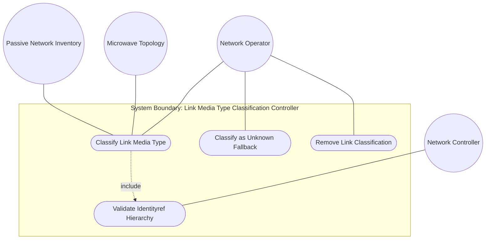
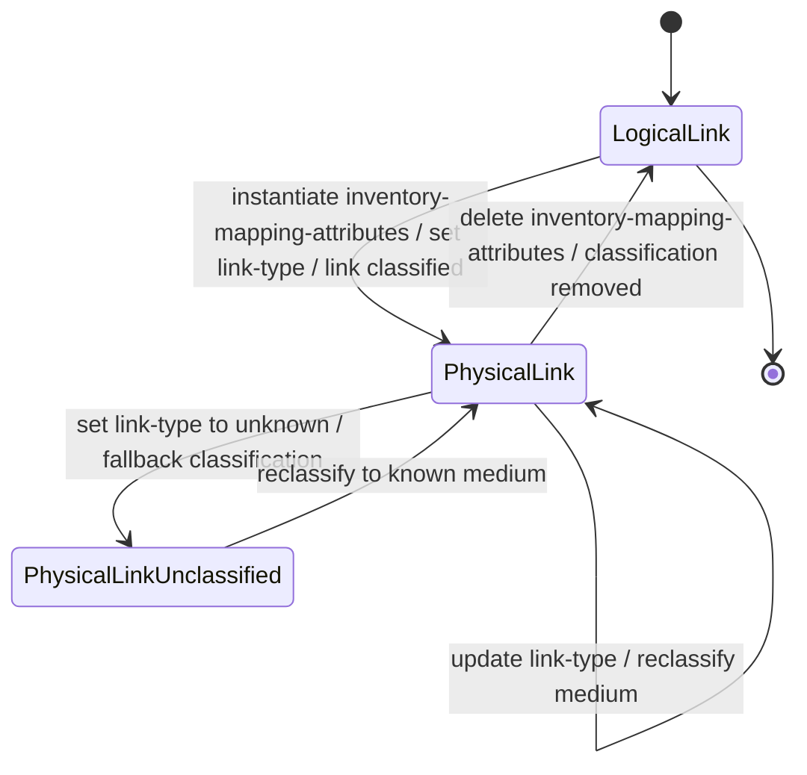

# Use Case: Classify Link Media Type for Physical Media Discrimination

## Parent Epic
- [ ] #73 - [Network Inventory: Inventory Topology Mapping](https://github.com/gintatkinson/3dgs-030/blob/main/docs/epics/epic-06-inventory-topology-mapping.md) (the link-type identity hierarchy under link inventory-mapping-attributes is the media classification mechanism for guiding consumers to specialized inventory models)

## 1. Actors
- **Primary Actor:** Network Operator (system or engineer classifying the physical media type of underlay links)
- **Secondary Actors:** Network Controller (enforces identityref type validation and when-expression constraints); Passive Network Inventory Model (consulted for detailed attributes of wired links); Microwave Topology Model (RFC 9656, consulted for detailed attributes of microwave wireless links)

## 2. Preconditions
- The parent network has `inventory-topology` present in its `network-types` (the `when` expression evaluates to `true`).
- The topology link exists at `/nw:networks/nw:network/nt:link` with valid source and destination endpoints.
- The relevant specialized inventory model modules (passive network inventory, microwave topology) are available for downstream consultation.

## 3. Trigger
The Network Operator classifies a topology link's physical medium by setting the `link-type` leaf within the `inventory-mapping-attributes` container to a value derived from the `link-type` identity hierarchy (via NETCONF edit-config or RESTCONF PUT/PATCH).

## 4. Main Success Scenario (Basic Flow)
1. The Network Operator identifies a topology link connecting two physical endpoints (e.g., "Link-SW1-SW2" connecting "SW-1" to "SW-2").
2. The Network Operator determines the physical medium of the link (e.g., fiber optic cable, copper Ethernet, microwave radio).
3. The Network Operator creates or modifies the `inventory-mapping-attributes` container on the link, setting `link-type` to the appropriate identity (e.g., `nwit:fiber`).
4. The Network Controller validates that the `when` expression on the link augmentation evaluates to `true` (parent network is of `inventory-topology` type).
5. The Network Controller validates that the `link-type` value is a valid `identityref` derived from the base `link-type` identity — type validation succeeds.
6. The Network Controller stores the classification: the `inventory-mapping-attributes` presence container signals the link is a physical link at the lowest underlay level, and `link-type` identifies the medium.
7. Downstream consumers (SAP orchestrators, what-if analysis engines, multi-layer navigators) read the `link-type` and route to the appropriate specialized inventory model:
   - Wired media (`fiber`, `copper`, `coax`, `leased-fiber`): passive network inventory for detailed physical attributes.
   - Wireless media (`microwave`): microwave topology model (RFC 9656) for radio attributes.
   - `unknown`: no specialized inventory model guidance; the link is acknowledged as unclassified.
8. Subsequent GET/GET-CONFIG requests return the `inventory-mapping-attributes` container with the `link-type` identity.

## 5. Alternate and Exception Flows
- **5a. Link is logical — inventory mapping absent (Branches from Basic Flow step 7):**
  1. The Network Operator queries a topology link that has no `inventory-mapping-attributes` container instantiated.
  2. The Network Controller returns the link data without the `inventory-mapping-attributes` container.
  3. The link is interpreted as a logical/overlay link — no physical media classification is asserted.
  4. No specialized inventory model consultation is applicable.

- **5b. Invalid identityref value rejected (Branches from Basic Flow step 5):**
  1. The Network Operator sets `link-type` to a value not derived from the base `link-type` identity (e.g., a namespace-qualified identity from an unrelated module).
  2. The Network Controller evaluates the `identityref` type constraint and finds the value does not derive from `link-type`.
  3. The operation is rejected with a type validation error (`invalid-value` per RFC 8040 / RFC 6241).
  4. The link's classification is not stored; the link remains unclassified.

- **5c. When constraint violation — network not inventory-topology (Branches from Basic Flow step 4):**
  1. The Network Operator attempts to set `inventory-mapping-attributes` with `link-type` on a link belonging to a non-inventory-topology network.
  2. The Network Controller evaluates the `when` expression and finds it evaluates to `false`.
  3. The augmentation is invalid for this network type; the operation is rejected.
  4. The link remains without physical media classification.

- **5d. Unknown media fallback classification (Branches from Basic Flow step 2):**
  1. The Network Operator cannot determine the physical medium of a discovered link (e.g., third-party transport with opaque medium).
  2. The Network Operator sets `link-type` to `nwit:unknown` — a valid identity in the hierarchy.
  3. The Network Controller accepts the value; the `inventory-mapping-attributes` presence container still marks the link as physical.
  4. Downstream consumers note the link is unclassified — no specialized inventory model guidance is provided.

- **5e. Leased fiber with limited physical visibility (Branches from Basic Flow step 7):**
  1. The Network Operator classifies a link as `nwit:leased-fiber` (derived from `nwit:fiber`).
  2. The Network Controller validates the identity (it derives from the base `link-type` via the `fiber` parent).
  3. The classification is stored; downstream consumers recognize that detailed physical attributes (strand count, attenuation, connector type) are typically not visible to the lessee.
  4. The passive network inventory model returns reduced detail for this link.

- **5f. Deletion of inventory mapping reverts to logical link (Branches from Basic Flow step 6):**
  1. After successful classification, the Network Operator deletes the `inventory-mapping-attributes` container from the link.
  2. The Network Controller removes the classification data.
  3. The link reverts to a logical/overlay link — no `link-type` is associated.
  4. Subsequent GET requests omit the `inventory-mapping-attributes` container.

- **5g. Identity hierarchy extensibility — new derived identity (Branches from Basic Flow step 5):**
  1. A specialized inventory module defines a new identity derived from `link-type` (e.g., `satellite-link` in a future module).
  2. The Network Operator sets `link-type` to the newly defined identity.
  3. The Network Controller validates that the identity derives from the base `link-type` (extensibility mechanism).
  4. The new classification is accepted — the base identity hierarchy is extensible per the schema.

- **5h. Unauthorized write operation denied by NACM (Branches from Basic Flow step 3):**
  1. A user without NACM write permission attempts to modify `link-type`.
  2. The Network Controller evaluates the NACM rule and denies the write operation.
  3. An `access-denied` error is returned.
  4. The existing link-type classification (if any) is preserved unchanged — no corruption of media type data occurs.

## 6. Postconditions (Guarantees)
- **Success Guarantee:** The topology link is classified with a valid `link-type` identity from the extensible hierarchy. The `inventory-mapping-attributes` presence container signals the link is a physical underlay link. The classification guides downstream consumers to the appropriate specialized inventory model (passive network inventory for wired media, microwave topology model for microwave wireless).
- **Failure Guarantee:** If validation fails (invalid identityref, when-expression violation, or NACM denial), the link remains in its prior state — either unclassified (no `link-type`) or with the pre-existing classification intact. No corrupt partial classification is stored.

## UML Diagrams
### Use Case Diagram


### State Machine Diagram


## 7. Operational Context
From draft-ietf-ivy-network-inventory-topology, Section 4.1:
> This document adds a lightweight "link-type" leaf to the topology link mapping to enable basic physical media classification. "link-type": An identityref indicating the link media type. Examples of wired link types are "copper", "fiber", or "coax". For wireless media, values such as "microwave", or "wlan" may be used. See also RFC 9656 for more detailed microwave radio attributes.
> The "link-type" serves as a lightweight discriminator that guides to the appropriate specialized inventory model for detailed resource information. For example, wired media ("fiber" or "copper") typically references a passive network inventory model such as the one defined in draft-ygb-ivy-passive-network-inventory.

From draft-ietf-ivy-network-inventory-topology, Section 5 (YANG module): Eight identities defined: `link-type` (base), `copper`, `fiber`, `coax`, `microwave`, `wlan`, `unknown`, `leased-fiber` (derived from `fiber`). The base identity is extensible.

From draft-ietf-ivy-network-inventory-topology, Appendix A: JSON example demonstrates `link-type` set to `"fiber"` on a link connecting SW-1 to SW-2.

From draft-ietf-ivy-network-inventory-topology, Section 7:
> 'link-type' is a sensitive writable node. Unauthorized modification could lead to incorrect resource allocation or service disruption.

## 8. Realization Matrix
### Required User Stories
- [ ] #76 - [Classify Link Media Type for Physical Media Discrimination](https://github.com/gintatkinson/3dgs-030/blob/main/docs/user-stories/us-39-classify-link-media-type.md) (directly realizes the link-type identityref classification and specialized inventory model routing)
- [ ] #81 - [Evaluate What-If Network Digital Twin Scenarios Using Inventory Topology](https://github.com/gintatkinson/3dgs-030/blob/main/docs/user-stories/us-44-evaluate-what-if-digital-twin.md) (link-type enables media change what-if analysis and path capacity recomputation in digital twin scenarios)
- [ ] #83 - [Enforce Access Control on Topology-Inventory Mapping Nodes](https://github.com/gintatkinson/3dgs-030/blob/main/docs/user-stories/us-46-enforce-access-control-topology-inventory.md) (link-type is a sensitive writable node requiring NACM access control per Section 7)

### Required Features
- [ ] #70 - [Link Media Type Classification](https://github.com/gintatkinson/3dgs-030/blob/main/docs/features/feat-16-link-media-type-classification.md) (the `inventory-mapping-attributes` container with `link-type` identityref leaf and the 8-identity hierarchy is the primary schema construct for link media classification)

## Source References
Structural Schema: [ietf-network-inventory-topology@2026-06-25.yang](https://github.com/gintatkinson/3dgs-030/blob/main/schema/ietf-network-inventory-topology%402026-06-25.yang) (Clause: augment /nw:networks/nw:network/nt:link, container inventory-mapping-attributes, leaf link-type, identity hierarchy)
Normative Specification: [draft-ietf-ivy-network-inventory-topology-08](https://datatracker.ietf.org/doc/html/draft-ietf-ivy-network-inventory-topology) (Clause: Sections 4.1, 5, 7, Appendix A)

> [!WARNING]
> **Mermaid Block Closing Constraints & Code Fence Integrity:**
> - Every Mermaid diagram MUST be strictly closed with ``` on a new line. Leaking Mermaid blocks or stray/unclosed code fences will fail downstream validation checks.
> - **Semicolon Restriction**: Do NOT use semicolons (`;`) in sequence diagram `Note` statements or message text statements. Semicolons are not allowed. Replace any semicolons with commas, dashes, or spaces.
