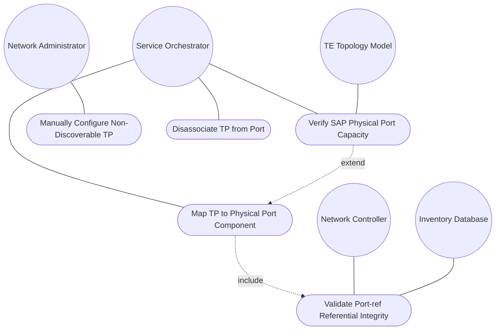
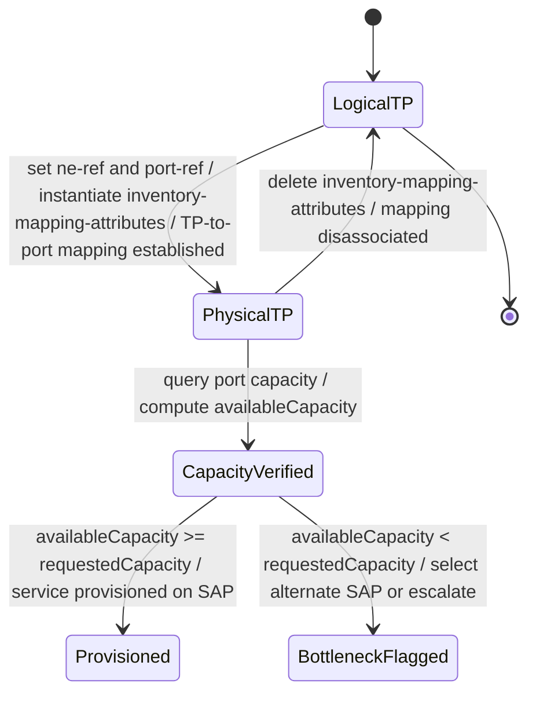

# Use Case: Map Termination Point to Physical Port Component for Resource Location

## Parent Epic
- [ ] #73 - [Network Inventory: Inventory Topology Mapping](https://github.com/gintatkinson/3dgs-030/blob/main/docs/epics/epic-06-inventory-topology-mapping.md) (the TP-to-port mapping under termination-point inventory-mapping-attributes enables physical resource location for SAP correlation and capacity verification)

## 1. Actors
- **Primary Actor:** Service Orchestrator (system locating the physical port underlying a logical termination point to verify resource availability during service provisioning)
- **Secondary Actors:** Network Controller (enforces leafref referential integrity for port-ref and ne-ref); Inventory Database (source of valid NE identifiers and component entries with port speed/capacity data); TE Topology Model (RFC 8795, consulted for allocated capacity on identified ports)

## 2. Preconditions
- The grandparent network has `inventory-topology` present in its `network-types` (the `when` expression `'../../nw:network-types/nwit:inventory-topology'` evaluates to `true`).
- The parent node exists and is associated with a valid NE via `ne-ref` (or a pre-existing NE is available for manual mapping).
- The physical port component exists in the base inventory at `/nwi:network-inventory/nwi:network-elements/nwi:network-element/nwi:components/nwi:component` with a valid `component-id`.
- The termination point exists under the parent node.

## 3. Trigger
The Service Orchestrator sets `ne-ref` and `port-ref` within the `inventory-mapping-attributes` container on a termination point (via NETCONF edit-config or RESTCONF PUT/PATCH), establishing a 1:1 mapping between the logical TP and its physical port component.

## 4. Main Success Scenario (Basic Flow)
1. The Service Orchestrator identifies a termination point requiring physical port correlation (e.g., "TP-SW1-P1" under node "SW-1" in network "physical-underlay").
2. The Service Orchestrator queries the base inventory to confirm the target NE (e.g., "NE-SW1") exists and contains the target port component (e.g., "eth-port-1").
3. The Service Orchestrator creates or modifies the `inventory-mapping-attributes` container on the TP, setting both `ne-ref` (the hosting NE) and `port-ref` (the leafref path to the physical port component).
4. The Network Controller validates that the `when` expression on the TP augmentation evaluates to `true` (grandparent network is of `inventory-topology` type).
5. The Network Controller validates that `ne-ref` resolves to a valid `ne-id` in the inventory (leafref referential integrity).
6. The Network Controller validates that `port-ref` resolves to a valid `component-id` within the referenced NE's component list — referential integrity is satisfied.
7. The Network Controller stores the mapping: the `inventory-mapping-attributes` presence container signals the TP is a physical termination point, and the `nwi:port-ref` grouping establishes the 1:1 correlation to the physical port component.
8. The Service Orchestrator resolves an SAP's `parent-termination-point` to the mapped physical port, then queries the port's total capacity and allocated capacity (via TE topology or inventory component attributes) to compute available capacity:
   - `availableCapacity = totalCapacity - allocatedCapacity`
9. If capacity is sufficient, the service is provisioned on the SAP. If capacity is insufficient, the Orchestrator selects an alternate SAP with adequate capacity or flags the bottleneck for manual intervention.

## 5. Alternate and Exception Flows
- **5a. Termination point is logical — inventory mapping absent (Branches from Basic Flow step 7):**
  1. The Service Orchestrator queries a termination point that has no `inventory-mapping-attributes` container instantiated.
  2. The Network Controller returns the TP data without the `inventory-mapping-attributes` container.
  3. The TP is interpreted as a logical termination point — no physical port mapping exists.
  4. SAP-to-physical-port correlation is not applicable for this TP.

- **5b. Dangling port-ref to nonexistent component (Branches from Basic Flow step 6):**
  1. The Service Orchestrator sets `port-ref` to a leafref path that does not resolve to a valid `component-id` under the referenced NE.
  2. The Network Controller evaluates the leafref `require-instance` constraint and detects a referential integrity violation.
  3. The operation is rejected with an `invalid-value` error; neither `ne-ref` nor `port-ref` is stored.
  4. The TP remains unmapped — no physical port association exists.

- **5c. ne-ref and port-ref mismatch across different NEs (Branches from Basic Flow step 6):**
  1. The Service Orchestrator sets `ne-ref` to NE-A but `port-ref` resolves to a component under NE-B.
  2. The Network Controller evaluates the leafref path constraint — the `port-ref` leafref path is relative to the NE identified by `ne-ref` within the same `nwi:port-ref` grouping.
  3. The logical inconsistency is detected; the operation is rejected.
  4. The TP remains unmapped or retains its previous valid mapping.

- **5d. When constraint violation — network not inventory-topology (Branches from Basic Flow step 4):**
  1. The Service Orchestrator attempts to set `inventory-mapping-attributes` on a TP belonging to a non-inventory-topology network.
  2. The Network Controller evaluates the `when` expression `'../../nw:network-types/nwit:inventory-topology'` and finds it evaluates to `false`.
  3. The augmentation is invalid for this network type; the operation is rejected.
  4. The TP remains a logical TP without physical port mapping.

- **5e. SAP-to-port capacity verification with insufficient resources (Branches from Basic Flow step 9):**
  1. After successful mapping, the Service Orchestrator queries the physical port for a candidate SAP.
  2. The computed available capacity (`totalCapacity - allocatedCapacity`) is less than the requested service bandwidth.
  3. The Orchestrator flags the port as a resource bottleneck with a report: "Port eth-port-1 on NE-SW1 is at 95% utilization".
  4. The Orchestrator selects an alternate SAP whose underlying physical port has sufficient available capacity.
  5. If no alternate SAP has adequate capacity, the request is escalated for manual intervention with precise bottleneck information.

- **5f. Removal of inventory mapping disassociates TP from physical port (Branches from Basic Flow step 7):**
  1. After successful mapping, the Service Orchestrator deletes the `inventory-mapping-attributes` container from the TP.
  2. The Network Controller removes both `ne-ref` and `port-ref` values.
  3. The TP reverts to a logical termination point — no physical port association exists.
  4. Subsequent GET requests omit the container; SAPs referencing this TP can no longer resolve physical resources.

- **5g. Manual configuration for non-discoverable port (Branches from Basic Flow step 3):**
  1. A leased line endpoint or CPE device has a known physical port but auto-discovery cannot reach it.
  2. The Service Orchestrator (or Network Administrator) manually sets `ne-ref` and `port-ref` on the termination point.
  3. The Network Controller validates referential integrity against the pre-registered NE and component.
  4. The manual mapping is stored (config true), maintaining topology-to-inventory correlation for the non-discoverable resource.

- **5h. Unauthorized write operation denied by NACM (Branches from Basic Flow step 3):**
  1. A user without NACM write permission attempts to modify `ne-ref` or `port-ref`.
  2. The Network Controller evaluates the NACM rule and denies the write operation.
  3. An `access-denied` error is returned.
  4. The existing mapping (if any) is preserved unchanged — no corruption of logical-to-physical TP mappings occurs.

## 6. Postconditions (Guarantees)
- **Success Guarantee:** The termination point is associated 1:1 with a physical port component. Both `ne-ref` and `port-ref` resolve to valid entries in the inventory. The `inventory-mapping-attributes` presence container signals the TP is a physical termination point. The mapping enables SAP-to-physical-port correlation, capacity verification (`availableCapacity = totalCapacity - allocatedCapacity`), and alternate SAP selection when resources are insufficient.
- **Failure Guarantee:** If validation fails (dangling port-ref, ne-ref/port-ref mismatch, when-expression violation, or NACM denial), the TP remains in its prior state — either a logical TP (no mapping) or with the pre-existing mapping intact. No corrupt partial mapping is stored.

## UML Diagrams
### Use Case Diagram


### State Machine Diagram


## 7. Operational Context
From draft-ietf-ivy-network-inventory-topology, Section 3.1:
> The inventory topology data model provides a physical port reference (port-ref) that enables correlation between logical topology entities and physical inventory components. During service provisioning, the SAP's parent-termination-point can be associated with the inventory topology's port-ref to locate the underlying physical resource.
> Specifically, the "parent-termination-point" of a SAP is mapped to the corresponding "port-ref" in the inventory topology, allowing the orchestrator to locate the physical resource. The orchestrator can then consult other relevant topology models (e.g., RFC 8795) to verify whether the identified port has adequate capacity for the requested service.
> If the physical port underlying a candidate SAP has insufficient resources (e.g., port speed fully utilized), the orchestrator can select an alternate SAP that maps to a different port with adequate capacity. If no alternative SAP is available, the orchestrator flags the request for manual intervention, providing the operator with precise inventory information about the bottleneck.

From draft-ietf-ivy-network-inventory-topology, Section 5 (YANG module):
> `container inventory-mapping-attributes` under `/nw:networks/nw:network/nw:node/nt:termination-point` uses `nwi:port-ref` grouping with refine on `port-ref` — "Reference to the physical port component in the network inventory. This reference establishes a 1:1 mapping between the logical TP and its physical port component."

From draft-ietf-ivy-network-inventory-topology, Section 6:
> The inventory-mapping-attributes containers are defined as read-write (config true) to accommodate cases where automatic discovery is not possible.

From draft-ietf-ivy-network-inventory-topology, Section 7:
> 'port-ref' is a sensitive writable node. Unauthorized modification could lead to incorrect resource allocation or service disruption.

## 8. Realization Matrix
### Required User Stories
- [ ] #77 - [Map Termination Point to Physical Port Component for Resource Location](https://github.com/gintatkinson/3dgs-030/blob/main/docs/user-stories/us-40-map-termination-point-to-physical-port.md) (directly realizes the port-ref mapping establishment and physical-TP vs. logical-TP discrimination)
- [ ] #79 - [Determine Service Attachment Point Physical Resources for Capacity Verification](https://github.com/gintatkinson/3dgs-030/blob/main/docs/user-stories/us-42-determine-sap-physical-resources.md) (the port-ref mapping resolves SAP parent-termination-points to physical port components and enables capacity computation)
- [ ] #80 - [Navigate Multi-Layer Network Topology Down to Physical Inventory Layer](https://github.com/gintatkinson/3dgs-030/blob/main/docs/user-stories/us-43-navigate-multi-layer-network.md) (the port-ref mapping resolves TPs to physical port components at the lowest navigation level during multi-layer traversal)
- [ ] #81 - [Evaluate What-If Network Digital Twin Scenarios Using Inventory Topology](https://github.com/gintatkinson/3dgs-030/blob/main/docs/user-stories/us-44-evaluate-what-if-digital-twin.md) (port-ref enables capacity upgrade what-if analysis and service-to-port correlation in digital twin scenarios)
- [ ] #82 - [Manually Configure NE and Port Mappings for Non-Discoverable Resources](https://github.com/gintatkinson/3dgs-030/blob/main/docs/user-stories/us-45-manually-configure-non-discoverable-mappings.md) (the port-ref leaf is config-writable, enabling manual leased line and third-party endpoint mapping)
- [ ] #83 - [Enforce Access Control on Topology-Inventory Mapping Nodes](https://github.com/gintatkinson/3dgs-030/blob/main/docs/user-stories/us-46-enforce-access-control-topology-inventory.md) (port-ref is a sensitive writable node requiring NACM access control per Section 7)

### Required Features
- [ ] #71 - [Termination-Point-to-Port Inventory Mapping](https://github.com/gintatkinson/3dgs-030/blob/main/docs/features/feat-17-tp-to-port-mapping.md) (the `inventory-mapping-attributes` container using `nwi:port-ref` grouping is the primary schema construct for TP-to-physical-port 1:1 mapping)

## Source References
Structural Schema: [ietf-network-inventory-topology@2026-06-25.yang](https://github.com/gintatkinson/3dgs-030/blob/main/schema/ietf-network-inventory-topology%402026-06-25.yang) (Clause: augment /nw:networks/nw:network/nw:node/nt:termination-point, container inventory-mapping-attributes, uses nwi:port-ref)
Normative Specification: [draft-ietf-ivy-network-inventory-topology-08](https://datatracker.ietf.org/doc/html/draft-ietf-ivy-network-inventory-topology) (Clause: Sections 3.1, 4, 5, 6, 7, Appendix A)

> [!WARNING]
> **Mermaid Block Closing Constraints & Code Fence Integrity:**
> - Every Mermaid diagram MUST be strictly closed with ``` on a new line. Leaking Mermaid blocks or stray/unclosed code fences will fail downstream validation checks.
> - **Semicolon Restriction**: Do NOT use semicolons (`;`) in sequence diagram `Note` statements or message text statements. Semicolons are not allowed. Replace any semicolons with commas, dashes, or spaces.
