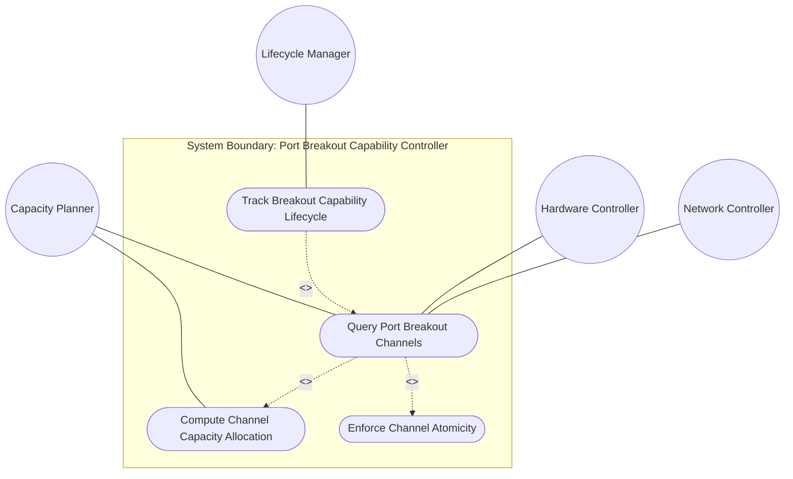
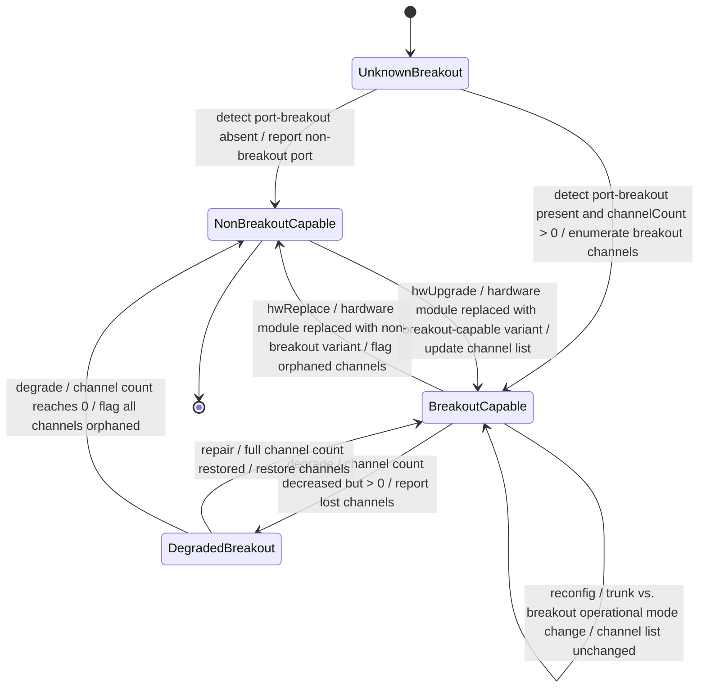

# Use Case: Query Port Breakout Capability for Partition-Capable Physical Ports

## Parent Epic
- [ ] #73 - [Network Inventory: Inventory Topology Mapping](https://github.com/gintatkinson/3dgs-030/blob/main/docs/epics/epic-06-inventory-topology-mapping.md) (the port-breakout container under termination-point exposes hardware-determined channelization capability for planning and capacity allocation)

## 1. Actors
- **Primary Actor:** Capacity Planner (system or operator reading the hardware-determined breakout channel list to plan port partitioning configurations, compute channel capacity, and track hardware lifecycle changes)
- **Secondary Actors:** Hardware Controller (reports the hardware-determined `port-breakout` state with breakout-channel enumeration); Lifecycle Manager (detects state transitions in breakout capability due to hardware replacement, degradation, or upgrades); Network Controller (enforces config false read-only constraint)

## 2. Preconditions
- The grandparent network has `inventory-topology` present in its `network-types` (the `when` expression evaluates to `true`).
- The termination point represents a physical port with possible breakout capability (the `inventory-mapping-attributes` container may or may not be present on the TP).
- The underlying hardware is capable of reporting its intrinsic channel partitioning capability (or absence thereof) to the controller.

## 3. Trigger
The Capacity Planner queries the `port-breakout` container for a termination point (via NETCONF get/get-config or RESTCONF GET), requesting the list of breakout channels into which the physical port can be partitioned.

## 4. Main Success Scenario (Basic Flow)
1. The Capacity Planner identifies a termination point representing a high-density physical port (e.g., "400g-1/0/1" — a 400 Gb/s DR4 port).
2. The Capacity Planner issues a GET request for the termination point data, specifically targeting the `port-breakout` container.
3. The Hardware Controller reports the current hardware state: the `port-breakout` presence container is instantiated, and the `breakout-channel` list contains four entries with `channel-id` values 1, 2, 3, and 4.
4. The Capacity Planner determines the total number of breakout channels (`N = 4`), each representing an independent atomic resource element.
5. The Capacity Planner queries the physical port's nominal speed from the inventory component data (e.g., 400 Gb/s).
6. The Capacity Planner computes the per-channel capacity: `perChannelCapacity = totalPortSpeed / channelCount` = 400 Gb/s / 4 = 100 Gb/s per channel.
7. The Capacity Planner evaluates channel allocation status: allocated channels vs. available channels, total allocated capacity, and total available capacity.
8. The Capacity Planner uses the channel allocation data to plan interface configurations — either a single trunk using all channels or multiple physical interfaces consuming subsets of channels — and feeds the data into capacity planning and what-if analysis.

## 5. Alternate and Exception Flows
- **5a. Non-breakout port — container absent (Branches from Basic Flow step 3):**
  1. The Capacity Planner queries the `port-breakout` container for a termination point representing a standard 10G or 100G port without breakout capability.
  2. The Hardware Controller returns the TP data without the `port-breakout` container — the container is absent.
  3. The Capacity Planner interprets the absence as "non-breakout-capable" — channel partitioning is not supported by this hardware.
  4. Total capacity equals the port's nominal speed (trunk mode only); no channel-based allocation metrics are applicable.

- **5b. Write operation rejected — config false data (Branches from Basic Flow step 3):**
  1. The Capacity Planner (or any actor) attempts to create, modify, or delete `port-breakout` or `breakout-channel` entries via edit-config.
  2. The Network Controller evaluates the `config false` annotation on the `port-breakout` container.
  3. The write operation is rejected with an `access-denied` or `invalid-value` error per RFC 8341 NACM or RFC 8040.
  4. The hardware-determined `port-breakout` state is preserved unchanged.

- **5c. Duplicate channel-id prevented at schema level (Branches from Basic Flow step 4):**
  1. The `breakout-channel` list is keyed by `channel-id` (uint16).
  2. The schema key constraint prevents any two entries in the same parent port from having the same `channel-id` value.
  3. This is enforced at the data model level — duplicate channel-ids are structurally impossible in valid instance data.

- **5d. Invalid channel-id type — value outside uint16 range (Branches from Basic Flow step 4):**
  1. A hardware report attempts to include a `channel-id` value outside the uint16 range (0..65535) or a non-integer value.
  2. The type system (`type uint16`) rejects the value at the data model layer.
  3. The invalid entry is not included in the `breakout-channel` list.

- **5e. Channel atomicity constraint violated (Branches from Basic Flow step 7):**
  1. A breakout channel (e.g., `channel-id 3`) is already consumed by physical interface "eth-1/0/1:3".
  2. A controller attempts to associate the same channel with a second physical interface.
  3. This violates the specification constraint: one breakout channel MUST NOT be associated with more than one physical interface.
  4. The assignment is rejected; the channel remains exclusive to the first physical interface.

- **5f. Trunk vs. breakout configuration does not affect channel listing (Branches from Basic Flow step 4):**
  1. The physical port is currently configured as a trunk (single interface consuming all channels).
  2. The Capacity Planner queries the `port-breakout` container.
  3. The `breakout-channel` list still reports all four channels — the list reflects hardware capability, not current interface configuration.
  4. The channel count is unchanged regardless of trunk or breakout operational mode.

- **5g. When constraint violation — network not inventory-topology (Branches from Basic Flow step 3):**
  1. The Capacity Planner queries a termination point belonging to a non-inventory-topology network.
  2. The Network Controller evaluates the `when` expression and finds it evaluates to `false`.
  3. The `port-breakout` container is not instantiated — it is absent from the response regardless of hardware capability.
  4. No breakout channel data is exposed.

- **5h. Hardware lifecycle state transition — channel count changes (Branches from Basic Flow step 3):**
  1. A physical port module is replaced, upgraded, or degraded, altering its breakout capability.
  2. The Lifecycle Manager detects the change by comparing the previous `breakout-channel` list with the current read.
  3. The Lifecycle Manager computes the `capabilityDelta`: orphaned channels (channels no longer supported) and new channels (channels newly available).
  4. Affected services using orphaned channels are flagged for immediate re-provisioning; new channels are added to the capacity pool.

- **5i. Unauthorized read access denied by NACM (Branches from Basic Flow step 2):**
  1. A user without NACM read permission for `port-breakout` issues a GET request.
  2. The Network Controller evaluates the NACM rule and filters the `port-breakout` data from the response.
  3. The response excludes hardware capability information; no network infrastructure details are exposed.
  4. The user receives only non-sensitive TP data.

## 6. Postconditions (Guarantees)
- **Success Guarantee:** The `port-breakout` container is returned with the complete `breakout-channel` list (unique channel-ids within the parent port scope). The container presence signals the port is breakout-capable; absence signals a non-breakout port. Per-channel capacity is computed as `perChannelCapacity = totalPortSpeed / channelCount`. Channel allocation status (allocated vs. available) is available for capacity planning and what-if analysis. Hardware-determined state cannot be modified by operators.
- **Failure Guarantee:** If the port is not breakout-capable, the container is absent (normal case for non-breakout ports). If the `when` expression evaluates to `false`, the container is absent regardless of hardware capability. Write operations targeting `config false` data are rejected with appropriate errors. Unauthorized read access results in filtered responses excluding the breakout data.

## UML Diagrams
### Use Case Diagram


### State Machine Diagram


## 7. Operational Context
From draft-ietf-ivy-network-inventory-topology, Section 4.2:
> High-density Ethernet ports (e.g., 400 Gb/s DR4) can be split into multiple independent lower-speed channels. The breakout channels represent the intrinsic capability of the port to be partitioned, regardless of whether the port is currently configured as a trunk or as a breakout port.
> A trunk port is associated with exactly one physical interface. A breakout port is a port that is decomposed into two or more physical interfaces; those interfaces may run at the same or different speeds and may consume the same or a different number of breakout channels.
> The container "port-breakout" is added under the termination-point augmentation. It lists the logical channels into which the single physical port can be divided. Only termination-points whose parent port is breakout-capable need to instantiate the container; otherwise the container is omitted, keeping the topology model minimal for the common non-breakout case.
> Breakout channel is an atomic resource element obtained by partitioning a breakout port. One physical interface may be associated with one or more breakout channels, but one breakout channel MUST NOT be associated with more than one physical interface.

From draft-ietf-ivy-network-inventory-topology, Section 6:
> The following nodes are read-only (config false) as they represent hardware-determined state: port-breakout: Hardware capability determined by physical port characteristics.

From draft-ietf-ivy-network-inventory-topology, Section 7:
> 'port-breakout': This node exposes hardware capabilities. Read access should be controlled.

From draft-ietf-ivy-network-inventory-topology, Appendix B: JSON example of a 400 Gb/s DR4 MPO port with 4 breakout channels (channel-id 1 through 4).

## 8. Realization Matrix
### Required User Stories
- [ ] #78 - [Report Port Breakout Capability for High-Density Ethernet Ports](https://github.com/gintatkinson/3dgs-030/blob/main/docs/user-stories/us-41-report-port-breakout-capability.md) (directly realizes the breakout-channel enumeration and non-breakout-port discrimination via container absence)
- [ ] #79 - [Determine Service Attachment Point Physical Resources for Capacity Verification](https://github.com/gintatkinson/3dgs-030/blob/main/docs/user-stories/us-42-determine-sap-physical-resources.md) (breakout channel availability informs capacity planning for channelized ports and enables computation of `availableChannels = totalChannels - allocatedChannels`)
- [ ] #81 - [Evaluate What-If Network Digital Twin Scenarios Using Inventory Topology](https://github.com/gintatkinson/3dgs-030/blob/main/docs/user-stories/us-44-evaluate-what-if-digital-twin.md) (breakout-channel data provides channel-aware capacity upgrade and allocation planning in digital twin what-if scenarios)
- [ ] #83 - [Enforce Access Control on Topology-Inventory Mapping Nodes](https://github.com/gintatkinson/3dgs-030/blob/main/docs/user-stories/us-46-enforce-access-control-topology-inventory.md) (port-breakout exposes hardware capabilities and requires read-access control per Section 7)
- [ ] #84 - [Calculate Port Breakout Channel Capacity Allocation for Channelized Interfaces](https://github.com/gintatkinson/3dgs-030/blob/main/docs/user-stories/us-47-calculate-breakout-channel-capacity.md) (the breakout-channel list and parent port speed are the inputs for per-channel capacity computation and allocation ratio analysis)
- [ ] #85 - [Track Port Breakout Hardware Capability Lifecycle Changes](https://github.com/gintatkinson/3dgs-030/blob/main/docs/user-stories/us-48-track-port-breakout-hardware-lifecycle.md) (the config false port-breakout container is the source of hardware-determined state that changes across lifecycle events — replacement, upgrade, degradation, repair)

### Required Features
- [ ] #72 - [Port Breakout Capability](https://github.com/gintatkinson/3dgs-030/blob/main/docs/features/feat-18-port-breakout-capability.md) (the read-only `port-breakout` container with `breakout-channel` list keyed by `channel-id` is the primary schema construct for exposing hardware channelization capability)

## Source References
Structural Schema: [ietf-network-inventory-topology@2026-06-25.yang](https://github.com/gintatkinson/3dgs-030/blob/main/schema/ietf-network-inventory-topology%402026-06-25.yang) (Clause: augment /nw:networks/nw:network/nw:node/nt:termination-point, container port-breakout config false, list breakout-channel key channel-id uint16)
Normative Specification: [draft-ietf-ivy-network-inventory-topology-08](https://datatracker.ietf.org/doc/html/draft-ietf-ivy-network-inventory-topology) (Clause: Sections 4.2, 5, 6, 7, Appendix B)

> [!WARNING]
> **Mermaid Block Closing Constraints & Code Fence Integrity:**
> - Every Mermaid diagram MUST be strictly closed with ``` on a new line. Leaking Mermaid blocks or stray/unclosed code fences will fail downstream validation checks.
> - **Semicolon Restriction**: Do NOT use semicolons (`;`) in sequence diagram `Note` statements or message text statements. Semicolons are not allowed. Replace any semicolons with commas, dashes, or spaces.
