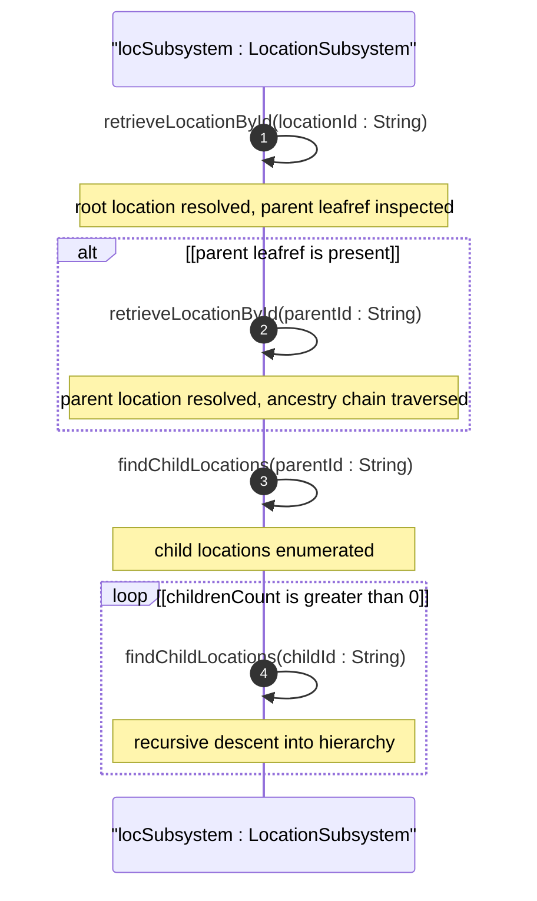
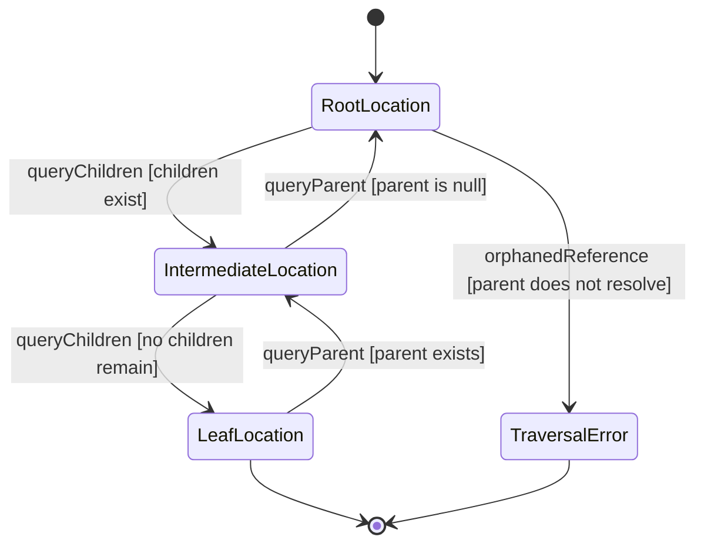

# User Story: Navigate Hierarchical Location Tree

## Parent Epic
- [ ] #6 - [Network Inventory Location](https://github.com/gintatkinson/3dgs-030/blob/main/docs/epics/epic-01-network-location-inventory.md) — Location hierarchy traversal falls under the core location inventory domain

## Domain Object Mapping
- **Primary Domain Objects:** nil:locations/location (Location list entry with id, parent leafref, type)
- **Actor/Role:** OSS Operator (operations support system consuming read-only location state)

## BDD Scenario (OOA/OOD Realization)
**As a** Network Operations Operator
**I want to** traverse a hierarchical location tree from site through buildings to individual rooms using parent-child leafref relationships
**So that** I can locate equipment within the full physical facility topology for dispatch and planning

**Given** a location hierarchy exists: Site-1 (parent=none) contains Building-A (parent=Site-1) which contains Floor-2 (parent=Building-A) which contains Room-201 (parent=Floor-2)
**When** the operator retrieves a location by id and follows its parent leafref upward, or queries for all child locations whose parent matches a given id
**Then** the complete ancestry chain resolves correctly and all descendant locations are enumerable
**And** circular parent references are not present in the hierarchy

## UML Sequence Diagram

## UML State Machine Diagram

## Operational Context
From RFC XXXX, Section 2 (Hierarchical Locations of Network Inventory):

The location list is generalized to support a variety of geographic location, such as sites, rooms, buildings. A site represents a general geographic location to group a set of NEs and corresponding inventory components. NEs, racks, equipment rooms, and buildings can be grouped within a site. Locations can be nested to form a hierarchy. For example, buildings may be within a site, and a room may be within a building.

## Required Features Matrix
- [ ] #1 - [Manage Hierarchical Location Inventory](https://github.com/gintatkinson/3dgs-030/blob/main/docs/features/feat-01-location-management.md) (parent leafref enables self-referential hierarchy with referential integrity)
- [ ] #2 - [Capture Physical Address Information](https://github.com/gintatkinson/3dgs-030/blob/main/docs/features/feat-02-physical-address.md) (physical address data enriches leaf locations for dispatch readiness)
- [ ] #3 - [Capture Geographic Location Coordinates](https://github.com/gintatkinson/3dgs-030/blob/main/docs/features/feat-03-geographic-location.md) (geo-location data enriches leaf locations for spatial positioning)

## Source References
Structural Schema: ietf-ni-location@2026-07-06.yang (Clause: list location, leaf parent type leafref path ../../location/id)
Normative Specification: draft-ietf-ivy-network-inventory-location (Clause: Section 2 - Hierarchical Locations of Network Inventory)
