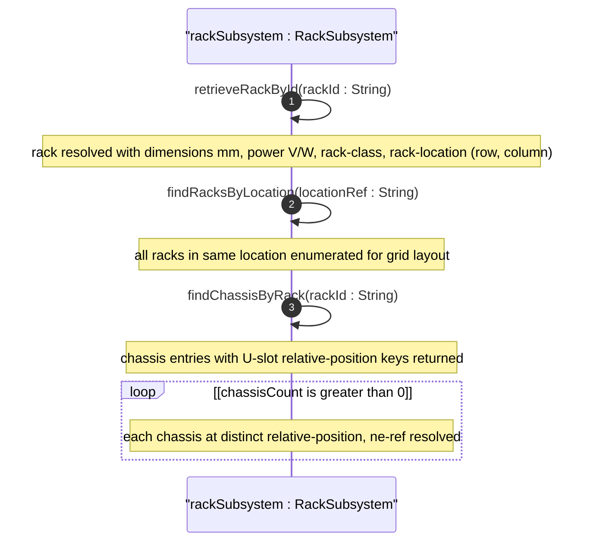
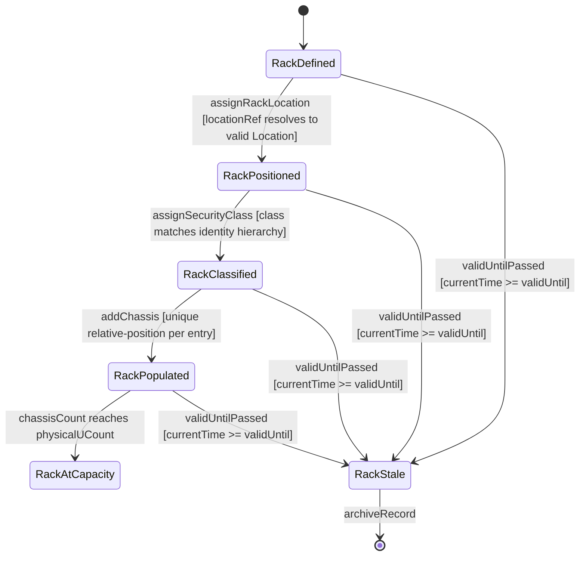

# User Story: Deploy Equipment in a Rack

## Parent Epic
- [ ] #7 - [Rack Inventory Management](https://github.com/gintatkinson/3dgs-030/blob/main/docs/epics/epic-02-rack-inventory-management.md) — Rack deployment, capacity planning, and chassis placement are core rack inventory operations

## Domain Object Mapping
- **Primary Domain Objects:** nil:locations/racks/rack (Rack with id, rack-class, height, width, depth, max-voltage, max-allocated-power), nil:locations/racks/rack/contained-chassis (U-slot chassis list), nil:locations/racks/rack/rack-location (positional data)
- **Actor/Role:** Network Planner (capacity planning and equipment deployment engineer)

## BDD Scenario (OOA/OOD Realization)
**As a** Network Planner
**I want to** inspect rack physical dimensions, electrical capacity, security classification, and deployed chassis
**So that** I can determine whether a rack has sufficient space, power, and appropriate security tier for new equipment installation

**Given** a rack Rack-101-A exists with height 2200mm, width 600mm, depth 1200mm, max-voltage 240V, max-allocated-power 8000W, and rack-class rack-secure-baseline located at Room-101 row 1 column 1
**When** the planner retrieves the rack record and its contained-chassis list
**Then** all physical dimensions are returned in millimeters
**And** electrical attributes are returned in volts and watts
**And** the security classification identity resolves to rack-secure-baseline
**And** each contained chassis entry is identified by its relative-position U-slot key
**And** the rack-location resolves to Room-101 with (row=1, column=1)

## UML Sequence Diagram

## UML State Machine Diagram

## Operational Context
From RFC XXXX, Section 3 (Rack):

racks represent physical equipment racks in which NEs can be installed, which facilitate device maintenance. Through rack-location, each rack can be assigned to a site or a specific location within a site, such as an equipment room. Each rack is assigned a unique ID and a name in the context of a facility. A rack may have specific attributes such as appearance-related and electricity-related attributes. The height, depth and width are described by Figure 2 (door facing the user).

## Required Features Matrix
- [ ] #4 - [Manage Rack Inventory](https://github.com/gintatkinson/3dgs-030/blob/main/docs/features/feat-04-rack-management.md) (rack physical dimensions in mm, electrical attributes in volts/watts, security classification identity hierarchy, contained-chassis with U-slot keys)
- [ ] #5 - [Map Rack Location Within Facility](https://github.com/gintatkinson/3dgs-030/blob/main/docs/features/feat-05-rack-location-details.md) (rack-location container with location-ref leafref, row-number, column-number positioning)

## Source References
Structural Schema: ietf-ni-location@2026-07-06.yang (Clause: grouping racks, container racks, list rack, leaves id, rack-class, height, width, depth, max-voltage, max-allocated-power, list contained-chassis, container rack-location)
Normative Specification: draft-ietf-ivy-network-inventory-location (Clause: Section 3 - Rack, Figure 2 rack dimensions, Figure 3 rack subtree)
