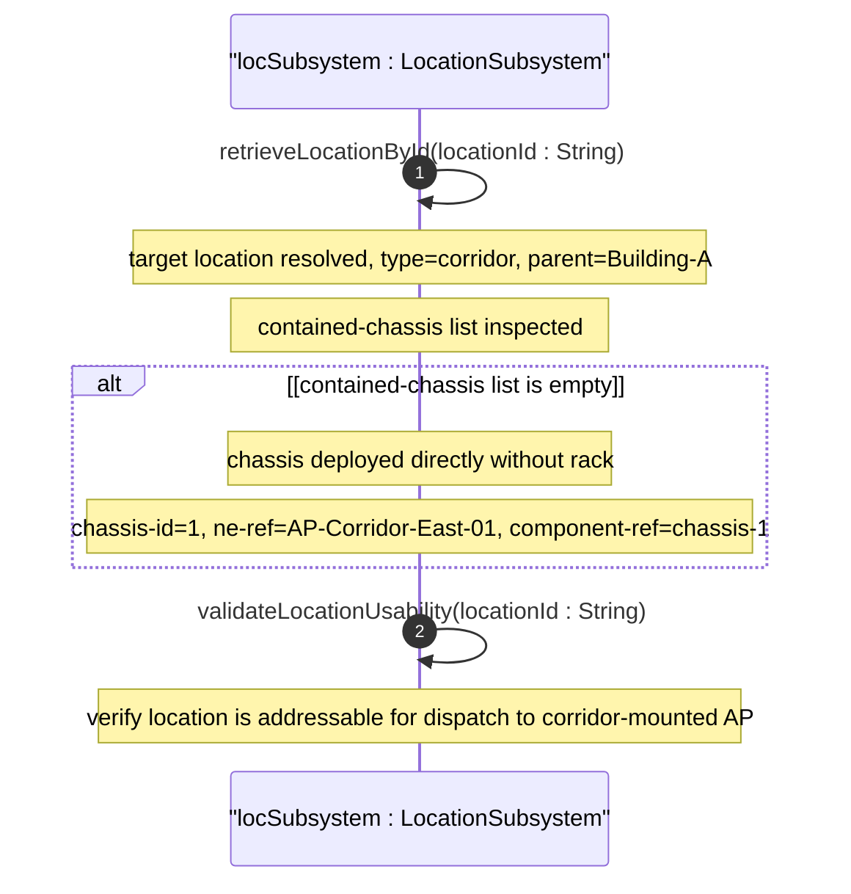

# User Story: Deploy Chassis Directly at a Location Without Rack

## Parent Epic
- [ ] #6 - [Network Inventory Location](https://github.com/gintatkinson/3dgs-030/blob/main/docs/epics/epic-01-network-location-inventory.md) — Non-rack chassis deployment is a location-scoped inventory operation within the location subsystem

## Domain Object Mapping
- **Primary Domain Objects:** nil:locations/location/contained-chassis (chassis directly at location without rack), nil:locations/location (hierarchical location entry)
- **Actor/Role:** Network Deployment Engineer

## BDD Scenario (OOA/OOD Realization)
**As a** Network Deployment Engineer
**I want to** record a chassis deployed directly at a location without any equipment rack
**So that** ceiling-mounted access points, wall-mounted switches, and other non-rack equipment are traceable within the physical inventory

**Given** a location Corridor-East of type corridor exists with parent Building-A
**When** a Wi-Fi access point AP-01 is ceiling-mounted in Corridor-East, and a controller records its chassis in contained-chassis with chassis-id=1, ne-ref=AP-Corridor-East-01, component-ref=chassis-1
**Then** the location Corridor-East's contained-chassis list includes the AP-01 entry
**And** the chassis entry carries a unique chassis-id key within that location scope
**And** ne-ref resolves to the logical network element AP-Corridor-East-01
**And** component-ref resolves to the specific chassis component within that network element
**And** no rack association is required

## UML Sequence Diagram

## Operational Context
From Appendix A.1, Non-Rack Deployment — Access Point Example:

A Wi-Fi access point deployed without a physical rack, ceiling-mounted in a corridor. The chassis is recorded directly in the location's contained-chassis list with a direct ne-ref to the network element and component-ref to the specific chassis component. The location itself is nested within a parent location forming a hierarchy.

## Required Features Matrix
- [ ] #1 - [Manage Hierarchical Location Inventory](https://github.com/gintatkinson/3dgs-030/blob/main/docs/features/feat-01-location-management.md) (contained-chassis list within location supports chassis directly deployed without rack, chassis-id key, ne-ref and component-ref leafrefs)

## Source References
Structural Schema: ietf-ni-location@2026-07-06.yang (Clause: list contained-chassis within list location, leaves chassis-id, ne-ref, component-ref)
Normative Specification: draft-ietf-ivy-network-inventory-location (Clause: Appendix A.1 - Non-Rack Deployment: Wi-Fi AP Ceiling-Mounted)
