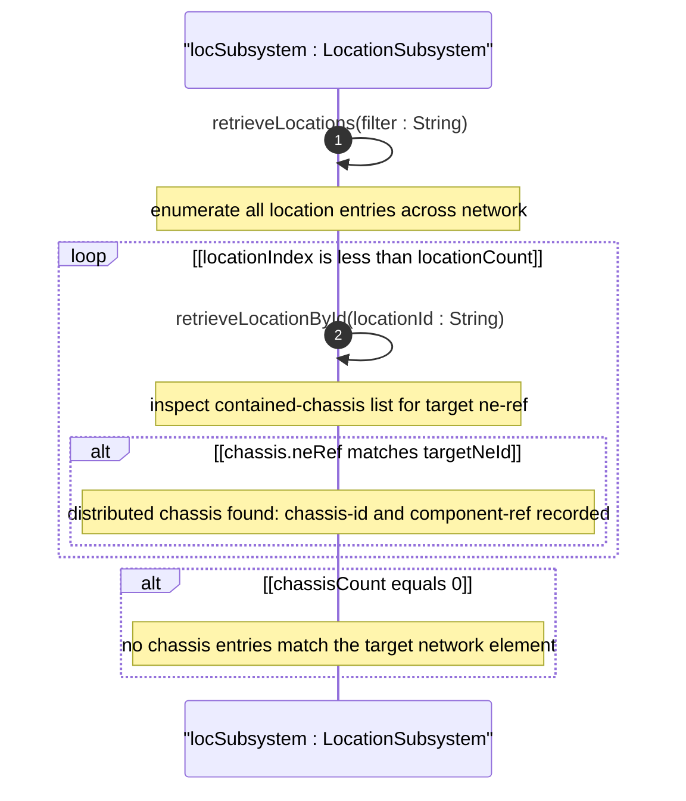
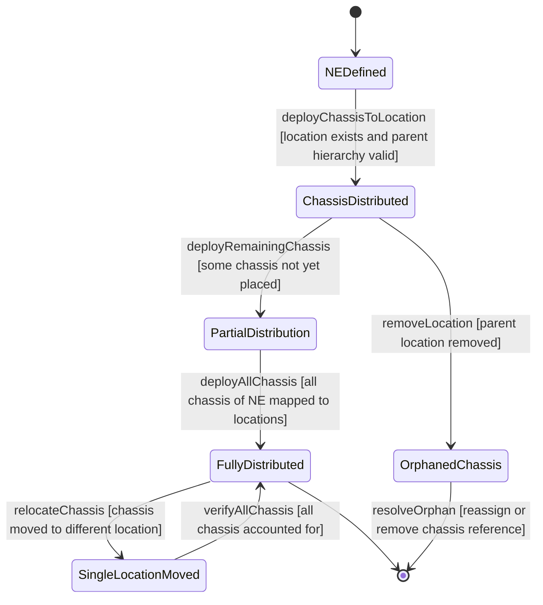

# User Story: Map Distributed Network Element Across Multiple Locations

## Parent Epic
- [ ] #6 - [Network Inventory Location](https://github.com/gintatkinson/3dgs-030/blob/main/docs/epics/epic-01-network-location-inventory.md) — Multi-chassis distributed NE spans multiple location entries via common ne-ref in contained-chassis lists

## Domain Object Mapping
- **Primary Domain Objects:** nil:locations/location/contained-chassis (chassis entries with ne-ref and component-ref leafrefs), nwi:network-elements/network-element (logical network element entity)
- **Actor/Role:** Network Inventory Manager

## BDD Scenario (OOA/OOD Realization)
**As a** Network Inventory Manager
**I want to** track a single logical network element whose chassis components are physically distributed across multiple locations
**So that** I have a complete view of the physical topology of a distributed system for maintenance and troubleshooting

**Given** a stack switch network element NE-Stack-01 has three chassis components (chassis-1, chassis-2, chassis-3) physically located in different rooms (Room-101 on Floor-1, Room-201 on Floor-2, Room-301 on Floor-3)
**When** all three chassis entries are recorded in their respective location contained-chassis lists, each with the same ne-ref=NE-Stack-01 but distinct chassis-id and component-ref values
**Then** querying for ne-ref=NE-Stack-01 across all locations returns three chassis entries
**And** each entry resolves to a different location with a distinct chassis-id
**And** each component-ref resolves to the correct chassis component within the NE
**And** the logical NE identity NE-Stack-01 is preserved across all physical locations

## UML Sequence Diagram

## UML State Machine Diagram

## Operational Context
From Appendix A.2, Distributed Multi-Chassis Network Element Deployment:

A stack switch is logically a single network element but its three chassis components are physically deployed in three different rooms on three different floors. Each chassis entry appears in the contained-chassis list of its respective location, referencing the same ne-ref value to maintain the logical NE grouping. The component-ref uniquely identifies each chassis component within the distributed network element.

## Required Features Matrix
- [ ] #1 - [Manage Hierarchical Location Inventory](https://github.com/gintatkinson/3dgs-030/blob/main/docs/features/feat-01-location-management.md) (contained-chassis list supports multiple entries with same ne-ref for distributed NEs, chassis-id key per location, ne-ref leafref to /nwi:network-elements/network-element/ne-id, component-ref conditional leafref)
- [ ] #2 - [Capture Physical Address Information](https://github.com/gintatkinson/3dgs-030/blob/main/docs/features/feat-02-physical-address.md) (each chassis location carries physical address for physical dispatch to the correct site)
- [ ] #3 - [Capture Geographic Location Coordinates](https://github.com/gintatkinson/3dgs-030/blob/main/docs/features/feat-03-geographic-location.md) (each chassis location may carry geo-location for spatial mapping of distributed components)

## Source References
Structural Schema: ietf-ni-location@2026-07-06.yang (Clause: list contained-chassis within list location, leaves ne-ref type leafref to ../nwi:network-elements/nwi:network-element/nwi:ne-id, component-ref type leafref conditional on ne-ref)
Normative Specification: draft-ietf-ivy-network-inventory-location (Clause: Appendix A.2 - Distributed Multi-Chassis Network Element Deployment)
