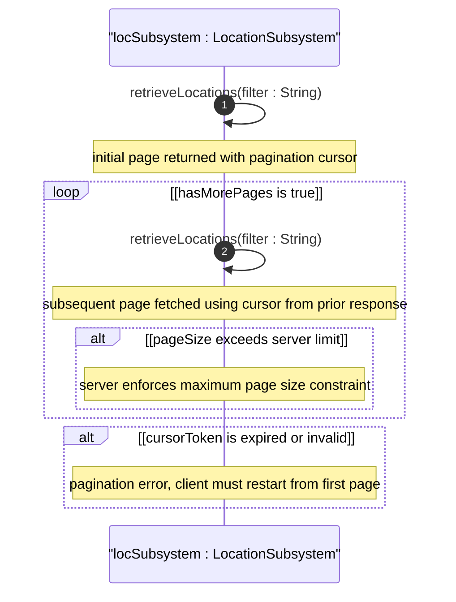

# User Story: Query Location Inventory with Pagination

## Parent Epic
- [ ] #6 - [Network Inventory Location](https://github.com/gintatkinson/3dgs-030/blob/main/docs/epics/epic-01-network-location-inventory.md) — Large-scale inventory queries fall under location data retrieval, a core operation of the location subsystem

## Domain Object Mapping
- **Primary Domain Objects:** nil:locations/location (paginated list of location entries), nil:locations/racks/rack (paginated list of rack entries)
- **Actor/Role:** OSS System (Operations Support System consuming read-only location state)

## BDD Scenario (OOA/OOD Realization)
**As an** OSS System
**I want to** retrieve location and rack inventory data in paginated chunks
**So that** large-scale queries do not overload the server with excessive result sets

**Given** the operational datastore contains 100,000 location entries across a global network
**When** the OSS system queries for all locations with a page size of 500 entries using RESTCONF GET with offset and limit parameters, or NETCONF get with pagination attributes
**Then** only 500 location entries are returned per response page
**And** each response includes a pagination marker or cursor for the next page
**And** the OSS system can iterate through all pages without server timeout
**And** the server does not construct in-memory result sets exceeding the page size

## UML Sequence Diagram

## Operational Context
From RFC XXXX, Section 6 (Operational Considerations):

In large-scale network inventory deployments with thousands of locations and racks, OSS systems consuming location data must use pagination mechanisms to avoid server overload. Queries that would return unbounded result sets should be paginated. The model itself does not define a pagination protocol; implementations should use the standard pagination mechanisms provided by the underlying management protocol (e.g., RESTCONF offset/limit or NETCONF with-cursor).

## Required Features Matrix
- [ ] #1 - [Manage Hierarchical Location Inventory](https://github.com/gintatkinson/3dgs-030/blob/main/docs/features/feat-01-location-management.md) (location list retrieval is the primary data source requiring pagination at scale)

## Source References
Structural Schema: ietf-ni-location@2026-07-06.yang (Clause: list location key id, list rack key id)
Normative Specification: draft-ietf-ivy-network-inventory-location (Clause: Section 6 - Operational Considerations, pagination requirement for large-scale queries)
