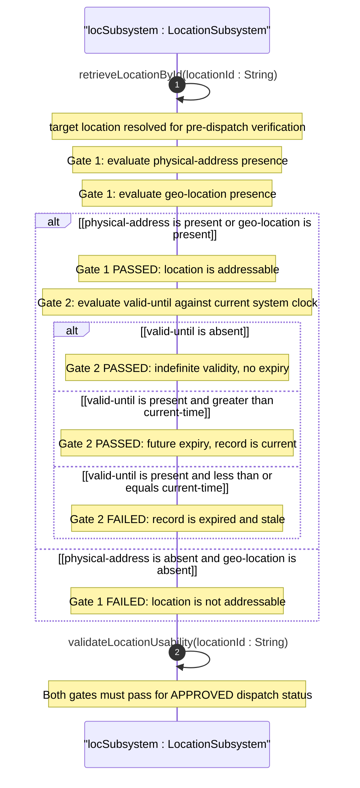
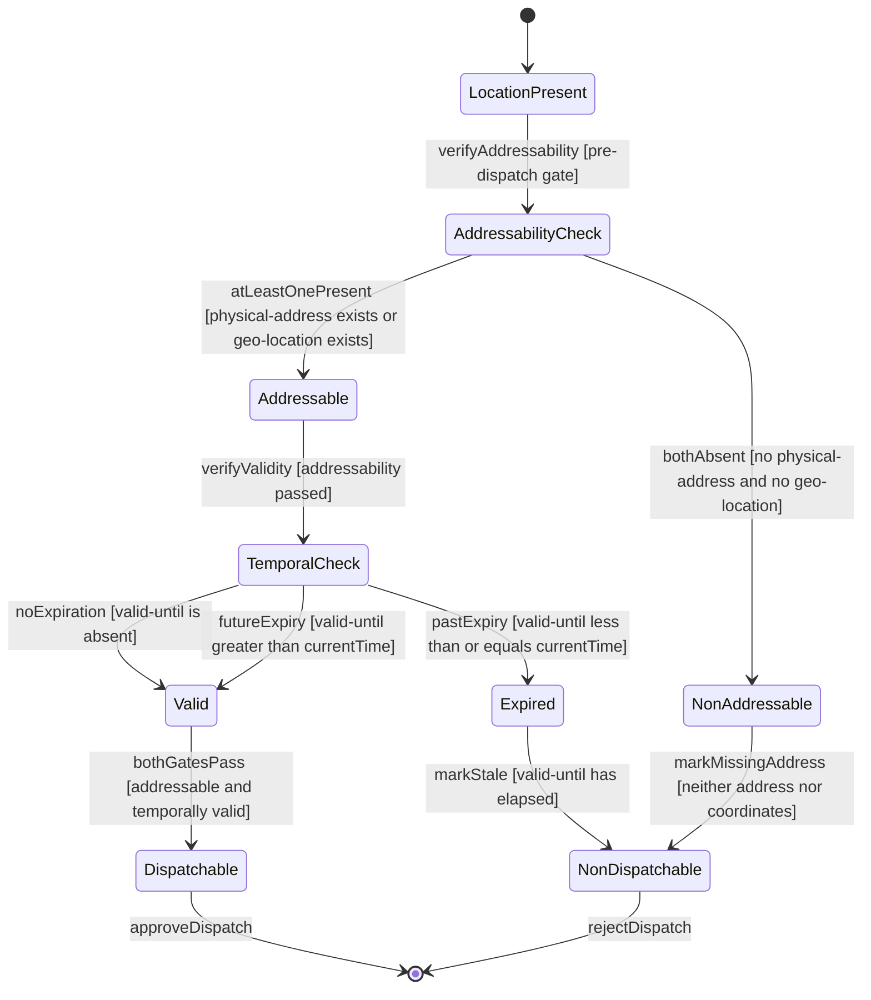

# User Story: Verify Location Data Quality for Operational Dispatch

## Parent Epic
- [ ] #6 - [Network Inventory Location](https://github.com/gintatkinson/3dgs-030/blob/main/docs/epics/epic-01-network-location-inventory.md) — Data quality verification is a critical operational gate before using any location for dispatch, touching physical-address, geo-location, and valid-until attributes

## Domain Object Mapping
- **Primary Domain Objects:** nil:locations/location (with valid-until, physical-address, geo-location), nil:locations/location/physical-address (structured postal address), nil:locations/location/geo-location (geographic coordinates from RFC 9179)
- **Actor/Role:** Field Dispatch Scheduler (operational staff validating location data before field operations)

## BDD Scenario (OOA/OOD Realization)
**As a** Field Dispatch Scheduler
**I want to** programmatically verify that a location has sufficient data quality for operational dispatch
**So that** field teams are not sent to locations with missing or ambiguous physical addressing and expired records are never used for planning

**Given** a location record exists in the operational datastore
**When** the scheduler invokes the location data quality verification algorithm before dispatching a field team
**Then** the verification logic evaluates two independent quality gates:

**Gate 1 — Addressability (OR condition):**
- If at least one of physical-address or geo-location is present, the gate passes
- If both physical-address and geo-location are absent, the gate fails and the location is marked non-dispatchable

**Gate 2 — Temporal Validity (AND condition):**
- If valid-until is absent (no expiration), the gate passes
- If valid-until is present AND represents a future timestamp (valid-until > current-time), the gate passes
- If valid-until is present AND represents a past or current timestamp (valid-until <= current-time), the gate fails and the location is marked expired

**And** both gates must pass for the location to be usable for operational dispatch

## UML Sequence Diagram

## UML State Machine Diagram

## Operational Context
From RFC XXXX, Section 6 (Operational Considerations):

Before using a location for field dispatch or planning, verification is required to ensure:
(a) At least one of physical-address or geo-location is present — without either, the location cannot be physically located by field personnel.
(b) The valid-until leaf is either not present or indicates a future time — if valid-until is present and represents a past timestamp, the location record is stale and MUST NOT be used operationally.

Both conditions must be satisfied for the location to be considered usable for operational dispatch.

## Required Features Matrix
- [ ] #1 - [Manage Hierarchical Location Inventory](https://github.com/gintatkinson/3dgs-030/blob/main/docs/features/feat-01-location-management.md) (location carries valid-until leaf for temporal validity checks, and is the context for the data quality verification algorithm)
- [ ] #2 - [Capture Physical Address Information](https://github.com/gintatkinson/3dgs-030/blob/main/docs/features/feat-02-physical-address.md) (physical-address container is one of the two addressability sources for Gate 1)
- [ ] #3 - [Capture Geographic Location Coordinates](https://github.com/gintatkinson/3dgs-030/blob/main/docs/features/feat-03-geographic-location.md) (geo-location container is the alternate addressability source for Gate 1)

## Source References
Structural Schema: ietf-ni-location@2026-07-06.yang (Clause: leaf valid-until type yang:date-and-time, grouping physical-address, uses geo:geo-location)
Normative Specification: draft-ietf-ivy-network-inventory-location (Clause: Section 6 - Operational Considerations, data quality verification requirements)
