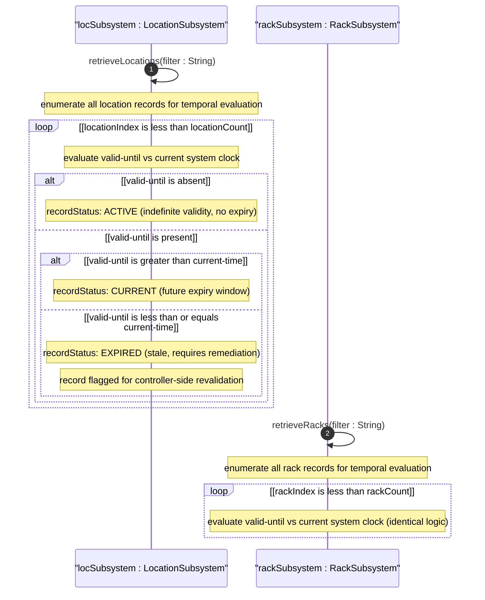
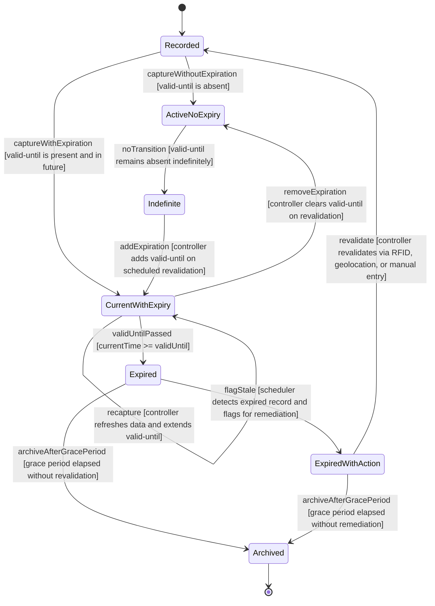

# User Story: Detect and Handle Expired Location and Rack Records

## Parent Epic
- [ ] #6 - [Network Inventory Location](https://github.com/gintatkinson/3dgs-030/blob/main/docs/epics/epic-01-network-location-inventory.md) — Location temporal expiration lifecycle is a core operational concern of the location subsystem
- [ ] #7 - [Rack Inventory Management](https://github.com/gintatkinson/3dgs-030/blob/main/docs/epics/epic-02-rack-inventory-management.md) — Rack temporal expiration lifecycle mirrors the location lifecycle, with identical valid-until semantics

## Domain Object Mapping
- **Primary Domain Objects:** nil:locations/location (with timestamp and valid-until leaves), nil:locations/racks/rack (with timestamp and valid-until leaves)
- **Actor/Role:** Inventory Lifecycle Manager (controller-side system monitoring record freshness)

## BDD Scenario (OOA/OOD Realization)
**As an** Inventory Lifecycle Manager
**I want to** automatically detect when location and rack records have passed their valid-until expiration timestamp
**So that** stale records are prevented from being used in operational contexts and can be flagged for remediation

**Given** multiple location and rack records exist in the operational datastore, each with an optional timestamp (recording when the record was last captured) and an optional valid-until (defining the record's expiration time)
**When** the lifecycle manager evaluates each record's temporal status against the current system clock

**Then** the evaluation logic produces one of three states:

**State A — Active (no expiration set):**
- Given a record where valid-until is absent
- When the record's temporal status is checked
- Then the record is classified as Active with indefinite validity

**State B — Current (future expiration):**
- Given a record where valid-until is present and represents a timestamp strictly greater than the current time
- When the record's temporal status is checked
- Then the record is classified as Current with remaining validity window

**State C — Expired (past expiration):**
- Given a record where valid-until is present and represents a timestamp less than or equal to the current time
- When the record's temporal status is checked
- Then the record is classified as Expired (stale)
- And the record MUST NOT be used for operational dispatch or planning
- And the record should be flagged for controller-side remediation (revalidation via RFID, geolocation service, or manual re-entry)

**And** the timestamp leaf records when the location or rack information was last captured, providing an audit trail for freshness

## UML Sequence Diagram

## UML State Machine Diagram

## Operational Context
From RFC XXXX, Section 6 (Operational Considerations):

The timestamp leaf records the last update time for the location or rack information. The valid-until leaf, if present, defines when the record expires. Once valid-until has passed, the location or rack record is considered stale and MUST NOT be used operationally. Stale records require controller-side remediation through automated tooling (RFID, geolocation services) or manual re-entry to restore currency.

Both locations and racks share identical temporal semantics: timestamp for audit trail, valid-until for expiration lifecycle, and the requirement to check validity before operational use.

## Required Features Matrix
- [ ] #1 - [Manage Hierarchical Location Inventory](https://github.com/gintatkinson/3dgs-030/blob/main/docs/features/feat-01-location-management.md) (location carries timestamp and valid-until leaves of type yang:date-and-time, location stale detection is part of data quality verification)
- [ ] #4 - [Manage Rack Inventory](https://github.com/gintatkinson/3dgs-030/blob/main/docs/features/feat-04-rack-management.md) (rack carries timestamp and valid-until leaves with identical temporal semantics to location)

## Source References
Structural Schema: ietf-ni-location@2026-07-06.yang (Clause: leaf timestamp type yang:date-and-time in list location, leaf valid-until type yang:date-and-time in list location, leaf timestamp in list rack, leaf valid-until in list rack)
Normative Specification: draft-ietf-ivy-network-inventory-location (Clause: Section 6 - Operational Considerations, temporal validity and expiration requirements)
