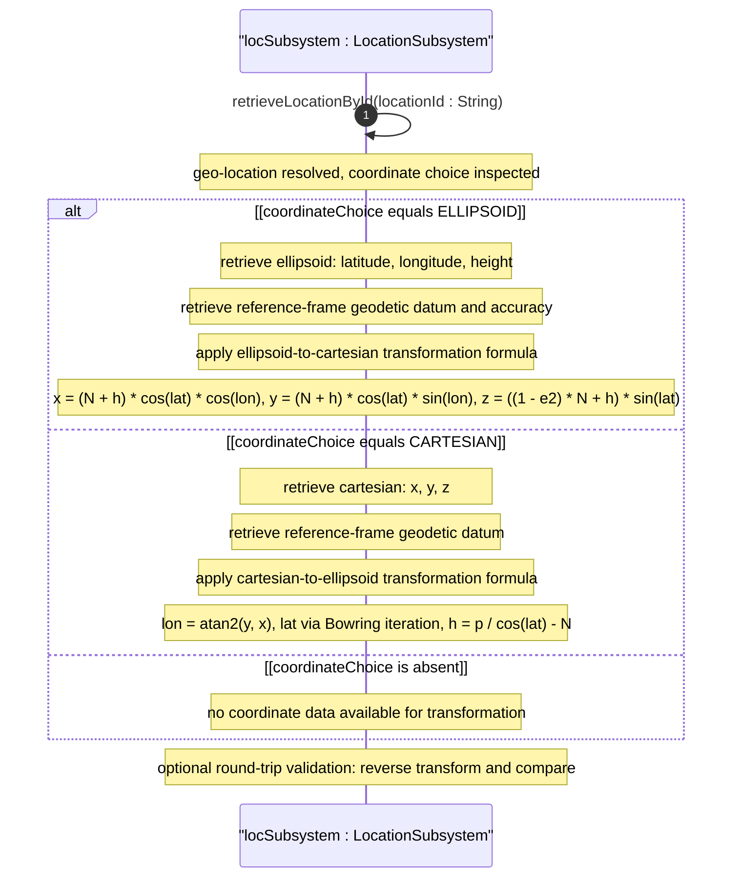
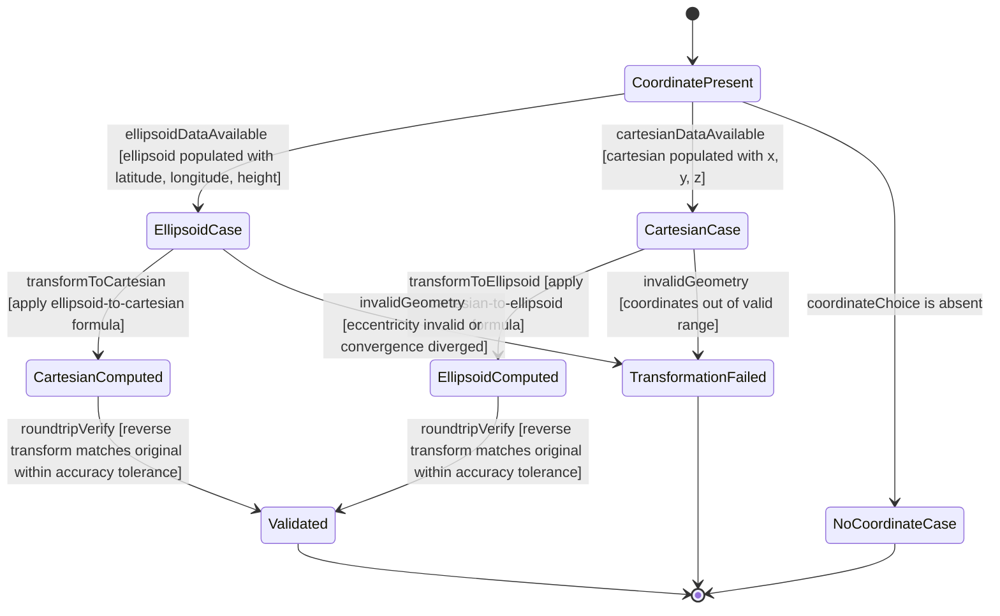

# User Story: Transform Geographic Coordinates Between Reference Systems

## Parent Epic
- [ ] #6 - [Network Inventory Location](https://github.com/gintatkinson/3dgs-030/blob/main/docs/epics/epic-01-network-location-inventory.md) — Coordinate transformation operates on geo-location data which is part of the location subsystem, leveraging the RFC 9179 geo-location grouping with its ellipsoid/cartesian choice

## Domain Object Mapping
- **Primary Domain Objects:** nil:locations/location/geo-location (with ellipsoid and cartesian coordinate choice), nil:locations/location/geo-location/reference-frame/geodetic-system (geodetic datum and accuracy)
- **Actor/Role:** GIS Analyst (geospatial analyst performing coordinate system transformations)

## BDD Scenario (OOA/OOD Realization)
**As a** GIS Analyst
**I want to** transform geographic coordinates between ellipsoidal (latitude, longitude, height) and Cartesian (x, y, z) reference systems
**So that** location coordinates can be compared, integrated, and visualized across different geospatial tools and coordinate systems

**Given** a location has geo-location coordinates recorded in the ellipsoid case with latitude (decimal degrees), longitude (decimal degrees), and height (meters above ellipsoid) within a geodetic datum such as WGS-84
**When** the analyst requests a transformation from ellipsoidal to Cartesian coordinates
**Then** a coordinate transformation algorithm computes the equivalent Cartesian (x, y, z) coordinates:

**Ellipsoid to Cartesian Formula:**
For an ellipsoid with semi-major axis a and flattening factor f:
- N = a / sqrt(1 - e squared times sin squared of latitude) where e squared = 2f - f squared
- x = (N + h) times cos(latitude) times cos(longitude)
- y = (N + h) times cos(latitude) times sin(longitude)
- z = ((1 - e squared) times N + h) times sin(latitude)

**Cartesian to Ellipsoid Formula:**
Given Cartesian coordinates (x, y, z):
- Compute longitude: longitude = atan2(y, x)
- Compute latitude iteratively using Bowring's method until convergence
- Compute height: h = p / cos(latitude) - N where p = sqrt(x squared + y squared)

**And** the transformation respects the accuracy metadata (coord-accuracy, height-accuracy) in the geodetic system of the reference frame
**And** both ellipsoidal and Cartesian forms can be validated against each other via round-trip conversion

## UML Sequence Diagram

## UML State Machine Diagram

## Operational Context
From RFC XXXX, Section 2 (Hierarchical Locations of Network Inventory):

The Network Inventory location model includes provisions for geo-location data (geographic coordinates). The geo-location grouping from RFC 9179 provides a choice between ellipsoidal and Cartesian coordinate representations within a common reference frame.

From RFC 9179 (Section 1, Introduction):

The grouping is designed to be used by other YANG modules that need to express the concept of a physical location, supporting ellipsoidal coordinates (latitude, longitude, height), Cartesian coordinates (x, y, z), and optionally velocity vectors.

## Required Features Matrix
- [ ] #3 - [Capture Geographic Location Coordinates](https://github.com/gintatkinson/3dgs-030/blob/main/docs/features/feat-03-geographic-location.md) (geo-location carries the ellipsoid/cartesian choice, reference-frame with geodetic-system including geodetic-datum, coord-accuracy, and height-accuracy which are prerequisites for accurate coordinate transformation)

## Source References
Structural Schema: ietf-ni-location@2026-07-06.yang (Clause: uses geo:geo-location in list location, providing ellipsoid and cartesian coordinate choice)
External Schema: RFC 9179 - A YANG Grouping for Geographic Locations (grouping geo-location, choice between ellipsoid and cartesian cases, reference-frame with geodetic system)
Normative Specification: draft-ietf-ivy-network-inventory-location (Clause: Section 2 - geographic coordinate provisions, Section 4 tree diagram showing geo-location)
