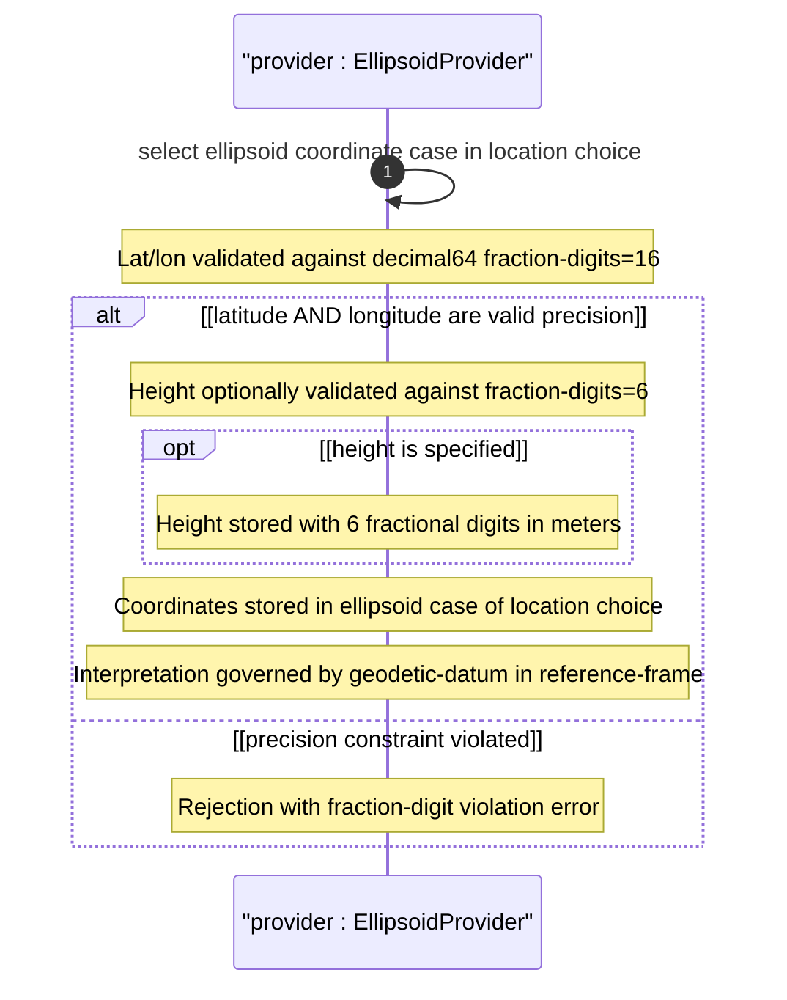

# User Story: Specify Geographic Location Using Ellipsoidal Coordinates

## Parent Epic
- [ ] #26 - [Geographic Location Module](https://github.com/gintatkinson/3dgs-030/blob/main/docs/epics/epic-03-geographic-location.md) (ellipsoidal coordinates are a case of the location choice within the geo-location grouping)

## Domain Object Mapping
- **Primary Domain Objects:** `geo-location/location` (choice), `geo-location/location/ellipsoid` (case: latitude, longitude, height), `geo-location/reference-frame/geodetic-system` (geodetic-datum defines coordinate meaning)
- **Actor/Role:** Location Data Provider (system or user recording a geographic position using latitude, longitude, and optional height)

## BDD Scenario (OOA/OOD Realization)
**As a** Location Data Provider
**I want to** specify a geographic location using ellipsoidal coordinates (latitude, longitude, and optional height) with high precision
**So that** the location is recorded in decimal degrees with up to 16 fractional digits, compatible with the geodetic datum defined in the reference frame

**Given** a geo-location container exists with a reference frame defining the geodetic datum
**When** the provider sets latitude to 40.7329700000000000 decimal degrees and longitude to -74.0076960000000000 decimal degrees with an optional height of 35.000000 meters
**Then** the ellipsoid case of the location choice is stored
**And** latitude and longitude are preserved with all 16 fractional decimal digits
**And** height is preserved with 6 fractional decimal digits
**And** the coordinate values are interpreted according to the geodetic-datum in the reference frame

## UML Sequence Diagram


## Operational Context
From RFC 9179, Section 2.2:

> This is the location on, or relative to, the astronomical object. It is specified using two or three coordinate values. These values are given either as 'latitude', 'longitude', and an optional 'height', or as Cartesian coordinates of 'x', 'y', and 'z'. For the standard location choice, 'latitude' and 'longitude' are specified as decimal degrees, and the 'height' value is in fractions of meters.

> In both choices, the exact meanings of all the values are defined by the 'geodetic-datum' value in Section 2.1.

From the YANG module schema:
- `leaf latitude`: type `decimal64 { fraction-digits 16; }`, units "decimal degrees"
- `leaf longitude`: type `decimal64 { fraction-digits 16; }`, units "decimal degrees"
- `leaf height`: type `decimal64 { fraction-digits 6; }`, units "meters"

## Required Features Matrix
- [ ] #21 - [Geo-Location Container](https://github.com/gintatkinson/3dgs-030/blob/main/docs/features/feat-06-geo-location-container.md) (the root container that hosts the location choice and temporal attributes)
- [ ] #24 - [Location Coordinates](https://github.com/gintatkinson/3dgs-030/blob/main/docs/features/feat-09-location-coordinates.md) (defines the ellipsoid case with latitude, longitude, and height leaves)
- [ ] #23 - [Geodetic System](https://github.com/gintatkinson/3dgs-030/blob/main/docs/features/feat-08-geodetic-system.md) (the geodetic-datum defines the meaning of latitude, longitude, and 0-height)
- [ ] #22 - [Reference Frame](https://github.com/gintatkinson/3dgs-030/blob/main/docs/features/feat-07-reference-frame.md) (defines the astronomical body on which ellipsoidal coordinates are measured)

## Source References
Structural Schema: [ietf-geo-location@2022-02-11.yang](https://github.com/YangModels/yang/blob/main/standard/ietf/RFC/ietf-geo-location%402022-02-11.yang) (Clause: choice location, case ellipsoid)
Normative Specification: [RFC 9179: A YANG Grouping for Geographic Locations](https://datatracker.ietf.org/doc/rfc9179/) (Clause: Section 2.2)

> [!WARNING]
> **Mermaid Block Closing Constraints & Code Fence Integrity:**
> - Every Mermaid diagram MUST be strictly closed with ``` on a new line. Leaking Mermaid blocks or stray/unclosed code fences will fail downstream validation checks.
> - **Semicolon Restriction**: Do NOT use semicolons (`;`) in sequence diagram `Note` statements or message text statements. Semicolons are not allowed.
