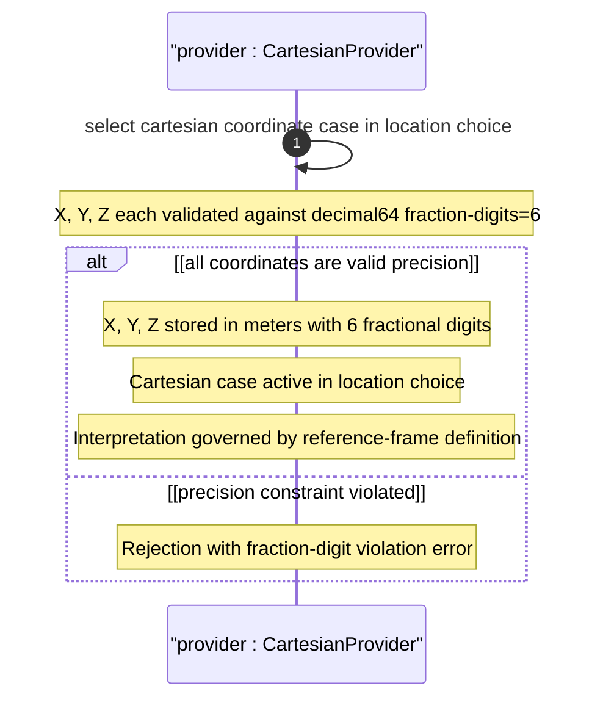

# User Story: Specify Geographic Location Using Cartesian Coordinates

## Parent Epic
- [ ] #26 - [Geographic Location Module](https://github.com/gintatkinson/3dgs-030/blob/main/docs/epics/epic-03-geographic-location.md) (Cartesian coordinates are a case of the location choice within the geo-location grouping)

## Domain Object Mapping
- **Primary Domain Objects:** `geo-location/location` (choice), `geo-location/location/cartesian` (case: x, y, z), `geo-location/reference-frame` (defines coordinate origin and axes meaning)
- **Actor/Role:** Location Data Provider (system or user recording a position using Cartesian x, y, z coordinates in meters)

## BDD Scenario (OOA/OOD Realization)
**As a** Location Data Provider
**I want to** specify a geographic location using Cartesian x, y, z coordinates in meters
**So that** the location is recorded as an alternative to ellipsoidal coordinates, with coordinates interpreted by the reference frame

**Given** a geo-location container exists with a reference frame defining the coordinate system
**When** the provider sets x=1330680.593000, y=-4652738.536000, and z=4138531.132000 meters
**Then** the Cartesian case of the location choice is stored
**And** each coordinate is preserved with 6 fractional decimal digits
**And** the coordinate values are interpreted according to the reference frame definition

## UML Sequence Diagram


## Operational Context
From RFC 9179, Section 2.2:

> For the Cartesian choice, 'x', 'y', and 'z' are in fractions of meters. In both choices, the exact meanings of all the values are defined by the 'geodetic-datum' value in Section 2.1.

From the YANG module schema:
- `leaf x`: type `decimal64 { fraction-digits 6; }`, units "meters", "The X value as defined by the reference-frame"
- `leaf y`: type `decimal64 { fraction-digits 6; }`, units "meters", "The Y value as defined by the reference-frame"
- `leaf z`: type `decimal64 { fraction-digits 6; }`, units "meters", "The Z value as defined by the reference-frame"

## Required Features Matrix
- [ ] #21 - [Geo-Location Container](https://github.com/gintatkinson/3dgs-030/blob/main/docs/features/feat-06-geo-location-container.md) (the root container that hosts the location choice)
- [ ] #24 - [Location Coordinates](https://github.com/gintatkinson/3dgs-030/blob/main/docs/features/feat-09-location-coordinates.md) (defines the Cartesian case with x, y, z leaves)
- [ ] #22 - [Reference Frame](https://github.com/gintatkinson/3dgs-030/blob/main/docs/features/feat-07-reference-frame.md) (defines the coordinate origin and axis meanings for Cartesian values)
- [ ] #23 - [Geodetic System](https://github.com/gintatkinson/3dgs-030/blob/main/docs/features/feat-08-geodetic-system.md) (the geodetic-datum defines the exact meaning of Cartesian coordinates)

## Source References
Structural Schema: [ietf-geo-location@2022-02-11.yang](https://github.com/YangModels/yang/blob/main/standard/ietf/RFC/ietf-geo-location%402022-02-11.yang) (Clause: choice location, case cartesian)
Normative Specification: [RFC 9179: A YANG Grouping for Geographic Locations](https://datatracker.ietf.org/doc/rfc9179/) (Clause: Section 2.2)

> [!WARNING]
> **Mermaid Block Closing Constraints & Code Fence Integrity:**
> - Every Mermaid diagram MUST be strictly closed with ``` on a new line. Leaking Mermaid blocks or stray/unclosed code fences will fail downstream validation checks.
> - **Semicolon Restriction**: Do NOT use semicolons (`;`) in sequence diagram `Note` statements or message text statements. Semicolons are not allowed.
