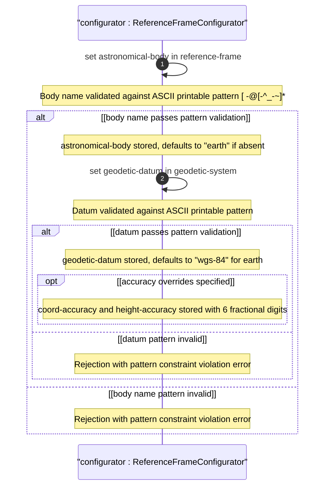

# User Story: Define Frame of Reference for Geographic Location Interpretation

## Parent Epic
- [ ] #26 - [Geographic Location Module](https://github.com/gintatkinson/3dgs-030/blob/main/docs/epics/epic-03-geographic-location.md) (reference-frame is the foundational container defining coordinate meaning for all location data)

## Domain Object Mapping
- **Primary Domain Objects:** `geo-location/reference-frame` (container), `geo-location/reference-frame/astronomical-body` (leaf, default "earth"), `geo-location/reference-frame/geodetic-system` (container with geodetic-datum and accuracy overrides)
- **Actor/Role:** Location System Configurator (system or user defining the frame of reference for location data interpretation)

## BDD Scenario (OOA/OOD Realization)
**As a** Location System Configurator
**I want to** define the frame of reference by selecting the astronomical body and geodetic datum
**So that** all location coordinates are interpreted correctly relative to the specified body and datum system

**Given** a geo-location container is being configured
**When** the configurator sets astronomical-body to "mars" and geodetic-datum to "mars-2000" with optional coord-accuracy of 0.5 meters and height-accuracy of 1.0 meters
**Then** the reference frame stores "mars" as the astronomical body
**And** the geodetic system uses "mars-2000" for coordinate interpretation
**And** the accuracy overrides are recorded with 6 fractional decimal digits
**And** if astronomical-body is not specified it defaults to "earth" and geodetic-datum defaults to "wgs-84"

## UML Sequence Diagram


## Operational Context
From RFC 9179, Section 2.1:

> The frame of reference ('reference-frame') defines what the location values refer to and their meaning. The referred-to object can be any astronomical body. It could be a planet such as Earth or Mars, a moon such as Enceladus, an asteroid such as Ceres, or even a comet such as 1P/Halley. This value is specified in 'astronomical-body' and is defined by the International Astronomical Union. The default 'astronomical-body' value is 'earth'.

> In addition to identifying the astronomical body, we also need to define the meaning of the coordinates (e.g., latitude and longitude) and the definition of 0-height. This is done with a 'geodetic-datum' value. The default value for 'geodetic-datum' is 'wgs-84' (i.e., the World Geodetic System).

> In addition to the 'geodetic-datum' value, we allow overriding the coordinate and height accuracy using 'coord-accuracy' and 'height-accuracy', respectively. When specified, these values override the defaults implied by the 'geodetic-datum' value.

## Required Features Matrix
- [ ] #21 - [Geo-Location Container](https://github.com/gintatkinson/3dgs-030/blob/main/docs/features/feat-06-geo-location-container.md) (the root container that hosts the reference-frame sub-container)
- [ ] #22 - [Reference Frame](https://github.com/gintatkinson/3dgs-030/blob/main/docs/features/feat-07-reference-frame.md) (defines the astronomical-body leaf with default "earth" and pattern constraint)
- [ ] #23 - [Geodetic System](https://github.com/gintatkinson/3dgs-030/blob/main/docs/features/feat-08-geodetic-system.md) (defines geodetic-datum default "wgs-84", coord-accuracy, and height-accuracy leaves)

## Source References
Structural Schema: [ietf-geo-location@2022-02-11.yang](https://github.com/YangModels/yang/blob/main/standard/ietf/RFC/ietf-geo-location%402022-02-11.yang) (Clause: container reference-frame, container geodetic-system)
Normative Specification: [RFC 9179: A YANG Grouping for Geographic Locations](https://datatracker.ietf.org/doc/rfc9179/) (Clause: Section 2.1)

> [!WARNING]
> **Mermaid Block Closing Constraints & Code Fence Integrity:**
> - Every Mermaid diagram MUST be strictly closed with ``` on a new line. Leaking Mermaid blocks or stray/unclosed code fences will fail downstream validation checks.
> - **Semicolon Restriction**: Do NOT use semicolons (`;`) in sequence diagram `Note` statements or message text statements. Semicolons are not allowed.
