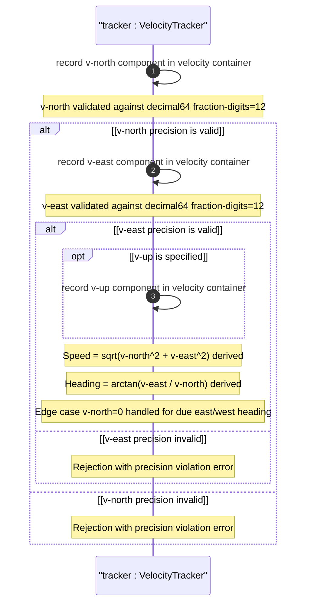

# User Story: Track Objects in Motion Using a Three-Dimensional Velocity Vector

## Parent Epic
- [ ] #26 - [Geographic Location Module](https://github.com/gintatkinson/3dgs-030/blob/main/docs/epics/epic-03-geographic-location.md) (velocity vector is a sub-container of geo-location describing object motion)

## Domain Object Mapping
- **Primary Domain Objects:** `geo-location/velocity` (container), `geo-location/velocity/v-north` (leaf, m/s), `geo-location/velocity/v-east` (leaf, m/s), `geo-location/velocity/v-up` (leaf, m/s), `geo-location/reference-frame/geodetic-system` (defines true north reference)
- **Actor/Role:** Motion Tracking System (system recording an object's motion at the time specified by the geo-location timestamp)

## BDD Scenario (OOA/OOD Realization)
**As a** Motion Tracking System
**I want to** record a three-dimensional velocity vector with v-north, v-east, and v-up components in meters per second
**So that** the object's speed and direction of motion at the timestamp can be derived and tracked over time

**Given** a geo-location container exists with a reference frame defining true north
**When** the tracking system sets v-north=1.500000000000 m/s, v-east=0.000000000000 m/s, and v-up=0.050000000000 m/s
**Then** the velocity vector is stored with all 12 fractional decimal digits per component
**And** the two-dimensional speed is derived as sqrt(v_north^2 + v_east^2) = 1.5 m/s
**And** the heading is derived as arctan(v_east / v_north) = 0 degrees (true north)
**And** partial velocity components are supported when some components are absent

## UML Sequence Diagram


## Operational Context
From RFC 9179, Section 2.3:

> Support is added for objects in relatively stable motion. For objects in relatively stable motion, the grouping provides a three-dimensional vector value. The components of the vector are 'v-north', 'v-east', and 'v-up', which are all given in fractional meters per second. The values 'v-north' and 'v-east' are relative to true north as defined by the reference frame for the astronomical body; 'v-up' is perpendicular to the plane defined by 'v-north' and 'v-east', and is pointed away from the center of mass.

> For some applications that demand high accuracy and where the data is infrequently updated, this velocity vector can track very slow movement such as continental drift.

## Required Features Matrix
- [ ] #21 - [Geo-Location Container](https://github.com/gintatkinson/3dgs-030/blob/main/docs/features/feat-06-geo-location-container.md) (the root container that hosts the velocity sub-container)
- [ ] #25 - [Velocity Vector](https://github.com/gintatkinson/3dgs-030/blob/main/docs/features/feat-10-velocity-vector.md) (defines v-north, v-east, v-up leaves with decimal64 fraction-digits 12)
- [ ] #22 - [Reference Frame](https://github.com/gintatkinson/3dgs-030/blob/main/docs/features/feat-07-reference-frame.md) (defines the true north reference for v-north and v-east interpretation)

## Source References
Structural Schema: [ietf-geo-location@2022-02-11.yang](https://github.com/YangModels/yang/blob/main/standard/ietf/RFC/ietf-geo-location%402022-02-11.yang) (Clause: container velocity)
Normative Specification: [RFC 9179: A YANG Grouping for Geographic Locations](https://datatracker.ietf.org/doc/rfc9179/) (Clause: Section 2.3)

> [!WARNING]
> **Mermaid Block Closing Constraints & Code Fence Integrity:**
> - Every Mermaid diagram MUST be strictly closed with ``` on a new line. Leaking Mermaid blocks or stray/unclosed code fences will fail downstream validation checks.
> - **Semicolon Restriction**: Do NOT use semicolons (`;`) in sequence diagram `Note` statements or message text statements. Semicolons are not allowed.
