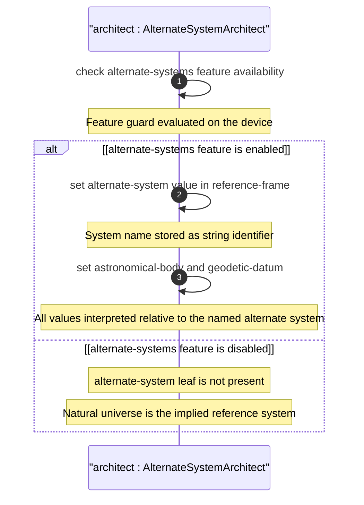

# User Story: Use Alternate Reference Systems for Virtual or Non-Natural Environments

## Parent Epic
- [ ] #26 - [Geographic Location Module](https://github.com/gintatkinson/3dgs-030/blob/main/docs/epics/epic-03-geographic-location.md) (alternate-systems is a feature-guarded capability within the reference-frame)

## Domain Object Mapping
- **Primary Domain Objects:** `geo-location/reference-frame` (container), `geo-location/reference-frame/alternate-system` (leaf, if-feature "alternate-systems"), `feature alternate-systems` (YANG feature guard)
- **Actor/Role:** Virtual Environment Architect (system or user configuring locations in simulated, virtual, or non-natural-universe coordinate systems)

## BDD Scenario (OOA/OOD Realization)
**As a** Virtual Environment Architect
**I want to** specify an alternate reference system for location coordinates
**So that** locations can be defined in virtual realities, simulations, or non-natural-universe coordinate systems distinct from the default natural universe

**Given** the YANG feature "alternate-systems" is enabled on the device
**When** the architect sets alternate-system to "simulation-vr-001" along with astronomical-body "mars" and geodetic-datum "mars-2000"
**Then** the reference frame stores the alternate system identifier
**And** all coordinate values are interpreted relative to the named alternate system
**And** when the feature is disabled the alternate-system leaf is not present in the data

## UML Sequence Diagram


## Operational Context
From RFC 9179, Section 2.1:

> Finally, we define an optional feature that allows for changing the system for which the above values are defined. This optional feature adds an 'alternate-system' value to the reference frame. This value is normally not present, which implies the natural universe is the system. The use of this value is intended to allow for creating virtual realities or perhaps alternate coordinate systems. The definition of alternate systems is outside the scope of this document.

From the YANG module schema:
- `feature alternate-systems`: "This feature means the device supports specifying locations using alternate systems for reference frames"
- `leaf alternate-system`: `if-feature "alternate-systems"`, type string, "The system in which the astronomical body and geodetic-datum is defined"

## Required Features Matrix
- [ ] #21 - [Geo-Location Container](https://github.com/gintatkinson/3dgs-030/blob/main/docs/features/feat-06-geo-location-container.md) (the root container that hosts the reference-frame sub-container)
- [ ] #22 - [Reference Frame](https://github.com/gintatkinson/3dgs-030/blob/main/docs/features/feat-07-reference-frame.md) (defines the alternate-system leaf guarded by the alternate-systems feature)
- [ ] #23 - [Geodetic System](https://github.com/gintatkinson/3dgs-030/blob/main/docs/features/feat-08-geodetic-system.md) (geodetic-datum interpretation is modified by the alternate system)

## Source References
Structural Schema: [ietf-geo-location@2022-02-11.yang](https://github.com/YangModels/yang/blob/main/standard/ietf/RFC/ietf-geo-location%402022-02-11.yang) (Clause: feature alternate-systems, leaf alternate-system)
Normative Specification: [RFC 9179: A YANG Grouping for Geographic Locations](https://datatracker.ietf.org/doc/rfc9179/) (Clause: Section 2.1)

> [!WARNING]
> **Mermaid Block Closing Constraints & Code Fence Integrity:**
> - Every Mermaid diagram MUST be strictly closed with ``` on a new line. Leaking Mermaid blocks or stray/unclosed code fences will fail downstream validation checks.
> - **Semicolon Restriction**: Do NOT use semicolons (`;`) in sequence diagram `Note` statements or message text statements. Semicolons are not allowed.
