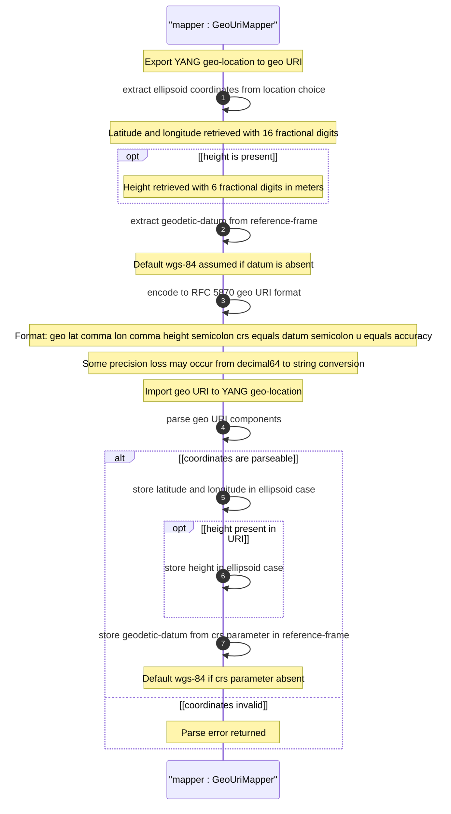

# User Story: Map Geographic Location to and from GEO URI Format

## Parent Epic
- [ ] #26 - [Geographic Location Module](https://github.com/gintatkinson/3dgs-030/blob/main/docs/epics/epic-03-geographic-location.md) (GEO URI mapping enables portability of geo-location data to RFC 5870 format)

## Domain Object Mapping
- **Primary Domain Objects:** `geo-location/location` (ellipsoid case: latitude, longitude, height), `geo-location/reference-frame/geodetic-system` (geodetic-datum maps to CRS parameter), `geo-location/reference-frame` (astronomical-body must be "earth"), `geo-location/timestamp` (time reference)
- **Actor/Role:** Data Interchange System (system converting between YANG geo-location data and RFC 5870 geo: URIs)

## BDD Scenario (OOA/OOD Realization)
**As a** Data Interchange System
**I want to** convert geographic location data between the YANG grouping format and RFC 5870 geo: URI strings
**So that** location data can be interchanged with systems using the standard geo: URI scheme

**Given** a geo-location with ellipsoidal coordinates latitude=48.8583424, longitude=2.3375084, height=35.0, geodetic-datum="wgs-84", and coord-accuracy=10.0
**When** the interchange system maps the data to a geo: URI
**Then** the resulting URI is "geo:48.8583424,2.3375084,35.0;crs=wgs-84;u=10.0"
**And** when parsing back from the geo: URI the YANG decimal64 precision constraints are honored
**And** the default CRS of "wgs-84" is assumed when the crs parameter is absent from the URI

## UML Sequence Diagram


## Operational Context
From RFC 9179, Section 5.1.1:

> RFC 5870 defines a standard URI value for geographic location data. It includes the ability to specify the 'geodetic-value' (it calls this 'crs') with the default being 'wgs-84'. For the location data, it allows two to three coordinates defined by the 'crs' value. For accuracy, it has a single 'u' parameter for specifying uncertainty.

> URI values can be mapped to and from the YANG grouping with the caveat that some loss of precision (in the extremes) may occur due to the YANG grouping using decimal64 values rather than strings.

## Required Features Matrix
- [ ] #21 - [Geo-Location Container](https://github.com/gintatkinson/3dgs-030/blob/main/docs/features/feat-06-geo-location-container.md) (the root container whose data is exported to or imported from geo: URI format)
- [ ] #24 - [Location Coordinates](https://github.com/gintatkinson/3dgs-030/blob/main/docs/features/feat-09-location-coordinates.md) (ellipsoidal latitude/longitude/height map to geo: URI coordinate values)
- [ ] #23 - [Geodetic System](https://github.com/gintatkinson/3dgs-030/blob/main/docs/features/feat-08-geodetic-system.md) (geodetic-datum maps to the crs parameter; coord-accuracy maps to the u parameter)
- [ ] #22 - [Reference Frame](https://github.com/gintatkinson/3dgs-030/blob/main/docs/features/feat-07-reference-frame.md) (astronomical-body must be "earth" for valid geo: URI mapping)

## Source References
Structural Schema: [ietf-geo-location@2022-02-11.yang](https://github.com/YangModels/yang/blob/main/standard/ietf/RFC/ietf-geo-location%402022-02-11.yang) (Clause: grouping geo-location, case ellipsoid, container geodetic-system)
Normative Specification: [RFC 9179: A YANG Grouping for Geographic Locations](https://datatracker.ietf.org/doc/rfc9179/) (Clause: Section 5.1.1)
Cross-Reference: [RFC 5870: A Uniform Resource Identifier for Geographic Locations](https://datatracker.ietf.org/doc/rfc5870/)

> [!WARNING]
> **Mermaid Block Closing Constraints & Code Fence Integrity:**
> - Every Mermaid diagram MUST be strictly closed with ``` on a new line. Leaking Mermaid blocks or stray/unclosed code fences will fail downstream validation checks.
> - **Semicolon Restriction**: Do NOT use semicolons (`;`) in sequence diagram `Note` statements or message text statements. Semicolons are not allowed.
